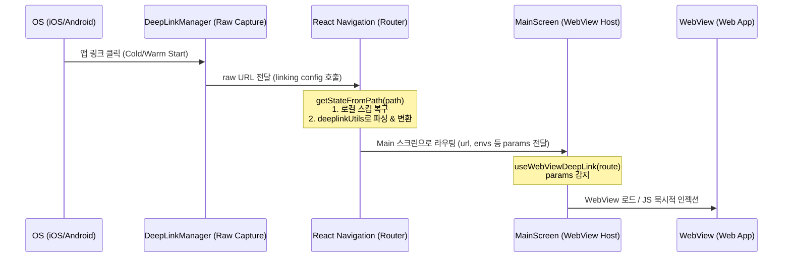

# Deep Link Architecture Refactoring SPEC

이 스펙 문서는 딥링크 모듈 리팩터링 작업에 따른 아키텍처 변경점과 설계 명세를 정의합니다.

---

## 1. 아키텍처 개요 (Overview)

기존의 딥링크 시스템은 지연된 딥링크(Deferred Deep Linking) 및 숏코드 확장을 위해 **Firebase Firestore**와 의존하고 있었으며, React Native 의존성이 포함된 공통 라이브러리(`libs/deeplinks`) 구조로 인해 모노레포 내 빌드 및 타입 참조의 복잡도가 높았습니다.

이번 리팩터링을 통해:

1. **Firestore와 완전 분리**: 서버리스 기반의 신규 쿼리 파라미터형 딥링크 패턴만 지원하고 Firestore 데이터 쓰기/조회 로직을 전면 제거했습니다.
2. **공통 라이브러리 해체 및 내재화**: 빌드 복잡도를 최소화하기 위해 공통 모듈을 해제하고, 앱 전용 유틸리티(`deeplinkUtils.ts`)로 로직을 완전히 내재화했습니다.
3. **React Navigation 통합**: 상태 저장 방식의 Zustand 스토어 방식을 제거하고, React Navigation의 네이티브 `linking` 인프라와 100% 통합했습니다.

---

## 2. 모바일 앱 딥링크 데이터 흐름 (Data Flow)

딥링크 유입부터 웹뷰 내 페이지 로드까지의 흐름은 다음과 같습니다.

---

## 3. 핵심 설계 명세 (Specification Details)

### A. 의존성 주입 (Dependency Injection)

`DeepLinkManager`와 `DeeplinkService`는 `provider.ts`에서 생성 및 관리되며, 생성자를 통해 의존성이 주입됩니다.

- **`DeepLinkManager`**: 단말 OS 레벨의 `Linking` API 및 iOS Release 빌드에서의 유니버설 링크 딜레이 큐(AppDelegate 버퍼 모듈)를 통합 관리하는 Low-level 캡처 클래스입니다.
- **`DeeplinkService`**: High-level 비즈니스 서비스로, 딥링크 이벤트 전파와 푸시 알림 클릭 등으로 들어온 원시 URL에 대한 표준화 필터링(`handleUrl`)을 대행합니다.

### B. 동기식 URL 변환 (`deeplinkUtils.ts`)

Firestore가 완전히 제거되었으므로, 모든 딥링크의 숏링크 변환 및 파싱은 서버 조회 없이 클라이언트 내부에서 동기식(`convertShortUrlWithEnvsSync`)으로 즉각 이루어집니다.

- **신규 딥링크 패턴**: `chatic://s?code=invt:910001:xxx&api=yyy`
- **변환 대상**: `https://dou.chatic.io/auth/login?code=invt:910001:xxx&provider=invite&version=2`
- **환율 환경 변수**: 쿼리스트링 내 `api` 및 `stage` 파라미터를 조합하여 프론트엔드 환경변수 `_backend` 파라미터를 동적으로 빌드하고 웹뷰에 인젝션합니다.

### C. 라우터 수준의 상태 동기화 (Router Integration)

- Zustand 스토어(`useDeepLinkStore`)를 완전 폐기하고 React Navigation의 `route.params`를 딥링크 상태의 단일 원천(Single Source of Truth)으로 삼았습니다.
- **Cold Start**: 첫 화면 진입 시 초기 `route.params.url` 값을 기준으로 WebView의 `initialSource`를 설정합니다.
- **Warm Start**: 앱이 실행 중인 상태에서 추가 링크가 유입되면 `route.params` 변경을 `useEffect`가 감지하여 `webViewRef.current.injectJavaScript`를 통해 웹뷰 내 `window.location.href` 이동을 처리합니다. 이동 완료 후 파라미터는 `navigation.setParams`로 즉시 초기화되어 루프를 방지합니다.

---

## 4. 검증 규격 (Verification)

- **단위 테스트**: `DeeplinkService.test.ts`를 통해 상대 경로가 커스텀 스킴으로 정상 복구되는지, 지원하지 않는 스크립트 형태의 비정상 스킴이 사전에 거부되는지 자동 테스트합니다.
- **통합 빌드**: Vite 및 Metro 환경에서 타입 충돌이나 공통 참조 오류 없이 단독 빌드가 완료되어야 합니다.
