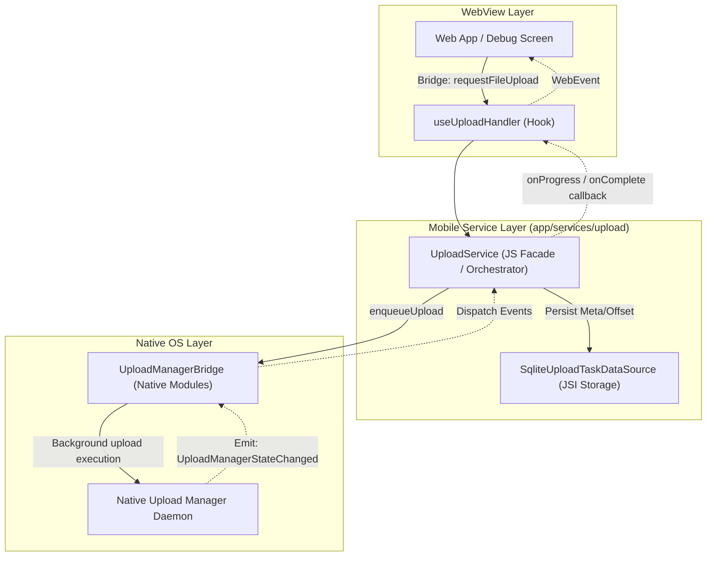
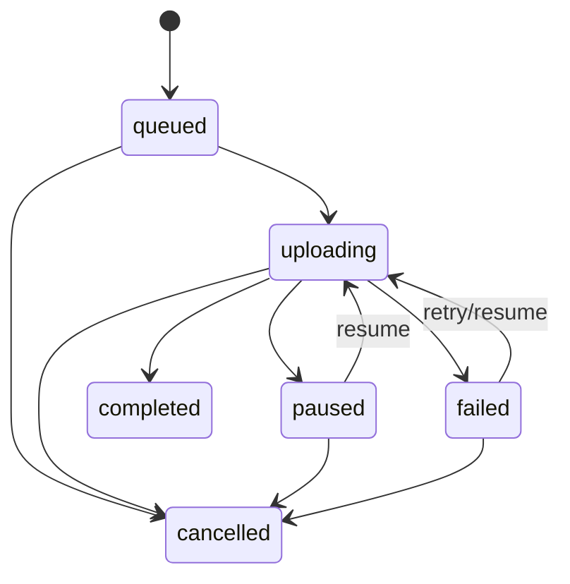

# Mobile Upload System 개선 SPEC (1GB+, Chunk, Progress, Pause/Resume/Cancel/Retry, Background, Manual Recovery)

- Date: 2026-05-28
- Target: `apps/mobile/src/app/` (React Native) + iOS/Android Native Bridge
- Reference (이전 스펙): `docs/specs/hybrid-large-file-chunk-upload-spec.md`

---

## 0) Goal / Success Criteria

- 크로스 플랫폼(iOS/Android)에서 **대용량(최소 1GB) 파일/이미지 업로드**를 안정적으로 지원한다.
- 업로드는 **청크 기반**이며 **진행률(바이트 기반)**을 표시한다.
- 사용자 액션: **일시정지 / 재개 / 취소 / 재시도**를 지원한다.
- 앱이 **백그라운드/화면 꺼짐** 상태에서도 가능한 한 오래 업로드를 유지한다. (OS 제약상 100% 보장은 불가)
- 앱이 중도 종료(사용자 종료/크래시)된 경우, 다음 실행 시 **수동 복구(재개/재시도/취소)**가 가능하도록
    - 진행상황/상태를 로컬에 캐싱한다.
    - 복구 가능한 작업 목록을 제공한다.
- 업로드 스펙(서버 프로토콜)은 서버와 협의가 필요하므로, **Transport 인터페이스**로 교체 가능하게 구성한다.
- 가능하면 네이티브 기능을 적극 활용하며, 필요 시 네이티브 브릿지를 확장한다.

## 1) Non-Goals

- “앱 강제종료 후에도 OS가 계속 업로드를 수행”을 항상 보장하지 않는다.
    - 대신 **수동 복구 + 재시도**를 통해 안정성을 확보한다.

---

## 2) Current Baseline (Repo Evidence)

- JS 업로드 루프(청크 전송/AbortController 기반 pause/resume/cancel):
    - `apps/mobil- WebView 메시지 핸들러:
    - `apps/mobile/src/app/webview/hooks/useUploadHandler.ts`

현 구조는 1GB 급에서 성능/안정성/백그라운드 지속성을 보장하기 위해 **JS 기반 업로드 루프를 완전히 삭제**하고 **100% Native Upload Engine 중심**으로 전환을 완료하였다.

---

## 3) Architecture (100% Native-Driven Single Pipeline)



### 3.1 Component Responsibilities

#### A. Mobile Service Domain (JS Orchestration)

- **UploadService**: 업로드 파이프라인의 메인 진입점. 업로드 진행률 콜백, 상태 갱신, UI 이벤트를 중재하고 네이티브 이벤트(`UploadManagerStateChanged`)를 해석하여 상태 저장소와 동기화 및 콜백을 전파.
- **SqliteUploadTaskDataSource**: 업로드 진행 중 매 청크 완료 시점마다 업로드 상태(`status`), 전송 완료 크기(`uploadedBytes`), 최근 청크 인덱스(`lastChunkIndex`)를 로컬 SQLite 테이블에 영속화.

#### B. Native Modules & Platform Daemons

- **UploadManagerBridge (Native Module / Native Bridge)**: React Native 네이티브 브릿지 바인딩 계층. JS 서비스 레이어(`UploadService`)로부터 전달받은 업로드 제어 명령(Enqueue, Pause, Resume, Cancel)을 각 플랫폼 네이티브 업로드 데몬으로 위임하고, 네이티브 업로드 코어 스레드에서 발생하는 전송 이벤트를 JS 영역(`UploadManagerStateChanged`)으로 브로드캐스트.
- **iOS Swift Upload Engine (`UploadManager.swift` / `URLSessionBackground`)**:
    - **`URLSessionConfiguration.background`**: 앱이 서스펜드/종료되더라도 iOS 네이티브 데몬인 `nsurlsessiond`가 전송 작업을 승계하여 백그라운드 완수를 처리하도록 위임.
    - **임시 청크 바디 파일 생성**: 백그라운드 URLSession의 구조적 제약(메모리 바이트 직접 전송 불가)을 해소하기 위해 청크 단위로 multipart/form-data 가공 바이너리 데이터를 임시 파일(`NSTemporaryDirectory()`)로 기록 후 `uploadTask(with:fromFile:)` 전송.
    - **델리게이트 기반 시퀀싱 (`URLSessionTaskDelegate`)**: 백그라운드 세션에서 사용할 수 없는 블록 completionHandler 대신 델리게이트를 통해 전송 완료 콜백을 가로채고, 순차적 청크 전송 시동 및 다음 청크 연쇄를 처리하는 비동기 이벤트 루프 구동.
    - **직렬 상태 처리 큐 (`stateQueue`)**: 모든 스레드 안전과 다중 스택 레이스 컨디션을 예방하기 위해 `DispatchQueue` 직렬 큐를 두고 상태 관리 및 Context 매핑 처리를 단일화.
- **Android Kotlin Upload Engine (`UploadBackgroundService.kt` / `UploadWorker.kt`)**:
    - **포그라운드 서비스 및 WorkManager 결합**: 백그라운드 대용량 파일 전송 중 기기 OS(Looming, Memory Pressure)에 의한 강제 킬(Kill)을 원천 봉쇄하기 위한 복합 엔진.
    - **WorkManager 스케줄러 (`UploadWorker`)**: `NetworkType.CONNECTED` 제약 사항 준수 및 부팅/재기동 시 포그라운드 작업 관할.
    - **백그라운드 포그라운드 서비스 (`UploadBackgroundService`)**: 실제 전송 처리를 스레드풀(`FixedThreadPool(3)`)로 수행하며 기기 CPU 휴면 방지를 위한 `WakeLock` 및 파일 바이너리 I/O 스트리밍 처리 담당.
    - **Android 14+ 포그라운드 유형 데이터 동기화 준수**: Android 14+ (API 34/36) 환경에서 `SystemForegroundService`에 `foregroundServiceType="dataSync"` 설정을 매니페스트 머지 및 런타임 `FOREGROUND_SERVICE_TYPE_DATA_SYNC` 명시 전달로 크래시와 OS 제약을 완전 차단.
    - **인텐트 기반 실시간 상태 이벤트 전파**: 백그라운드 스레드의 전송 진척 상황을 `ACTION_UPLOAD_EVENT` 브로드캐스트 인텐트로 발행해 네이티브 브릿지에서 React Native 이벤트로 바인딩하여 JS 영역에 실시간 반영.

---

## 4) Restructured Directory & Naming Conventions

### 4.1 Unified Naming Conventions (네이밍 컨벤션 통일)

데이터베이스 및 스토리지 액세스 관련 인터페이스와 구현체의 네이밍을 다른 비즈니스 로직(예: `/data/cache` 내 `DataSource` 패턴)과 통일합니다:

- **DataSource Suffix**: 데이터 저장 및 조회 역할을 수행하는 클래스는 기존 `Repository` 접미사 대신 `DataSource` 접미사를 사용합니다.
    - `IUploadTaskRepository` → `IUploadTaskDataSource`
    - `SqliteUploadTaskRepository` → `SqliteUploadTaskDataSource`
- **Prefix Standard**:
    - 모든 인터페이스는 `I` 접두사를 붙여 정의합니다. (예: `IUploadTaskDataSource`, `IUploadService`)

### 4.2 Directory Structure

```
apps/mobile/src/app/
└── services/
    └── upload/                   # 업로드 전용 서비스 도메인
        ├── repository/           # 업로드 상태 영속화 (DataSource)
        │   ├── types.ts          # IUploadTaskDataSource
        │   ├── SqliteUploadTaskDataSource.ts
        │   ├── SqliteUploadTaskDataSource.test.ts
        │   └── index.ts
        ├── UploadService.ts      # 메인 오케스트레이터
        ├── UploadService.native.test.ts # 네이티브 모듈 기반 단위 테스트
        ├── types.ts              # 업로드 상태 및 인터페이스 정의
        └── index.ts
```

---

## 5) State Model

권장 상태:

- `queued` → `uploading` → (`paused` | `failed`) → `uploading` → `completed`
- 언제든 `cancelled`
- 앱 재시작 시, 이전 `uploading`은 실제 실행 중이 아니므로 **`paused`로 강등**하여 수동 복구로 이어진다.



---

## 6) Manual Recovery (앱 종료 후 수동복구)

### 6.1 저장해야 하는 최소 메타

- `uploadId`
- 파일 정보: `fileUri`(또는 샌드박스 경로), `fileName`, `mimeType`, `totalBytes`
- 전송 정보: `chunkSize`, `uploadedBytes`, `lastChunkIndex`(또는 `offset`)
- 상태: `status`, `retryCount`, `createdAt`, `updatedAt`
- 서버 세션: 협의된 프로토콜에 따라 `{ sessionId, etags, presigned, ... }` 등을 JSON으로 저장
- 인증 참조: 민감 정보(토큰)를 직접 저장하지 않고, 필요 시 재생성 가능한 **참조키(authRef)** 저장

### 6.2 복구 UX/동작

- 앱 시작 시 DataSource에서 `status IN (queued, uploading, paused, failed)`를 로드하여 “복구 가능한 업로드” 목록을 제공한다.
- 사용자가 `Recover`를 누르면:
    - 로컬 파일 존재/권한 확인
    - (가능 시) 서버 `status(uploadId)`로 동기화
    - 이후 `Resume / Retry / Cancel` 제공
- 로컬 파일이 사라진 경우:
    - 작업은 `failed`로 고정하고 “재선택 필요”를 안내한다.

---

## 7) File Source 안정화 전략

Android `content://`, iOS `ph://` 등은 만료/권한 이슈가 발생할 수 있으므로, 기본적으로 업로드 시작 시 **앱 샌드박스 경로로 복사**하여 안정적으로 파일을 읽을 수 있게 한다.

---

## 8) Policies

외부 사용자가 옵션으로 설정 가능해야 한다.

- Concurrency:
    - `maxConcurrentUploads` (기본값 제공, 예: 2~3)
- Network:
    - `wifiOnly`, `allowCellular`, `requiresCharging`, `lowPowerModeBehavior`
- Retry:
    - `maxRetries`, `backoff`(exponential), `retryableErrorCodes`

---

## 9) Auth Provider (AWS4Signer)

- 업로드 요청 시점에 헤더를 생성/갱신할 수 있어야 한다.
- 인증 만료 시 “재시도 시점에 새 헤더로 재요청”이 가능해야 한다.
- **서버 스펙과의 합의가 필요하므로 TODO로 남긴다.**

---

## 10) Server Upload Protocol (초기: 베이직 Chunk HTTP)

서버와 최종 협의 전까지, 교체 가능한 Transport 인터페이스로 설계한다.
초기 기본안(가장 베이직):

- `init(uploadId, fileMeta) -> { sessionId?, chunkSize?, ... }`
- `uploadChunk(uploadId, chunkIndex, offset, bytes, headers)`
    - HTTP `PUT` 또는 `POST`
    - 요청 본문은 **바이너리** (Base64/JSON payload 지양)
    - 헤더는 아래 중 1개를 선택(서버 협의):
        - `Content-Range` 기반
        - `X-Chunk-Index`, `X-Chunk-Offset`, `X-Chunk-Size` 기반
- (선택) `status(uploadId) -> { uploadedBytes | nextChunkIndex }`
- `complete(uploadId)` / `abort(uploadId)`

필수 요구:

- (uploadId, chunkIndex) 중복 업로드 시 안전한 **idempotency**
- 재전송/재시도 시 서버가 오류 없이 처리할 수 있는 규칙

---

## 11) WebView Bridge Messages (기존 유지 + 확장 가능)

기존 메시지를 유지:

- `RequestFileUpload`
- `PauseFileUpload`
- `ResumeFileUpload`
- `CancelFileUpload`

이벤트:

- `OnUploadProgress`
- `OnUploadComplete`

필요 시 확장:

- `ListRecoverableUploads`
- `RecoverUpload(uploadId)`
- `RetryUpload(uploadId)`

---

## 12) Rollout Plan

1. **Phase 1 (완료)**: 공통 네트워크/유틸리티 레이어 추출 및 업로드 도메인(transport, datasource) 리팩토링 및 네이티브 빌드 안정화
2. **Phase 2 (완료)**: JS-fallback 엔진 완전 삭제. Native UploadManagerBridge 중심의 100% 네이티브 아키텍처 전환 완료 및 가상 5GB 대용량 데이터 생성/백그라운드 전송 테스트 지원 완료.
3. **Phase 3 (완료)**: iOS Swift 및 Background URLSession delegate 기반 엔진 재작성 완료 및 Android 14+ (API 34/36) dataSync Foreground Service 타입 선언 머지 및 런타임 대응 완료
4. **Phase 4**: 서버 프로토콜 확정(S3 multipart/presigned 등) 및 관측/재시도 정책 고도화

---

## 13) Open Questions (Server 협의 필요)

- `status(uploadId)` 제공 여부
- chunk 크기 상한/권장값
