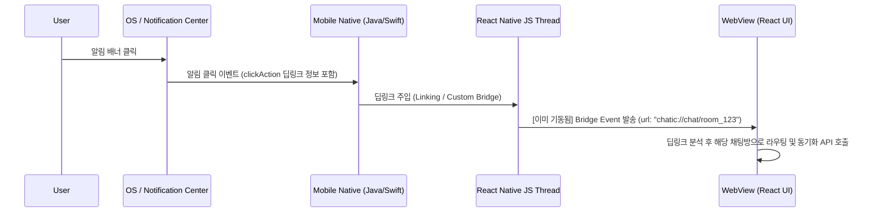
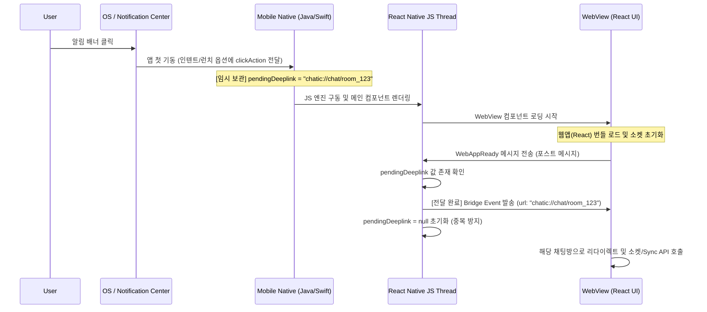

# DoU Push Notification Scenario Documentation

본 문서는 DoU 하이브리드 앱의 고성능 네이티브 푸시 아키텍처에 구현된 사용자 상태별, 시나리오별 알림 동작과 데이터 동기화 흐름을 상세 기술한 레퍼런스 문서입니다. 개발 및 검증 과정의 테스트 시나리오로 활용할 수 있습니다.

---

## 1. 플랫폼 상태별 수신 및 노출 시나리오

| 번호    | 앱 실행 상태 (App State)    | 수신 플랫폼   | 노출 방식                                                                    | 데이터 동기화 방식                                                  |
| :------ | :-------------------------- | :------------ | :--------------------------------------------------------------------------- | :------------------------------------------------------------------ |
| **1.1** | **포그라운드 (Foreground)** | Android / iOS | 시스템 배너 노출 **안 함**. 웹뷰 상단 **인앱 알림 토스트** 슬라이드 노출. | 실시간 소켓(WebSocket) 및 RN Bridge Event 전달.                     |
| **1.2** | **백그라운드 (Background)** | Android / iOS | **시스템 알림 배너** 노출.                                                   | 동기화 없음. 유저가 알림을 클릭하거나 앱을 직접 실행할 때까지 대기. |
| **1.3** | **앱 완전히 종료 (Killed)** | Android / iOS | **시스템 알림 배너** 노출.                                                   | 동기화 없음. 유저가 알림을 클릭하거나 앱을 직접 실행할 때까지 대기. |

---

## 2. 알림 클릭 및 진입 시나리오 (Deep Link Routing)

### 2.1. 핫 스타트 (Hot Start) 진입 시나리오

> 앱이 백그라운드에 살아있는 상태에서 알림 배너를 클릭하여 앱으로 복귀하는 경우

1. **상태**: 웹뷰가 이미 로딩되어 소켓과 이벤트 리스너가 살아있는 상태입니다.
2. **동작**: 네이티브가 클릭 인텐트/대리자를 캐치하여 React Native 브릿지로 즉시 딥링크 URL을 보냅니다.
3. **결과**: 웹뷰가 즉시 `chatic://chat/room_123` 스키마를 처리하여 해당 대화방으로 리다이렉트합니다.

---

### 2.2. 콜드 스타트 (Cold Start) 진입 시나리오

> 앱이 완전히 종료(Killed)된 상태에서 알림 배너를 클릭하여 첫 기동되는 경우 (레이스 컨디션 해결 방안)

1. **상태**: 메인 앱 프로세스와 웹뷰가 처음 켜져서 초기화되는 상태입니다.
2. **동작**: 네이티브 단에서 수신된 딥링크 정보를 `pendingDeeplink` 임시 변수에 저장하고, 웹뷰가 `WebAppReady` 브릿지 이벤트를 보낼 때까지 이벤트를 홀딩합니다.
3. **결과**: 웹뷰가 로딩을 완전히 마치고 신호를 받을 준비가 된 순간, 홀딩되었던 딥링크가 안전하게 전달되어 유실 없이 채팅방 리다이렉트가 수행됩니다.

---

### 2.3. 앱 아이콘 직접 실행 시나리오 (No Alert Click)

> 푸시 배너를 클릭하지 않고 홈 화면의 앱 아이콘을 직접 눌러 실행하는 경우

1. **동작**:
    - 앱이 실행되며 홈 화면(대화 목록 등)이 첫 화면으로 노출됩니다. (리다이렉트 스킵)
    - 웹뷰 로드 즉시 WebSocket이 서버에 연결되고, 최신 대화 목록을 확인하기 위한 **Sync API**(`GET /sync`)를 서버에 호출합니다.
2. **결과**: 유저가 백그라운드 상태에서 수신한 모든 메시지들이 서버로부터 일괄 벌크 수신되어 로컬 화면 상태가 최신으로 일치됩니다. (푸시 수집 누락과 전혀 무관하게 완벽한 무결성 보장)

---

## 3. 특정 기능 시나리오 (Mute 및 서버 필터링)

### 3.1. 무음 채팅방 메시지 수신 시나리오 (Muted Room)

1. **서버 동작**: 사용자가 알림을 꺼둔 채팅방의 일반 대화는 **서버에서 푸시 발송 자체를 생략(Skip)**합니다.
2. **소켓 동작**: 유저가 포그라운드 상태인 경우, 메시지는 **소켓(WebSocket)으로만 실시간 전송**됩니다. 웹뷰는 화면을 갱신하지만, 효과음이나 인앱 토스트 배너는 띄우지 않습니다.
3. **복구**: 사용자가 오프라인 상태일 때 무음방에 쌓인 대화는, 추후 앱 실행 시 **Sync API**를 통해 완벽히 동기화됩니다.

### 3.2. 포그라운드 활성 채팅방 메시지 수신 시나리오 (Active Room Filtering)

> 사용자가 `A 채팅방`을 열어놓고 대화 중인 상태에서 상대방이 `A 채팅방`에 새 대화를 보낸 경우

1. **서버 동작**: 서버는 유저의 활성화 세션을 체크하여, 유저가 이미 해당 채팅방에 머무르고 있는 상태이면 **푸시 알림 발송을 취소(Filter-out)**합니다.
2. **앱 동작**: 앱에는 푸시 배너가 전혀 오지 않으며, 소켓을 통해서만 메시지가 실시간 수신됩니다. 웹뷰는 채팅방 하단에 대화를 덧붙여 보여줍니다.
3. **이점**: 포그라운드 상태에서 불필요한 인앱 알림 배너가 징~하고 울리며 사용자 경험을 해치는 현상을 원천 방지합니다.

### 3.3. 다른 화면을 보고 있을 때의 메시지 수신 시나리오 (Non-active Room)

> 사용자가 앱을 켜놓고 `B 채팅방`을 보고 있거나 설정 메뉴에 있는데, `A 채팅방`에서 새 대화가 온 경우

1. **서버 동작**: 사용자가 `A 채팅방`에 활성화되어 있지 않으므로 **푸시 알림을 정상 발송**합니다.
2. **앱 동작**: 단말이 포그라운드 상태이므로 네이티브 시스템 배너 노출은 취소됩니다. 대신, 푸시 페이로드가 웹뷰 브릿지로 전달됩니다.
3. **결과**: 웹뷰는 상단에 **"홍길동: [메시지 내용]" 형식의 커스텀 인앱 토스트 알림**을 슬라이드로 띄워 유저에게 다른 방에서 대화가 왔음을 알립니다.
