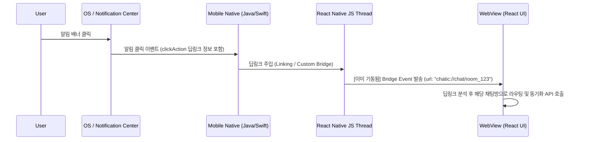
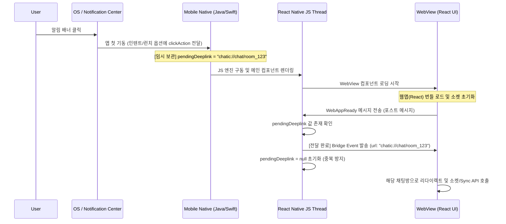

# DoU Push Notification Scenario Documentation

본 문서는 DoU 하이브리드 앱의 고성능 네이티브 푸시 아키텍처에 구현된 사용자 상태별, 시나리오별 알림 동작과 데이터 동기화 흐름을 상세 기술한 레퍼런스 문서입니다. 개발 및 검증 과정의 테스트 시나리오로 활용할 수 있습니다.

---

## 1. 플랫폼 상태별 수신 및 노출 시나리오

| 번호    | 앱 실행 상태 (App State)    | 수신 플랫폼   | 노출 방식                                                                                | 데이터 동기화 방식                                                  |
| :------ | :-------------------------- | :------------ | :--------------------------------------------------------------------------------------- | :------------------------------------------------------------------ |
| **1.1** | **포그라운드 (Foreground)** | Android / iOS | 시스템 배너 노출 **안 함**. 웹뷰 상단 **인앱 알림 배너** 슬라이드 노출. (웹 구현: §4) | 실시간 소켓(WebSocket) 및 RN Bridge Event 전달.                     |
| **1.2** | **백그라운드 (Background)** | Android / iOS | **시스템 알림 배너** 노출.                                                               | 동기화 없음. 유저가 알림을 클릭하거나 앱을 직접 실행할 때까지 대기. |
| **1.3** | **앱 완전히 종료 (Killed)** | Android / iOS | **시스템 알림 배너** 노출.                                                               | 동기화 없음. 유저가 알림을 클릭하거나 앱을 직접 실행할 때까지 대기. |

---

## 2. 알림 클릭 및 진입 시나리오 (Deep Link Routing)

### 2.1. 핫 스타트 (Hot Start) 진입 시나리오

> 앱이 백그라운드에 살아있는 상태에서 알림 배너를 클릭하여 앱으로 복귀하는 경우

1. **상태**: 웹뷰가 이미 로딩되어 소켓과 이벤트 리스너가 살아있는 상태입니다.
2. **동작**: 네이티브가 클릭 인텐트/대리자를 캐치하여 React Native 브릿지로 즉시 딥링크 URL을 보냅니다.
3. **결과**: 웹뷰가 즉시 `chatic://chat/room_123` 스키마를 처리하여 해당 대화방으로 리다이렉트합니다.

---

### 2.2. 콜드 스타트 (Cold Start) 진입 시나리오

> 앱이 완전히 종료(Killed)된 상태에서 알림 배너를 클릭하여 첫 기동되는 경우 (레이스 컨디션 해결 방안)

1. **상태**: 메인 앱 프로세스와 웹뷰가 처음 켜져서 초기화되는 상태입니다.
2. **동작**: 네이티브 단에서 수신된 딥링크 정보를 `pendingDeeplink` 임시 변수에 저장하고, 웹뷰가 `WebAppReady` 브릿지 이벤트를 보낼 때까지 이벤트를 홀딩합니다.
3. **결과**: 웹뷰가 로딩을 완전히 마치고 신호를 받을 준비가 된 순간, 홀딩되었던 딥링크가 안전하게 전달되어 유실 없이 채팅방 리다이렉트가 수행됩니다.
4. **웹 측 2차 버퍼링**: 네이티브가 홀딩을 풀어도 웹앱 내부에서는 라우터(및 네비게이션 핸들러)가 아직 마운트되기 전일 수 있습니다. 웹은 부트스트랩 시점(`apps/web/src/main.tsx`)에 `pendingNavigationStore`를 시작하여 이른 `OnNavigate` 이벤트를 붙잡아 두었다가, 핸들러가 등록되는 순간 재생(replay)합니다. 즉 콜드 스타트 레이스는 네이티브(pendingDeeplink)와 웹(pendingNavigationStore) 양쪽에서 이중으로 방어됩니다.

---

### 2.3. 앱 아이콘 직접 실행 시나리오 (No Alert Click)

> 푸시 배너를 클릭하지 않고 홈 화면의 앱 아이콘을 직접 눌러 실행하는 경우

1. **동작**:
    - 앱이 실행되며 홈 화면(대화 목록 등)이 첫 화면으로 노출됩니다. (리다이렉트 스킵)
    - 웹뷰 로드 즉시 WebSocket이 서버에 연결되고, 최신 대화 목록을 확인하기 위한 **Sync API**(`GET /sync`)를 서버에 호출합니다.
2. **결과**: 유저가 백그라운드 상태에서 수신한 모든 메시지들이 서버로부터 일괄 벌크 수신되어 로컬 화면 상태가 최신으로 일치됩니다. (푸시 수집 누락과 전혀 무관하게 완벽한 무결성 보장)

---

## 3. 특정 기능 시나리오 (Mute 및 서버 필터링)

### 3.1. 무음 채팅방 메시지 수신 시나리오 (Muted Room)

1. **서버 동작**: 사용자가 알림을 꺼둔 채팅방의 일반 대화는 **서버에서 푸시 발송 자체를 생략(Skip)**합니다.
2. **소켓 동작**: 유저가 포그라운드 상태인 경우, 메시지는 **소켓(WebSocket)으로만 실시간 전송**됩니다. 웹뷰는 화면을 갱신하지만, 효과음이나 인앱 토스트 배너는 띄우지 않습니다.
3. **복구**: 사용자가 오프라인 상태일 때 무음방에 쌓인 대화는, 추후 앱 실행 시 **Sync API**를 통해 완벽히 동기화됩니다.

### 3.2. 포그라운드 활성 채팅방 메시지 수신 시나리오 (Active Room Filtering)

> 사용자가 `A 채팅방`을 열어놓고 대화 중인 상태에서 상대방이 `A 채팅방`에 새 대화를 보낸 경우

1. **서버 동작**: 서버는 유저의 활성화 세션을 체크하여, 유저가 이미 해당 채팅방에 머무르고 있는 상태이면 **푸시 알림 발송을 취소(Filter-out)**합니다.
    - 웹이 서버에 보고하는 "머무르는 방"(`device.sync`의 viewing 짝)은 **채팅방 화면과 그 스레드 화면 둘 다**입니다 (`apps/web/src/app/hooks/useDeviceSync.ts`). 스레드는 같은 방을 다른 각도에서 보는 화면이라, 답글을 쓰는 동안에도 그 채널의 푸시는 발송되지 않아야 합니다. 방↔스레드 이동은 같은 viewing 짝이므로 중간에 clear가 끼지 않습니다.
    - 반대로 방을 **떠나는** 순간 viewing은 즉시 비워집니다. 방금 보낸 메시지의 푸시가 그 직후 도착할 수 있으므로, 최종 방어는 아래 §4.2의 클라이언트 억제 규칙입니다.
2. **앱 동작**: 앱에는 푸시 배너가 전혀 오지 않으며, 소켓을 통해서만 메시지가 실시간 수신됩니다. 웹뷰는 채팅방 하단에 대화를 덧붙여 보여줍니다.
3. **이점**: 포그라운드 상태에서 불필요한 인앱 알림 배너가 징~하고 울리며 사용자 경험을 해치는 현상을 원천 방지합니다.

### 3.3. 다른 화면을 보고 있을 때의 메시지 수신 시나리오 (Non-active Room)

> 사용자가 앱을 켜놓고 `B 채팅방`을 보고 있거나 설정 메뉴에 있는데, `A 채팅방`에서 새 대화가 온 경우

1. **서버 동작**: 사용자가 `A 채팅방`에 활성화되어 있지 않으므로 **푸시 알림을 정상 발송**합니다.
2. **앱 동작**: 단말이 포그라운드 상태이므로 네이티브 시스템 배너 노출은 취소됩니다. 대신, 푸시 페이로드가 `OnReceiveNotification` 브릿지 이벤트로 웹뷰에 전달됩니다.
3. **결과**: 웹뷰는 상단에 **`#채널명` 헤드라인 + 메시지 본문** 형식의 커스텀 인앱 알림 배너를 슬라이드로 띄워 유저에게 다른 방에서 대화가 왔음을 알립니다. 배너를 클릭하면 푸시 배너 탭과 동일한 라우팅 규칙(클라우드/사이트 전환 + 히스토리 정규화)으로 해당 채팅방에 진입합니다.

---

## 4. 웹(WebView) 인앱 알림 배너 구현 레퍼런스

포그라운드 인앱 알림(시나리오 1.1, 3.3)의 웹 측 구현입니다. 진입점은 `apps/web/src/app/hooks/useInAppPushMessage.tsx`입니다.

| 구성 요소                 | 파일                                      | 역할                                                                                                                                    |
| :------------------------ | :---------------------------------------- | :-------------------------------------------------------------------------------------------------------------------------------------- |
| `useInAppPushMessage`     | `hooks/useInAppPushMessage.tsx`           | `OnReceiveNotification` 구독 → 억제 판정 → 배너 표시. `UnifiedLayout`에 마운트.                                                         |
| `InAppNotificationCard`   | `ui/components/InAppNotificationCard.tsx` | 배너 UI. 앱 테마를 따르는 서피스(popover/card 토큰) + main-accent 좌측 바.                                                              |
| `resolveInAppPushRoute`   | `utils/resolveInAppPushRoute.ts`          | 푸시 `data`(link/clickAction/channelId + cid/sid) → 라우팅 경로 매핑. 모바일 `resolvePushTapPath`의 웹 포트.                            |
| `extractPushBannerFields` | `utils/resolveInAppPushRoute.ts`          | 배너가 읽는 필드(`ownerId`/`channelId`/`channelName`/`thumbnail`)를 `payload` 머지를 거쳐 해석. 억제 규칙의 입력.                       |
| `useDeviceSync`           | `hooks/useDeviceSync.ts`                  | 현재 보고 있는 방(방+스레드)과 포그라운드 상태를 서버에 보고 — 시나리오 3.2 서버 필터의 입력.                                           |
| `usePushNavigate`         | `bridge/navigation/usePushNavigate.ts`    | 배너 클릭과 네이티브 푸시 탭(`OnNavigate`)이 공유하는 네비게이션 프리미티브 (핸드셰이크 대기 → 클라우드/사이트 전환 → 히스토리 정규화). |

### 4.1. 노출 규칙

- **교체 표시**: 고정 toast id를 사용하여 여러 푸시가 연달아 와도 최신 1개만 표시됩니다 (스택 없음, 카카오톡 방식).
- **노출 시간**: 5초 자동 닫힘, 상단 중앙(top-center) 위치.
- **Safe Area**: 네이티브가 주입하는 `--safe-top` CSS 변수 기반 오프셋으로 노치/상태바를 침범하지 않습니다 (`AppRuntime`의 `SonnerToaster` offset).

### 4.2. 클라이언트 측 억제 규칙 (서버 필터링에 더한 2차 방어)

| 조건                                   | 동작       | 이유                                              |
| :------------------------------------- | :--------- | :------------------------------------------------ |
| silent push (`title`/`body` 모두 없음) | 표시 안 함 | 뱃지/동기화용 데이터 푸시는 사용자 노출 대상 아님 |
| `ownerId` == 내 uid                    | 표시 안 함 | 내가 보낸 메시지의 에코 푸시는 노이즈             |
| 현재 보고 있는 채널의 푸시             | 표시 안 함 | 메신저 관례 (시나리오 3.2의 클라이언트 측 보강)   |
| 라우팅 정보 없음                       | 표시 전용  | 클릭 동작 없이 내용만 노출                        |

**서버 계약**: 채팅 푸시는 발신자 uid를 `ownerId`로 **항상** 싣습니다. 이 필드가 빠진 푸시는 "내가 보낸 메시지" 판정 자체가 불가능해 배너가 그대로 노출되므로, 클라이언트는 별도 폴백(전송 에코 가드 등)을 두지 않고 이 계약에 의존합니다.

**필드 해석 규칙**: `ownerId`/`channelId`는 `data`에서 직접 읽지 않고 **`payload` JSON을 머지한 뒤** 읽습니다(`extractPushBannerFields`). 발신자에 따라 이 필드들이 `payload` 안에 중첩되어 오고, 안드로이드 포그라운드 경로는 top-level `channelId` 자리에 OS 알림 채널(`dou_chat`)을 실어 보내던 시기가 있었기 때문입니다. 머지에서는 **`payload` 값이 top-level을 이깁니다** — 구버전 앱에서도 웹만 배포하면 억제가 살아납니다.

**네이티브 전달 계약**: 안드로이드 포그라운드 푸시는 `ChaticFirebaseMessagingService.emitForegroundEvent`가 **FCM `data` 맵 전체 + 원본 `payload` 문자열**을 그대로 넘기고, `useFcmHandler`가 `data` → `payload` 순으로 병합합니다. OS 알림 채널은 `channel_id`/`notificationChannelId`로만 실리며 **`channelId`를 덮어쓰지 않습니다**. iOS는 RN Firebase `onMessage`가 `remoteMessage.data`를 그대로 전달하므로 별도 매핑이 없습니다.
