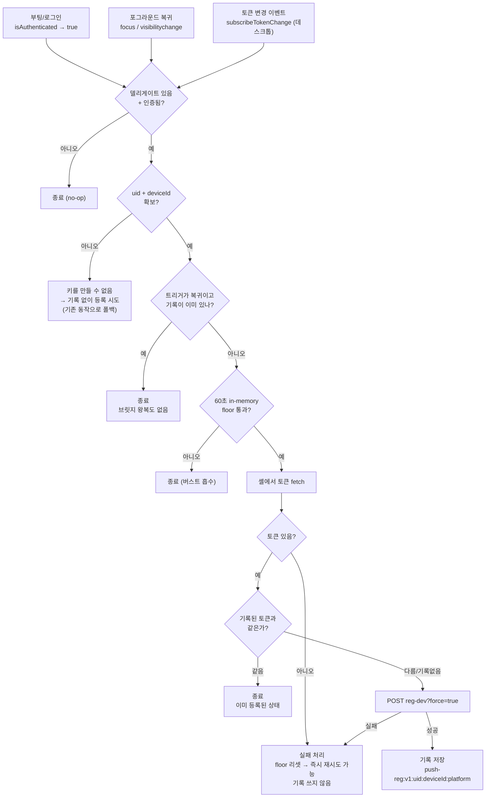
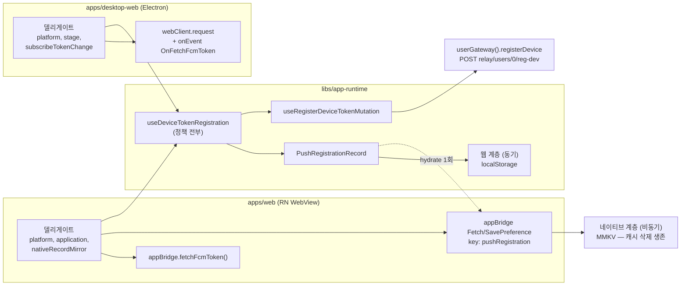
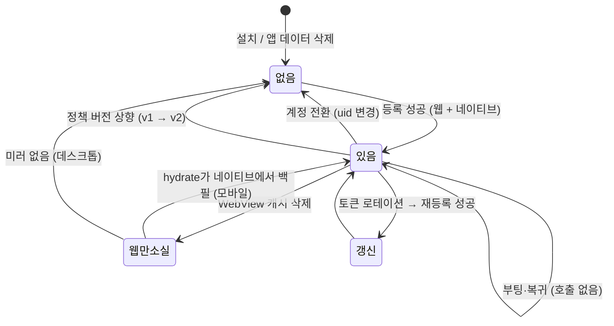

# 푸시 디바이스 토큰 등록 (`reg-dev`)

> 상태: Live · 최종 갱신: 2026-09-08 · 관련 ADR: [ADR-0077](../adr/0077-register-push-device-once-per-install.md), [ADR-0045](../adr/0045-push-relay-cloud-routing-crossover.md), [ADR-0076](../adr/0076-app-runtime-auth-single-verdict-and-typed-session-events.md)

네이티브 셸(모바일 WebView / Electron)의 푸시 토큰을 홈 브로커에 등록하는 레이어. 등록된 토큰으로 무엇을 하는지(cross-cloud fan-out, 배지, 토스트, cid 역추적)는 [cross-cloud-push.md](./cross-cloud-push.md)가 다룬다.

## 목적

한 사용자는 여러 cloud에 속하지만 라이브 WebSocket은 **현재 접속한 cloud 하나**만 커버한다. 그 공백은 백엔드 `chatic-pushes-api`가 **계정 단위 토큰 1개**로 모든 cloud의 메시지를 fan-out해서 메운다. 이 문서의 레이어는 그 fan-out이 성립하기 위한 전제 하나를 책임진다 — **이 기기의 푸시 토큰이 브로커에 등록되어 있고, 그 SNS endpoint가 살아 있을 것.**

등록 자체는 단순한 REST 한 방(`POST {relay}/users/0/reg-dev`)이지만, 언제 얼마나 자주 부를지가 이 레이어의 전부다. 너무 안 부르면 기기가 조용히 푸시를 못 받고, 너무 자주 부르면 서버 알림 채널이 중복 호출로 뒤덮인다.

## 설계 원칙

1. **정책은 런타임에, 셸 지식은 델리게이트에.** 언제 등록할지·건너뛸지는 전부 `libs/app-runtime`이 정한다. 앱은 "이 셸에서 토큰을 어떻게 얻는가"와 platform/stage 같은 셸 고유 값만 주입한다. 소켓 쪽 `SocketSessionDelegate`와 같은 역전이다.
2. **구현은 한 벌만 둔다.** 모바일과 데스크톱이 같은 훅을 쓴다. 셸 차이는 델리게이트 필드로 흡수하고, 훅을 복제하지 않는다.
3. **디바이스 식별자는 절대 이 레이어에서 만들지 않는다.** 소켓 identity와 반드시 같아야 하므로 `useDynamicDeviceId` 하나만 참조한다.
4. **계정 식별자는 relay 토큰에서 읽는다.** `users/0/reg-dev`는 계정 단위 등록이므로, cloud 슬롯을 따라 움직이는 활성 토큰이 아니라 계정에 고정된 relay 토큰의 uid를 쓴다.
5. **실패는 기록하지 않는다.** 등록 성공만 상태로 남긴다. 실패·빈 토큰은 아무것도 남기지 않고 다음 트리거에서 그대로 재시도된다.
6. **실제로 호출할 때는 항상 `force`로 뚫는다.** 호출 빈도를 줄이는 것과, 부를 때 서버 가드를 우회하는 것은 별개 문제다.
7. **저장 키에 정책 버전을 박는다.** 정책이 바뀌면 버전을 올리는 것만으로 전 기기가 한 번 재등록한다. 별도 인프라 없는 재등록 브로드캐스트 수단이다.

## 범위

**포함**

- 등록 트리거 정책 (부팅/로그인, 포그라운드 복귀, 토큰 변경)
- 설치당 1회 dedup과 그 영구 기록
- `DeviceTokenDelegate` 계약 (`stage`, `subscribeTokenChange`, `nativeRecordMirror`)
- 모바일(`apps/web`)·데스크톱(`apps/desktop-web`) 델리게이트 배선
- 모바일 네이티브 미러 — `PreferenceKey`의 `pushRegistration`과 그 브릿지 화이트리스트

**제외**

- 중계서버(`relay` / `chatic-pushes-api`) 수정 일체 — `reg-dev`의 알림 발송 조건, 응답 계약, SNS endpoint 재활성화 로직
- 푸시 **수신** 이후의 모든 것 (OS 알림, 배지, 토스트, cid 역추적) → [cross-cloud-push.md](./cross-cloud-push.md)
- 디바이스 GLOBAL 푸시 mute (소켓 `device.update-remote`) → `DeviceRepositoryV2.updateRemotePushMute`
- 데스크톱 네이티브 저장 — Electron main에 Preference 핸들러가 없다. 데스크톱은 웹 계층만 쓴다.
- 원격 킬스위치 / 피처 플래그 인프라 (ADR-0077에서 명시적으로 제외)

## 시나리오

### S1. 새 기기 첫 실행 — 등록 1회

1. 셸이 웹을 띄우고 `CHATIC_APP_PLATFORM`(및 데스크톱은 `CHATIC_APP_STAGE`)을 주입한다.
2. 로그인이 끝나 `isAuthenticated`가 true가 된다.
3. 훅이 relay 토큰에서 uid를, `useDynamicDeviceId`에서 deviceId를 읽는다.
4. 저장된 등록 기록이 없다 → 셸에서 토큰을 fetch → `reg-dev`를 `force=true`로 호출.
5. 성공 → 웹 계층(`push-reg:v1:<uid>:<deviceId>:<platform>`)에 기록하고, 모바일은 네이티브 `pushRegistration`에도 같은 항목을 민다.

### S2. 같은 기기 재실행 — 호출 0회

1. `isAuthenticated`가 true가 된다.
2. 셸에서 토큰을 fetch한다(로컬 브릿지 왕복, 네트워크 없음).
3. 저장된 기록의 토큰과 일치 → **`reg-dev`를 호출하지 않는다.**

앱을 몇 번을 껐다 켜도 이 경로만 돈다. 기존 구현이 부팅마다 1회씩 호출하던 자리다.

### S3. 포그라운드 복귀 — 호출 0회, 브릿지 왕복도 0회

1. 사용자가 앱으로 돌아와 `focus`/`visibilitychange`가 뜬다.
2. 현재 uid·deviceId·platform에 대한 등록 기록이 이미 있다 → **토큰 fetch조차 하지 않고 즉시 종료.**

기록이 아직 없을 때만(= 첫 등록이 성공하지 못한 상태) 등록을 시도한다. 이 경로를 남겨두는 이유는 S6이다.

### S4. FCM 토큰 로테이션

- **모바일**: 다음 실행의 S1/S2 경로에서 fetch한 토큰이 기록과 달라 재등록된다. 세션 중간에는 감지하지 않는다.
- **데스크톱**: Electron main이 토큰 재발급 시 `OnFetchFcmToken`을 요청 없이 밀어준다(`apps/desktop/src/main/index.ts:703`). 델리게이트의 `subscribeTokenChange`가 이를 받아 즉시 재등록한다 — 데스크톱은 며칠씩 켜져 있어 다음 실행을 기다릴 수 없다.

### S5. 계정 전환

로그아웃 → 다른 계정 로그인. uid가 바뀌어 저장 키가 달라지므로 기록이 없는 상태가 되고, S1이 그대로 돈다. 같은 기기·같은 FCM 토큰이 새 계정으로 옮겨 등록된다.

### S6. 알림 권한을 나중에 허용

첫 실행에 권한을 거부하면 셸이 토큰을 주지 못한다 → 빈 토큰은 실패로 처리되어 기록을 남기지 않는다. 나중에 설정에서 권한을 켜고 앱으로 돌아오면 S3의 "기록 없음" 분기가 열려 있어 그 자리에서 등록된다.

### S7. WebView 캐시 삭제 — 모바일은 호출 0회

앱의 캐시 삭제나 저장소 압박으로 웹 계층이 비어도, 모바일은 네이티브 계층이 기록을 들고 있다.

1. `isAuthenticated`가 true → 훅이 네이티브 미러를 1회 hydrate한다.
2. 웹 계층은 비었지만 네이티브 항목의 identity가 일치 → 그 값을 웹 계층에 백필한다.
3. fetch한 토큰이 그 값과 같다 → `reg-dev`를 호출하지 않는다.

데스크톱은 미러가 없으므로 이 경우 1회 재등록한다.

### S8. SNS endpoint가 죽은 경우 — 자동 복구 없음

SNS는 배달 1회 실패로 platform endpoint를 disable시키고 `CreatePlatformEndpoint`는 그것을 되살리지 못한다([cross-cloud-push.md](./cross-cloud-push.md) §3-1, §3-3). 설치당 1회 정책에서는 기록이 남아 있는 한 재등록이 일어나지 않으므로, 그 기기는 다음 중 하나가 있어야 복구된다.

- 앱 재설치 / 앱 데이터 삭제 (두 계층 모두 소실). 모바일은 WebView 캐시 삭제만으로는 부족하다 — S7이 네이티브에서 되살린다.
- FCM 토큰 로테이션 (S4)
- 계정 전환 (S5)
- 정책 버전 상향 배포 (`v1` → `v2`)
- 디버그 화면의 등록 확인 실행 — `apps/web/src/app/features/debug/hooks/usePushRegistration.ts`가 dedup을 거치지 않고 직접 등록을 시도하므로 지원 대응 경로로 계속 쓸 수 있다

ADR-0077이 의식적으로 감수한 트레이드오프다.

## 다이어그램

### 등록 판단 흐름



### 셸별 배선



### 저장 기록의 수명



## 상세 구현

### 핵심 파일

| 파일                                                                  | 역할                                                               |
| --------------------------------------------------------------------- | ------------------------------------------------------------------ |
| `libs/app-runtime/src/push/hooks/useDeviceTokenRegistration.ts`       | 등록 정책 전부 — 트리거, dedup, 스로틀, 재시도                     |
| `libs/app-runtime/src/push/registrationRecord.ts`                     | 성공 기록 — 키 구성, 웹 계층 읽기/쓰기, 네이티브 계층 hydrate/백필 |
| `libs/app-runtime/src/push/index.ts`                                  | `push` 파사드 그룹 배럴                                            |
| `libs/app-runtime/src/data/hooks/device.ts`                           | `useRegisterDeviceTokenMutation` — 런타임이 소유한 유일한 REST 훅  |
| `libs/http/src/gateways/users.ts:44`                                  | `registerDevice` — `POST {relay}/users/0/reg-dev`, `force` 쿼리    |
| `apps/web/src/app/bridge/useDeviceTokenRegistration.ts`               | 모바일 델리게이트                                                  |
| `apps/desktop-web/src/app/shared/hooks/useDeviceTokenRegistration.ts` | 데스크톱 델리게이트 (`DesktopRuntime.tsx`에서 마운트)              |
| `libs/app-messages/src/types/model/preference.ts`                     | `PreferenceKey`의 `pushRegistration`                               |
| `apps/mobile/src/app/webview/hooks/usePreferenceCacheHandler.ts`      | 그 키의 브릿지 쓰기 허용                                           |

### `DeviceTokenDelegate` 변경

기존 계약(`platform`, `fetchDeviceToken`, `installId`, `application`)에 세 필드를 더했다.

```ts
/** Deployment stage sent to the broker. Omitting it lets the broker fall back to ITS default. */
stage?: string;

/** The shell minted a new token. Returns an unsubscribe. */
subscribeTokenChange?: (onChange: () => void) => () => void;

/** Durable home for the registration record, for shells whose storage outlives the webview's. */
nativeRecordMirror?: { read(): Promise<string | null>; write(raw: string): Promise<void> };
```

셋 다 선택이다 — 모바일은 `nativeRecordMirror`만, 데스크톱은 `stage`와 `subscribeTokenChange`만 준다.

`stage`는 `RegisterDeviceTokenBody`에 이미 존재하므로(`node_modules/@lemoncloud/chatic-backend-api/dist/view/types.d.ts:358`) wire 변경은 없다. 델리게이트에만 구멍을 뚫으면 된다.

**`stage`가 왜 선택이 아닌가.** 브로커는 stage가 없으면 자기 기본값(`dev`)을 쓴다. 프로덕션 데스크톱이 `chatic-desktop-dev` SNS 앱에 등록되면 토큰이 귀속된 Firebase 프로젝트와 SNS 자격증명 프로젝트가 어긋나 FCM이 `SENDER_ID_MISMATCH`로 거부하고, SNS는 그 endpoint를 자동으로 Disable시킨다([cross-cloud-push.md](./cross-cloud-push.md) §3-1). 현재 데스크톱 훅이 보내고 있는 값이므로, 통합 시 옮기지 않으면 데스크톱 푸시가 통째로 죽는다.

### 계정 식별자를 relay 토큰에서 읽는 이유

`useSessionIdentity().userId`는 **활성 슬롯**의 토큰에서 나온다(`libs/app-runtime/src/session/store/contextStore.ts:112`). 사용자가 cloud에 진입하면 활성 토큰이 cloud 위임 토큰으로 바뀌므로 uid가 흔들릴 수 있고, 그러면 cloud를 옮길 때마다 저장 키가 달라져 재등록이 발생한다 — "설치당 1회"가 "cloud 전환당 1회"로 무너진다.

`getRelaySessionUser()`는 그 반대로 정의되어 있다 — "계정 단위 프로필 원천이며 활성 슬롯을 따라 cloud로 들어가면 안 된다"(`contextStore.ts:74-82`). `users/0/reg-dev`가 relay의 계정 단위 엔드포인트이므로 식별자도 여기서 읽는 것이 맞다.

```ts
const user = getRelaySessionUser();
const uid = (user?.id ?? user?.uid ?? null) as string | null;
```

`register()` 콜백 안에서 동기적으로 읽는다 — 리액트 상태로 들고 있지 않으므로 항상 호출 시점의 값이다.

### 저장 기록 — 두 계층

**웹 계층**은 `@chatic/shared`의 `storage`다. 기본 어댑터는 `sessionStorage`지만 네이티브 셸(RN WebView / Electron) 안에서는 앱 엔트리의 `setStorageAdapter(isNative() ? localStorage : sessionStorage)`가 `localStorage`로 교체하고(ADR-0079 전에는 `libs/web-config`의 import 부수효과였다), 훅이 도는 조건(델리게이트 non-null ⟺ 네이티브 셸)과 범위가 정확히 일치한다. **동기**라는 점이 존재 이유다 — 포그라운드 복귀 경로가 브릿지 왕복 없이 판단할 수 있어야 한다.

```
키   push-reg:v1:<uid>:<deviceId>:<platform>
값   {"id":"v1:<uid>:<deviceId>:<platform>","token":"<등록에 성공한 토큰>","at":<epoch ms>}
```

**네이티브 계층**은 모바일의 `pushRegistration` preference(MMKV)다. WebView 캐시 삭제를 견디는 것이 존재 이유이며, **비동기**라 마운트 후 1회 hydrate해 메모리에 올린다. 한 항목만 담는다 — 기기당 활성 계정은 하나이므로 계정별 맵은 전환할 때마다 무한히 자랄 뿐이다. 그래서 값에 `id`(구성된 identity 키)를 함께 넣어 읽을 때 대조한다.

- `at`은 진단용이다. 만료 판단에 쓰지 않는다 — 설치당 1회이므로 만료가 없다.
- `v1`은 정책 버전이다. 올리면 전 기기가 한 번 재등록한다.
- 웹 계층 키는 `@`로 시작하지 않는다. `?logout=1` 정리 루틴(`app-runtime/session/auth/logoutStorageSweep`)이 `@` 접두 키를 지우기 때문이다. 지워져도 uid가 키에 있어 동작은 안전하지만, 불필요한 재등록을 만들지 않는다.
- 웹 계층이 비었는데 네이티브가 답할 수 있으면 `read`가 웹 계층을 **백필**한다. 이후 동기 읽기가 다시 빨라진다.
- 메모리의 네이티브 사본은 셸이 쓰기를 **실제로 수락한 뒤에만** 세팅한다. 없는 네이티브 사본을 있다고 믿으면, 세션 중 웹 계층이 비워졌을 때 답할 수 없는 계층을 근거로 등록을 건너뛰게 된다 — 건너뛰는 쪽이 위험한 방향이다.

```ts
export class PushRegistrationRecord {
    /** Bump to force every device to re-register exactly once. */
    private static readonly POLICY_VERSION = 'v1';
    hydrate(mirror: NativeRecordMirror | undefined): Promise<void>; // 인스턴스당 1회, 절대 reject 안 함
    read(id: RegistrationIdentity): string | null; // 동기 — 웹 계층 우선, 없으면 hydrate된 네이티브
    write(id: RegistrationIdentity, token: string, mirror?: NativeRecordMirror): void;
}
```

**hydrate는 fast path보다 뒤에서, 그리고 토큰 fetch와 나란히 실행한다.** 뒤에 두는 이유는 복귀 경로의 동기 종료를 지키기 위해서다 — 브릿지 왕복을 피하려고 브릿지 왕복을 하면 앞뒤가 안 맞는다. 아직 hydrate되지 않은 부팅은 최악의 경우 필요 없던 토큰 fetch를 한 번 하지만, 그 뒤의 토큰 비교가 호출 자체는 막는다.

토큰 fetch와 **직렬로 엮지 않는 이유**는 둘 다 브릿지 request이고 기본 타임아웃이 10초라서다. 서로의 답을 필요로 하지 않으므로 `Promise.all`로 묶는다 — 직렬이면 브릿지가 늘어질 때 두 타임아웃이 연달아 붙어 첫 등록이 최대 20초 밀린다.

**구버전 앱에서의 동작.** 웹 번들이 앱보다 먼저 배포되므로 릴리스 직후에는 미러가 동작하지 않는 것이 정상이다. 쓰기는 화이트리스트에 키가 없어 `PREF_KEY_NOT_WRITABLE`로 거부되고, 읽기는 화이트리스트가 없어 빈 값을 돌려준다. 둘 다 삼켜지고 웹 계층만으로 미러 이전과 동일하게 동작한다.

### 훅의 트리거별 동작

기존 두 프리미티브(`Coalescer`, `Throttle`, ADR-0076 결정 4)는 그대로 둔다.

- **`Throttle`(60초)의 역할이 바뀐다.** 재등록 간격을 재는 정책이 아니라, 한 번의 포그라운드 전환이 `focus`와 `visibilitychange`로 두 번 들어오는 것 같은 버스트를 흡수하는 하한이 된다. 상한은 이제 저장 기록이 담당한다.
- **`Coalescer`는 그대로** — 동시 트리거가 하나의 in-flight 시도를 공유한다.

| 트리거               | 기록 있음                       | 기록 없음 |
| -------------------- | ------------------------------- | --------- |
| 부팅/로그인          | 토큰 fetch → 비교 → 같으면 종료 | 등록      |
| 포그라운드 복귀      | **즉시 종료** (fetch 없음)      | 등록 (S6) |
| 토큰 변경 (데스크톱) | 토큰이 다르므로 등록            | 등록      |

부팅 경로에서 fetch를 건너뛰지 않는 이유는 토큰 로테이션 감지가 그 자리에서만 일어나기 때문이다(S4). 복귀 경로에서 건너뛰는 이유는 그 경로가 하루에 수십 번 돌기 때문이다.

### uid를 얻지 못한 경우

키를 만들 수 없으므로 기록을 읽지도 쓰지도 못한다. 이때는 **기존 동작(매번 등록)으로 폴백한다.** 등록을 건너뛰어 기기를 조용히 죽이는 것보다, 호출이 줄지 않는 편이 안전한 실패 방향이다.

### 데스크톱 델리게이트

현재 훅의 `post` + `onEvent` 조합은 불필요하다. Electron main이 `FetchFcmToken`을 정식 request 핸들러로 등록해두고 있으므로(`apps/desktop/src/main/index.ts:280`, `success: true`와 함께 `OnFetchFcmToken`을 반환), 모바일과 동일하게 `webClient.request`로 끝난다.

`onEvent('OnFetchFcmToken')`은 버리지 않고 `subscribeTokenChange`로 옮긴다. main이 토큰 재발급 시 요청 없이 밀어주는 경로이기 때문이다(`index.ts:703`).

## 검증 방법

### 유닛 테스트

- `libs/app-runtime/src/push/hooks/useDeviceTokenRegistration.test.tsx` (27건) — 델리게이트 null·미인증 no-op, installId 폴백, application 기본값, `stage` 전달, 설치당 1회(재실행 무호출·복귀 시 fetch 없음·기록 없으면 복귀 등록·토큰 로테이션·계정 변경·디바이스 id 변경·uid 필드 두 형태·실패 시 기록 없음·uid 부재 폴백과 floor), 네이티브 미러(등록 시 함께 기록·웹 저장소 삭제 후 무호출·미러 거부해도 성공 유지), 재로그인 동일/다른 계정, in-flight 코얼레싱, `subscribeTokenChange`(재등록·동일 토큰이면 무호출·언마운트 해제·미제공 시 무동작)
- `libs/app-runtime/src/push/registrationRecord.test.ts` (19건) — 키 구성, `@` 접두 금지, identity 조각별 격리, 손상 JSON·`token` 누락에서 null, 저장 실패 무시, 네이티브 미러(동시 기록·hydrate 후 응답·백필·identity 불일치·1회만 읽음·미러 없음·읽기 실패·쓰기 거부·손상 기록·쓰기 거부 시 네이티브 사본 없음·미러 부재 시 네이티브 사본 없음)
- `apps/mobile/src/app/webview/hooks/usePreferenceCacheHandler.test.ts` — `pushRegistration`이 브릿지로 쓰기 가능하고, 화이트리스트 밖 키는 여전히 거부되는지
- `apps/web/src/app/bridge/useDeviceTokenRegistration.test.ts` — 델리게이트 어댑터

테스트 서술은 리포 관례대로 한국어, 코드 주석은 영어.

```bash
cd libs/app-runtime && npx jest --config jest.config.js
```

### 수동 확인

1. **모바일 재부팅 무호출** — 앱 첫 실행 후 네트워크 로그에서 `reg-dev` 1건 확인 → 앱 완전 종료 후 3회 재실행 → `reg-dev` 추가 호출 0건, DoU chatic 채널 알림도 추가 0건.
2. **포그라운드 복귀 무호출** — 앱을 백그라운드로 보냈다 복귀 10회 → `reg-dev` 0건.
   2-1. **캐시 삭제 생존 (새 앱 빌드에서만)** — 등록 후 앱 설정에서 WebView 캐시/데이터 삭제 → 재실행 → `reg-dev` 0건. 구버전 앱에서는 1건이 정상이며, 그것이 미러가 아직 안 붙었다는 신호다.
3. **데스크톱 stage 회귀 방지 (필수)** — 프로덕션 빌드에서 첫 등록 후 SNS 콘솔에서 endpoint가 `chatic-desktop-prod`에 생겼는지 확인. `chatic-desktop-dev`에 생겼다면 `stage` 주입이 빠진 것이다.
4. **데스크톱 수신 확인** — 다른 cloud에서 메시지를 보내 OS 알림이 오는지. §3-1의 `SENDER_ID_MISMATCH`는 등록 성공 응답만으로는 드러나지 않는다.
5. **계정 전환** — 로그아웃 후 다른 계정 로그인 → `reg-dev` 1건.
6. **권한 뒤늦은 허용** — 알림 권한 거부 상태로 첫 실행 → `reg-dev` 0건 → OS 설정에서 권한 허용 후 앱 복귀 → `reg-dev` 1건.
