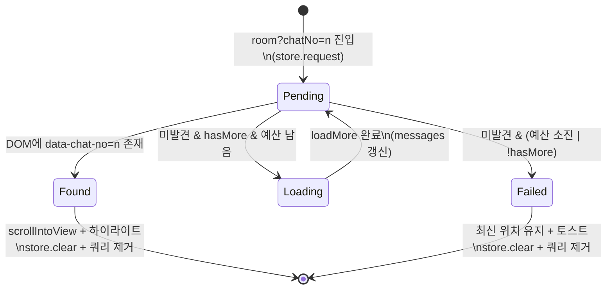

# 메시지 점프 (chatNo 커서 이동)

> 상태: Live · 최종 갱신: 2026-07-29 · 관련 ADR: [[ADR-0033]](../../adr/0033-local-global-search.md)

## 목적

채팅방 피드를 특정 메시지(chatNo) 위치로 이동시킨다. 1차 소비자는 검색
결과의 메시지 클릭([[web-search-page]](./web-search-page.md))이며, 이후
링크 미리보기·푸시 딥링크 등 "특정 메시지로 가기"가 필요한 모든 흐름이
같은 메커니즘을 쓴다.

서버 `chat.feed`는 `cursorNo` 기준 과거 방향 페이징만 지원하므로
(anchored 양방향 페치 없음), 점프는 "타깃이 로드될 때까지 과거 페이지를
반복 로드"하는 방식이다. desktop-web에 동일 방식의 완성 구현이 있어
(`useMessageJumpStore` + `MessageList`의 점프 로직) 이를 apps/web으로
이식한다.

## 설계 원칙

- **desktop-web 시맨틱 이식**: 점프 타깃 스토어(nonce 재발화), DOM
  `data-chat-no` 탐색, 페이지 예산 루프 — 검증된 구조를 그대로 따른다.
- **기존 피드 모델 유지**: `useChats`의 "최신 앵커 성장 윈도우"
  (`loadMore`)를 바꾸지 않는다. 점프는 그 위에서 `loadMore`를 반복
  호출하는 소비자일 뿐이다. 피드가 항상 최신을 포함하므로 "타깃보다
  아래(최신) 방향" 로드는 필요 없다.
- **예산 초과는 명시적 폴백**: 무한 로드하지 않는다. 예산 소진 시 채널
  최신 위치에 머물고 토스트로 안내한다.
- **타깃 전달은 URL 쿼리**: apps/web은 라우트-당-채널 구조이므로
  (desktop-web의 단일 페이지 스토어 전달과 달리) `?chatNo=` 쿼리로
  전달한다 — 딥링크·새로고침에도 안전.

## 범위

**포함**

- 점프 스토어(`useMessageJumpStore`) apps/web 이식.
- `/channels/:id/room?chatNo=<n>` 쿼리 계약 + 파싱.
- 메시지 행 DOM에 `data-chat-no` 노출.
- 점프 실행 훅: DOM 탐색 → 스크롤+하이라이트, 미발견 시 예산 내
  `loadMore` 반복, 폴백 토스트.

**제외**

- 서버 anchored-feed API 확장(양방향 앵커 페치) — 추진 안 함(ADR-0033).
- 크로스 클라우드 전환 — 진입 전 단계는 [[web-search-page]]의
  `useSearchNavigate` 담당. 이 문서는 "채널방 도착 이후"만 다룬다.
- 점프 히스토리(뒤로가기로 점프 전 위치 복원).

## 시나리오

1. **캐시에 이미 있는 메시지(대부분)**: 검색 결과 클릭 →
   `room?chatNo=1234` 진입 → room 페이지가 쿼리를 파싱해 점프 스토어에
   `request(channelId, 1234)` → 점프 훅이 `[data-chat-no="1234"]` DOM
   발견 → `scrollIntoView({ block: 'center' })` + 하이라이트 →
   스토어 clear + 쿼리 제거.
2. **윈도우 밖 메시지**: DOM 미발견 → `hasMore`인 동안 `loadMore()` 호출
   → `messages` 변화로 effect 재실행 → 발견 시 1번과 동일. 페이지 예산
   (`MAX_JUMP_PAGES`) 내 반복.
3. **도달 실패(예산 소진 또는 히스토리 끝)**: 반복 중단 → 채널 최신
   위치 유지 → "메시지를 찾을 수 없어요" 토스트 → 스토어 clear.
4. **같은 메시지 재점프**: 같은 chatNo로 다시 클릭해도 스토어 `nonce`
   증가로 effect가 재발화되어 다시 스크롤/하이라이트된다.

## 다이어그램

## 상세 구현

### 점프 스토어 (신규: `apps/web/src/app/stores/useMessageJumpStore.ts`)

desktop-web 구조를 이식 — `MessageJumpTarget { channelId, chatNo, nonce }`,
`request(channelId, chatNo)`, `clear()`. zustand, 비영속.

**nonce 계산은 desktop-web과 다르게** 모듈 스코프의 별도 카운터로
관리한다(`target?.nonce`에서 파생하지 않음). desktop-web처럼 다음
nonce를 `get().target?.nonce ?? 0) + 1`로 계산하면, `clear()`가
target을 null로 되돌린 뒤 같은 메시지로 다시 점프할 때 nonce가 다시
1부터 시작해 이전 점프와 값이 같아져 재발화가 안 되는 경우가 생긴다
(테스트로 확인). 별도 카운터는 `clear()` 여부와 무관하게 항상 증가한다.

### 쿼리 계약

- `paths.ts`의 `ROUTES.channels.room`은 유지하고, 검색 쪽에서
  `${ROUTES.channels.room(id)}?chatNo=${n}` 형태로 조립한다.
- `ChannelRoomPage`에서 `useSearchParams`로 `chatNo` 파싱 → 유효한
  양의 정수면 `useMessageJumpStore.request(channelId, chatNo)` 후 쿼리
  파라미터를 제거(`replace`)해 새로고침 시 재점프를 막는다.

### 메시지 행 DOM 노출

- `ChannelRoomPage.tsx`의 메시지 행 래퍼에
  `data-chat-no={message.chatNo}` 추가(`chatNo`가 있는 확정 메시지만 —
  pending/failed 행은 제외).

### 점프 실행 훅 (신규: `features/channels/hooks/useMessageJump.ts`)

- 입력: `{ channelId, containerRef, messages, hasMore, isLoadingMore, loadMore }`
  — `useChats` 반환과 `useChatScroll`의 `containerRef`를 그대로 받는다.
- effect 의존: `[target?.nonce, messages]` — 타깃이 현재 채널과 일치할
  때만 동작.
- 발견 시: `scrollIntoView({ block: 'center' })` + 하이라이트 클래스
  일정 시간 부여 → `clear()`.
- 미발견 시: `!isLoadingMore && hasMore && pagesLoaded < MAX_JUMP_PAGES`
  이면 `loadMore()` 호출하고 카운터 증가. 조건 불충족이면 폴백(토스트 +
  `clear()`).
- 로드 반복 중에는 스크롤을 건드리지 않는다 — 점프 스크롤은 발견 시
  1회만 실행되어 `useChatScroll`의 loadMore 앵커 보존과 충돌하지 않는다.

### 하이라이트 스타일

- 기존 tailwind 토큰으로 임시 배경 강조(예: `bg-primary/10` 트랜지션).

## 검증 방법

- 유닛 테스트: `useMessageJump` — (a) DOM 존재 시 스크롤+clear, (b)
  미존재→loadMore 반복→발견, (c) 예산 소진 폴백, (d) nonce 재발화, (e)
  타 채널 타깃 무시. jsdom에서 `data-chat-no` 요소 주입으로 검증.
- 유닛 테스트: `useMessageJumpStore` — request/nonce/clear.
- 수동 확인: 검색 → 메시지 클릭 → 스크롤·하이라이트, 오래된 메시지로
  폴백 토스트, 같은 결과 재클릭 재점프.
