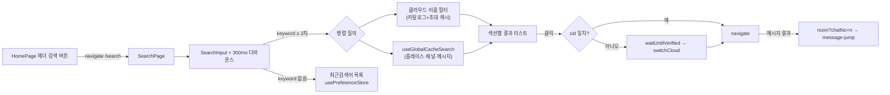

# 웹 검색 페이지 (/search)

> 상태: Live · 최종 갱신: 2026-07-29 · 관련 ADR: [[ADR-0033]](../../adr/0033-local-global-search.md)

## 목적

apps/web에 전역 검색 진입점을 제공한다. 키워드 하나로 클라우드 이름·
플레이스·채널·채팅 메시지를 로컬 캐시에서 찾고, 결과 클릭 시 해당
위치(다른 클라우드 포함)로 이동한다. 최근검색어를 저장·재사용한다.

데이터 기반은 [[global-cache-search]](../cache/global-cache-search.md)의
검색 계약, 메시지 결과 클릭 시 커서 이동은
[[message-jump]](./message-jump.md)가 담당한다.

## 설계 원칙

- **로컬 즉답**: 네트워크 왕복 없이 캐시만 스캔한다. 결과의 신선도
  한계(비활성 클라우드 stale, 메시지는 캐시된 최근 범위만)는 숨기지 않고
  UI 카피로 전달한다.
- **기존 패턴 준수**: 관측은 repo 콜백 패턴, 상태는 zustand, 영속은
  `usePreferenceStore` 레지스트리, 라우팅은 `ROUTES` 상수 — 새 장치(RxJS
  등)를 도입하지 않는다.
- **크로스 클라우드 이동은 전환 선행**: 채널/플레이스 데이터는 활성
  클라우드 repo에서 로드되므로, 타 클라우드 결과 진입 시 반드시
  `switchCloud`를 마친 뒤 라우팅한다(`usePushNavigate.ts:106-125` 패턴).
  **site 전환은 하지 않는다** — 대상 페이지(room, place detail)는 모두
  URL의 id로 데이터를 로드하고 세션의 selectedSiteId를 읽지 않으므로
  (`ChannelRoomPage.tsx`는 `channel.sid`를 로드된 채널에서 파생, `
PlaceInfoPage.tsx`는 `useParams().placeId`만 사용) cid 전환만으로
  충분하다.

## 범위

**포함**

- `/search` 라우트 + `apps/web/src/app/features/search/` 피처 신설.
- 실시간 키워드 필터(디바운스 300ms, 최소 2글자).
- 결과 섹션: 클라우드 / 플레이스 / 채널 / 메시지.
- 최근검색어: 제출 시 저장, LRU 최대 10개, 개별·전체 삭제.
- 결과 클릭 내비게이션(동일/타 클라우드), 진입 실패 토스트.
- HomePage 헤더 검색 버튼의 "준비 중" 플레이스홀더 교체.

**제외**

- 검색 다이얼로그/단축키(Cmd+K) — 전용 페이지로 확정(ADR-0033).
- 채널방 헤더 내 검색 버튼(`ChatRoomHeader`에 onSearch prop 없음) — 후속.
- 서버 검색, 검색 결과 랭킹 고도화.

## 시나리오

1. **진입**: 홈 헤더 검색 버튼 클릭(`HomePage.tsx` `onSearch`) →
   `navigate(ROUTES.search.root)` → 검색 페이지. 입력이 비어 있으면
   최근검색어 목록 표시(각 항목 클릭=재검색, X=개별 삭제, 전체 삭제 버튼).
2. **검색**: 2글자 이상 입력 → 300ms 디바운스 → 두 소스를 병렬 질의:
    - 클라우드 이름: relay 카탈로그(`useCloudSessionCatalog`) + 초대
      클라우드(`useInvitedClouds`)를 인메모리 필터.
    - 플레이스/채널/메시지: `useGlobalCacheSearch().search(keyword, { cid?
  })` — 전체 cid 파티션(uid는 훅 내부에서 컨텍스트로부터 주입).
      결과를 섹션별로 렌더(매치 텍스트 하이라이트, 메시지 행에는 채널명·
      시각·스니펫). 타 클라우드 항목에는 클라우드 이름 배지를 붙인다.
3. **제출·저장**: Enter 또는 결과 클릭 시 키워드를 최근검색어에 LRU
   저장(중복 시 맨 앞으로, 10개 초과 시 꼬리 제거).
4. **결과 클릭**:
    - 클라우드 → `switchCloud(cloud.id)` 후 홈.
    - 플레이스 → (cid 다르면 전환) → `ROUTES.place.detail(placeId)`.
    - 채널 → (cid 다르면 전환) → `ROUTES.channels.room(channelId)`.
    - 메시지 → (전환) → `ROUTES.channels.room(channelId)?chatNo=<n>` →
      [[message-jump]] 흐름.
      전환/진입 실패(삭제된 채널 등 stale 결과) 시 토스트로 안내하고 검색
      페이지에 머문다.

## 다이어그램



## 상세 구현

### 라우트

- `apps/web/src/app/routes/paths.ts` — `ROUTES.search = { root: '/search' }`.
- `apps/web/src/app/routes/PrivateRoutes.tsx` — 기존 lazy 패턴
  (`withSuspense`)으로 `search/*` 등록, `UnifiedLayout` 하위.

### 피처 구조 (`apps/web/src/app/features/search/`)

```
search/
├── pages/SearchPage.tsx          # 입력 + 최근검색어 + 결과 리스트
├── hooks/useGlobalSearch.ts      # 디바운스 + 병렬 질의 + 섹션 데이터 조립
├── hooks/useRecentSearches.ts    # usePreferenceStore 래핑 (LRU/삭제)
├── hooks/useSearchNavigate.ts    # 결과 클릭 → (전환) → 라우팅
├── components/…                  # 섹션/행/하이라이트
└── index.ts
```

- 입력은 ui-kit `SearchInput`(`@chatic/web-ui-kit`, controlled `value`/
  `onChange(value)`) 사용.
- 디바운스·최소 글자 상수는 desktop-web과 동일 값: `DEBOUNCE_MS = 300`,
  `MIN_QUERY_LENGTH = 2`. `@chatic/shared`의 `useDebounce`는 쓰지 않고
  훅 내부에 인라인 구현한다 — 그 패키지의 루트 배럴이 `ErrorFallback`을
  경유해 `@chatic/assets`를 끌어오는데, apps/web의 jest
  moduleNameMapper에 그 매핑이 없어(`@chatic/ui-kit/*`, `@chatic/lib/utils`만
  특례 처리됨) 테스트가 깨진다.
- 표시 상한(섹션당 20, 메시지 30)은 `useGlobalSearch`에서 적용 — 검색
  계약은 상한 없이 반환한다([[global-cache-search]] 설계 원칙).
- 결과 행 하이라이트는 desktop-web `SearchDialog.tsx`의 `highlight()`
  접근(첫 매치 볼드, 긴 본문 앞 트림)을 이식.
- 클라우드 결과 타입: `useCloudSessionCatalog().clouds`(relay `CloudView`,
  `id`/`name`)와 `useInvitedClouds().invitedClouds`(`DomainCloud`,
  `id`/`cid`/`name`)는 서로 다른 타입이라, `{ id: string; name?: string }`
  형태의 로컬 `CloudSearchResult`로 정규화해 합친다. 클릭 시 전환에 쓰는
  cid는 `cloud.id`(= `switchCloud`/`selectedCloudId`가 쓰는 식별자,
  `CloudSessionSheet.tsx`의 `handleSelectCloud(cloudId)` 패턴과 동일).

### 최근검색어 (`usePreferenceStore` 레지스트리)

- `apps/web/src/app/stores/preferenceKeys.ts`의 `PREFERENCES`에 추가:

```ts
recentSearches: {
    strategy: 'local',
    localKey: 'chatic-recent-searches',
    defaultValue: '[]',
},
```

`native+local`이 아니라 `local`을 쓴다 — 모바일의
`usePreferenceCacheHandler.ts`가 `SavePreference` 브리지 메시지를
보안 allowlist(`BRIDGE_WRITABLE_PREFERENCE_KEYS`)로 제한하고 있어,
native+local로 하려면 그 allowlist와 `PreferenceKey` 타입에 네이티브
쪽 변경이 필요하다. `channelSort`도 같은 이유(클라이언트 전용, 서버
동기화 없음)로 `local`을 쓰는 전례를 따랐다 — WebView 캐시 삭제 시
최근검색어 목록만 초기화되는 낮은 리스크로 판단.

- `usePreferenceStore.ts`에 기존 `channelSort` 패턴대로:
    - 상태 `recentSearches: string[]` + 파서 `parseRecentSearches`(JSON
      배열 아니면 `[]` 폴백, 문자열 아닌 항목 제거).
    - 액션 `addRecentSearch(keyword)`(대소문자 무시 중복 제거 후 맨 앞
      이동, `MAX_RECENT_SEARCHES`=10 초과 시 꼬리 제거),
      `removeRecentSearch(keyword)`, `clearRecentSearches()`.
    - `local` 전략이므로 hydrate 분기 추가 불필요.

### 결과 클릭 내비게이션 (`useSearchNavigate.ts`)

`usePushNavigate.ts`의 검증된 순서를 cid만으로 재사용한다:

```
needsSwitch = cid && cid !== selectedCloudId
needsSwitch → getSocketManager().waitUntilVerified(10s)
           → switchCloud(cid)
navigate(target)
```

- 미검증 타임아웃 또는 전환 실패 시: push처럼 best-effort 이동이 아니라
  **토스트로 실패 안내**(검색은 사용자가 능동 대기 중이므로 조용한
  오이동 방지). 이 점이 `usePushNavigate`와의 유일한 동작 차이다.
- 중복 호출 방지를 위한 in-flight 가드는 `usePushNavigate`와 동일하게 둔다.

### 진입점 교체

- `HomePage.tsx`의 `handleSearch`("준비 중" 토스트)를
  `navigate(ROUTES.search.root)`로 교체. 더는 안 쓰는
  `homePage.searchComingSoon` i18n 키를 ko/en에서 제거.

### i18n

- `apps/web/public/locales/{ko,en}/translation.json`의 **기존 미사용
  `search.*` 블록**(`placeholder`, `recent`, `clearAll`, `places`,
  `chat`, `noResults`, `noHistory`)을 그대로 활용하고, 부족한 키
  (`clouds`, `channels`, `removeRecent`, `navigateFailed`,
  `messageJumpFailed`)를 추가한다.

## 검증 방법

- 유닛 테스트: `useGlobalSearch`(디바운스·최소 글자·섹션 조립·상한·
  클라우드 이름 매칭), `useSearchNavigate`(전환 분기·실패 토스트·in-flight
  가드) — 검색 계약과 라우터/세션 훅은 mock.
- `usePreferenceStore.test.ts`에 최근검색어 add/remove/clear/LRU/corrupt
  JSON 케이스 추가.
- 수동 확인: 홈 → 검색 진입 → 한글/영문 키워드, 타 클라우드 결과 클릭 시
  전환 후 진입, 메시지 결과 → 점프, 최근검색어 저장/삭제, 새로고침 후 유지.
