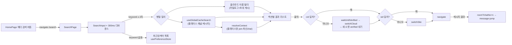

# 웹 검색 페이지 (/search)

> 상태: Live · 최종 갱신: 2026-08-06 · 관련 ADR: [[ADR-0033]](../../adr/0033-local-global-search.md)

## 목적

apps/web에 검색 진입점을 제공한다. 키워드 하나로 **활성 클라우드**의 플레이스·
채널·채팅 메시지를 로컬 캐시에서 찾고, 결과 클릭 시 그 위치로 이동한다.
클라우드 이름은 활성 여부와 무관하게 매칭되어 다른 클라우드로 건너가는 통로가
된다. 최근검색어를 저장·재사용한다.

데이터 기반은 [[global-cache-search]](../cache/global-cache-search.md)의
검색 계약, 메시지 결과 클릭 시 커서 이동은
[[message-jump]](./message-jump.md)가 담당한다.

## 설계 원칙

- **로컬 즉답**: 네트워크 왕복 없이 캐시만 스캔한다. 결과의 신선도 한계
  (마지막 동기화 시점 스냅샷, 메시지는 캐시된 최근 범위만)는 숨기지 않는다.
- **범위는 활성 클라우드**: 캐시 스캔은 `search(keyword, { cid: 활성 cid })`로
  한 클라우드만 훑는다. 캐시가 `(cid, uid)`로 나뉘고 uid가 활성 세션 토큰에서
  오기 때문에, 전체 파티션을 훑으면 세션에 따라 보이는 결과가 달라진다
  (ADR-0033 결정 2항). 다른 클라우드는 이름으로 찾아 전환한 뒤 검색한다.
- **기존 패턴 준수**: 관측은 repo 콜백 패턴, 상태는 zustand, 영속은
  `usePreferenceStore` 레지스트리, 라우팅은 `ROUTES` 상수 — 새 장치(RxJS
  등)를 도입하지 않는다.
- **클라우드 결과 이동은 전환 선행**: 클라우드 이름 결과로 다른 클라우드에
  들어갈 때는 반드시 `switchCloud`를 마친 뒤 라우팅한다
  (`usePushNavigate.ts:106-125` 패턴). 플레이스/채널/채팅 결과는 활성 클라우드
  안에 있으므로 클라우드 전환이 일어나지 않는다(전환 로직은 그대로 두어, 범위가
  다시 넓어져도 경로가 하나로 유지된다).
- **플레이스(sid) 전환도 함께 한다.** 근거: 검색 결과에서 플레이스를 고르면 **홈으로** 가야
  하고(`HomePage`는 URL이 아니라 세션의 `selectedSiteId`로 그린다,
  `HomePage.tsx:65,184`), 채널로 진입한 뒤 뒤로 나오면 그 채널이 속한
  플레이스의 홈에 있어야 한다. 전환 수단은 app-runtime이 공개하는
  `useSiteSwitch`(소켓 `auth.switch`, `libs/app-runtime/src/session/useSiteSwitch.ts`).
- **검색 결과 행은 데이터를 당겨오지 않는다**: 행 컴포넌트는 순수 표시
  전용이고, 표시할 값은 전부 [[global-cache-search]](../cache/global-cache-search.md)의
  `resolveContext`가 공급한다. 홈의 `ChannelItem`처럼 행 안에서
  `useChannelSync`/`useChatSync`/`useLastChat`을 부르면 빈 값이 나오고 엉뚱한
  클라우드 소켓에 sync 타깃이 등록된다(이유는 그 문서의 "목적" 참조).
  홈에서 가져오는 것은 시각적 레이아웃뿐이다.
- **캐시 기준 표시**: 안읽음 수·마지막 메시지·인원수는 모두 마지막 동기화
  시점의 캐시 값이다(검색 자체가 캐시 기준이라는 전제와 같은 선).
- **검색어는 URL에 둔다**: `/search?q=<키워드>`. 결과에서 뒤로 돌아오면 그
  히스토리 항목이 검색어를 그대로 복원해 결과 화면이 다시 보인다 — 페이지 로컬
  state만 쓰면 언마운트와 함께 사라져 빈 검색창으로 떨어진다. 키 입력은
  `replace`로 반영해 히스토리를 늘리지 않는다.

## 범위

**포함**

- `/search` 라우트 + `apps/web/src/app/features/search/` 피처 신설.
- 실시간 키워드 필터(디바운스 300ms, 최소 2글자).
- 결과 섹션: 클라우드 / 플레이스 / 채널 / 메시지.
- 최근검색어: 제출 시 저장, LRU 최대 10개, 개별·전체 삭제.
- 결과 클릭 내비게이션(동일/타 클라우드), 진입 실패 토스트.
- HomePage 헤더 검색 버튼의 "준비 중" 플레이스홀더 교체.
- **행 표시 정보** (모든 결과가 활성 클라우드이므로 클라우드 조각은 표시하지
  않는다 — 항상 같은 값이라 정보가 없다):
    - 플레이스: 플레이스 사진(원형), 이름. 사진이 없으면 **그림 플레이스홀더 디스크**
      (`IconImageSolid`, Figma place-thumbnail placeholder — 초대 플레이스 카드와 같은
      아바타)를 쓴다. 사람 글리프(`DefaultAvatar`)는 플레이스에 맞지 않는다.
    - 채널: 원형 썸네일, 이름, 인원수 pill, 안읽음 배지, 마지막 메시지, 시각,
      소속 플레이스.
    - 채팅: **발신자 프로필 사진 + 발신자 이름**, 매치된 메시지 본문,
      소속 "플레이스 › 채널", 작성 **연월일 + 시각**.
    - **발신자 신원은 플레이스 표시 프로필이다** — 이름은 `profile.nick`, 사진은
      `profile.thumbnail`. 계정 `nick`은 **절대 쓰지 않는다**(플레이스가 보여주는
      이름과 다른 별개의 라벨이다). 방도 같은 규칙이다
      (`ChannelRoomPage.tsx`의 `ownerProfile?.nick`, `useChats`의 `nameOf`는 `name`을 읽는다).
    - 프로필이 캐시에 없을 때(그 방을 한 번도 열지 않은 경우 — 프로필 sync는 방 안에서만
      등록된다) 이름만 계정 `name` → 메시지에 실린 `owner$.name` 순으로 폴백하고,
      **사진은 폴백하지 않는다**(기본 아바타). 이름까지 없으면 `search.unknownSender`.
    - 시각 표기는 연월일을 함께 보여준다 — 검색은 과거까지 닿으므로 HH:MM만으로는
      올해 메시지와 작년 메시지를 구분할 수 없다. 채널 행의 마지막 메시지 시각도
      동일하게 표시한다.
- **로딩 표시**: 스캔 중이고 아직 결과가 없으면 스켈레톤 행을 보여준다. 빈
  컨테이너를 그리면 "결과 없음"으로 읽히고 곧 결과로 튄다.
- **범위 안내 카피**: 입력 바로 아래에 "'<클라우드>'에서만 검색됩니다"를 항상
  띄운다(이름을 모르면 "현재 클라우드에서만 검색됩니다"). 결과가 없는 것이
  데이터가 없는 것처럼 읽히지 않게 하려는 것이고, 설계 원칙의 "신선도·범위
  한계를 UI 카피로 전달한다"를 이 화면에서 이행하는 지점이다.
  i18n: `search.scopeNoticeNamed` / `search.scopeNotice`.
- **플레이스 전환**: 플레이스 결과 → 전환 후 홈, 채널/채팅 결과 → 전환 후
  해당 방.

**제외**

- 검색 다이얼로그/단축키(Cmd+K) — 전용 페이지로 확정(ADR-0033).
- 채널방 헤더 내 검색 버튼(`ChatRoomHeader`에 onSearch prop 없음) — 후속.
- 서버 검색, 검색 결과 랭킹 고도화.

## 시나리오

1. **진입**: 홈 헤더 검색 버튼 클릭(`HomePage.tsx` `onSearch`) →
   `navigate(ROUTES.search.root)` → 검색 페이지. 입력이 비어 있으면
   최근검색어 목록 표시(각 항목 클릭=재검색, X=개별 삭제, 전체 삭제 버튼).
2. **검색**: 2글자 이상 입력 → 300ms 디바운스 → 두 소스를 병렬 질의.
   클라우드 이름은 카탈로그(`useCloudSessionCatalog`) + 초대 클라우드
   (`useInvitedClouds`) + 캐시 이름(`useCachedCloudNames`)을 합친 맵에서 인메모리
   필터하고, 플레이스/채널/메시지는
   `useGlobalCacheSearch().search(keyword, { cid: 활성 cid })`로 활성 클라우드
   파티션을 훑는다(uid는 훅 내부에서 컨텍스트로부터 주입). 스캔 중 결과가 없으면
   스켈레톤을 표시한다.
3. **컨텍스트 채움**: `search` 결과가 오면 참조를 모아
   `resolveContext({ uid, cids, channelRefs })`를 호출한다. 도착 전에도 행은
   이미 이름·썸네일·인원수로 그려져 있고(검색 행 자체에 실려 온 값),
   플레이스명·안읽음·마지막 메시지·채팅의 소속 채널만 나중에 채워진다.
   실패하면 그 필드들만 비운 채 유지한다(결과 자체를 버리지 않는다).
4. **제출·저장**: Enter 또는 결과 클릭 시 키워드를 최근검색어에 LRU
   저장(중복 시 맨 앞으로, 10개 초과 시 꼬리 제거).
5. **결과 클릭** — 모두 `goTo(target, { cid, sid })` 한 경로를 지난다:
    - 클라우드 → 전환 후 홈(`ROUTES.home`). sid는 지정하지 않는다(전환된
      클라우드의 기본 플레이스를 그대로 따른다).
    - 플레이스 → (cid 다르면 클라우드 전환) → `switchSite(place.id)` →
      홈(플레이스 상세가 아니다).
    - 채널 → (전환) → `switchSite(channel.sid)` →
      `ROUTES.channels.room(channelId)`.
    - 메시지 → (전환) → `switchSite(소속 채널의 sid)` →
      `ROUTES.channels.room(channelId)?chatNo=<n>` → [[message-jump]] 흐름.
6. **전환 실패**: 클라우드 전환 실패 → 토스트, 검색 페이지 유지.
   클라우드는 성공했지만 플레이스 전환이 실패한 경우 → 이동을 중단하고
   토스트로 안내하되 **클라우드는 되돌리지 않는다**(되돌리기가 또 한 번의
   실패 가능한 왕복이라 상태가 더 불확실해진다). 사용자는 전환된 클라우드의
   검색 화면에 머물고 다시 시도할 수 있다.

## 다이어그램



## 상세 구현

### 라우트

- `apps/web/src/app/routes/paths.ts` — `ROUTES.search = { root: '/search' }`.
- `apps/web/src/app/routes/PrivateRoutes.tsx` — 기존 lazy 패턴
  (`withSuspense`)으로 `search/*` 등록, `UnifiedLayout` 하위.

### 피처 구조 (`apps/web/src/app/features/search/`)

```
search/
├── pages/SearchPage.tsx          # 입력 + 최근검색어 + 섹션별 결과 렌더
├── hooks/useGlobalSearch.ts      # 디바운스 + 병렬 질의 + 섹션 데이터 조립
├── hooks/useSearchContext.ts     # resolveContext 호출 + 행 표시 모델 조립
├── hooks/useRecentSearches.ts    # usePreferenceStore 래핑 (LRU/삭제)
├── hooks/useSearchNavigate.ts    # 결과 클릭 → (cid/sid 전환) → 라우팅
├── components/ResultRow.tsx      # 순수 표시 행 (leading/title/subtitle/context/badge/trailing)
├── components/HighlightText.tsx  # 매치 강조
├── components/RecentSearchList.tsx
├── lib/formatResultContext.ts    # "클라우드 › 플레이스 › 채널" 조립(미해결 조각 생략)
└── index.ts
```

#### 표시 모델과 행 컴포넌트

`useSearchContext`가 검색 결과 + 컨텍스트 맵을 합쳐 **화면에 필요한 값만
담은 평평한 표시 모델**을 만든다. 행 컴포넌트는 이 모델만 받는다(훅 호출
없음 — 설계 원칙 참조):

```ts
interface ChannelResultRow {
    cid: string;
    sid?: string;
    channelId: string;
    name: string;
    thumbnail?: string;
    memberNo?: number;
    unread: number; // 캐시된 (chatNo - metaNo) - join.readNo
    lastMessage?: string;
    lastMessageAt?: number;
    cloudName?: string;
    placeName?: string;
}
```

- **안읽음 계산은 홈과 같은 공식을 공유한다.** `features/home/lib/countUnread.ts`의
  `countUnread`/`readCursorOf`를 홈(`useChannelUnreads`)과 검색이 같이 쓴다 —
  공식이 두 곳에서 갈리는 것을 막는다. join이 없으면 홈과 동일하게 0(배지 없음),
  캐시된 head가 커서보다 낡아도 음수로 가지 않는다.
- 마지막 메시지는 `lastChatsByRef`의 `content`. 홈의 `useLastChat`이 하는
  "내 시스템 메시지 스킵"은 하지 않는다 — 검색 행은 캐시된 최신 1건을
  그대로 보여주고, 그 이상 정확도는 캐시 기준 전제를 넘는다.
- 플레이스 이름은 `sitesByRef['cid:sid'].name`, 채팅 행의 채널 이름은
  `channelsByRef`, 발신자는 `profilesByRef['cid:sid:userId']`(채팅의 `ownerId`와
  소속 채널의 `sid`로 조회). 해결되지 않은 조각은 `formatResultContext`가
  생략한다(id를 노출하지 않는다).
- 썸네일은 `CacheSiteView.thumbnail` / `CacheChannelView.thumbnail`
  (타입 주석상 base64라 인증 이슈 없음). 42px 원형으로 표시하며 폴백이 종류마다 다르다 —
  채널·발신자는 `DefaultAvatar`(사람), 플레이스는 `IconImageSolid`(그림 플레이스홀더).
- `ResultRow`는 `leading`/`title`/`subtitle`/`context`/`badge`/`trailing` 슬롯을
  받는 순수 표시 컴포넌트다. `context`는 소속 경로 한 줄(말줄임), `trailing`은
  시각 + `UnreadBadge`. ui-kit `ListRow`는 subtitle이 단일 truncate 줄이라 3줄
  행에 맞지 않아 쓰지 않는다
  (`libs/web-ui-kit/src/composites/list/ListRow.tsx:62`).
- 소속 경로 구분자는 `›` 리터럴이므로 신규 i18n 키가 없다. 섹션 헤더는 기존
  `search.*` 키를 그대로 쓴다.

#### 입력·상한·정규화

- 입력은 ui-kit `SearchInput`(`@chatic/web-ui-kit`, controlled `value`/
  `onChange(value)`) 사용.
- 디바운스·최소 글자 상수는 desktop-web과 동일 값: `DEBOUNCE_MS = 300`,
  `MIN_QUERY_LENGTH = 2`. `@chatic/shared`의 `useDebounce`는 쓰지 않고
  훅 내부에 인라인 구현한다 — 그 패키지의 루트 배럴이 `ErrorFallback`을
  경유해 `@chatic/assets`를 끌어오는데, apps/web의 jest
  moduleNameMapper에 그 매핑이 없어(`@chatic/ui-kit/*`, `@chatic/lib/utils`만
  특례 처리됨) 테스트가 깨진다.
- 표시 상한(섹션당 20, 메시지 30)은 `useGlobalSearch`에서 적용 — 검색
  계약은 상한 없이 반환한다([[global-cache-search]] 설계 원칙).
- 결과 행 하이라이트는 desktop-web `SearchDialog.tsx`의 `highlight()`
  접근(첫 매치 볼드, 긴 본문 앞 트림)을 이식.
- 클라우드 결과 타입: `useCloudSessionCatalog().clouds`(relay `CloudView`,
  `id`/`name`)와 `useInvitedClouds().invitedClouds`(`DomainCloud`,
  `id`/`cid`/`name`)는 서로 다른 타입이라, `{ id: string; name?: string }`
  형태의 로컬 `CloudSearchResult`로 정규화해 합친다. 클릭 시 전환에 쓰는
  cid는 `cloud.id`(= `switchCloud`/`selectedCloudId`가 쓰는 식별자,
  `CloudSessionSheet.tsx`의 `handleSelectCloud(cloudId)` 패턴과 동일).

### 최근검색어 (`usePreferenceStore` 레지스트리)

- `apps/web/src/app/stores/preferenceKeys.ts`의 `PREFERENCES`에 추가:

```ts
recentSearches: {
    strategy: 'local',
    localKey: 'chatic-recent-searches',
    defaultValue: '[]',
},
```

`native+local`이 아니라 `local`을 쓴다 — 모바일의
`usePreferenceCacheHandler.ts`가 `SavePreference` 브리지 메시지를
보안 allowlist(`BRIDGE_WRITABLE_PREFERENCE_KEYS`)로 제한하고 있어,
native+local로 하려면 그 allowlist와 `PreferenceKey` 타입에 네이티브
쪽 변경이 필요하다. `channelSort`도 같은 이유(클라이언트 전용, 서버
동기화 없음)로 `local`을 쓰는 전례를 따랐다 — WebView 캐시 삭제 시
최근검색어 목록만 초기화되는 낮은 리스크로 판단.

- `usePreferenceStore.ts`에 기존 `channelSort` 패턴대로:
    - 상태 `recentSearches: string[]` + 파서 `parseRecentSearches`(JSON
      배열 아니면 `[]` 폴백, 문자열 아닌 항목 제거).
    - 액션 `addRecentSearch(keyword)`(대소문자 무시 중복 제거 후 맨 앞
      이동, `MAX_RECENT_SEARCHES`=10 초과 시 꼬리 제거),
      `removeRecentSearch(keyword)`, `clearRecentSearches()`.
    - `local` 전략이므로 hydrate 분기 추가 불필요.

### 결과 클릭 내비게이션 (`useSearchNavigate.ts`)

`usePushNavigate.ts`의 순서를 확장해 cid와 sid를 순차 전환한다:

```
needsCloudSwitch = cid && cid !== selectedCloudId
needsCloudSwitch → getSocketManager().waitUntilVerified(10s)
                 → switchCloud(cid)
                 → getSocketManager().waitUntilVerified(10s)   // 새 클라우드 소켓
needsSiteSwitch  = sid && sid !== selectedSiteId
needsSiteSwitch  → switchSite(sid)                             // app-runtime useSiteSwitch
navigate(target)
```

- **클라우드 전환 후 재검증 대기가 새로 추가된다.** `switchSite`는 소켓
  `auth.switch`이므로 새 클라우드 연결이 verified되기 전에 부르면 실패한다.
  기존 코드는 전환 **전에만** 대기했다.
- 전환 수단은 `useSiteSwitch`(app-runtime 공개 심볼,
  `libs/app-runtime/src/index.ts:28` — 공개 표면 변경 없음). web-core의
  `switchSiteSession`(토큰 리프레시 경로)은 쓰지 않는다.
- 미검증 타임아웃 또는 전환 실패 시: push처럼 best-effort 이동이 아니라
  **토스트로 실패 안내**(검색은 사용자가 능동 대기 중이므로 조용한
  오이동 방지). 플레이스 전환만 실패한 경우의 처리는 시나리오 6번 참조.
- 중복 호출 방지를 위한 in-flight 가드는 `usePushNavigate`와 동일하게 둔다.

### 진입점 교체

- `HomePage.tsx`의 `handleSearch`("준비 중" 토스트)를
  `navigate(ROUTES.search.root)`로 교체. 더는 안 쓰는
  `homePage.searchComingSoon` i18n 키를 ko/en에서 제거.

### i18n

- `apps/web/public/locales/{ko,en}/translation.json`의 **기존 미사용
  `search.*` 블록**(`placeholder`, `recent`, `clearAll`, `places`,
  `chat`, `noResults`, `noHistory`)을 그대로 활용하고, 부족한 키
  (`clouds`, `channels`, `removeRecent`, `navigateFailed`,
  `messageJumpFailed`)를 추가한다.

## 검증 방법

- 유닛 테스트: `useGlobalSearch`(디바운스·최소 글자·섹션 조립·상한·
  클라우드 이름 매칭·**렌더마다 배열 identity가 바뀌는 클라우드 소스에서도
  검색 1회**), `useSearchNavigate`(cid/sid 전환 분기·전환 후 재검증 대기·
  플레이스만 실패 시 이동 중단·실패 토스트·in-flight 가드),
  `useSearchContext`(맵 결합·키 충돌 없음·컨텍스트 부재 시 필드 생략·
  resolveContext 실패 시 결과 유지) — 검색 계약과 라우터/세션 훅은 mock.
- 안읽음 공식 순수 함수는 홈 테스트에서 이미 커버되는 케이스를 공유하고,
  검색 쪽은 join 부재 = 0 케이스만 추가한다.
- `usePreferenceStore.test.ts`에 최근검색어 add/remove/clear/LRU/corrupt
  JSON 케이스 추가.
- 수동 확인: 홈 → 검색 진입 → 한글/영문 키워드, 타 클라우드 결과 클릭 시
  전환 후 진입, **플레이스 결과 클릭 시 그 플레이스의 홈이 열리는지**,
  채널 결과에 플레이스명·안읽음·마지막 메시지가 붙는지, 메시지 결과 →
  점프, 최근검색어 저장/삭제, 새로고침 후 유지.
