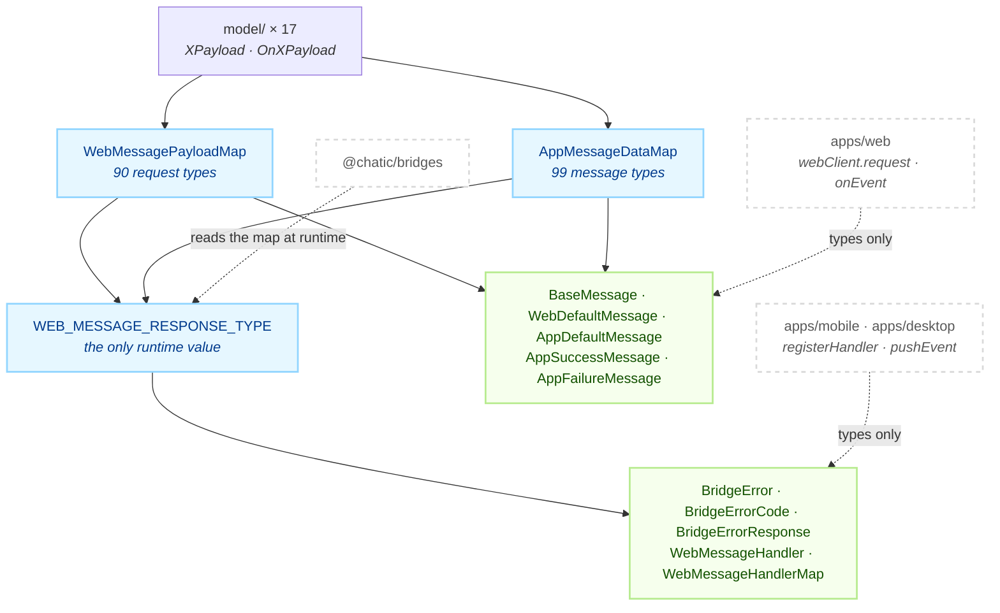

# @chatic/app-messages

**The vocabulary the web and the native shell both compile against.** It declares every message that
can cross the WebView boundary — 90 web→app request types, 99 app→web message types, the payload
shape of each, and the one map that says which reply a request is owed. It carries no transport and
almost no runtime code: a single exported value, and types either side of it.

[`@chatic/bridges`](../bridges/README.md) is the other half of the boundary. **This package declares
what a message is; that one decides what happens to it** — matching a reply to the caller waiting for
it, buffering until the channel exists, giving up on a timeout, reporting a message nobody answers.
The two are separate packages because their build graphs are: the installed app compiles against the
vocabulary, and it must be able to do that without a browser transport coming along.

## Purpose

Consumers see the `@chatic/app-messages` barrel and nothing else. `tsconfig.base.json` maps
`@chatic/app-messages` alone — there is no `@chatic/app-messages/*` entry, so a deep import does not
resolve, and the command that proves nobody writes one:

```bash
grep -rn "@chatic/app-messages/" --include='*.ts' --include='*.tsx' apps libs | grep -v node_modules
```

The package imports **no workspace package at all**, in either direction:

```bash
grep -rn "from '@chatic/" --include='*.ts' libs/app-messages/src   # must print nothing
```

That is the whole reason this lib exists apart from `@chatic/bridges`. The native shell in
`apps/mobile` and the Electron main process in `apps/desktop` need the message shapes and nothing
else; an edge to a sibling here would drag a WebView client into a React Native bundle and an
Electron main process, neither of which has a `window`.

What this package does **not** own: delivery, request/reply matching, readiness buffering and
timeouts ([`@chatic/bridges`](../bridges/README.md)); the handlers that answer these messages
(`apps/mobile/src/app/webview/hooks/useWebMessageRouter.ts`, `apps/desktop/src/main/index.ts`); the
storage engines behind the cache messages ([`@chatic/db`](../db/README.md)); which cache domain is
routed to which engine ([`@chatic/app-runtime`](../app-runtime/README.md)); the `LogEntry` contract
that `AppLogInfo` mirrors on the wire ([`@chatic/logger`](../logger/README.md)).

## Design principles

1. **No workspace dependency.** The grep above is the rule. Where a type here has to agree with a
   type elsewhere, the agreement is asserted from the other side — `@chatic/bridges` declares
   `Pick<AppLogInfo, keyof LogContext>` in `appLogInfoCodec.ts` precisely because this package cannot
   import `LogContext` to derive it.
2. **Types, with exactly one value.** `WEB_MESSAGE_RESPONSE_TYPE` is the only runtime export in the
   package; everything else erases at build. A second value would be a second thing to keep in step
   between two release trains.
3. **A request names its reply once, and the compiler checks it.**
   `as const satisfies Record<WebMessageType, AppMessageType>` makes the map total: add a request to
   `WebMessagePayloadMap` and omit its row here, and the package stops compiling. Nothing else in
   the add-a-message procedure fails on its own.
4. **A retired message keeps its declaration.** The web deploys ahead of the app, so a web build
   that predates a removal is still installed against the newest shell and still sends the old
   message. Deleting the type deletes the handler, which answers `NOT_FOUND`, which surfaces as a
   failure on a screen that used to work. The four `*AppLogBuffer` request/reply pairs are in this
   state today: declared, handled, and documented as answering empty.
5. **Where both sides must declare independently, share the type and not the value.**
   `CacheDomainVersions` is `Partial<Record<CacheType, number>>` and there is deliberately no shared
   constant of version numbers: if both sides imported one, the handshake would be an identity
   rather than a negotiation. The app reports what it implements, the web compares against what it
   requires, and only the shape is common.
6. **Optional fields are the compatibility mechanism.** A field an older peer may not send is
   optional, and the receiver decides the fallback. `SendLogPayload.timestamp` is optional because a
   pre-ADR-0047 web build does not stamp one, and the receiver substitutes its arrival time rather
   than dropping the entry.
7. **Every import is a type import.** Four externals appear — `react-native`, `react-native-iap`,
   `@lemoncloud/chatic-socials-api`, `@lemoncloud/chatic-backend-api` — and all four are
   `import type`, so they erase and no runtime API is ever reached. That is what lets a browser
   bundle include this package while `react-native` is nowhere in its dependency tree.

## Scope

**In** — the three maps (`WebMessagePayloadMap`, `AppMessageDataMap`, `WEB_MESSAGE_RESPONSE_TYPE`);
the envelopes around them (`BaseMessage`, `WebDefaultMessage`, `AppDefaultMessage`,
`AppSuccessMessage`, `AppFailureMessage`); the native handler signatures (`WebMessageHandler`,
`WebMessageHandlerResponse`, `WebMessageHandlerMap`); the bridge failure taxonomy (`BridgeErrorCode`,
`BridgeError`, `BridgeErrorResponse`); and 17 payload files under `model/`.

**Out** — everything that runs. Transport, matching, buffering, timeouts and teardown are
[`@chatic/bridges`](../bridges/README.md). The handlers are the shells (`apps/mobile`,
`apps/desktop`). The cache engines the cache messages reach are [`@chatic/db`](../db/README.md), and
the routing decision in front of them is [`@chatic/app-runtime`](../app-runtime/README.md).

## Structure



Every arrow crossing this package's boundary is dashed, and every one of them points **in** — the
solid arrows are internal. `@chatic/bridges` is the one
consumer that reads `WEB_MESSAGE_RESPONSE_TYPE` as a **value** — twice, in `WebBridgeClient` to know
what reply to wait for and in `AppBridgeHost` to build the handshake's supported-message lists.
Everyone else takes types.

### What governs each hop of a round trip

The runtime mechanics of this exchange belong to [`@chatic/bridges`](../bridges/README.md). What is
drawn here is only which declaration constrains each step, because that is what breaks when a
message is added wrong.

```mermaid
sequenceDiagram
    participant C as web caller
    participant M as this package
    participant H as native handler

    C->>M: { type: 'FetchBadgeCount', data }
    Note over M: WebMessagePayloadMap['FetchBadgeCount']<br/>pins `data` to FetchBadgeCountPayload
    M->>H: WebMessageRequest&lt;'FetchBadgeCount'&gt;
    Note over M,H: WEB_MESSAGE_RESPONSE_TYPE maps the request<br/>to 'OnFetchBadgeCount' — once, for both sides
    H-->>M: WebMessageHandlerResponse&lt;'FetchBadgeCount'&gt;<br/><i>type pinned, data still unknown</i>
    Note over M: AppMessageDataMap['OnFetchBadgeCount']<br/>pins the reply payload
    M-->>C: AppSuccessMessage&lt;'OnFetchBadgeCount'&gt;
```

The asymmetry in the middle is deliberate. A handler's declared return type fixes the reply **type**
but leaves `data` as `unknown`: at that point `refId` and `version` have not been injected yet, and
several domain payloads lose their union correlation when narrowed through a generic. The strict
alternative is `WebMessageAppHandler<K>`, which pins the payload too, and individual handlers opt
into it where the correlation survives.

### Directories

```text
libs/app-messages/src/
├── index.ts                      public barrel — re-exports ./types, nothing else
└── types/
    ├── index.ts                  re-exports model/ and the four files below, flat
    ├── types.ts                  BaseMessage — refId · version · nonce, on every message
    ├── web-message.ts            WebMessagePayloadMap (90) + the WebMessage envelopes
    ├── app-message.ts            AppMessageDataMap (99) + the AppMessage envelopes
    ├── web-message-response.ts   WEB_MESSAGE_RESPONSE_TYPE, handler types, error types
    └── model/                    17 files — the payloads, grouped by domain
```

23 files, 2,844 lines, **no specs and no jest config**. There is nothing to run here; `tsc -b` is the
whole gate.

The payload files, with what is in each:

| File              | Lines | What it declares                                                                       |
| ----------------- | ----- | -------------------------------------------------------------------------------------- |
| `system.ts`       | 561   | Device & System payloads, app icons, permissions, contacts, media — plus `Ping`/`Pong` |
| `cache.ts`        | 435   | `CacheType`, `CacheDomainVersions`, nine `Cache*View` models, the 11 cache messages    |
| `common.ts`       | 220   | `AppLogInfo`, the upload queue, the four retired buffer pairs, `PendingReportInfo`     |
| `device.ts`       | 174   | `DeviceInfo`, `VersionInfo`, `SafeAreaInfo`, the eight file-upload **requests**        |
| `iap.ts`          | 154   | Products, purchases, receipts, `AndroidOfferTokens`                                    |
| `notification.ts` | 129   | FCM token, badge count and base, push marks, OS notification                           |
| `perf.ts`         | 118   | Boot timeline (`BootRecord`, `BootWebMarks`), `SetDebugMode`                           |
| `auth.ts`         | 80    | `OAuthLoginProvider` and the Google/Apple token results                                |
| `test-record.ts`  | 49    | The native DB scenario harness — five messages, used by the debug panel only           |
| `custom-zip.ts`   | 48    | Apply/disable/status for the custom web-bundle override                                |
| `preference.ts`   | 44    | `PreferenceKey` — a closed union of six keys                                           |
| `update.ts`       | 35    | Desktop auto-update: status push, download, restart                                    |
| `app-update.ts`   | 32    | Mobile store update: version check, open store                                         |
| `config.ts`       | 24    | The shell's opaque KV bridge (ADR-0079)                                                |
| `unfurl.ts`       | 23    | URL metadata lookup                                                                    |
| `clipboard.ts`    | 10    | Copy to the native clipboard                                                           |
| `index.ts`        | 16    | The barrel for the sixteen above                                                       |

Names you would not find by guessing at a filename:

- **`BridgeError`, `BridgeErrorCode` and `BridgeErrorResponse` live here**, in
  `web-message-response.ts`, not in `@chatic/bridges` — the native shell constructs error responses
  too, and this package is the only one it compiles against.
- **The native handler signatures are in `web-message-response.ts`**, beside the map they narrow
  against: `WebMessageHandler`, `WebMessageHandlerResponse`, `WebMessageHandlerMap`, and the strict
  `WebMessageAppHandler`.
- `AppLogInfo`, `AppLogLevel` and `AppLogOrigin` are in `model/common.ts`; `Platform` is there too,
  not in `model/device.ts`.
- **The eight file-upload replies are split from their requests.** `RequestFileUploadPayload` and its
  seven siblings are in `model/device.ts`; every `On…Payload` answering them is in `model/system.ts`,
  along with `OnUploadProgressPayload` and `OnUploadCompletePayload`.
- `PingPayload` and `PongPayload` are in `model/system.ts`.
- **There is no `errors.ts`, no `constants.ts` and no enum in the package.** Every union is a string
  literal union: an enum is a runtime value, and principle 2 spends the only one on
  `WEB_MESSAGE_RESPONSE_TYPE`.

## Usage

Callers import types. The message `type` string is the only thing they name — both payloads are
inferred from it.

```ts
import { webClient } from '@chatic/bridges';

// The reply type is never written down: WEB_MESSAGE_RESPONSE_TYPE maps
// 'FetchBadgeCount' to 'OnFetchBadgeCount', and the payload follows.
const { data } = await webClient.request({ type: 'FetchBadgeCount', data: {} });
//      ^? OnFetchBadgeCountPayload — { count: number }
```

The shell side names the same string and gets the handler signature back:

```ts
import type { WebMessageData } from '@chatic/app-messages';

bridge.registerHandler('FetchBadgeCount', async (_message: WebMessageData<'FetchBadgeCount'>) => ({
    type: 'OnFetchBadgeCount', // any other string here does not compile
    success: true,
    data: { count: await getBadgeCount() },
}));
```

### Adding a message

1. Declare `XPayload` (request) and `OnXPayload` (reply) in the `model/` file for the domain. A
   payload with nothing to carry is an empty object type, never `void` and never `never` — the
   envelope's `data` field is not optional.
2. Add `X: XPayload` to `WebMessagePayloadMap`, under the numbered section it belongs to.
3. Add `OnX: OnXPayload` to `AppMessageDataMap`, under the matching section.
4. Add `X: 'OnX'` to `WEB_MESSAGE_RESPONSE_TYPE`. **This is the step that fails to compile if you
   forget it**, and therefore the one that catches steps 2 and 3 having drifted.
5. Register a handler in every shell that should answer it — `apps/mobile`'s
   `useWebMessageRouter`, `apps/desktop`'s `registerHandlers`, or both.

For an app→web push with no request behind it, do step 1 and step 3 only. Nine messages are in that
shape: `OnUpdateDeviceInfo`, `OnBackPressed`, `OnNavigate`, `OnReceiveNotification`,
`OnUploadProgress`, `OnUploadComplete`, `OnPurchaseSuccess`, `OnPurchaseError`, `OnUpdateStatus`.

The deploy order is part of the procedure, not a caveat: **the web ships before the app.** A web
build that sends a message the installed shell has no handler for gets `NOT_FOUND` back, so a new
message needs a fallback on the web side until the shell that answers it is everywhere.

## Scenarios

### 1. A request and its reply

`FetchBadgeCount` → `OnFetchBadgeCount`, above. All 90 request types work this way and each maps to
a distinct reply — no two requests share a reply type.

### 2. A push nobody asked for

`Purchase` resolves with `OnPurchase`, which is an **acknowledgement that the flow started**, not the
outcome. The outcome arrives later and unsolicited, as `OnPurchaseSuccess` or `OnPurchaseError`, and
the web reads it through `onEvent`. That split is why those two are among the nine app-only types:
there is no request they could be the reply to.

### 3. A message the installed shell does not implement

The shell answers `NOT_FOUND`, and the caller decides. `@chatic/db` turns three specific
`NOT_FOUND`s into learned fallbacks — `FetchManyCacheData`, `FetchLastChatsData` and
`ClearCacheDataByChannel` each degrade to an older path the first time they come back unhandled. The
alternative, deleting the message from the map, would break the older web builds still sending it.

### 4. Retiring a message without deleting it

The ring buffer the four `*AppLogBuffer` messages read is gone; the upload queue
(`FetchLogUploadQueue` / `AckLogUploadQueue`) is the only log store. Their types stay, and the shell
answers them with an empty result, because an installed older web build still calls them and a
`NOT_FOUND` would render as a failure on its debug screen.

They deliberately do **not** fall back to the upload queue. `PollAppLogBuffer` is destructive by
contract, so serving the queue through it would let an old build drain entries the server has not
accepted yet — trading at-least-once delivery for a populated debug screen. All four go when no
deployed web build calls them.

### 5. Fire-and-forget

`SendLog` carries one log entry web→app, at a rate set by however much the web logs. It is declared
with a reply (`OnSendLog`) like everything else, but the shell's handler returns nothing, and
`@chatic/bridges` reads that as "no response" and sends none. The reply would have no caller waiting
for it and would cost a main-thread hop per log line.

### 6. Negotiating cache domains in the handshake

`OnWebAppReady` carries three overlapping capability fields, and they are not redundant.
`cacheSchemaVersion` is the physical SQLite version, kept for debugging and for web builds that
predate the rest. `supportedCacheTypes` is a name list, which a web build converts to "version 1 of
each". `cacheDomainVersions` is the measured per-domain contract version (ADR-0053) and wins when
present. A host with no local cache DB — the Electron main process — sends none of them and is read
as legacy. The full negotiation is
[`app-runtime`'s](../app-runtime/docs/data/cache-contract-versions.md).

## How to verify

```bash
npx tsc -b libs/app-messages/tsconfig.json --force     # the whole gate
```

- Type checking must be `tsc -b`. Inside the lib, `tsc --noEmit` checks zero files and succeeds, so
  passing it proves nothing. `nx typecheck @chatic/app-messages` runs `tsc --build
--emitDeclarationOnly` in the lib directory, which resolves to the same program.
- **`tsconfig.json` references `tsconfig.lib.json` only.** Every other lib in `libs/` also references
  a `tsconfig.spec.json`; this one has no specs to reference, and no `jest.config.js`. There is no
  `test` target — `nx test @chatic/app-messages` does not exist, and CI's `run-many -t test` skips
  the project rather than failing it.
- The compile-time checks that matter are assertions, not tests: the `satisfies` clause on
  `WEB_MESSAGE_RESPONSE_TYPE`, and `AppLogInfoLogContext` over in `@chatic/bridges`. Both fail the
  type check and neither produces a test failure, so a green jest run says nothing about them.
- A stale `dist`/`out-tsc` produces phantom errors after a file moves or is deleted — `tsc -b` does
  not clean orphaned `.d.ts` files. `rm -rf dist/out-tsc` and look again.
- Downstream: 157 files in nine projects import this barrel — `apps/mobile` (79), `apps/web` (43),
  `libs/db` (9), `libs/data` (9), `libs/bridges` (8), `libs/app-runtime` (6), and one file each in
  `libs/device-utils`, `apps/desktop` and `apps/desktop-web`. (`apps/admin-v2`, `libs/shared` and
  `libs/config` name the package in comments only — `libs/config` declares its own `Stage` and
  `Platform` rather than importing them.) `.github/workflows/verify.yml` type checks all nine except
  `@chatic/mobile` and `desktop-web` — those two are the ones to run by hand, and `desktop-web`
  carries a long-standing 21-error baseline, so compare against it rather than expecting zero.

```bash
npx nx run-many -t typecheck --exclude=desktop-web,block-kit-builder,@chatic/landing,@chatic/mobile,chatic-deferred-link-cleanup
```
