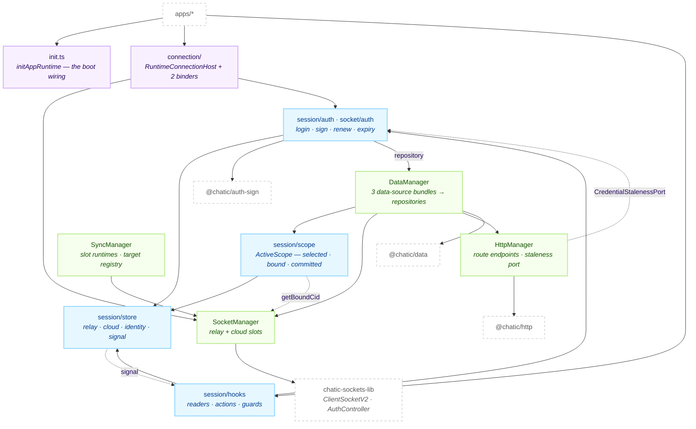
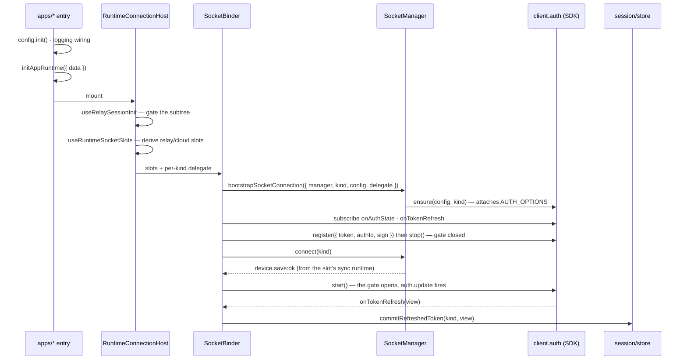

# @chatic/app-runtime

**The runtime an app mounts.** It owns the session — tokens, the selected cloud and site, identity —
and derives everything downstream from it: two WebSocket slots and their authentication, the HTTP
client and the credential that signs it, the repository graph and its cache scope, the sync runtimes
that keep those caches current, device-token registration, and the user issue report. It exports one
name, `runtime`, holding seven groups.

This document covers the **overview and structure** only. The per-layer detail is canonical under
[`docs/`](#documents).

## Purpose

Apps see the `@chatic/app-runtime` barrel and nothing else, and inside that barrel there is one
identifier. Imports that reach past it into internal paths number **zero**, which is what lets the
inside be rearranged with no blast radius.

```bash
grep -rn "@chatic/app-runtime/" --include='*.ts' --include='*.tsx' apps libs | grep -v node_modules
```

Four apps consume it and nothing else does — `apps/web`, `apps/desktop-web`, `apps/admin-v2`,
`apps/testbed`. The surface itself is locked symbol by symbol by
[`src/public-surface.test.ts`](./src/public-surface.test.ts): 64 value exports across the seven
groups, and a test that fails if an eighth group appears or a symbol moves between them.

This lib is the **composition root, not an engine**. It builds and wires; the engines it assembles
live elsewhere and do not leak to apps: the socket transport and its auth controller
(`@lemoncloud/chatic-sockets-lib`), the data layer ([`libs/data`](../data/README.md)), the HTTP
executor ([`libs/http`](../http/README.md)), the storage adapters ([`libs/db`](../db/README.md)),
the HMAC signer (`libs/auth-sign`) and the logging core ([`libs/logger`](../logger/README.md)).
[`libs/config`](../config/README.md) is the one exception an app touches directly — it calls
`config.init()` from its own entry point, before this lib boots.

## Design principles

1. **Session state has one home and one writer, and that writer is passive.** `session/store/**` stores and announces; it knows nothing about sockets, data, HTTP or its own sibling folders. The rule is not a convention — [`eslint.config.mjs`](./eslint.config.mjs) bans those imports inside `store/**`, with exactly one exempt file.
2. **Every engine has one creation point.** `getSocketManager()` · `getSyncManager()` · `getHttpManager()` · `getDataRuntime()`. A second `new` for any of them is a bug, and the sync manager deliberately gets its own file so `socket/` never imports `socket/sync/`.
3. **Nothing here calls a refresh endpoint, and nothing here builds an `auth.update` packet.** The SDK's auth controller owns both. Two tests walk the source tree and fail on the string: [`http/refreshAbsence.test.ts`](./src/http/refreshAbsence.test.ts) and [`socket/authUpdateAbsence.test.ts`](./src/socket/authUpdateAbsence.test.ts). Path-based lint was tried first and died silently when the symbols moved.
4. **Every server call is a repository call.** Gateway instances are known only inside `data/` and `http/`; even the login and token-exchange use cases in `session/auth/` go through `AuthRepository` (ADR-0036). There is no direct-gateway escape hatch.
5. **The three scope views are never collapsed.** `selected` flips optimistically, `bound` is observed from the live socket, `committed` follows the token. Their disagreement _is_ optimistic cloud switching; merging them brings back cross-cloud cache poisoning.
6. **One truth table answers "is this slot authenticated".** `deriveAuthStatus` is a pure function of six signals, and any file that recombines the sources itself is a regression (ADR-0076).
7. **A store write emits a typed signal, and one use case is one fan-out.** Every writer emits its `SessionSignalKind`; a use case wraps itself in `sessionSignal.batch()` so subscribers never observe a half-applied switch.
8. **relay refreshes, cloud re-issues — and that asymmetry is two classes, not a comment.** A relay token has no parent, so its only renewal is the socket's own refresh; a cloud token is minted from the relay identity, so it is re-issued. `ICredentialRenewer` has one implementation each.
9. **Boot is an explicit call.** `initAppRuntime()` runs the wiring that used to happen as an import side effect, where it was invisible in the entry point and a tree-shake could move or drop it.
10. **Only interfaces and domain types cross a boundary.** Contracts are `I*` interfaces, implementations are classes taking their dependencies as constructor arguments, and an implementation class never leaves its assembly point.
11. **File kind decides file placement, and two tests check it.** Hooks live in their module's `hooks/` ([`hookPlacement.test.ts`](./src/hookPlacement.test.ts), which checks exported `use*` declarations, not just filenames); types live in `types.ts` with **zero value exports** — all seven of them — because `socket/index.ts` re-exports its `types.ts` wholesale and a value put there leaks onto a barrel. Value constants go in `constants.ts`, pure helpers in `utils/`.
12. **There are no value import cycles.** [`importCycleAbsence.test.ts`](./src/importCycleAbsence.test.ts) re-measures the tree on every run rather than trusting a lint path.

## Scope

**In** — the session store and its signal, the login/logout/switch use cases, the scope owner, the
React session surface, the socket manager and its two slots, socket authentication wiring and
credential renewal, the sync manager and the app's sync plans, the HTTP manager and its route
endpoints, the repository graph and cache-storage routing, the offline chat outbox, device-token
registration, the user issue report and the log-batch upload, and the boot call that wires them.

**Out** — the socket transport and its `AuthController`
(`@lemoncloud/chatic-sockets-lib`); repositories, data sources and mappers
([`libs/data`](../data/README.md)); the HTTP executor, retry and error classification
([`libs/http`](../http/README.md)); IndexedDB and native SQLite adapters
([`libs/db`](../db/README.md)); the HMAC signature itself (`libs/auth-sign`); the log entry
contract and its uploader ([`libs/logger`](../logger/README.md)); the settings registry
([`libs/config`](../config/README.md)); and everything a screen does with any of it.

## Structure



Three rules the arrows cannot draw. **The store is a leaf** — every arrow touching it points in.
**The status path only reads** — `deriveAuthStatus` and `ActiveScope` observe the store and the
socket and write to neither. And **`http/` is a leaf too, with one exception**:
[`http/factory.ts`](./src/http/factory.ts) is the only file under `http/` that imports the session,
which is what lets `session/auth` and `data/` both depend on HTTP without closing a cycle.

### Booting one slot



The gate is the part that is easy to get wrong: the backend cannot process `auth.update` until a
device is registered on that connection, and the SDK sends both on the same `connected` event with
`auth.update` first. Details in [docs/auth/](./docs/auth/README.md).

### Directories

```text
libs/app-runtime/src/
├── index.ts          public barrel — one export, `runtime`
├── facade.ts         the seven groups, assembled from group barrels
├── init.ts           initAppRuntime — five boot steps, in order
├── boot.ts           the `boot` group's barrel; it has no module of its own
├── connection/       11 files — the host, SocketBinder, SocketReauthBinder, 5 hooks
├── session/          53 files — store (12) · auth (9) · scope (3) · hooks (28)
├── socket/           32 files — SocketManager (6) + utils (2) + auth wiring (17) + sync (7)
├── http/             6 files — HttpManager, transport, gateways, 2 late-bound registries
├── data/             17 files — DataManager, 3 factories, cache routing, outbox, 4 hooks
├── push/             3 files — device-token registration and its record
├── report/           5 files — user issue report + log-batch upload
├── config/           1 file — records the effective settings in the logs
└── utils/            4 files — Coalescer · Throttle · unrefTimer · isNativeApp
```

136 source files, 77 test files, 10,466 lines of non-test code.

Names that are not where a filename suggests. `ISocketManager`, `SocketKind`, `SocketState` and
`ScopedSocketClient` all live in [`socket/types.ts`](./src/socket/types.ts) — there is no
`ISocketManager.ts`. `SocketSessionDelegate` and `ReauthDelegate` live in
[`socket/auth/types.ts`](./src/socket/auth/types.ts); `IDataManager` and `CacheAssemblyOptions` in
[`data/types.ts`](./src/data/types.ts); `ISyncManager` in
[`socket/sync/types.ts`](./src/socket/sync/types.ts). The `boot` group is a **file**,
`boot.ts`, not a directory — booting is not an engine, so the logic stays in whichever module owns
each piece. `http/`, `config/` and `utils/` have no `index.ts` at all: they are not facade groups
and in-package callers reach them by concrete path.

## Usage

Two calls and one component. Everything else is a hook.

```ts
// apps/*/src/main.tsx — once, before render.
import { runtime } from '@chatic/app-runtime';

runtime.boot.initAppRuntime({ data: { cache: { maxChatsPerChannel: 1000 } } }); // `data` is optional
```

```tsx
import { runtime } from '@chatic/app-runtime';

export const App = () => (
    // The host derives its own socket slots and owns the auth delegate. An app passes only children.
    <runtime.connection.RuntimeConnectionHost>
        <MainLayout />
    </runtime.connection.RuntimeConnectionHost>
);
```

```tsx
const ChannelList = () => {
    const { selectedCloudId } = runtime.session.useSessionSelection();
    const { channel } = runtime.data.useRuntimeRepositories();
    const { isConnected, isVerified } = runtime.connection.useRuntimeSocketState();
    runtime.sync.useChannelSync(channelId); // keeps this channel live while mounted
};
```

Four rules hold.

1. **Import one identifier.** `runtime`, then pick a group. The groups are not importable on their own, and that is deliberate: `data` is already a local in 23 consumer files, `session` in 17, `sync` in 9, so `const { data } = useQuery()` would shadow the group and stop the file compiling. There is no flat alias lane either — selling a symbol under two names guarantees one of them rots.
2. **A group is a job, not a folder.** `session.applySessionToken` lives in `socket/auth/`, `session.authFailureReaction` in `http/`, `push.useRegisterDeviceTokenMutation` in `data/hooks/`. Each group's own barrel names every symbol it sells, so the barrel is the catalogue.
3. **Read values with hooks; control lifecycle by mounting.** `RuntimeAuthHost` is the same host with background guest login switched off — for a console that must not silently acquire a session. It is a second named export rather than a prop so a forgotten argument cannot hand a console a guest.
4. **Store writers are not on the surface.** Reading `getGlobalSessionContext()` is fine; there is no `setSessionAuthenticated` to call. Driving the session is the runtime's own job.

### Wiring

```text
apps/*/src/main.tsx
  ├─ config.init(...)                     @chatic/config — first, this lib reads it lazily
  ├─ logging + bridge wiring              the log hub must have listeners before anything logs
  ├─ initAppRuntime({ data? })            ↓ five steps, in this order
  │    ├─ logoutStorageSweeper.sweep()    honors ?logout=1, drops the signed-out account's keys
  │    ├─ configureSessionStore()         env → relay endpoint RESOLVERS (functions, not values)
  │    ├─ credentialRecovery.register()   HTTP recovery → the relay renewer
  │    ├─ configureDataRuntime(config)    app cache/repository policy, only if passed
  │    └─ attachConfigStateLog()          one boot line naming every overridden setting
  └─ render
       └─ <RuntimeConnectionHost>
            ├─ useRelaySessionInit()      gate: renders null until the session is ready
            ├─ useSocketSessionDelegate() per-kind seed · sign · writeback
            ├─ useRuntimeSocketSlots()    session → { relay?, cloud? } slot configs
            ├─ useRelaySessionKeepAlive() guest login when no session exists (host-dependent)
            ├─ <SocketBinder>             boots/tears down each slot; calls getSyncManager() first
            └─ <SocketReauthBinder>       re-auths a slot whose identity token changed
```

Nothing in `initAppRuntime` touches the network. Endpoints are injected as **functions**, so a
deeplink override captured after boot still applies, and the transport is built on first use. The
call is idempotent (a second one warns), and it must sit between two boundaries: **after** the app's
logging wiring, because it logs; **before** anything that can read the session, because
`relayStore.getBackend()` throws rather than guessing when its resolvers are missing — a loud
failure that names `initAppRuntime()` beats a request going out with an empty host.

Three of the five steps delegate to the module that owns the thing being configured. Credential
recovery does not, because it owns nothing: it joins the HTTP registry to the socket renewers, and
the registry imports nothing at runtime precisely so the two sides never meet. A wiring with no owner
belongs to the composition root.

## Scenarios

### 1. Cold boot as a guest

`initAppRuntime` injects the endpoint resolvers and registers credential recovery; no network. The
host awaits `useRelaySessionInit`, which runs the transport init once and blocks the subtree —
it reads the stored session's existence, it does not refresh it. With no relay token,
`useRelaySessionKeepAlive` runs one device-based guest login (a `Coalescer` keeps a re-render from
firing a second). The token commits, `SocketBinder` boots the relay slot, and the slot reaches
`verified` once `device.save:ok` opens the gate and `auth.update` is acknowledged.

### 2. Waking up with a lapsed relay credential

The app calls `recoverUnverifiedSockets()` on its own foreground signal. Only slots where
`needsSocketKick(status)` holds get kicked — a slot that looks `verified` is left alone, because
churning a warm connection costs more than it fixes. When the relay socket re-verifies,
`useSessionStalenessGuard` evaluates on that rising edge; a `stale` status runs
`credentialRenewers.relay.renew()`, which is the SDK's own `auth.refresh()`. The refreshed view
comes back through `onTokenRefresh`, is merged so that `identityToken`, `identityPoolId` and the
credential bundle survive, and lands in the store. **There is no HTTP fallback**: with no socket,
`renew()` returns `false` and the caller's job is to get a socket back.

### 3. Switching cloud

`cloudSession.switchTo(cloudId)` flips the selected cid and clears the selected site immediately, so
cid-scoped cache observers re-subscribe to the target at once. The token exchange
(`delegate-cloud` then `exchange-token`) runs, and the commits happen inside one
`sessionSignal.batch()` — subscribers see one notification, not eight, and a failed switch rolls
back inside the batch so it is never observed at all. `committed` moves only on success; `bound`
says where the socket actually is. Every cloud switch changes the wss URL, so the binder rebuilds
the slot rather than re-authenticating it.

### 4. A guest signs in

The relay token is replaced but `url|deviceId|wssType` is unchanged, so `SocketBinder` does not
reboot. `SocketReauthBinder` sees the slot's `identityToken` change and calls
`reauthenticateActiveSocket`. If the SDK already holds that exact token the call is a no-op — that
guard is what stops the SDK's own refresh writeback from looping back as a re-authentication.
Otherwise it fires `auth.logout()` to revoke the old backend session, forces the verified flag down,
and re-registers, which is how the SDK re-sends `auth.update` on a live connection.

### 5. A screen opens a room

`useChatSync(channelId)` registers a sync target by ref-count and primes the room in one call:
the cache's highest `chatNo` becomes the plan's baseline through `updateLocalSnapshot`, and only a
cold cache fetches a first page. Live messages then arrive as `chat.sync` pushes and land in the
same cache by idempotent `chatNo` merge. Unmounting disposes the ref; the last dispose stops the
target after a 30-second grace, so a route change and back does not restart it.

### 6. The session is over

Two ways, and only one is reversible. A user logout calls `logoutSession()`, which notifies both
slots' sockets with `auth.logout()` and then tears the local session down and redirects with
`?logout=1` — the flag the next document's `initAppRuntime` reads to sweep the storage. The other is
terminal: the SDK exhausts `maxFailures` and reports `expired`, and
`RelayCredentialRenewer.onTerminalExpiry()` waits through two 30-second confirmation rounds — while
offline it does not judge at all — before logging out, because `expired` also means "three failures
on a dying link". A backend-revoked session skips all of that: nothing the client holds can
un-revoke it, so it is detected by its error message and ends the session immediately.

## Documents

| Folder                                                                     | What it covers                                                                                                                     |
| -------------------------------------------------------------------------- | ---------------------------------------------------------------------------------------------------------------------------------- |
| [docs/session/](./docs/session/README.md)                                  | The session hub. Three stores and their keys, the typed signal and batching, the scope's three views, the use cases, the hooks     |
| [docs/auth/](./docs/auth/README.md)                                        | Staying authenticated. Who owns what, the five-state truth table, boot and re-auth wiring, the two renewers, the two guards        |
| [docs/auth/signing.md](./docs/auth/signing.md)                             | The per-kind `authId` / signature / writeback contract, and the registry that catches an `authId` drifting out from under the SDK  |
| [docs/socket/](./docs/socket/README.md)                                    | `SocketManager`. Dual slots and the active facade, kind-pinned requests and subscriptions, the binders, state, failure reporting   |
| [docs/sync/](./docs/sync/README.md)                                        | `SyncManager`. Per-slot runtimes, the ref-counted target registry, the five plans, chat prime, `updateLocalSnapshot`               |
| [docs/sync/plans.md](./docs/sync/plans.md)                                 | What the SDK scheduler does under the plans — the two plan families, the triggers, and the behaviours only the source shows        |
| [docs/data/](./docs/data/README.md)                                        | `DataManager` and the three factories, the offline outbox, invited-cloud durability                                                |
| [docs/data/cache-storage-routing.md](./docs/data/cache-storage-routing.md) | Which storage a cache type lands in, and the contract-version negotiation that keeps a web deploy ahead of the app from voiding it |
| [docs/http/](./docs/http/README.md)                                        | `HttpManager`. The three routes, the sealed transport, the staleness port, and the two late-bound registries                       |
| [docs/push/](./docs/push/README.md)                                        | Device-token registration — the delegate contract, the once-per-install record, the triggers                                       |

## How to verify

```bash
npx tsc -b libs/app-runtime/tsconfig.json         # every project tsconfig.json references
npx jest --config libs/app-runtime/jest.config.js # 77 test files
cd libs/app-runtime && npx eslint src             # flat config — run it from this directory
```

- Type checking must be `tsc -b`. Inside `libs/app-runtime`, `tsconfig.json` is a solution file (`files: []`, `include: []`), so `tsc --noEmit` checks zero files and exits 0. `tsc -b tsconfig.json` builds what that file references — the lib project, and the spec project when it is on the reference list. `tsc -b tsconfig.lib.json` checks only the lib.
- Jest does not type check: the base sets `isolatedModules`, so ts-jest transpiles. A fixture that has drifted from the type it imitates surfaces as `… is not a function` at runtime unless the spec project is checked too.
- Four tests are gates rather than unit tests, and they fail for reasons a reviewer will not expect: `public-surface.test.ts` (the 64 symbols and their groups), `refreshAbsence.test.ts` and `authUpdateAbsence.test.ts` (they walk `src/**` for a string), `importCycleAbsence.test.ts` (it rebuilds the import graph), and `hookPlacement.test.ts` (every exported `use*` sits in a `hooks/` folder).
- Do not run `yarn install` in a worktree. Node resolution walks up to the parent repo's `node_modules`, so the binaries are already reachable; installing here rewrites `apps/mobile/ios/Podfile.lock` and a leftover symlink poisons the parent on the next install.
- `.github/workflows/verify.yml` runs `lint`, `typecheck` and `test` for this project on every pull request, so a red gate here is a red CI.
- Downstream: a changed barrel symbol reaches `apps/web`, `apps/desktop-web`, `apps/admin-v2`, `apps/testbed` and `libs/data`. That workflow excludes `desktop-web` from `typecheck` (a long-standing error baseline) and `web` from `test` (7 failures of 2720), so those two are the ones to run by hand.
- A stale `dist`/`out-tsc` produces phantom errors after a directory moves — downstream projects read a lib's emitted `.d.ts`, not its source, and `tsc -b` does not delete orphans. `rm -rf libs/app-runtime/dist libs/app-runtime/out-tsc` and look again. For the same reason, an app "type error" right after a barrel change is usually an unbuilt lib: build the lib first, then re-run the app alone.
