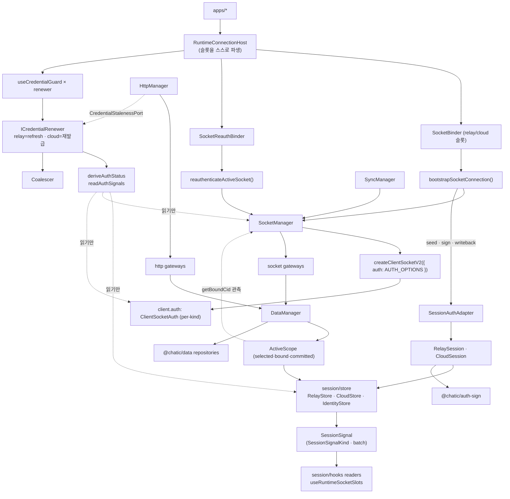
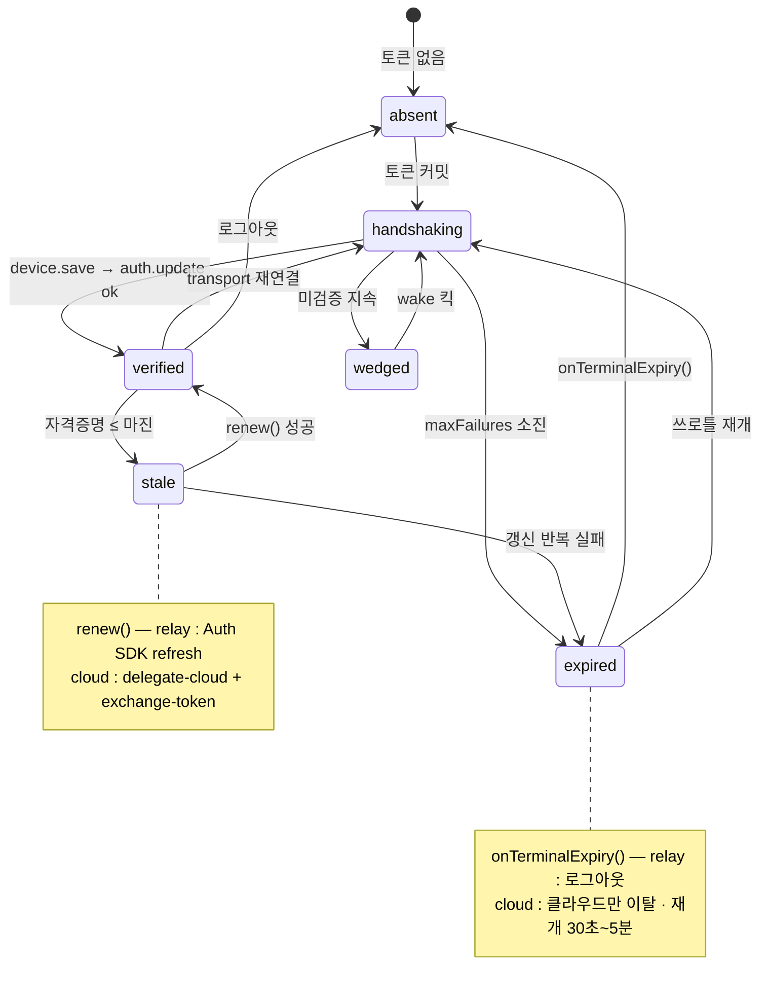
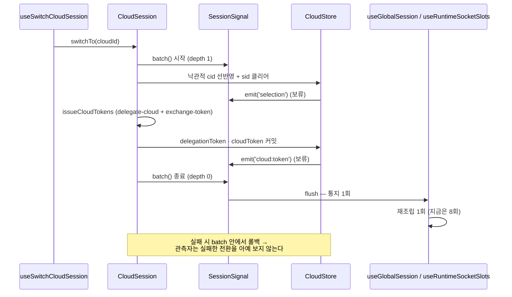

# App Runtime Architecture (v2)

> 상태: **Proposed** · 최종 갱신: 2026-09-07 · 기준 트리: `claude/app-runtime-auth-architecture-31b5a3` (`76a601410`)
> 관련 ADR: [ADR-0074](../../../docs/adr/0074-app-runtime-auth-single-verdict-and-typed-session-events.md)
> (인증 단일 판정 · 세션 시그널 타입화 · 자격증명 renewer) ·
> [ADR-0070](../../../docs/adr/0070-app-runtime-session-hub.md) (세션 허브 · HTTP 대칭 · 엔진 분리) ·
> [ADR-0036](../../../docs/adr/0036-data-surface-unification-app-runtime-cleanup.md) (repository 단일 표면)
>
> ⚠️ **이 문서는 목표 구조다.** 현재 Live 문서는 [`architecture.md`](./architecture.md)이고, 이 문서가
> `Live`로 전환되는 시점에 그 문서를 **삭제**한다(ADR-0074 §최종 구조). 그때까지 코드의 진실은
> `architecture.md`이며, 이 문서의 §시나리오·§상세 구현은 "이렇게 될 것"을 말한다.
>
> 무엇이 **그대로 남고** 무엇이 **바뀌는지**는 §범위가 한 표로 정리한다 — ADR-0070의 결정은 대부분
> 유효하고, 이 개정은 그 위에 "상태를 어떻게 읽는가"를 얹는다.

## 목적

`libs/app-runtime`는 앱이 보는 **유일한 런타임 창구**다. 세션(토큰·선택 상태·identity·스코프)을 소유하고,
그 세션으로부터 소켓 연결·HTTP 클라이언트·repository 그래프·sync 런타임을 파생시키는 **composition root**다.

앱이 직접 보는 패키지는 `@chatic/app-runtime`와 `@chatic/data` 둘뿐이다. `@chatic/http` · `@chatic/db` ·
`@chatic/auth-sign` · `@chatic/web-config` · `@lemoncloud/chatic-sockets-lib`는 전부 이 라이브러리가
조립하는 대상이며 앱 코드에 새지 않는다.

v2가 추가로 책임지는 것은 하나다: **"지금 인증·세션 상태가 무엇인가"에 대한 답이 이 패키지 안에 정확히
한 군데 있다.** ADR-0070이 상태의 *소유*를 하나로 만들었고, 이 개정은 상태의 *판정과 통지*를 하나로 만든다.

## 설계 원칙

앞으로 이 영역을 확장·수정할 때 따르는 기준이다. 1~5는 ADR-0070에서 계승하고, 6~10은 ADR-0074가 추가한다.

1. **세션은 여기 하나가 관리한다.** 세션 상태의 유일한 보관처·writer는 `session/store`다.
2. **엔진은 각자 하나만 소유한다.** `SocketManager`(소켓) · `HttpManager`(HTTP) · `SyncManager`(sync) ·
   `DataManager`(repository 그래프). 인증 *수명주기*는 엔진 축이 아니라 Auth SDK `ClientSocketAuth`가 소유한다.
3. **refresh 실행은 `ClientSocketAuth` 단독이다.** 이 리포에 refresh 엔드포인트를 치는 코드가 하나도 없고,
   그 부재를 [`src/http/refreshAbsence.test.ts`](../src/http/refreshAbsence.test.ts)가 지킨다.
   `auth.update`를 짓는 것도 SDK 단독이고, 그 부재는
   [`src/socket/authUpdateAbsence.test.ts`](../src/socket/authUpdateAbsence.test.ts)가 지킨다.
4. **스토어는 수동적이다.** `session/store/**`는 소켓·데이터·HTTP·형제 폴더를 모른다 —
   [`eslint.config.mjs`](../eslint.config.mjs)의 `no-restricted-imports`가 강제선이다.
5. **세 뷰는 합치지 않는다.** 스코프의 `selected`(선택) · `bound`(소켓 관측) · `committed`(커밋 토큰)는 이름
   붙은 별개 값이다. 통일하는 것은 **소유자**(`session/scope/ActiveScope`)이지 값이 아니다.
6. **판정은 한 군데서만 한다.** 인증 상태(`AuthStatus`)를 계산하는 코드는 `deriveAuthStatus` 순수 함수
   하나다. 다른 파일이 원천 7개를 다시 조합하는 것은 회귀다 (ADR-0074 결정 1).
7. **통지는 타입이 있고, 유스케이스 1회는 fan-out 1회다.** 쓰기 메서드는 예외 없이 자기
   `SessionSignalKind`를 emit하고, 유스케이스는 `sessionSignal.batch()`로 경계를 긋는다
   (ADR-0074 결정 2).
8. **비대칭은 클래스로 표현한다.** relay는 refresh, cloud는 재발급 — 이 사실은 주석이 아니라
   `ICredentialRenewer` 구현 두 개다. 공유되는 것은 스케줄링뿐이다 (ADR-0074 결정 3).
9. **경계를 넘는 것은 인터페이스와 도메인 타입뿐** (ADR-0070 §0). 계약은 `I*` 인터페이스, 구현은 클래스 +
   생성자 주입, 구현 클래스는 조립 지점 밖으로 나가지 않는다.
10. **이름은 발명하지 않고, 선례의 강도를 같이 적는다.** 새 심볼은 리포에 이미 있는 형태만 쓰고,
    §네이밍 규약이 형태별 **실측 등장 수**를 표로 들고 있다 — "선례가 있다"와 "선례가 55건이다"는
    다른 주장이므로 숫자 없이 관례를 주장하지 않는다. 실측 0건인 접미사(`*Impl` · `*Service` ·
    `*Strategy` · `*Bus` · `*Verdict` · `*Probe`)와 이미 다른 뜻으로 점유된 단어(`transact`
    — DB·결제 트랜잭션)는 쓰지 않는다. 불가피하게 새 단어를 쓸 때는 표에 **새 단어라고 표시**한다
    (현재 `Renewer` 하나).

## 네이밍 규약

현 트리(`53a2a47e6`)에서 실측한 관례다. 새 심볼을 추가할 때 이 표에서 형태를 고른다. **실측** 열은 그
형태가 리포에 실제로 몇 번 나오는지다 — 선례의 강도가 형태마다 크게 다르므로 숫자를 같이 적는다.

| 형태                       | 규약                                                    | 실측                           | 선례                                                                                |
| -------------------------- | ------------------------------------------------------- | ------------------------------ | ----------------------------------------------------------------------------------- |
| 계약 인터페이스            | `I` + 개념                                              | 55쌍                           | `ISocketManager` · `IDataManager` · `IAuthSigner` · `ICredentialRecoverer`          |
| 구현 클래스                | 인터페이스에서 `I`만 뗀 이름                            | 55쌍                           | `SocketManager` · `CredentialRecoveryRegistry` · `PortCredentialRecoverer`          |
| 싱글턴 export              | 클래스명 camelCase, 타입은 인터페이스로 고정            | **4건뿐**                      | `credentialRecovery` · `staleCredentialMarker` · `webClient`                        |
| 지연 조립 싱글턴           | `get*()` + `reset*()` 테스트 시임                       | 3                              | `getHttpManager`/`resetHttpManager` · `getSocketManager` · `getSyncManager`         |
| 함수 + 주입 인자           | `(args, deps?: *Deps)` + lazy 기본값                    | 2                              | `requestRelaySessionRefresh(deps)` · `recoverUnverifiedSockets(deps)`               |
| 포트 (소비자 쪽 계약)      | `*Port` · `*Provider` · `*Delegate` (`I` 없음)          | 1 · 4 · 2                      | `CredentialStalenessPort` · `DataContextProvider` · `SocketSessionDelegate`         |
| 포트 구현 (세션→포트 변환) | `*Adapter`                                              | 265                            | `SessionCredentialAdapter implements CredentialStalenessPort`                       |
| 행위자 (하나의 일을 수행)  | `-er` / `-or` 명사                                      | `Recoverer` 9 · `Attributor` 8 | `ICredentialRecoverer`(libs/http) · `IAuthSigner` · `IFailureAttributor`            |
| 개념 그 자체인 클래스      | 접미사 없이 개념 명사                                   | 1                              | `ActiveScope implements DataContextProvider`                                        |
| 순수 판정 함수 + 결과 타입 | `derive*` + `*Status` + 입력 `*Signals`                 | 2 · 14 · **1**                 | `deriveConnectivity` · `ConnectivityStatus` · `ConnectivitySignals`                 |
| 순수 헬퍼                  | 클래스가 아니라 함수, `utils/`                          | —                              | `calcSignature` · `msUntilExpiration` · `annotateSocketError` · `socketRebootKey`   |
| 값 묶음 타입               | `*Snapshot` · `*Context` · `*State`                     | 234 · 14 · 20                  | `CloudSessionSnapshot` · `RelayContext` · `SocketState`                             |
| 훅 옵션                    | `*Policy` (정책) · `*Options` (조립) · `*Config` (부팅) | 5 · 49 · 14                    | `SessionStalenessPolicy` · `CacheAssemblyOptions` · `AppRuntimeConfig`              |
| 함수 인자 묶음             | `*Args` (필수) · `*Deps` (주입 가능·기본값 있음)        | 2 · 5                          | `BootstrapSocketConnectionArgs` · `RecoverUnverifiedSocketsDeps`                    |
| 상수                       | SCREAMING_SNAKE                                         | —                              | `AUTH_OPTIONS` · `SLOT_KINDS` · `RELAY_TOKEN_KEY` · `DEFAULT_INTERVAL_MS`           |
| 문자열 유니온 키           | `*Kind` · `*Owner` · `*Route`                           | —                              | `SocketKind` · `CredentialOwner` · `HttpRoute`                                      |
| 훅                         | `runtime/`은 `useRuntime*`, 가드는 `use*Guard`          | 4 · 3                          | `useRuntimeBinding` · `useRuntimeSocketState` · `useCloudCredentialGuard`           |
| 부팅 배선                  | `configure*`                                            | 4                              | `configureSessionStore` · `configureCredentialRecovery` · `configureRelayEndpoints` |
| 파일명                     | 엔진/스코프 클래스만 PascalCase, 그 외 camelCase        | 4 ↔ 나머지                    | `SocketManager.ts` · `ActiveScope.ts` ↔ `credentialFreshness.ts` · `relayStore.ts` |

**쓰지 않는 접미사** (리포 실측 0건): `*Impl` · `*Service`(libs) · `*Strategy` · `*Bus` · `*Verdict` ·
`*Probe`(선언 0). `transact`도 쓰지 않는다 — 0건인데다 `transaction`은 이 리포에서 이미 **DB
트랜잭션**([IndexedDBDatabase.ts](../../db/src/indexeddb/IndexedDBDatabase.ts))과 **결제
트랜잭션**(`FinishPurchaseTransaction`)을 뜻한다. "모아서 한 번만 통지"는 리포 어휘로 `batch`(60) ·
`flush`(74)다.

**v2가 도입하는 이름과 그 근거** — 마지막 열이 근거의 강도다:

| 새 심볼                                                                    | 형태                  | 근거                                                                                                                                                                                                                                                                           |
| -------------------------------------------------------------------------- | --------------------- | ------------------------------------------------------------------------------------------------------------------------------------------------------------------------------------------------------------------------------------------------------------------------------ |
| `SessionAuthAdapter implements SocketSessionDelegate`                      | 포트 구현             | `*Adapter` 265 · `SessionCredentialAdapter`가 같은 패키지의 동형 선례                                                                                                                                                                                                          |
| `SocketAuthSnapshot`                                                       | 값 묶음               | `*Snapshot` 234 · `CloudSessionSnapshot`                                                                                                                                                                                                                                       |
| `IRelayStore` / `RelayStore` (외 2)                                        | 계약+구현             | `I*` 55쌍. 기존 `RelayCore`는 web-core `session/core` 잔재라 관례 밖                                                                                                                                                                                                           |
| `useRuntimeSocketSlots` + `RuntimeSocketSlots`                             | `runtime/` 훅         | `useRuntime*` 4                                                                                                                                                                                                                                                                |
| `useCredentialGuard` + `CredentialGuardPolicy`                             | 가드 훅 + 정책        | `use*Guard` 3 · `*Policy` 5                                                                                                                                                                                                                                                    |
| `relaySession.clearSessionAndRedirect()` · `cloudSession.clearStores()`    | `clear*` 동사         | `clearSession` · `clearToken` · `clearSelectedSite` 등 다수                                                                                                                                                                                                                    |
| `SessionSignalKind`                                                        | 문자열 유니온 키      | `SocketKind` · `CredentialOwner`                                                                                                                                                                                                                                               |
| `AuthStatus` · `AuthSignals` · `deriveAuthStatus`                          | 순수 판정 함수 + 결과 | `deriveConnectivity`/`ConnectivityStatus`/`ConnectivitySignals` — **직계 형제 1쌍뿐이지만 미러링 대상이 바로 그것**                                                                                                                                                            |
| `readAuthSignals` · `getAuthStatus` (+ `AuthSignalDeps`)                   | 함수 + 주입 인자      | 같은 폴더의 `requestRelaySessionRefresh(deps)` · `recoverUnverifiedSockets(deps)`                                                                                                                                                                                              |
| `ISessionSignal` / `SessionSignal` / `sessionSignal` · `batch()`/`flush()` | 계약+구현+싱글턴      | 싱글턴 형태 4건 · 기존 `signal.ts`의 "session signal" 어휘 · `batch` 60/`flush` 74                                                                                                                                                                                             |
| `Coalescer<T>`                                                             | 기존 클래스의 일반화  | `RelayRefreshCoalescer`에서 도메인 접두사만 제거 (1가족)                                                                                                                                                                                                                       |
| `IRelaySession` / `RelaySession` · `ICloudSession` / `CloudSession`        | 개념 그 자체인 클래스 | **`*Session` 클래스는 리포에 0건.** 형태 근거는 `ActiveScope` 하나이고, 단어는 `CloudSessionSnapshot`·`switchCloudSession` 등 명사구로 이미 흔하다 — 그 명사구의 클래스 승격                                                                                                   |
| `selected` (구 `intent`) · `deriveSelectedContext` (구 `deriveIntent`)     | 개명                  | `getSelectedCloudId`·`getSelectedSiteId`·`applySelectedSite`·`useSessionSelection`·`CLOUD_SELECTED_*` 키. 구 `intent`는 스코프 뜻으로 3파일뿐이고 나머지 등장은 안드로이드 `Intent`다 (ADR-0074 §결정 8)                                                                       |
| `mergeRefreshedRelayToken` · `mergeRefreshedCloudToken`                    | 순수 헬퍼 (함수)      | `merge*` 접두 심볼은 리포에 없다. 형태 근거는 "순수 헬퍼는 함수"(`calcSignature` · `msUntilExpiration`)                                                                                                                                                                        |
| `ICredentialRenewer` / `RelayCredentialRenewer` / `CloudCredentialRenewer` | 행위자                | **`Renewer`는 리포에 없는 새 단어다** (0건). `-er` 형태는 `Recoverer` 9·`Attributor` 8에서, 동사 `renew`는 `renewCloudSession`에서 왔다. `libs/http`의 `ICredentialRecoverer`를 재사용하지 않는 이유는 그쪽이 요청 재시도용 회복이고 이쪽은 토큰 갱신이라 독자가 헷갈리기 때문 |

`AuthStatus`의 값도 리포 어휘에서 왔다 — `'verified'`는 `isVerified`/`isKindVerified`, `'stale'`은
`isStale`/`staleCredentialMarker`, `'wedged'`는 wake 복구 주석의 "wedged sockets", `'absent'`는
`useRelaySessionKeepAlive`의 "absent session", `'expired'`는 SDK `AuthControllerState`의 종단값,
`'handshaking'`은 `requestRelaySessionRefresh`의 로그 문구 "handshake not complete on this connection".

## 범위

### 그대로 남는 것 (ADR-0070에서 계승, 재검토 대상 아님)

| 유지                                                           | 근거                                                                     |
| -------------------------------------------------------------- | ------------------------------------------------------------------------ |
| 엔진 4축 + Auth SDK 소유                                       | ADR-0070 결정 1~5. 축의 개수·경계는 바뀌지 않는다                        |
| refresh/`auth.update` 부재                                     | 부재 검사 테스트 2개가 그대로 지킨다                                     |
| 스코프 3뷰와 그 소유자                                         | ADR-0070 결정 7. **값은 건드리지 않는다**                                |
| `initAppRuntime` 명시 부팅                                     | ADR-0070 5단계. 순서 계약 2경계 유지                                     |
| 스토어 수동성 eslint 강제선                                    | 규칙 그대로. v2는 여기에 시그널 규약(원칙 7)을 더한다                    |
| dual socket 슬롯 · 액티브 파사드                               | `SocketManager`의 슬롯/파사드 구조 유지 (인터페이스만 분할 — §상세 구현) |
| 싱글턴 이름 `relayStore`·`cloudStore`·`identityStore` + 파일명 | 클래스화해도 호출부는 바뀌지 않는다                                      |

### 바뀌는 것

| 변경                                     | ADR-0074 | 앱 영향      |
| ---------------------------------------- | -------- | ------------ |
| 인증 판정 → `deriveAuthStatus` 단일      | 결정 1   | 없음         |
| 세션 통지 → `ISessionSignal` + 배치      | 결정 2   | 없음         |
| 자격증명 갱신 → renewer 2개              | 결정 3   | 없음         |
| 동시성 가드 7종 → `Coalescer`+`Throttle` | 결정 4   | 없음         |
| `session/auth/services.ts` 클래스화      | 결정 0·5 | 없음         |
| 스토어 인터페이스 `*Core` → `I*Store`    | 결정 0·5 | 없음         |
| 배럴에서 앱 미사용 32개 제거             | 결정 6   | 없음         |
| 스코프 첫 뷰 `intent` → `selected`       | 결정 8   | 없음         |
| 이름 충돌 제거 (logout 2벌)              | 결정 7   | admin-v2 1곳 |
| `RuntimeBinding.context` 제거            | v2 §상세 | 앱 4개       |

### 제외

- `apps/desktop-web` 수정 — 다른 세션의 미커밋 작업이 있어 **참조만** 한다.
- `ServiceUnavailable` 기능의 존폐 — [2026-09 죽은 코드 스윕 §4-1](../../../docs/audit/2026-09-dead-code-sweep.md)
  소관. 이 트랙은 배럴에서만 내린다.
- 서버 계약 변경 (`expiresIn` 보고) — 마진 상수의 근거가 걸려 있지만 이 트랙 밖이다.
- `@chatic/data` · `@chatic/http` · `@chatic/db` 내부 — 이 트랙은 `app-runtime`만 만진다.
- 두 번째 배럴(`internal.ts`)이나 서브패스 export — 리포에 선례 0이고 필요도 없다(ADR-0074 결정 6).

## 다이어그램

### 1. 시스템 구조 — 엔진 4축 + v2가 추가하는 판정·시그널 축



핵심: 판정 경로는 **아무것도 쓰지 않는다**(점선 = 읽기 전용). 쓰기는 전부
세션 클래스 → 스토어 → `SessionSignal` 한 방향으로만 흐른다.

### 2. `AuthStatus` 상태 다이어그램 (kind별)



이 그림이 v2의 중심이다. 지금은 이 전이가 **네 파일에 흩어진 조건문**으로만 존재하고 어디에도 그려져
있지 않다. `deriveAuthStatus`의 진리표 테스트가 이 그림 그대로를 잠근다.

### 3. 클라우드 전환 — `batch`로 fan-out 1회



## 시나리오

목표 상태 기준. 각 시나리오의 **판정 주체가 `deriveAuthStatus` 하나**라는 점이 v2의 차이다.

### S1. 콜드 부팅 (게스트, 웹)

1. `main.tsx`가 `initAppRuntime({ data })`를 호출한다 — env → relay endpoint resolver 주입, 자격증명 회복
   배선, 데이터 정책 등록. 네트워크는 건드리지 않는다.
2. `RuntimeConnectionHost`가 `useRelaySessionInit`로 relay transport 부팅을 await하고 그동안 서브트리를
   막는다. 부팅은 **refresh하지 않는다** — 저장된 세션의 존재만 읽는다.
3. relay 토큰이 없으면 `useRelaySessionKeepAlive`가 device 기반 게스트 로그인을 1회 돌린다
   (`Coalescer`가 중복 발사를 막는다).
4. 토큰이 커밋되면 `status: absent → handshaking`. `SocketBinder`가 relay 슬롯을 부팅하고,
   `bootstrapSocketConnection`이 `register → stop(게이트 닫기) → connect` 순서로 배선한다.
5. `device.save:ok`가 오면 게이트를 열어 `auth.update`가 발사되고, `auth.update:ok` 후
   `isKindVerified('relay')`가 true → `status: verified`.

### S2. 슬립 복귀 — relay 자격증명이 만료됐다

1. 포그라운드 신호에 `recoverUnverifiedSockets`가 돈다. `getAuthStatus('relay')`가
   `wedged`인 슬롯만 킥한다 — `verified`로 보이는 슬롯은 건드리지 않는다(따뜻한 재연결 churn 방지).
2. relay 소켓이 재검증되면 `useCredentialGuard(relayRenewer)`가 상승 엣지에서 평가한다.
   `status === 'stale'`이면 `relayRenewer.renew()` → Auth SDK `auth.refresh()`.
3. 성공하면 `onTokenRefresh` → `SessionAuthAdapter.commitRefreshedToken('relay', view)` →
   `mergeRefreshedRelayToken`이 세 불변식(`identityToken`·`identityPoolId`·`credential`)을 보존해
   스토어에 쓴다 → `sessionSignal.emit('relay:token')`.
4. 소켓이 없어 갱신이 불가능하면 `renew()`는 `false`를 돌려준다. **HTTP 우회는 없다** (원칙 3).

### S3. 클라우드 전환 (낙관적)

§다이어그램 3 그대로. `selected`는 즉시 뒤집히고, `committed`는 교환 성공 시에만 움직이며, `bound`는
소켓이 실제로 붙은 곳을 말한다 — **세 값은 그대로 유지되고**, 달라지는 것은 통지가 8회에서 1회가 되는 것뿐.

### S4. 게스트 → 소셜 승격 (같은 연결)

1. relay 토큰이 교체되지만 `url|deviceId|wssType`(reboot key)는 그대로다 → `SocketBinder`는 재부팅하지
   않는다.
2. `SocketReauthBinder`가 슬롯의 `identityToken` 변화를 보고 `reauthenticateActiveSocket`을 부른다.
3. SDK가 이미 그 토큰을 들고 있으면 no-op(피드백 루프 차단). 진짜 신원 교체면
   `logout → register`로 같은 연결에서 재인증하고, 연결이 없으면 게이트를 다시 닫아
   `device.save:ok → auth.update` 순서를 지킨다.
4. cloud 슬롯은 이 경로에 없다 — **모든 클라우드 전환은 wss URL을 바꾼다**는 불변식 때문이고, 그 불변식이
   깨지면 `SocketBinder`의 same-wss 가드가 소리를 낸다.

### S5. relay 종단 `expired`

SDK가 `maxFailures`(3) 연속 실패로 종단에 도달 → `status: expired` →
`relayRenewer.onTerminalExpiry()` → 로그아웃(정책). 좀비 상태(`isVerified=false`가 영구인데 토큰은
스토어에 남아 있음)로 UI가 남지 않는다. 재개는 쓰로틀된다(초기 30초 → 상한 5분, `authenticated`에서 리셋).

### S6. 클라우드 자격증명이 소켓 다운 중에 만료

1. `useCredentialGuard(cloudRenewer)`가 자격증명 자신의 `Expiration`에서 마감을 파생해 잠든다
   (상한 5분 — 정지된 탭이 긴 타이머를 늦게 깨우므로).
2. 마감이 오면 `cloudRenewer.renew()` → `cloudSession.reissueCommitted()`(**커밋된** cid 기준, 캐시 우회) →
   스토어 커밋 → 클라우드 소켓 재등록.
3. relay 레그가 stale해서 실패하면 재시도 sleep. **teardown 신호가 아니다** — 클라우드 상실은 재입장으로
   회복 가능하고, "이 클라우드를 포기한다"는 결정은 `onTerminalExpiry`가 소유한다.

### S7. HTTP 403 — 서명 거부와 네트워크 장애를 가른다

`@chatic/http`가 `CredentialStalenessPort`에 묻는다 → `SessionCredentialAdapter`가 relay renewer의
`timeToExpiry()`를 읽어 답한다(다른 route도 relay 자격증명으로 서명하므로 같은 답). 만료면 `recover()`가
`relayRenewer.renew()`를 돌리고 호출자가 1회 재시도한다. **회복 구현이 http 아래로 늦게 바인딩되는
이유**는 import 링이며, 그 링을 끊는 지점이 `credentialRecovery` 레지스트리다.

## 상세 구현

### 1. `socket/auth/authStatus.ts` — 인증 판정 (신설 1파일)

```
socket/auth/
  authStatus.ts   AuthStatus · AuthSignals · SocketAuthSnapshot   (타입)
                  deriveAuthStatus(signals)                       (순수 진리표)
                  readAuthSignals(kind, deps?) · getAuthStatus(kind, deps?)
                  AuthSignalDeps                                  (주입 인자)
```

`socket/auth/`에 두는 이유는 소비자 셋(`bootstrapSocketConnection` · `recoverUnverifiedSockets` ·
`requestRelaySessionRefresh`)이 모두 이 폴더에 있고, 판정 입력의 절반이 소켓 쪽이기 때문이다.
파일명은 이 폴더의 camelCase 관례를 따른다.

**클래스도 싱글턴도 만들지 않는다.** 원천 접근은 `AuthSignalDeps`를 optional 인자로 받아 기본값을 lazy
해석한다 — 스토어 접근자, `Pick<ISocketManager, 'isKindVerified' | 'getClient'>`, renewer의
`timeToExpiry`. 같은 폴더의 `requestRelaySessionRefresh(deps)` · `recoverUnverifiedSockets(deps)`가 이미
쓰는 형태이고, 그래서 지연 싱글턴(`get*`/`reset*`)도 테스트 시임도 필요 없다(테스트는 `deps`로 직접
넣는다). `deriveAuthStatus`는 소켓·스토어 없이 테스트된다
([`deriveConnectivity`](../src/connection/useConnectivity.ts)가 이미 쓰는 형태). `AuthSignals.controller`는
SDK의 `AuthControllerState`(`'' | pending | validating | authenticated | failed | disconnected | expired`)를
그대로 싣는다 — 단, `disconnected`는 컨트롤러가 방출하지 않으므로 판정에 쓰지 않는다
([socket/auth/README.md §2](./socket/auth/README.md)).

**이관 대상 — 같은 인증 판정을 중복하는 2곳**

| 현재 위치                                                                                                       | 이관 후                           |
| --------------------------------------------------------------------------------------------------------------- | --------------------------------- |
| [`requestRelaySessionRefresh`](../src/socket/auth/requestRelaySessionRefresh.ts) 의 사전 조건 두 블록           | `canRefreshThroughSocket(status)` |
| [`recoverUnverifiedSockets`](../src/socket/auth/recoverUnverifiedSockets.ts) 의 `isKindVerified`/`expired` 조합 | `needsSocketKick(status)`         |

**[`useConnectivity`](../src/connection/useConnectivity.ts)는 이관 대상이 아니다.** 최초 계획은 4곳이
었지만 이것은 인증 판정이 아니라 **표시 판정**이다 — 그것이 답하는 질문은 "사용자에게 무엇을 말할지"
이고 `AuthStatus`는 "런타임이 무엇을 할지"다. `AuthStatus`가 추가로 주는 입력은 배너에서 전부 같은
값으로 접히고(`credentialMs`·`storedSessionExpired`는 사용자에게 할 말이 아니다), 스냅샷은 구독 가능한
값이 아니라서 지금 구독 하나로 되는 것을 셋으로 늘려야 하며, ACTIVE 슬롯 축을 kind 축으로 바꾸려면
`getActiveKind()`를 공개해야 한다. 근거 전문은 ADR-0074 §결정 1.

### 2. `session/store` — 타입 시그널 + 클래스 스토어 (파일 이동 없음)

```
session/store/
  signal.ts        SessionSignalKind · ISessionSignal · SessionSignal · sessionSignal
                   (기존 subscribeSessionSignal은 전 종류 구독 래퍼로 유지)
  relayStore.ts    IRelayStore · RelayStore · export const relayStore    ← 이름·파일 유지
  cloudStore.ts    ICloudStore · CloudStore · export const cloudStore    ← 이름·파일 유지
  identityStore.ts IIdentityStore · IdentityStore · export const identityStore
  contextStore.ts  파생 컨텍스트 조립 (동등성 게이트 제거 — 시그널이 대신한다)
  configure.ts     env 이음매 (유일한 lint 면제) — relayStore.configureEndpoints 호출로 변경
  stores.ts        기존 재수출 유지 (소비자 무변경)
```

- **인터페이스 개명**: `RelayCore` → `IRelayStore`, `CloudCore` → `ICloudStore`,
  `IdentityCore` → `IIdentityStore`. `*Core`는 web-core `session/core` 폴더명의 잔재이고 리포의 `I*`
  관례 밖이다. **싱글턴 이름과 파일명은 그대로**이므로 호출부는 바뀌지 않는다.
- **읽기 메모화**: raw 문자열이 같으면 파싱 결과를 재사용한다. 지금은 `buildRelayContext()` 한 번이 relay
  토큰을 3번 파싱한다.
- **시그널 규약(원칙 7)**: 쓰기 메서드는 자기 `SessionSignalKind`를 emit한다. 순수 캐시 쓰기만 예외이고
  이름으로 드러낸다(`setCachedCloudTokens`).
- **진입점 정리**: identity 쓰기 5개(`setSessionAuthenticated` · `rebuildSessionIdentity` ·
  `clearRelaySession` · `setSessionIdentityState` · `markSessionInitialized`)를 하나의 클래스 메서드
  집합으로 모으고, "쓰고 통지하지 않는" 메서드(`setIdentityState`)를 없앤다.

### 3. `session/auth` — 클래스 3개 + renewer 2개 + 순수 utils

```
session/auth/
  relaySession.ts        IRelaySession · RelaySession
                         initialize · loginAsGuest · loginWithCredential · loginWithNativeToken
                         · loginWithCode · applyToken · logout · clearSessionAndRedirect
  cloudSession.ts        ICloudSession · CloudSession
                         switchTo · leave · clearStores · applySelectedSite · reissueCommitted
  sessionAuthAdapter.ts  SessionAuthAdapter implements SocketSessionDelegate
                         getAuthRegistration · signAuth · commitRefreshedToken · onAuthExpired
  (renewer 는 `socket/auth/renewers.ts` — 두 갱신 동작이 이미 그 폴더에 있고
   `socket/auth → session` 은 있는 엣지, `session/auth → socket` 은 0이라 반대로 두면 순환이다)
  cloudTokens.ts         issueCloudTokens 유지 (CloudSession·CloudCredentialRenewer 공유)
  utils/
    signature.ts         calcSignature
    tokenMerge.ts        mergeRefreshedRelayToken · mergeRefreshedCloudToken
                         (msUntilExpiration은 `session/store/expiry.ts` — 스토어도 써야 하고
                          store 수동성 eslint가 store → auth import를 막는다)
```

`credentialFreshness.ts`는 사라지고 `ICredentialRenewer.timeToExpiry()`로 흡수된다 — 지금
`CredentialOwner`로 키를 잡는 별도 축인데, 그 축이 곧 renewer의 축이다. `CredentialOwner` 타입 자체는
유지한다(renewer의 `owner` 필드).

### 4. `utils/` — 동시성 프리미티브 2종

```ts
// utils/coalescer.ts — 진행 중인 시도를 공유하고, 방금 정산된 답을 잠깐 재사용한다
export class Coalescer<T> {
    constructor(opts?: { memoMs?: number; now?: () => number });
    run(attempt: () => Promise<T>): Promise<T>;
    reset(): void;
}

// utils/throttle.ts — 동기 "지금 발사해도 되나" 게이트. 고정 간격 또는 지수 성장
export class Throttle {
    constructor(opts: { intervalMs: number; maxIntervalMs?: number; now?: () => number });
    tryAcquire(): boolean;
    reset(): void;
}
```

**둘로 나눈 이유**는 7개가 두 메커니즘이기 때문이다 — 코얼레싱은 값을 공유하고(전부 Promise 반환),
쓰로틀링은 허가를 묻는다(거부는 "건너뛴다"이고, 종단 `expired` 재개 게이트는 **Promise 조차 아니다** —
소켓 메시지 핸들러 안의 동기 판정이다). 하나로 접으면 Promise 호출부마다 `skipped` 센티널이 필요하고
그 동기 게이트는 여전히 담기지 않는다. 근거 전문은 ADR-0074 §결정 4.

호출부 7곳이 이것을 쓴다. **각 호출부의 현재 숫자는 옮기되 바꾸지 않는다** — 메모 3초
(`requestRelaySessionRefresh`) · 쿨다운 60초(staleness `forceRefresh`, 푸시 재등록) · 지수 30초~5분
(종단 `expired` 재개, 2026-08 감사 §5-1이 정한 값). `RelayRefreshAttempt` 같은 도메인 `*Attempt`
클래스는 그대로 남는다.

### 5. `socket` — 인터페이스 분할 (구현은 그대로)

`ISocketManager`는 20+ 멤버가 4개 관심사를 한 타입에 담고 있어 게이트웨이 하나가 슬롯 생명주기까지
타입으로 알게 된다. 구현(`SocketManager`)은 건드리지 않고 계약만 쪼갠다:

```ts
interface ISocketSlotLifecycle {
    ensure;
    connect;
    destroy;
    setAuthenticated;
    rebindCid;
}
interface ISocketTransport {
    request;
    send;
    onType;
    onMessage;
    onState;
    onError;
    disconnect;
}
interface ISocketObservability {
    getSnapshot;
    subscribe;
    subscribeClient;
    subscribeSlotClients;
    isKindVerified;
    subscribeKindVerified;
    waitUntilVerified;
    waitUntilKindVerified;
}
interface ISocketScope {
    getBoundCid;
}

export interface ISocketManager extends ISocketSlotLifecycle, ISocketTransport, ISocketObservability, ISocketScope {}
```

`ISocketManager`를 합성 타입으로 남기므로 기존 소비자는 무변경이고, 새 소비자는 필요한 조각만 받는다.
[`ActiveScope.BoundCidSource`](../src/session/scope/ActiveScope.ts)가 이미 이 패턴(`Pick` 하나)을
시연하므로, 그것을 규칙으로 올리는 것이다.

**이름 충돌 제거(ADR-0074 결정 7)**: 약한 판은 `relaySession.clearSessionAndRedirect()` ·
`cloudSession.clearStores()` 메서드로 들어가 전역 이름을 잃는다. 공개되는 `logoutSession` ·
`logoutCloudSession`은 소켓 통지를 포함한 `socket/auth` 판에만 부여한다.

### 6. `connection` · `runtime` — 호스트가 슬롯을 스스로 파생한다

지금 앱 4개가 전부 `const binding = useRuntimeBinding(); <RuntimeConnectionHost binding={binding} />`를
반복하는데, 호스트는 `binding.socket`만 읽는다. 그리고 `RuntimeBinding.context`는 **테스트만 읽는 죽은
필드**이고, 그 생성 코드는 [`deriveSelectedContext`](../src/session/scope/selectedContext.ts)를 글자 단위로 중복한다
(같은 공식 2개 구현, 하나는 죽음 — `RuntimeDataBinder` 삭제 시 소비자가 사라졌다).

```ts
// runtime/types.ts
export interface RuntimeSocketSlots {
    relay?: RuntimeSocketSlot;
    cloud?: RuntimeSocketSlot;
}
// runtime/useRuntimeSocketSlots.ts
export const useRuntimeSocketSlots = (): RuntimeSocketSlots => {
    /* ... */
};
```

- 호스트가 `useRuntimeSocketSlots()`를 내부에서 호출한다. `slots` prop은 테스트/특수 진입점을 위해
  optional로 남긴다.
- `RuntimeBinding` · `useRuntimeBinding`을 삭제한다 — cid/sid/uid 공식은 `deriveSelectedContext` 하나만 남는다.

### 7. 공개 표면 — `index.ts` 하나

```
src/index.ts                 앱 표면만 (약 80). "내부"의 정의는 여기 없다는 것.
src/public-surface.test.ts   EXPECTED 단일 목록이 그것을 잠근다 (구조 변경 없음)
```

앱이 쓰지 않는 32개를 `index.ts`에서 제거한다. 내부 소비자는 구체 모듈 경로로 import하는 기존 관례를
따른다([`useSocketSessionDelegate.ts`](../src/connection/useSocketSessionDelegate.ts)가 배럴을 우회해
`../socket/auth/sessionDelegate`를 직접 잡는 것이 선례). `patchRelaySessionUser` /
`getRelaySessionUser`는 계정 프로필 읽기·쓰기 짝(ADR-0062)이고 `apps/web`이 실제로 쓰므로 **남는다**.

## 검증 방법

단계마다 아래를 통과해야 한다. 2026-09-02 스윕 배치가 쓴 레시피와 같다.

**워크트리에서는 의존성을 설치하지 않는다.** Node resolution이 부모 리포(`dou-app/node_modules`)로
올라가므로 그 바이너리를 절대경로로 부르면 된다. 워크트리에서 `yarn install`을 돌리면 postinstall이
`apps/mobile/ios/Podfile.lock`(hermes 체크섬)을 건드리고, `node_modules` 심링크를 남기면 이후
워크트리 install이 부모를 오염시킨다.

```bash
# 타입 — libs의 tsconfig.json은 solution 스타일(files:[]/include:[])이라
# tsc --noEmit이 0건 검사 후 통과한다. -b + tsconfig.lib.json이 진짜 검사다.
../../node_modules/.bin/tsc -b libs/app-runtime/tsconfig.lib.json libs/http/tsconfig.lib.json
```

```bash
# 테스트 — nx test는 PATH에 jest가 없어 죽는다. lib 디렉터리에서 직접 부른다.
cd libs/app-runtime && node ../../node_modules/.bin/jest --ci
```

```bash
# lint — eslint 9 flat config라 config가 있는 디렉터리에서 돌린다(--ext 없음)
cd libs/app-runtime && node ../../node_modules/.bin/eslint src
```

```bash
# 문서 — .md도 prettier 검사 대상이고, 커밋 훅(.lintstagedrc)이 staged 전체에
# nx format:write를 걸므로 편집 후 미리 돌려 diff를 예측 가능하게 만든다.
node ../../node_modules/.bin/prettier --config ./.prettierrc --write <편집한 .md>
# mermaid 블록은 커밋 전에 파싱 검증할 수 있다 (repo에 mermaid는 없지만 npx로 동작)
npx -y @mermaid-js/mermaid-cli@11 -i block.mmd -o block.svg
```

**측정된 기준선 (`e997117a4`, 2026-09-07)** — 아래 값에서 벗어나면 내 변경이다:

| 대상                                | 결과                                                   |
| ----------------------------------- | ------------------------------------------------------ |
| `tsc -b` app-runtime + http         | **0건**                                                |
| `jest` app-runtime                  | **54스위트 / 468케이스 통과**                          |
| `eslint` app-runtime                | **0 error / 2 warning** (둘 다 선재 — 아래)            |
| `apps/web` · `admin-v2` · `testbed` | 0건 (2026-09-02 실측값 인용 — 배치 B 착수 시 재확인)   |
| `apps/desktop-web`                  | **17건** 선재 부채 (수정 금지 대상, 기준선으로만 사용) |

선재 warning 2건: `session/auth/services.ts:420` 미사용 `target`(콜백 형태 유지를 위한 의도된 인자,
2026-09-02 스윕이 이미 기록) · `session/hooks/app/useRegisterDeviceToken.ts:38` non-null assertion
(**배치 A1이 파일을 지우면서 함께 사라진다** — 배치 A 후 기준선은 1 warning).

앱 타입체크는 `libs/data` 등의 선재 오류가 TS6305 캐스케이드를 만들 수 있고, `tsc --build`는 같은
호출 안에서 형제 빌드가 실패하면 유령 오류를 쏟는다 — **부채로 보고하기 전에 단독으로 다시 돌릴 것.**

**단계별 추가 게이트**

| 단계 | 게이트                                                                                                                           |
| ---- | -------------------------------------------------------------------------------------------------------------------------------- |
| 0    | `public-surface.test.ts` EXPECTED에서 제거한 심볼 수 = 삭제한 export 수                                                          |
| 1    | `apps/admin-v2` 빌드 + `useRelaySessionGuard.spec.ts` 갱신 (강한 판 호출로)                                                      |
| 2    | 표면 스캔(공개 심볼 × 앱 참조)을 테스트로 승격 — 미사용 export가 다시 쌓이지 않는다                                              |
| 3    | `deriveAuthStatus` 진리표가 **§다이어그램 2의 전이 전부**를 덮는다. 기존 4개 사본은 새 판정과 같은 답을 내는 것을 확인한 뒤 삭제 |
| 4    | 전환당 통지 횟수 테스트 — `cloudSession.switchTo()` 1회에 리스너가 정확히 1번 불린다                                             |
| 5    | 두 renewer의 관측 가능한 동작 불변 — 마진·쿨다운·재시도 sleep·teardown 스트릭 계수 여부를 진리표로 잠근다                        |
| 6    | 앱 4개 빌드 + `RuntimeBinding` 삭제 후 `tsc -b` 전부                                                                             |

**수동 확인 포인트** (자동화 불가)

- 슬립 복귀 후 첫 relay-signed 요청이 403하지 않는다 (S2).
- 클라우드 전환 중 홈 레일이 옛 클라우드 데이터를 깜빡이지 않는다 (S3 — fan-out 축소가 회귀를 만들지
  않았는지).
- 게스트 → 소셜 승격 후 목록이 승격된 사용자 기준으로 재앵커된다 (S4 — `setAuthenticated(false)` 강제
  dip이 살아 있는지).

---

## 실행 기록

> **임시 섹션** — `Live` 전환 시 §구현 체크리스트와 함께 삭제한다.

| 단계 | 배치                                         | 커밋                                | 상태                              |
| ---- | -------------------------------------------- | ----------------------------------- | --------------------------------- |
| 0    | A — 죽은 코드·중복·주석·`intent`→`selected`  | `9e8a1b107`                         | ✅ 완료                           |
| 1    | B — 이름 충돌 제거 (logout 2벌)              | `df897adec`                         | ✅ 완료                           |
| 2    | C — 배럴에서 앱 미사용 32개 제거             | `e38be8c98`                         | ✅ 완료                           |
| —    | 리뷰 반영 (근접 이름 충돌 · A12 회귀 테스트) | `ccbb35fb2`                         | ✅ 완료                           |
| 3    | D — `deriveAuthStatus`                       | 추가 `cbbe94c7e` · 이관 `81e44162e` | ✅ 완료 (D3·D6 철회)              |
| 4    | E — `SessionSignal` + `batch`                | 추가 `07fc8e57a` · 이관 `3d1f161f1` | ✅ 완료 (E5 → G5)                 |
| 5    | F — 동시성 프리미티브 + renewer              | `62f08eaf8` · `aa3ba989d` · renewer | ✅ 완료 (F2 철회)                 |
| 6    | G — 클래스화 + `RuntimeBinding` 정리         | —                                   | 미착수 (앱 4개, desktop-web 포함) |

**현재 기준선**: `tsc -b` app-runtime+http **0건** · jest **58스위트 500케이스** · eslint app-runtime
**0 error / 1 warning**(선재 `services.ts`의 `target`) · `apps/admin-v2`·`apps/testbed`·`apps/web` tsc는
app-runtime 관련 **0건**(web은 `@chatic/web-ui-kit` stale dist 선재 8건) · `apps/desktop-web` tsc
**17건 = 2026-09-02 기준선과 동일**(8개 파일, app-runtime 관련 0건) · admin-v2
`useRelaySessionGuard.spec` 5케이스 통과.

**실행이 계획을 정정한 것 (누적)**

| #   | 계획                                      | 실제                                                                                                                                                                         |
| --- | ----------------------------------------- | ---------------------------------------------------------------------------------------------------------------------------------------------------------------------------- |
| 1   | 만료 계산을 `auth/utils/expiry.ts`로 통합 | `store/expiry.ts`로. 스토어 수동성 eslint가 `store/**` → `../auth`를 막아 방향상 store 쪽만 가능하다                                                                         |
| 2   | 앱 미사용 공개 표면 31개                  | **32개**. `setSessionAuthenticated`의 앱 '참조'가 주석 한 줄이었다                                                                                                           |
| 3   | `AuthStatus`에 `wedged` 포함              | 제외. "미검증 지속"은 시간 축이 필요해 읽기 전용 투영으로 파생 불가 — 상태는 5개                                                                                             |
| 4   | 인증 판정 사본 4곳 이관                   | **2곳**. `useConnectivity`는 표시 판정, relay 가드는 두 시계를 다른 정책으로 쓴다                                                                                            |
| 5   | 동시성 가드 7 → 1                         | **7 → 2**. 코얼레싱(값 공유·Promise)과 쓰로틀링(허가·동기 게이트)은 다른 메커니즘이다                                                                                        |
| 6   | E5 `useRuntimeBinding` 부분집합 구독      | G5로 이동 — `context.uid` 때문에 지금은 부분집합이 곧 전체 종류다                                                                                                            |
| 7   | 두 가드를 `useCredentialGuard` 하나로     | **철회**. 트리거 모델이 다르다 — relay는 폴링(30초 + 검증 엣지), cloud는 `Expiration`에서 파생한 자가 무장 마감. 합치면 `mode` 스위치가 되고 그것이 ADR-0070이 거부한 형태다 |

5단계에서 **테스트가 잡은 것**: `Coalescer`가 `Date.now`를 생성 시점에 참조로 캡처하면 jest 의 fake
timer 가 나중에 교체한 전역을 못 본다 — 호출 시점 조회로 고쳤다.

3단계 이관이 만든 **동작 델타 1건**: `requestRelaySessionRefresh`·`recoverUnverifiedSockets`가 이제
스토어의 토큰 유무까지 본다. 실무상 같지만(바인딩됐다 = 토큰이 있었다) 둘이 어긋나는 순간에는
refresh를 시도하지 않고 킥도 하지 않는다 — 스토어가 authority이므로 안전한 방향으로 채택했다.

**4단계부터 남은 위험**: 0~3은 삭제·개명·판정 이관이라 revert로 복구되지만, 4~5는 통지 경로를 옮기므로
회귀 형태가 "조용한 오작동"이다. §리스크와 미지수의 롤백 전략대로 "추가"와 "제거"를 분리하고, 3단계가
그랬듯 **동등성 확인이 델타를 잡으면 숨기지 말고 커밋 메시지에 적는다.**

## 구현 체크리스트

> **임시 섹션** — `Live` 전환 시 섹션째 삭제한다.
>
> **기준선은 확보됐다** (`e997117a4`, 2026-09-07 — §검증 방법의 표). 워크트리에 `node_modules`를 설치할
> 필요는 없었다: 부모 리포의 바이너리를 절대경로로 부르면 `tsc -b`/`jest`/`eslint`/`prettier`가 전부
> 동작한다.
>
> **배치 A 13항목은 2026-09-07에 전수 재검증했다** — 참조 0 판정(A1·A2·A6·A7), 참조 1건 판정(A3·A5),
> 중복 쓰기 위치(A4 — `services.ts:333`과 `:341`이 같은 호출이고 `:316`은 의도된 낙관적 선반영),
> 문장·주석 잔존(A9~A12), 개명 대상 파일 존재(A13)를 각각 확인했다. 근거는 여전히 **정적 판독**이므로
> (`rg` 전수 검색) 삭제 직전에 심볼 이름으로 한 번 더 찾을 것 — 2026-09 스윕이 `as` 재수출에서 오탐
> 1건을 낸 전례가 있다.

### 배치 A — 0단계: 죽은 코드 · 중복 · 낡은 주석 · 이름 정정 (앱 무변경)

| #   | 대상                                                                                                                                                                                                                                                                                | 조치                                                                                                                                                                                                                                                      |
| --- | ----------------------------------------------------------------------------------------------------------------------------------------------------------------------------------------------------------------------------------------------------------------------------------- | --------------------------------------------------------------------------------------------------------------------------------------------------------------------------------------------------------------------------------------------------------- |
| A1  | `session/hooks/app/useRegisterDeviceToken.ts`                                                                                                                                                                                                                                       | 파일 삭제. 소비자 0(주석 언급 1건뿐)이고 토큰 동일성 dedup은 desktop-web이 위험하다고 기록한 전략이다(SNS가 1회 실패로 엔드포인트 비활성화)                                                                                                               |
| A2  | `identityStore.{getRegisteredDeviceToken,setRegisteredDeviceToken}` + `REGISTERED_DEVICE_TOKEN_KEY`                                                                                                                                                                                 | A1의 유일한 소비자였으므로 동반 삭제                                                                                                                                                                                                                      |
| A3  | [`session/store/expiry.ts`](../src/session/store/expiry.ts) `msUntilExpiration` (구 `session/auth/utils/expiry.ts`)                                                                                                                                                                 | 리포 전체 import 0. `CredentialFreshness.remainingFrom` · `getCachedCloudTokens` 인라인과 합쳐 **1벌**로. **공유 지점은 `store/` 쪽이다** — 스토어 수동성 eslint가 `store/**` → `../auth` import를 막으므로 두 소비자가 함께 물 수 있는 방향은 그쪽뿐이다 |
| A4  | [`services.ts` `switchCloudSession`](../src/session/auth/services.ts) 의 `setSelectedCloudId(cloudId)`                                                                                                                                                                              | 직전 `cloudStore.saveSelectedCloudId(cloudId)`와 같은 호출 — 삭제 (통지 1회 감소)                                                                                                                                                                         |
| A5  | `services.ts` `localStorage.removeItem('chatic-device-token')`                                                                                                                                                                                                                      | 이 키의 writer/reader가 리포에 없다 — 삭제. 대신 A2로 실제 키가 정리된다                                                                                                                                                                                  |
| A6  | `cloudStore.{clearDelegationToken,clearSelectedPlace,getSelectedPlaceId,savePlaceOrder,getPlaceOrder}`                                                                                                                                                                              | 참조 0 — 삭제. `clearDelegationToken`은 `clearSession`과 clear 의미가 다른 두 번째 경로라 특히 제거 가치가 있다                                                                                                                                           |
| A7  | `identityStore.{clearIdentity,getDeviceId}` · `sessionContextStore.{updateIdentityState,getRelayContext}`                                                                                                                                                                           | 참조 0 — 삭제                                                                                                                                                                                                                                             |
| A8  | `persistDeviceId`의 생 `localStorage.setItem` + 중복 리터럴 `DEVICE_ID_STORAGE_KEY`                                                                                                                                                                                                 | A7로 reader가 없어지는 죽은 쓰기 — 삭제하고 스토어 경유만 남긴다. **웹의 디바이스 id가 탭 세션 단위인 것이 의도인지는 별개 결정**(ADR-0074 §열린 질문 4)                                                                                                  |
| A9  | [`bootstrapSocketConnection.ts`](../src/socket/auth/bootstrapSocketConnection.ts) `onTokenRefresh` 주석                                                                                                                                                                             | 한국어 문장 중간에 영어 조각이 끼어 문장이 성립하지 않는다(편집 중 두 주석 병합) — 재작성                                                                                                                                                                 |
| A10 | [`relayStore.ts`](../src/session/store/relayStore.ts) 헤더 "세션 배럴이 module load에 configure를 돌린다" · [`session/index.ts`](../src/session/index.ts) "`./store`를 먼저 import하면 env 배선이 돌아간다"                                                                         | ADR-0070 5단계 이후 **거짓**. `configure.ts` 자신의 헤더가 정확한 설명을 담고 있으므로 그쪽에 맞춘다                                                                                                                                                      |
| A11 | [`store/index.ts`](../src/session/store/index.ts) 가 2번 지칭하는 `./cores`                                                                                                                                                                                                         | 실제 파일명은 `stores.ts` — 정정                                                                                                                                                                                                                          |
| A12 | [`contextStore.ts`](../src/session/store/contextStore.ts) `getCloudSessionSnapshot`                                                                                                                                                                                                 | 캐시를 우회해 `buildCloudContext()`를 직접 부르므로 같은 tick에서 다른 독자보다 새로운 값을 낼 수 있다 — 캐시 경유로 통일                                                                                                                                 |
| A13 | `intent` → `selected` 개명 (ADR-0074 §결정 8) — `scope/intent.ts` → `selectedContext.ts` · `deriveIntent` → `deriveSelectedContext` · `ActiveScope.get intent` → `get selected` · ctor `readIntent` → `readSelected` · `DataManager`의 `intentProvider` → `selectedContextProvider` | 코드 4파일 + 테스트 1개, **앱 0곳**. 동작 변화 없음. 문서 동반 갱신: `architecture.md`(4) · `session/architecture.md`(6) · `data/README.md`(1) · `docs/adr/0070`(2 — 개명 사실만 각주로, ADR 본문은 고치지 않는다)                                        |

### 배치 B — 1단계: 이름 충돌 (ADR-0074 결정 7)

- B1. 루트 배럴이 공개하는 `logoutSession` · `logoutCloudSession`을 `socket/auth` 판으로 고정하고,
  `session/auth/services.ts`의 약한 판을 배럴에서 제거한다 (클래스화는 6단계 — 이 단계는 배럴만).
- B2. `apps/admin-v2/src/app/hooks/useRelaySessionGuard.ts` teardown을 강한 판으로 교체 + `.spec.ts` 갱신.
- B3. `public-surface.md`의 "비공개" 목록과 실제 배럴이 일치하는지 재확인.

### 배치 C — 2단계: 배럴 정리 (ADR-0074 결정 6)

- C1. 앱 미사용 **32개**를 `index.ts`에서 제거 (ADR-0074 §맥락 6 + `setSessionAuthenticated`).
- C2. `public-surface.test.ts` EXPECTED 갱신 — **목록 구조는 그대로**(단일 목록).
- C3. 표면 스캔(공개 심볼 × 앱 참조)을 스크립트 → 테스트로 승격.
- C4. `patchRelaySessionUser` / `getRelaySessionUser`는 유지 (근거를 주석에 남긴다).

### 배치 D — 3단계: `deriveAuthStatus`

- D1. `socket/auth/authStatus.ts`에 타입 + `deriveAuthStatus` 신설 + 진리표 테스트(§다이어그램 2 전이 전부).
- D2. 같은 파일에 `readAuthSignals` · `getAuthStatus` · `AuthSignalDeps` 추가 (주입 인자 형태).
- ~~D3. `useConnectivity` 이관~~ — **철회**(ADR-0074 §결정 1). 표시 판정이라 인증 판정의 사본이 아니다.
- ~~D6. `useSessionStalenessGuard` 이관~~ — **철회**(ADR-0074 §맥락 1 정정 블록). 두 시계를 서로 다른
  정책으로 쓰므로 `stale` 하나로 접으면 admin-v2의 좀비 teardown이 사라진다.
- D4. `recoverUnverifiedSockets` → `status` 기반으로.
- D5. `requestRelaySessionRefresh`의 사전 조건 4개 → `status` 기반으로.
- D7. 이관 완료 후 옛 조건문 삭제. **각 이관은 "같은 답을 낸다"를 테스트로 확인한 뒤에만 삭제한다.**

### 배치 E — 4단계: `SessionSignal`

- E1. `signal.ts`에 `SessionSignalKind` · `ISessionSignal` · `SessionSignal` · `sessionSignal` 추가.
  `subscribeSessionSignal`은 전 종류 구독 래퍼로 유지(호출부 무변경).
- E2. `notifySessionStateChanged` 24곳 → `sessionSignal.emit(kind)` 매핑.
- E3. 스토어 3형제의 쓰기 메서드에 시그널 부여 + 통지 누락/불일치 3건 수정.
- E4. 유스케이스 4개를 `batch`로 감싼다 (switch · 재발급 · cloud teardown · relay teardown).
- E5. `useRuntimeBinding`(→ 6단계에서 `useRuntimeSocketSlots`)이 시그널 부분집합만 구독하게 하고
  `rebuildSessionIdentity`의 손 게이트 제거.
- E6. 전환당 통지 1회 테스트.

### 배치 F — 5단계: renewer + Coalescer

- F1. `renewers/credentialRenewer.ts` 인터페이스 + 구현 2개. `credentialFreshness.ts` 흡수·삭제.
- ~~F2. `useCredentialGuard` 병합~~ — **철회**(ADR-0074 §결정 3). 트리거 모델이 폴링 대 자가 무장
  마감이라 공통부가 `enabled`·`visibilitychange` 뿐이고, 합치면 `mode` 스위치가 된다.
  `useSessionStalenessGuard`/`useCloudCredentialGuard`는 그 위의 얇은 프리셋으로 **이름을 남긴다**
  (앱 3곳 호출부 무변경 — ADR-0074 §열린 질문 2).
- F3. `sessionDelegate.onAuthExpired` → `renewers[kind].onTerminalExpiry()`.
- F4. `configureCredentialRecovery` → relay renewer의 `renew`.
- F5. `utils/coalescer.ts` 신설 + 호출부 7곳 이관 (**숫자 불변**).
- F6. 관측 동작 불변 진리표 테스트.

### 배치 G — 6단계: 클래스화 + `RuntimeBinding` 정리

- G1. 스토어 3형제 클래스화 + 인터페이스 개명(`RelayCore`→`IRelayStore` 외 2). 싱글턴 이름·파일명 유지.
- G2. `services.ts` → `relaySession.ts` · `cloudSession.ts` · `sessionAuthAdapter.ts` + utils.
- G3. `utils/tokenMerge.ts` 분리 + 불변식당 테스트 1개.
- G4. `ISocketManager` 4분할 (합성 타입으로 이름 유지, 구현 무변경).
- G5. `RuntimeBinding`·`useRuntimeBinding` 삭제 → `RuntimeSocketSlots`·`useRuntimeSocketSlots`.
  호스트가 스스로 파생. 앱 4개 갱신 (**desktop-web은 조율 후**).

### 문서 마감

- H1. 이 문서의 §시나리오·§다이어그램·§상세 구현·§검증 방법을 실제 구현에 맞게 다듬는다.
- H2. §구현 체크리스트 · §리스크와 미지수 섹션을 통째로 삭제한다.
- H3. 상태를 `Live`로, 파일명을 `architecture.md`로 만들고 **기존 `architecture.md`를 삭제**한다.
- H4. 기존 `architecture.md`를 가리키는 인바운드 링크 **19개 / 13파일**을 전부 갱신한다 (실측,
  `76a601410`):

    | 파일                                                 | 링크 수 |
    | ---------------------------------------------------- | ------- |
    | `libs/app-runtime/docs/README.md`                    | 4       |
    | `libs/app-runtime/docs/public-surface.md`            | 2       |
    | `libs/app-runtime/docs/socket/auth/README.md`        | 2       |
    | `libs/app-runtime/docs/socket/README.md`             | 1       |
    | `libs/app-runtime/docs/socket/sync/README.md`        | 1       |
    | `libs/app-runtime/docs/runtime/README.md`            | 1       |
    | `libs/app-runtime/docs/runtime/session-lifecycle.md` | 1       |
    | `libs/app-runtime/docs/data/README.md`               | 1       |
    | `libs/app-runtime/docs/session/architecture.md`      | 1       |
    | `libs/data/docs/local/README.md`                     | 1       |
    | `libs/data/docs/remote/README.md`                    | 1       |
    | `libs/logger/docs/perf-metrics.md`                   | 2       |
    | `docs/audit/2026-09-dead-code-sweep.md`              | 1       |

    `docs/adr/0070`은 이 문서를 링크하지 않으므로 대상이 아니다 (ADR은 자기 §최종 구조에서 폴더 구조를
    직접 서술한다).

- H5. ADR-0074 상태를 `Live`로 전환하고 §단계 표를 실제 실행 기록으로 바꾼다.

## 리스크와 미지수

> **임시 섹션** — `Live` 전환 시 섹션째 삭제한다.

### 검증이 필요한 가정

| 가정                                                                                  | 확인 방법                                                                                                 |
| ------------------------------------------------------------------------------------- | --------------------------------------------------------------------------------------------------------- |
| 앱 미사용 32개가 진짜 미사용이다 (문자열 동적 참조·네이티브 브릿지 경로 없음)         | 삭제 전 심볼 이름으로 전수 재검색. 2026-09 스윕이 `as` 재수출에서 오탐 1건을 낸 전례가 있다               |
| §다이어그램 2의 전이가 실제 SDK 동작과 일치한다                                       | [socket/auth/README.md §5](./socket/auth/README.md)(SDK 내부 동작)와 대조 + 실기기에서 슬립 복귀 1회 관측 |
| 통지 8 → 1이 관측자에게 회귀를 만들지 않는다 (중간 상태에 **의존**하던 구독자가 없다) | 4단계에서 전환 시나리오 수동 확인 (홈 레일 · 채널 목록 · MY 헤더)                                         |
| `Coalescer` 통합이 타이밍을 바꾸지 않는다                                             | 각 호출부의 현재 숫자를 테스트로 먼저 고정한 뒤 이관                                                      |
| `AuthControllerState`의 `disconnected`를 판정에 쓰지 않아도 충분하다                  | 컨트롤러가 방출하지 않는다는 SDK dist 확인이 문서에 있다 — 진리표에서 그 값을 `failed`와 같게 취급        |

### 충돌 가능성

- **같은 워크트리를 다른 세션이 쓴다.** 커밋은 경로를 명시해 스테이징하고, `git add` 직전
  `--cached`로 남의 변경이 섞이지 않았는지 확인한다. `git stash`는 쓰지 않는다(공유 스택).
- **`architecture.md`를 다른 세션이 개정 중일 수 있다** — 2026-09 스윕 §6 기록이 그렇게 적어 놨다.
  v2를 별도 파일로 쓰는 이유가 이것이고, H3의 삭제는 그 세션과 조율한 뒤에만 한다.
- **ADR 번호 0074.** `0061`·`0064`·`0065`·`0067`·`0068`·`0069`는 다른 브랜치가 점유한 상태로
  `docs/adr/`에 아직 없다. 0074는 현재 트리에서 비어 있지만, 머지 시점에 재확인할 것.
- **`apps/desktop-web`** — 다른 세션의 미커밋 작업이 있어 G5의 앱 갱신에서 제외하고 별도 조율로 넘긴다.
- **`RelayCore` → `IRelayStore` 개명**은 그 타입을 import하는 파일을 한 커밋에서 같이 만져야 한다.
  기계적이지만 커밋을 쪼개면 중간 상태가 컴파일되지 않는다.

### 롤백 전략

- 0~2단계는 순수 삭제·개명·이동이므로 커밋 되돌리기로 완전 복구된다.
- 3~5단계는 **새 구조를 먼저 추가하고 옛 경로를 나중에 지운다.** 각 단계 안에서 "추가" 커밋과 "제거"
  커밋을 분리하면, 회귀가 보고될 때 제거 커밋만 되돌려 옛 판정으로 즉시 복귀할 수 있다.
- 6단계는 앱을 건드리므로 **lib 커밋과 앱 커밋을 분리**한다.
