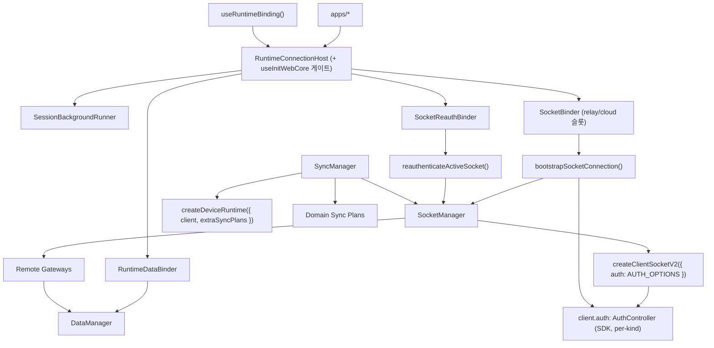

# App Runtime Architecture

## 목적

`libs/app-runtime`가 소켓 transport·인증·sync·data를 어떻게 조립하는지 정의한다. 상위 세션 레이어(`@chatic/web-core`)가 준 `RuntimeBinding`을 받아 물리 연결과 repository를 파생시키는 **composition root**다.

## 결정 요약

transport 계층은 2개 manager 축으로 정리된다:

1. `SocketManager` — 소켓 생성/교체/상태 (relay·cloud **듀얼 슬롯** + active-facade)
2. `SyncManager` — sync runtime 생성/조작

인증 수명주기는 별도 manager 축이 아니라 **SDK `AuthController`(`client.auth`)** 가 소유한다. bootstrap 시퀀싱·구독 배선은 `SocketBinder`가 호출하는 순수 함수 `bootstrapSocketConnection(...)`가, same-connection 재인증은 `SocketReauthBinder`가 담당한다([auth/README.md](./auth/README.md)).

핵심 원칙:

- `createClientSocketV2`의 생성 책임은 `SocketManager`에만 둔다.
- `createDeviceRuntime`의 생성 책임은 `SyncManager`에만 둔다.
- 인증(만료 refresh·재연결 재인증·백오프·switch·logout 패킷)은 SDK `AuthController`가 소유한다. app-runtime은 `register`·구독·same-connection 재인증 트리거만 배선한다.
- gateway는 raw client가 아니라 `SocketManager`의 stable active-facade를 사용한다.
- sync는 raw runtime이 아니라 `SyncManager`를 통해서만 조작한다.
- `createSocketRuntime()`는 객체 조립만 담당하는 composition root로 유지한다.

## 시스템 구조



## 책임 분리

### 1. `SocketManager`

책임:

- kind별 `ClientSocketV2` 생성·교체·destroy (relay·cloud 두 슬롯)
- kind별 인증 상태 미러링(`setAuthenticated`) + transport 연결 합성 `SocketState` 방송
- active-facade `request/send/onType/onMessage/onState/onError` (cloud 우선, 없으면 relay)
- socket 교체 시 listener 재바인딩, `getBoundCid`, `waitUntilVerified`

비책임:

- token 획득/갱신 정책·`auth.update` orchestration — SDK `AuthController`
- **401 감지/재시도** — `request`는 401을 가로채지 않는다(제거됨)
- sync runtime 생성 — `SyncManager`

과거의 `ManagedSocketClientProxy` 역할(request facade + listener rebind)은 별도 클래스 없이 `SocketManager`가 흡수했다. 외부 gateway는 소켓 교체·슬롯 전환을 몰라도 된다.

### 2. 인증: SDK `AuthController` + bootstrap/reauth 배선

인증 수명주기는 SDK `AuthController`가 소유한다. app-runtime은 상태를 들고 있는 controller 클래스를 두지 않고, 순수 함수/바인더로 **배선만** 한다:

- `bootstrapSocketConnection({ manager, config, delegate })` — 부팅 시퀀스 `ensure → 구독 → register+stop(게이트 닫기) → device.save:ok/disconnect 구독 → connect`(순서 필수), `onAuthState`→`setAuthenticated`, `onTokenRefresh`→`commitRefreshedToken`, `expired`→`onAuthExpired` 배선. `auth.update`는 `device.save:ok` 이후에만 발사(백엔드 device 선등록 요구), `ready()` 호출 없음.
- `reauthenticateActiveSocket({ manager, delegate, kind })` — `SocketReauthBinder`가 same-connection 신원 교체(게스트→소셜 승격, 같은 wss cloud site 전환)를 재인증. `token===auth.token` no-op 가드 + `logout→register` resume.

SDK가 소유(app-runtime 비책임): 토큰 획득/갱신 타이밍·만료 refresh·재연결 재인증·백오프·site switch 패킷.

상세 소유 경계·상태 머신·서명 계약은 [auth/README.md](./auth/README.md)·[auth/usage.md](./auth/usage.md)·[auth/signing.md](./auth/signing.md)가 SSoT다.

### 3. `SyncManager`

책임:

- 현재 client 기준 `createDeviceRuntime({ client, extraSyncPlans })` 소유
- runtime `start()`/`stop()`, sync target ref-count registry + client-swap 시 replay
- 도메인별 sync plan 등록(`createSyncPlans`), cross-cloud frame 가드

비책임:

- token refresh, socket bootstrap, chat prime(= `usePrimeChat`가 소유)

상세는 [sync/README.md](./sync/README.md).

### 4. `DataManager`

책임:

- remote/local data source 조립 → repository 그래프 (`ensure(context)`)
- `socketAwareProvider`로 live socket cid 주입 → repository가 socket-vs-cache 클라우드 불일치를 감지해 오염 쓰기 방지

상세는 [data/README.md](./data/README.md).

## 조립 (composition root)

### `createSocketRuntime()` (`src/socket/runtime.ts`)

```ts
const socketManager = new SocketManager();
const syncManager = new SyncManager(socketManager);
// 인증은 SDK AuthController가 client당 소유(SocketManager가 auth: AUTH_OPTIONS로 부착).
// bootstrap/reauth 배선은 SocketBinder/SocketReauthBinder가 순수 함수로 수행 — controller 인스턴스 없음.
return { socketManager, syncManager };
```

- `createClientSocketV2`는 `SocketManager` 내부에서만.
- `createDeviceRuntime`는 `SyncManager` 내부에서만.

### `RuntimeConnectionHost` (React 조립 루트)

`useInitWebCore` init 게이트 뒤에 `SessionBackgroundRunner`·`RuntimeDataBinder`·`SocketBinder`·`SocketReauthBinder`를 마운트하고, `useSocketSessionDelegate`로 만든 per-kind delegate를 소켓 바인더에 넘긴다([runtime/session-lifecycle.md](./runtime/session-lifecycle.md)).

## 외부 사용 규칙

- **gateway / remote data layer** — `SocketManager` active-facade만 사용, raw `ClientSocketV2` 직접 의존 금지.
- **sync hooks / feature layer** — `SyncManager`(또는 `useSyncTarget` 계열)만 사용, `createDeviceRuntime` 직접 의존 금지.
- **auth/session binding** — 인증은 SDK `AuthController`가 소유. `SocketBinder`가 부팅을, `SocketReauthBinder`가 same-connection 재인증을 배선하며 상태를 들고 있는 controller 클래스는 없다. site 전환은 `switchSite`(→ `client.auth.switch(`${uid}@${siteId}`)`).

## 모듈 구조

```text
libs/app-runtime/src/
  connection/
    RuntimeConnectionHost.tsx      # 조립 루트 + init 게이트 + delegate 소유
    RuntimeDataBinder.tsx
    SocketBinder.tsx               # relay/cloud 슬롯 부팅
    SocketReauthBinder.tsx         # same-connection 재인증
    SessionBackgroundRunner.tsx    # relay keep-alive
    useSocketSessionDelegate.ts    # per-kind delegate 배선
  runtime/
    RuntimeManager.ts
    useRuntimeBinding.ts
    useRuntimeRepositories.ts
    useSessionProfile.ts
  socket/
    SocketManager.ts
    bootstrapSocketConnection.ts
    reauthenticateActiveSocket.ts
    switchSite.ts
    logoutSession.ts
    logoutCloudViaSocket.ts
    runtime.ts
    types.ts
    hooks/useSocketState.ts
    sync/
      SyncManager.ts
      plans.ts
      types.ts
      hooks/useSyncTarget.ts
  data/
    DataManager.ts
    runtime.ts
    cacheStorageStrategies.ts
    factories/{remoteFactory,localFactory,repositoryFactory}.ts
  push/
    useDeviceTokenRegistration.ts
```
