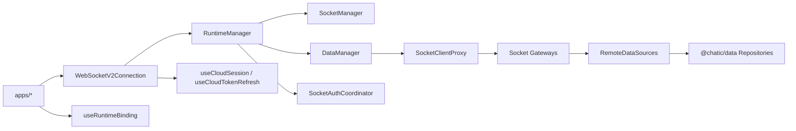
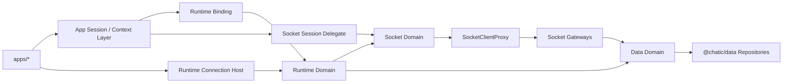

# App Runtime Architecture

Date: 2026-06-18

## 목적

이 문서는 현재 `libs/app-runtime` 구조를 다시 검토한 뒤, 최종적으로 어떤 아키텍처로 정리해야 하는지 정의한다.

> 앱(`apps/*`)이 소비하는 공개 표면은 [public-surface.md](./public-surface.md)를 참조한다.

## 현재 구조 요약



## 현재 구조에서 확인된 사실

- `runtime`은 아직 세션/인증 흐름에 관여한다.
- `connection/WebSocketV2Connection.tsx`는 `useCloudSession`, `useCloudTokenRefresh`에 의존한다.
- `runtime/useRuntimeBinding.ts`는 `@chatic/web-core` 세션 상태를 직접 읽어 binding을 계산한다.
- `RuntimeManager.bootstrap()`은 connect, device 등록, `auth.update`까지 수행한다.
- `data`는 `ISocketManager -> SocketClientProxy -> gateway bundle` 구조로 remote datasource를 조립한다.

## 아키텍처 결론

### 1. `runtime`은 순수 composition root로 축소한다

`runtime`은 아래만 담당한다.

- binding 반영
- socket/data 조립
- bootstrap 진입점 제공

`runtime`이 하면 안 되는 것:

- 세션 읽기
- 토큰 refresh
- cloud fallback
- 세션 hook export

### 2. `socket`은 transport + stable client + session bootstrap을 담당한다

`socket` 도메인의 중심은 아래 3개다.

- `SocketManager`
- `SocketClientProxy`
- `SocketSessionController` 또는 동등한 bootstrap/reauth orchestration 계층

### 3. `data`는 gateway assembly + repository assembly로 정리한다

`data`는 아래 책임만 가진다.

- `SocketClientProxy`를 사용하는 gateway bundle 조립
- remote/local datasource 조립
- repository 조립
- dispatcher lifecycle 관리

`data`는 세션/인증 정책을 몰라야 한다.

### 4. 앱 레이어 또는 상위 컨텍스트 레이어가 세션/인증을 소유한다

상위 레이어가 소유하는 것:

- 로그인 상태
- cloud/site 선택 상태
- socket endpoint 선택
- token 발급/refresh/fallback
- UI 후속 처리

## 목표 구조



## 권장 모듈 구조

```text
libs/app-runtime/src/
  connection/
    RuntimeConnectionHost.tsx
  runtime/
    RuntimeManager.ts
    runtimeFactory.ts
    types.ts
    # data 서브: RuntimeDataBinder / SocketBinder (binding 반응, runtime/README §14)
    # session 서브: SessionBackgroundRunner / TransportBootstrap (runtime/session-runner.md)
  socket/
    SocketManager.ts            # 책임 #1 (관측 상태 store)
    SocketClientProxy.ts        # 책임 #3 401 인터셉트 위치
    SocketSessionController.ts  # 책임 #2/#4/#5 오케스트레이션
    gatewayRuntime.ts
    types.ts
    hooks/useSocketState.ts
  data/
    DataManager.ts
    runtime.ts
    factories/
      remoteFactory.ts
      localFactory.ts
      repositoryFactory.ts
    types.ts
```

> **제거·교체 대상:** 현재 코드의 `runtime/SocketAuthCoordinator.ts`와 `connection/WebSocketV2Connection.tsx` 와이어링은 목표 구조가 아니다. `SocketSessionController` + delegate 주입 + (binder/runner 컴포넌트)로 재구성한다. 새 와이어링의 훅/컴포넌트 결정은 [runtime/runtime.md](./runtime/runtime.md) §13을 따른다.

## 리팩터링 우선순위

1. `app-runtime/src/hooks`에서 세션/인증 hook 제거
2. `connection` 계층에서 `useCloudSession`, `useCloudTokenRefresh` 제거
3. `socket` 내부에 bootstrap/reauth controller 명시화
4. `data`가 `ISocketManager`가 아니라 socket gateway runtime 또는 proxy에 의존하도록 경계 정리
5. `src/index.ts` 공개 API를 현재 구조에 맞게 정리

## 승인 기준

- `runtime`은 더 이상 `@chatic/web-core` 세션 API를 직접 읽지 않는다.
- `hooks` 디렉터리에는 세션/인증 hook이 없다.
- `socket`은 stable proxy + bootstrap controller를 가진다.
- `data`는 socket 세션 정책을 모르는 gateway/repository 조립 계층으로 남는다.

## 세션 오케스트레이션 로직 배치 (11개)

세션/소켓 마이그레이션에서 다루는 로직의 배치 요약. web-core의 전이/hook 상세는 `@chatic/web-core` docs를, 소켓·data·binding 반응은 아래 도메인 문서를 참조한다.

| #   | 로직                               | 1차 소유                                                       | 경계 넘는 효과                                                                                   |
| --- | ---------------------------------- | -------------------------------------------------------------- | ------------------------------------------------------------------------------------------------ |
| ①   | 중계서버 로그인 항시 유지          | web-core `hooks/app` (`useRelaySessionKeepAlive`)              | session 서브 러너가 백그라운드 마운트 ([runtime/session-runner.md](./runtime/session-runner.md)) |
| ②   | 병렬 리프레시 (relay + cloudToken) | web-core `hooks/app` (`useTokenRefresh`)                       | session 서브 러너가 백그라운드 마운트 ([runtime/session-runner.md](./runtime/session-runner.md)) |
| ③   | 클라우드 전환                      | web-core `hooks/session/actions`                               | cid 선반영 → [runtime](./runtime/runtime.md) §12 / [data](./data/data.md) §7-1 반응              |
| ④   | 클라우드 로그아웃                  | web-core `hooks/session/actions`                               | cid → binding 반응                                                                               |
| ⑤   | 중계서버 로그아웃                  | web-core `hooks/session/actions`                               | 캐시 클리어 → 외부 레이어 ([data](./data/data.md) §7-2)                                          |
| ⑥   | 사이트 전환                        | web-core `hooks/session/actions`                               | `refreshCloudSession` 서비스 single-flight                                                       |
| ⑦   | 초대                               | web-core `hooks/auth`+`session`                                | —                                                                                                |
| ⑧   | 소켓 리프레시 (= 소켓 #2 주기)     | app-runtime [socket](./socket/socket.md) §2-1 #2 / §8 delegate | web-core 토큰 hook 주입. `sid` 없으면 skip                                                       |
| ⑨   | 소켓 401 복구 (= 소켓 #3)          | app-runtime [socket](./socket/socket.md) §2-1 #3 / §8 delegate | web-core refresh hook 주입. **#2와 달리 siteId 포함 cloud 세션 refresh 동반**                    |
| ⑩   | cid/sid 기본값                     | [runtime](./runtime/runtime.md) §11 불변식                     | cid=`default`, sid=`null` 가능. binding 반응은 §14 binder                                        |
| ⑪   | 디바이스 등록                      | web-core `hooks/app` + `identityCore`                          | deviceId → identityCore 저장. session 서브 러너가 마운트                                         |
