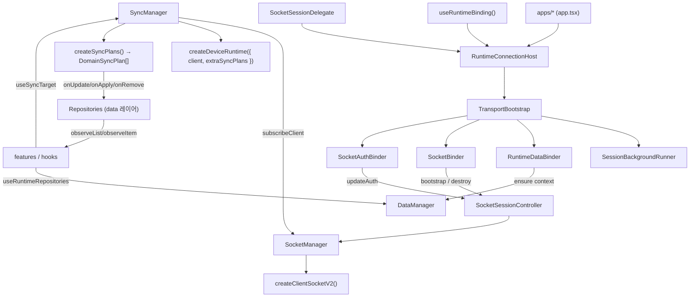

# App Runtime Architecture

Date: 2026-06-25
Status: **As-Built (현재 구현 기준)**

## 목적

이 문서는 `libs/app-runtime`가 **현재 어떻게 구성되어 동작하는지**를 정의한다 — data / socket / session / sync 계층의 책임 분리와 조립(composition) 방식.

`app-runtime`은 프레젠테이션을 갖지 않는 **headless chat engine**이다. 상위 세션 레이어(`@chatic/web-core`)가 제공하는 세션 상태를 `RuntimeBinding`으로 받아, data context·socket 연결·sync runtime을 그 상태에 맞춰 동기화한다.

핵심 원칙:

- **값은 훅으로 읽고, lifecycle은 컴포넌트 마운트로 제어한다.**
- `createClientSocketV2`(transport)의 생성 책임은 `SocketManager`에만 둔다.
- `createDeviceRuntime`(sync runtime)의 생성 책임은 `SyncManager`에만 둔다.
- gateway/remote 계층은 raw socket이 아니라 `SocketManager`의 stable API를 쓴다.
- sync는 raw runtime이 아니라 `SyncManager`(또는 `useSyncTarget` 훅)를 통해서만 조작한다.
- `createSocketRuntime()`는 객체 조립만 담당하는 composition root다(로직 없음).

---

## 1. 시스템 구조



세 가지 런타임 싱글톤이 엔진의 축이다 — 모두 `get*()` 진입점으로 접근하는 lazy 싱글톤:

| 싱글톤             | 진입점                | 조립 위치                              |
| ------------------ | --------------------- | -------------------------------------- |
| DataManager        | `getDataManager()`    | `data/runtime.ts`                      |
| Socket runtime 3종 | `getSocketRuntime()`  | `socket/runtime.ts` (composition root) |
| RuntimeManager     | `getRuntimeManager()` | `runtime/`                             |

`socket/runtime.ts`의 `createSocketRuntime()`이 `SocketManager` + `SocketSessionController` + `SyncManager`를 한 번에 조립한다.

---

## 2. 책임 분리

### 2.1 `SocketManager` (`socket/SocketManager.ts`)

- `ClientSocketV2`의 생성·교체·destroy.
- 현재 socket state 저장 및 방송, stable `request/send/onType/onMessage/onState` 제공.
- socket 교체 시 listener 재바인딩. `subscribeClient(cb)`로 client 교체를 다수 소비자(예: `SyncManager`)에 통지.
- `setRecoveryHandler()`로 401 복구 정책을 주입받아 `request`가 감지·재시도.

비책임: 토큰 획득/갱신, `auth.update` orchestration, sync runtime 생성.

### 2.2 `SocketSessionController` (`socket/SocketSessionController.ts`)

- bootstrap 시퀀스: `device.save` ack 대기 후 `auth.update`.
- `updateAuth(reason)` — 세션/사이트 전환 시 재인증.
- 401 recovery(`handle401Recovery`), 주기적 auth refresh.
- 상위 세션 레이어와의 결합은 `SocketSessionDelegate`(토큰 조회/refresh 주입 계약)로.

비책임: socket client 생성/교체, sync plan 조립.

### 2.3 `SyncManager` (`socket/sync/SyncManager.ts`)

- `SocketManager.subscribeClient`로 현재 client를 구독 → client가 생기면 `createDeviceRuntime({ client, extraSyncPlans })`로 sync runtime 생성, `start()`.
- `register(target)` / `registerChannel|Chat|Place|Profile|Join|Device` — `type+id` sync target on/off. ref-count + dispose 반환.
- client 교체(재로그인/재연결) 시 등록 target을 새 runtime에 **자동 replay**.
- chat target은 `primeChatTarget`으로 캐시 max chatNo를 `updateLocalSnapshot`에 주입하고 캐시가 비었을 때만 첫 페이지 fetch(§sync 문서 참조).

비책임: 토큰 refresh, gateway request 재시도.

> 상세 sync 동작·SyncPlan·도메인별 정책은 [sync/README.md](sync/README.md) · [sync/domain-sync-and-plans.md](sync/domain-sync-and-plans.md).

### 2.4 `DataManager` (`data/DataManager.ts`)

- `ensure(context)`로 현재 data context(`cid/sid/uid`)에 맞는 repository 조립을 보장.
- repository는 remote gateway(`SocketManager` 기반) + local cache를 합성한다.
- 갱신 데이터는 repository cache → `observeList`/`observeItem` 스트림으로 UI에 흐른다.

---

## 3. 조립(composition) — connection 컴포넌트

앱은 `RuntimeConnectionHost` 하나를 마운트하고, 그 안에서 값 훅(`useRuntimeBinding`)과 delegate를 주입한다. Host는 아래 lifecycle 컴포넌트를 마운트한다(`connection/RuntimeConnectionHost.tsx`):

```tsx
<RuntimeConnectionHost binding={binding} delegate={delegate}>
    <TransportBootstrap>
        {' '}
        // web-core init 완료까지 하위 트리 렌더 gate
        <SessionBackgroundRunner /> // KeepAlive / TokenRefresh / DeviceId 백그라운드 훅
        <RuntimeDataBinder binding={binding} /> // context 변경 시 DataManager.ensure
        <SocketBinder binding={binding} /> // socket config 변경 시 bootstrap/destroy
        <SocketAuthBinder binding={binding} /> // identityToken 변경 시 updateAuth
        {children} // 실제 화면
    </TransportBootstrap>
</RuntimeConnectionHost>
```

| 컴포넌트                  | 트리거                            | 동작                                                                               |
| ------------------------- | --------------------------------- | ---------------------------------------------------------------------------------- |
| `TransportBootstrap`      | mount                             | `startWebCoreInit()` 완료 전 `null` 렌더(가드)                                     |
| `SessionBackgroundRunner` | mount                             | `useInitWebCore`/`useRelaySessionKeepAlive`/`useTokenRefresh`/`useDynamicDeviceId` |
| `RuntimeDataBinder`       | `binding.context` 변경            | `getDataManager().ensure(context)`                                                 |
| `SocketBinder`            | `binding.socket` 변경             | config 있으면 `sessionController.bootstrap(config)`, 없으면 `destroy`              |
| `SocketAuthBinder`        | `binding.auth.identityToken` 변경 | `markUnverified()` + `updateAuth('session-switch')`                                |

> `SocketAuthBinder`는 **token 변경에만** 반응한다. 사이트 전환은 sid를 먼저 optimistic 적용하고 token은 나중에 커밋되므로, token이 커밋되기 전에 재인증하면 stale token을 보내게 된다. socket 교체 자체는 `SocketBinder`가 bootstrap(인증 포함)하므로 AuthBinder는 그 경우 skip한다.

### 3.1 `RuntimeBinding` — 단일 입력

`useRuntimeBinding()`이 `@chatic/web-core`의 `useGlobalSession()` + `useDynamicDeviceId()`를 관측해 파생한다(`runtime/useRuntimeBinding.ts`):

```ts
interface RuntimeBinding {
    context: { cid; sid; uid }; // data 캐시 스코프
    socket: { config: { url; deviceId; wssType } } | null; // 소켓 연결 문맥
    auth: { kind: 'relay' | 'cloud'; siteId?; identityToken? } | null;
}
```

- `cid`는 **선택된 cloud**를 따른다(전환 시 optimistic 선반영 → cid-scoped observe 스트림이 즉시 새 캐시로 재구독). socket/auth는 token이 커밋될 때까지 `activeServer` 기준 유지.

---

## 4. 외부 사용 규칙

### gateway / remote data layer

- `SocketManager`(또는 그 위의 repository)만 사용. raw `ClientSocketV2`에 직접 의존 금지.

### sync hooks / feature layer

- `SyncManager`(권장: `useSyncTarget`/`useChatSync`/`useChannelSync`/`usePlaceSync`/`useProfileSync`/`useJoinSync` 훅)만 사용.
- raw `ClientSocketRuntime` 또는 `createDeviceRuntime`에 직접 의존 금지.

### auth/session binding

- `SocketSessionController`만 사용. `SocketAuthBinder`가 token 변경 시 `updateAuth()`를 호출.

---

## 5. 모듈 구조 (현재)

```text
libs/app-runtime/src/
  index.ts                      # 공개 표면 re-export
  connection/                   # lifecycle 컴포넌트 (마운트로 제어)
    RuntimeConnectionHost.tsx
    TransportBootstrap.tsx
    SessionBackgroundRunner.tsx
    RuntimeDataBinder.tsx
    SocketBinder.tsx
    SocketAuthBinder.tsx
  runtime/                      # composition root + 값 훅
    RuntimeManager.ts
    useRuntimeBinding.ts
    useRuntimeRepositories.ts
  socket/
    SocketManager.ts
    SocketSessionController.ts
    runtime.ts                  # createSocketRuntime() = composition root
    types.ts
    hooks/useSocketState.ts
    sync/
      SyncManager.ts            # createDeviceRuntime 소유 + target register
      plans.ts                  # createSyncPlans() → DomainSyncPlan[]
      types.ts
      hooks/useSyncTarget.ts    # register 훅 (useChatSync/useChannelSync/…)
  data/
    DataManager.ts
    runtime.ts
    types.ts
    cacheStorageStrategies.ts
    factories/
```

> 과거 `ManagedSocketClientProxy`(→ `SocketManager`로 흡수), `AppSyncRuntime`(→ `SyncManager`로 재편), 그리고 앱 주도 catch-up 실험(`GlobalChatSync`/`ChatSyncScheduler`/`RuntimeSyncController`)은 **모두 제거되었다.** 현재 sync는 `SyncManager` + `DomainSyncPlan` 단일 경로다.

---

## 6. 남은 후속

- runtime 튜닝 값(`SyncRuntimeOptions`: keepAlive/reconnect/rotation/devicePlan)의 외부 config(connectionDraft류) 연결 — 현재는 composition root의 빈 기본값(=엔진 기본 유지). 주입 표면(`SyncManagerDeps.runtimeOptions`)은 준비됨.
- 앱(`apps/web`·`apps/desktop-web`) 측 sync 소비부를 `useSyncTarget` 계열 훅으로 정렬(현재 일부 앱이 구 진입점을 참조 중인 마이그레이션 잔여).
  </content>
