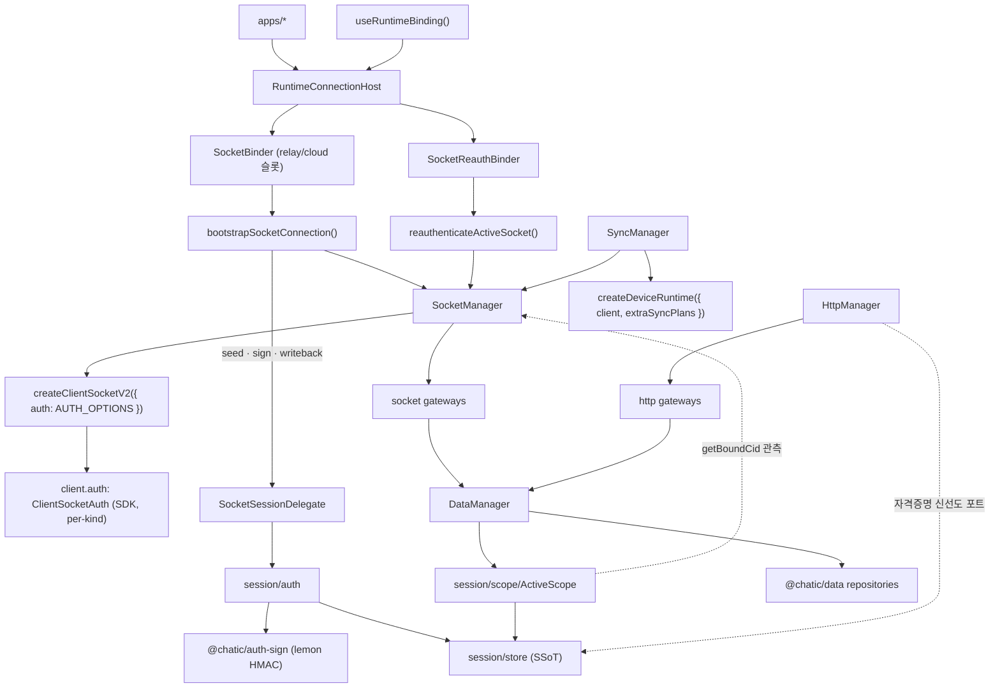

# App Runtime Architecture

> 상태: Live · 최종 갱신: 2026-09-02 · 관련 ADR: [ADR-0070](../../../docs/adr/0070-app-runtime-session-hub.md) (세션 허브·HTTP 대칭·엔진 분리) · [ADR-0036](../../../docs/adr/0036-data-surface-unification-app-runtime-cleanup.md) (repository 단일 표면)

## 목적

`libs/app-runtime`는 앱이 보는 **유일한 런타임 창구**다. 세션(토큰·선택 상태·identity·스코프)을
소유하고, 그 세션으로부터 소켓 연결·HTTP 클라이언트·repository 그래프·sync 런타임을 파생시키는
**composition root**다.

앱이 직접 보는 패키지는 `@chatic/app-runtime`와 `@chatic/data` 둘뿐이다. `@chatic/http` ·
`@chatic/db` · `@chatic/auth-sign` · `@chatic/web-config` · `@lemoncloud/chatic-sockets-lib`는 전부
이 라이브러리가 조립하는 대상이며 앱 코드에 새지 않는다.

## 결정 요약

**세션은 여기 하나가 관리한다.** 세션 상태의 유일한 보관처·writer는 `session/store`다. 과거
`@chatic/web-core`가 들고 있던 스토어·유스케이스·훅은 전부 이 패키지로 들어왔고, 그 패키지는
삭제됐다.

**엔진은 넷이고 각자 하나만 소유한다.**

| 축                             | 소유                                                        | 생성 책임 단일 지점                   |
| ------------------------------ | ----------------------------------------------------------- | ------------------------------------- |
| `session/store`                | 세션 상태 — relay·cloud·identity 토큰, 선택(cid/sid/uid)    | 유일 writer, **수동**(저장·통지만)    |
| `SocketManager` (`socket/`)    | 소켓 생성/교체/상태 (relay·cloud 듀얼 슬롯 + active-facade) | `createClientSocketV2`                |
| `HttpManager` (`http/`)        | HTTP 실행기 — route(relay/cloud/oauth/iap)별 endpoint·서명  | `createHttpClient` (`@chatic/http`)   |
| `SyncManager` (`socket/sync/`) | sync runtime 생성/조작                                      | `createDeviceRuntime`                 |
| `DataManager` (`data/`)        | data-source 조립 → repository 그래프                        | `createRepositories` (`@chatic/data`) |

**인증 수명주기는 별도 manager 축이 아니다.** SDK `ClientSocketAuth`(`client.auth: AuthController`)가
소유한다. app-runtime은 부팅 시 토큰·`authId`·서명 콜백을 `register`하고 상태를 **구독만** 한다.

핵심 원칙:

- **refresh 실행은 `ClientSocketAuth` 단독이다.** 이 리포에 refresh 엔드포인트를 치는 코드가
  하나도 없고, 그 부재를 [`src/http/refreshAbsence.test.ts`](../src/http/refreshAbsence.test.ts)가
  지킨다(경로 패턴 lint가 아니라 **부재 검사** — 심볼이 어디로 옮겨가든 걸린다).
- **`auth.update`를 보내는 것도 `ClientSocketAuth` 단독이다.** app-runtime은 컨트롤러의 발사 *시점*을
  게이트(`start`/`stop`)로 미룰 뿐 패킷을 짓지 않으며, 그 부재를
  [`src/socket/authUpdateAbsence.test.ts`](../src/socket/authUpdateAbsence.test.ts)가 지킨다.
- **모든 HTTP 요청은 게이트웨이 액션이다.** 게이트웨이 인스턴스를 아는 코드는 전부 `data/` 안이고,
  `session/auth`도 repository를 지난다.
- **스토어는 수동적이다.** `session/store/**`는 소켓·데이터·HTTP·형제 폴더를 모른다 —
  [`eslint.config.mjs`](../eslint.config.mjs)의 `no-restricted-imports`가 강제선이다.
- **세 뷰는 합치지 않는다.** 스코프의 `intent`(선택) · `bound`(소켓 관측) · `committed`(커밋 토큰)는
  이름 붙은 별개 값이다. 통일하는 것은 **소유자**(`session/scope/ActiveScope`)이지 값이 아니다.
- gateway는 raw client가 아니라 `SocketManager`의 stable active-facade를 쓴다.
- sync는 raw runtime이 아니라 `SyncManager`를 통해서만 조작한다.

## 시스템 구조



## 책임 분리

### 1. `session/` — 세션 허브

세션의 SSoT. 네 폴더가 각자 하나를 소유하고, 방향은 `hooks → auth → store`, `scope → store`
한쪽으로만 흐른다.

| 폴더     | 소유                                                       | 비고                                                  |
| -------- | ---------------------------------------------------------- | ----------------------------------------------------- |
| `store/` | relay·cloud·identity 토큰 · 선택 상태 · 파생 컨텍스트 조립 | **수동** — 저장과 통지(`notifySessionStateChanged`)뿐 |
| `auth/`  | login · 발급 · switch · logout · SDK delegate 재료         | HTTP는 repository를 지난다. refresh는 수행하지 않는다 |
| `scope/` | `ActiveScope` — intent·bound·committed 세 뷰 + 합성        | `DataContextProvider` 구현자                          |
| `hooks/` | React 표면 — readers 4 · session actions · auth · app 훅   | `auth`·`store` 소비만                                 |

env는 주입받는다: `store/**`는 `@chatic/web-config`를 직접 import하지 않고,
[`store/configure.ts`](../src/session/store/configure.ts) 한 파일만이 relay endpoint resolver를
꽂는 이음매다(그 파일만 lint 면제).

상세는 [session/architecture.md](./session/architecture.md)가 SSoT다.

### 2. `SocketManager` (`socket/`)

책임:

- kind별 `ClientSocketV2` 생성·교체·destroy (relay·cloud 두 슬롯)
- kind별 인증 상태 미러링(`setAuthenticated`) + transport 연결 합성 `SocketState` 방송
- active-facade `request/send/onType/onMessage/onState/onError` (cloud 우선, 없으면 relay)
- socket 교체 시 listener 재바인딩, `getBoundCid`, `waitUntilVerified`

비책임: token 획득/갱신 정책·`auth.update` orchestration(SDK 소유) · **401 감지/재시도**(제거됨) ·
sync runtime 생성(`SyncManager`).

**`auth.update`의 발신자는 SDK 하나뿐이다.** 이 리포에 그 패킷을 짓는 코드가 없고, 그 부재를
[`src/socket/authUpdateAbsence.test.ts`](../src/socket/authUpdateAbsence.test.ts)가 지킨다(refresh와
같은 형식의 부재 검사). 두 번째 발신자가 있으면 컨트롤러가 **자기가 열지 않은 세션**에 대해 갱신을
계획하게 된다 — 상태 머신의 입력(실패 카운트·종단 `expired`·refresh 타이밍)이 전부 자기 발사 기준이기
때문이다. 그래서 socket 데이터소스 번들에도 `update` 슬롯이 없다(`AuthSocketDomainGateway`).

상세는 [socket/README.md](./socket/README.md).

### 3. 인증: SDK `ClientSocketAuth` + bootstrap/reauth 배선

인증 수명주기는 SDK가 소유한다. app-runtime은 상태를 들고 있는 controller 클래스를 두지 않고 순수
함수/바인더로 **배선만** 한다:

- [`bootstrapSocketConnection({ manager, config, delegate })`](../src/socket/auth/bootstrapSocketConnection.ts)
  — 부팅 시퀀스 `ensure → 구독 → register+stop(게이트 닫기) → device.save:ok/disconnect 구독 → connect`(순서 필수),
  `onAuthState`→`setAuthenticated`, `onTokenRefresh`→`commitRefreshedToken`, `expired`→`onAuthExpired` 배선.
  `auth.update`는 `device.save:ok` 이후에만 발사(백엔드 device 선등록 요구), `ready()` 호출 없음.
- [`reauthenticateActiveSocket({ manager, delegate, kind })`](../src/socket/auth/reauthenticateActiveSocket.ts)
  — same-connection 신원 교체(게스트→소셜 승격)를 `SocketReauthBinder`가 재인증.
  `token===auth.token` no-op 가드 + `logout→register` resume.

SDK가 소유(app-runtime 비책임): 토큰 획득/갱신 타이밍·만료 refresh·재연결 재인증·백오프·site switch 패킷.

세 지점(seed · sign · writeback)만이 app-runtime 몫이고, `commitRefreshedToken`이 새 토큰 뷰의
**유일한** 저장 경로다. 상세 소유 경계·상태 머신·서명 계약은
[socket/auth/README.md](./socket/auth/README.md) · [usage.md](./socket/auth/usage.md) ·
[signing.md](./socket/auth/signing.md)가 SSoT다.

### 4. `HttpManager` (`http/`)

`SocketManager`와 대칭인 HTTP 축. HTTP 요청을 만들거나 실행하는 것은 전부 `http/**` 안에 있다.

책임:

- route(`relay` · `cloud` · `oauth` · `iap`)별 endpoint 해석과 크레덴셜 선택
- lemon transport 조립([`transport.ts`](../src/http/transport.ts)) + 게이트웨이 인스턴스 보관
- 네트워크 로그 sink(redact·truncate) 배선

경계 규칙 둘:

- **`cloud` route는 고정 host가 없다.** 위임 토큰이 준 대상 클라우드 backend를 호출부가
  `baseURL` 오버라이드로 싣는다.
- **`http/` 아래는 app-runtime 안에서 leaf에 가깝다.** 세션을 아는 파일은 합성 루트
  [`factory.ts`](../src/http/factory.ts) 하나뿐이고, 크레덴셜은 import가 아니라
  `CredentialStalenessPort`로 들어온다. 이것이 `session`·`data`·`http`가 서로를 가리키던 매듭을 푼
  지점이다 — 문서화된 단방향 엣지 하나가 순환 대신 남는다.

실행기·retry/bypass·에러 분류의 구현은 [`@chatic/http`](../../http/docs/architecture.md) 소관이다.

> **cloud route는 없다 (2026-09-02).** 클라우드 backend는 여전히 목적지다 — `exchange-token`과 초대
> 조회가 위임 토큰이 알려준 host로 간다 — 하지만 그 요청들은 `baseURL`로 목적지를 싣고 **relay 서명**을
> 탄다. 클라우드 자격증명으로 서명하던 유일한 요청(클라우드 HTTP refresh)은 ADR-0070이 지웠고, 그것을
> 위한 SigV4 실행기·`CloudCredentialPort`도 함께 사라졌다. 목적지와 서명 방식은 독립이다.

### 5. `SyncManager` (`socket/sync/`)

책임:

- 현재 client 기준 `createDeviceRuntime({ client, extraSyncPlans })` 소유
- runtime `start()`/`stop()`, sync target ref-count registry + client-swap 시 replay
- 도메인별 sync plan 등록(`createSyncPlans`), cross-cloud frame 가드

비책임: token refresh, socket bootstrap, chat prime(= `usePrimeChat`가 소유).

상세는 [socket/sync/README.md](./socket/sync/README.md).

### 6. `DataManager` (`data/`)

책임:

- local · socket · http 세 데이터소스를 조립해 repository 그래프를 만든다(생성자에서 1회)
- repository에 `ActiveScope`를 `DataContextProvider`로 주입 — repository가 socket-vs-cache
  클라우드 불일치를 감지해 오염 쓰기를 막는다

표면은 `getRepositories()`·`getContext()` 둘뿐이다. `ensure(context)`·`destroy()`는 스코프가 read 시점
파생으로 바뀐 뒤 no-op으로 남아 있었고 이제 **삭제됐다** — 커밋할 것이 없는데 컨텍스트를 받아 두고
무시하는 메서드는 "밀어 넣으면 반영된다"는 오해를 초대한다. 같은 이유로 스코프를 밀어 넣던
`RuntimeDataBinder`도 파일째 사라졌다. 커밋을 되살리면 관측자가 stale cid로 구독하던 render-lag가
돌아온다.

상세는 [data/README.md](./data/README.md).

## 스코프 — 세 뷰와 판정

cloud 전환은 cid를 **낙관적으로 먼저** 뒤집는다. 그 창 동안 나가는 소켓은 옛 클라우드에 bind된 채
프레임을 계속 내놓으므로, "이 프레임/쓰기를 써도 되는가"의 판정이 필요하다.

| 뷰          | 원천                                   | 성격                                       |
| ----------- | -------------------------------------- | ------------------------------------------ |
| `intent`    | 선택 상태(`selectedCloudId`) + uid/sid | 전환 즉시 뒤집힘 — 캐시 파티션의 축        |
| `bound`     | `SocketManager.getBoundCid()`          | bind 시점 동결 관측값 — 임의로 바꾸지 않음 |
| `committed` | 커밋된 cloud 토큰의 cid                | 소켓 슬롯 config·HTTP 크레덴셜 선택의 기준 |

소유자는 [`session/scope/ActiveScope`](../src/session/scope/ActiveScope.ts) 하나이고, **판정 함수의
소유자는 `@chatic/data`**다(`scopeGuards` — `isForeignContext` · `isCidActive`). 판정 호출부 다수가
`data` 안에 있어 leaf인 그쪽이 소유해야 성립한다. `session/scope`와 `socket/sync`는 그 소비자다.

## 조립 (composition root)

### `createSocketRuntime()` ([`src/socket/runtime.ts`](../src/socket/runtime.ts))

```ts
const socketManager = new SocketManager();
const syncManager = new SyncManager(socketManager);
// 인증은 SDK ClientSocketAuth가 client당 소유(SocketManager가 auth: AUTH_OPTIONS로 부착).
// bootstrap/reauth 배선은 SocketBinder/SocketReauthBinder가 순수 함수로 수행 — controller 인스턴스 없음.
return { socketManager, syncManager };
```

### `RuntimeConnectionHost` (React 조립 루트)

`useRelaySessionInit` init 게이트 뒤에 바인더들을 마운트하고, `useSocketSessionDelegate`로 만든
per-kind delegate를 소켓 바인더에 넘긴다. relay keep-alive(`useRelaySessionKeepAlive`)는 게이트 위에서
인라인 호출한다 — [runtime/session-lifecycle.md](./runtime/session-lifecycle.md).

### 부팅 — `initAppRuntime(config)` ([`src/init.ts`](../src/init.ts))

부팅은 **명시 호출**이다. 앱 엔트리(`main.tsx`)가 render 전에 한 번 부른다.

```ts
initAppRuntime({ data: { cache: { maxChatsPerChannel: 1000 } } });
```

하는 일 셋: env → relay endpoint resolver 주입(`configureSessionStore`), route별 자격증명 복구 배선
(`configureCredentialRecovery`), 그리고 넘겨받은 데이터 정책 등록(`configureDataRuntime`). 네트워크는
건드리지 않는다 — resolver는 **함수로** 주입되므로 부팅 이후 잡힌 딥링크 override도 유효하고, lemon
transport는 첫 사용 시 지연 생성된다.

**예전에는 import 부수효과였다.** `session` 배럴 로드가 `configureSessionStore()`를, `connection`
배럴 로드가 `configureCredentialRecovery()`를 돌렸다. 그래서 부팅이 "누가 먼저 import했는가"의
결과였고, 엔트리에 보이지 않았고, import 재배치나 트리셰이킹이 조용히 옮기거나 없앨 수 있었다.

**순서 계약 두 경계.** 호출은 그 사이에 온다:

- **앱의 로깅·브릿지 배선 뒤** — 이 호출은 로그를 낼 수 있다(중복 부팅 경고, 늦은 데이터 정책 경고).
- **세션을 읽을 수 있는 코드보다 앞** — `relayStore`는 resolver가 없으면 추측하지 않고 **throw**하며,
  에러 메시지가 `initAppRuntime()`을 지목한다. 빈 host로 요청이 나가는 대신 큰 소리로 실패한다.

`configureDataRuntime`은 더 이상 개별 공개 표면이 아니다 — `initAppRuntime({ data })`에 흡수됐다.
앱이 순서를 기억해야 하는 configure-\* 함수 집합 대신 부팅 호출 하나를 갖는다.

## 외부 사용 규칙

- **gateway / remote data layer** — `SocketManager` active-facade 또는 `HttpManager`만 사용,
  raw `ClientSocketV2`·raw HTTP 클라이언트 직접 의존 금지.
- **sync hooks / feature layer** — `SyncManager`(또는 `useSyncTarget` 계열)만 사용,
  `createDeviceRuntime` 직접 의존 금지.
- **세션** — 앱은 `session/hooks`의 훅 표면만 소비한다. 스토어 직접 쓰기 금지.
- **auth/session binding** — 인증은 SDK가 소유. `SocketBinder`가 부팅을, `SocketReauthBinder`가
  same-connection 재인증을 배선하며 상태를 들고 있는 controller 클래스는 없다. site 전환은
  `useSiteSwitch`(내부 `socket/auth/switchSite` → `client.auth.switch('<uid>@<siteId>')`).
- **refresh** — 어떤 레이어도 refresh 엔드포인트를 치지 않는다. 트리거가 필요하면
  `requestRelaySessionRefresh()`뿐이고, 소켓이 없으면 `false`를 돌려준다. **relay 전용이다** — cloud
  토큰은 relay 신원에서 재발급되므로(`renewCloudSession`) refresh로 고칠 대상이 아니다.

## 모듈 구조

```text
libs/app-runtime/src/
  connection/
    RuntimeConnectionHost.tsx      # 조립 루트 + init 게이트 + delegate 소유 + relay keep-alive 인라인
    RuntimeAuthHost.tsx            # 데이터 바인딩 없는 축소판 Host
    SocketBinder.tsx               # relay/cloud 슬롯 부팅
    SocketReauthBinder.tsx         # same-connection 재인증
    useSocketSessionDelegate.ts    # per-kind delegate 배선
    useConnectivity.ts             # 연결 상태 진리표
  session/                         # 세션 허브 (SSoT)
    store/                         # relay·cloud·identity·context — 유일 writer, 수동성 eslint
      configure.ts                 #   env 주입 이음매 (유일한 lint 면제)
    auth/                          # login·발급·switch·logout·cloud 토큰 재발급 + SDK delegate 재료
    scope/                         # ActiveScope (intent·bound·committed) + intent 파생
    hooks/                         # readers 4 · session actions · auth 8 · app 훅
  runtime/                         # 앱이 소비하는 value-deriving 훅
    types.ts                       # RuntimeBinding/RuntimeSocketSlot/SessionProfile
    useRuntimeBinding.ts           # 세션 → 소켓 슬롯 파생
    useRuntimeRepositories.ts · useRuntimeSocketState.ts · useRuntimeProfile.ts
    useKindVerified.ts · useGlobalCacheSearch.ts
  socket/
    SocketManager.ts               # transport (듀얼 슬롯 + active-facade)
    runtime.ts                     # getSocketManager/getSyncManager 싱글턴
    types.ts                       # SocketKind/SocketBindingConfig/SocketState/ISocketManager
    auth/                          # 소켓 인증 배선 (transport에서 분리)
      bootstrapSocketConnection.ts · reauthenticateActiveSocket.ts · recoverUnverifiedSockets.ts
      applySessionToken.ts · requestRelaySessionRefresh.ts · renewCloudSession.ts
      switchSite.ts · logoutSession.ts · logoutCloudSession.ts
      sessionDelegate.ts · types.ts   # SocketSessionDelegate 계약
    sync/
      SyncManager.ts · plans.ts · types.ts · hooks/useSyncTarget.ts
  http/
    HttpManager.ts                 # route별 endpoint·크레덴셜 (SocketManager와 대칭)
    factory.ts                     # 합성 루트 — 세션을 아는 유일한 http 파일
    transport.ts · gateways.ts
    refreshAbsence.test.ts         # refresh 부재 검사 (경로 lint 대체)
  report/                          # 사용자 이슈 제보 + 로그 배치 업로드
                                   # payload는 세션에서, 전송은 data의 report repository로
  data/
    DataManager.ts                 # 데이터소스 3종 조립 → repository 그래프
    runtime.ts                     # configureDataRuntime 정책 주입
    cacheStorageRouting.ts         # 캐시 타입 → web/native 저장소 결정 단일 지점
    nativeCacheSupport.ts          # 네이티브가 핸드셰이크로 보고한 캐시 capability
    invitedCloudDurability.ts · outbox.ts
    factories/{socketFactory,localFactory,httpFactory,repositoryFactory}.ts
    hooks/                         # 앱 2개 이상이 쓰는 catalog 계열만 남은 REST 훅
  push/
    useDeviceTokenRegistration.ts
```

## 관련 문서

- [public-surface.md](./public-surface.md) — 앱이 보는 공개 표면 / 비공개 내부
- [session/architecture.md](./session/architecture.md) — 세션 허브 상세 (store·auth·scope·hooks)
- [runtime/README.md](./runtime/README.md) — `RuntimeBinding` 파생·바인더 역할
- [socket/README.md](./socket/README.md) · [socket/auth/README.md](./socket/auth/README.md) ·
  [socket/sync/README.md](./socket/sync/README.md)
- [data/README.md](./data/README.md) · [push/README.md](./push/README.md)
