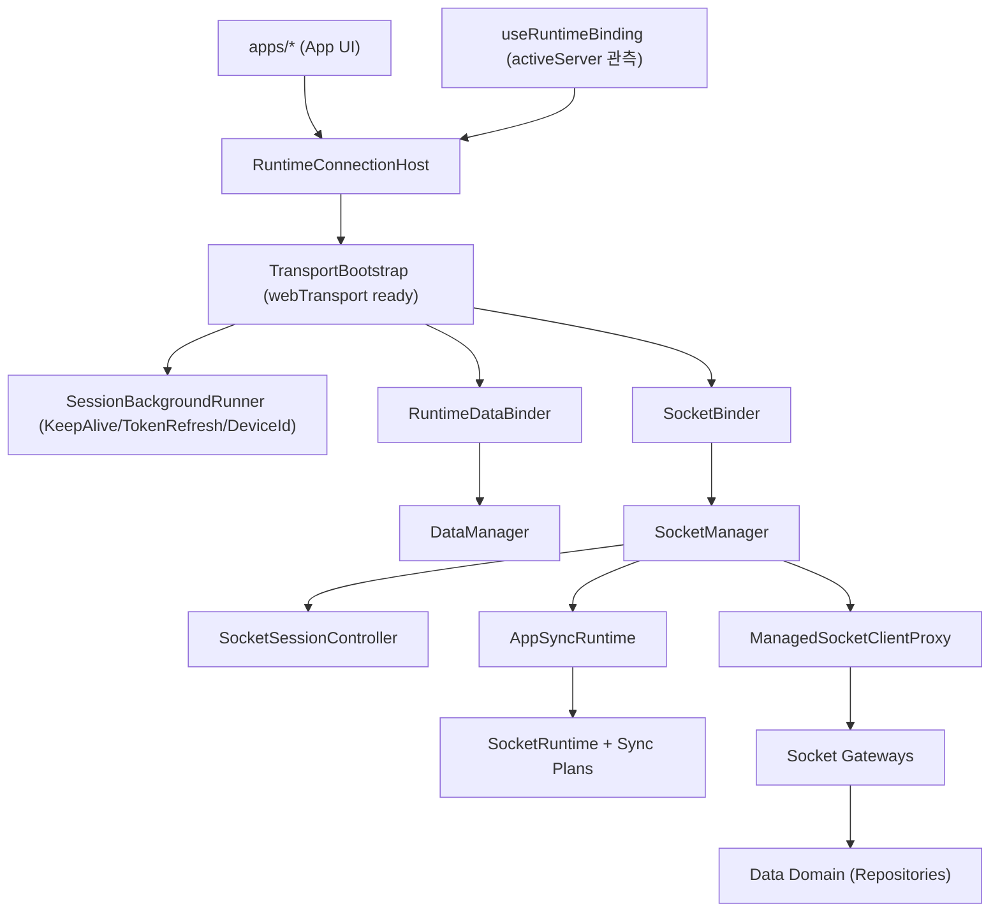

# App Runtime Architecture

Date: 2026-06-19

## 목적

이 문서는 `libs/app-runtime` 내의 세션/소켓 연결 라이프사이클 및 데이터/레포지토리 조립 구조의 아키텍처 설계를 정의한다.

## 아키텍처 구조 요약

`app-runtime`은 세션의 상태 제어(로그인/토큰 관리 등)를 직접 수행하지 않고 상위 세션 레이어(`@chatic/web-core`)에 위임하며, 파생된 **활성 서버 관측 데이터(RuntimeBinding)**에 반응하여 소켓 및 데이터 레이어를 조립/재연결하는 구조를 취한다.

채널/채팅 sync의 실행 시점 제어는 `data`가 아니라 `app-runtime`이 소유한다. 다만 제어 기준은 `RuntimeBinding.context`가 아니라 **socket lifecycle**이며, sync runtime은 `SocketManager` 하위 서비스로 결합한다. 상세 명세는 [sync/README.md](./sync/README.md)를 따른다.

현재 `app-runtime`의 소켓/게이트웨이 조립은 레거시 `wss` 클라이언트가 아니라 `@lemoncloud/chatic-sockets-lib`의 **v2 모듈**(`ClientSocketV2`, domain gateway, v2 message contract) 사용을 전제로 한다.



---

## 아키텍처 핵심 원칙

### 1. `runtime`은 순수 Composition Root 역할을 수행한다

- 세션 상태 조회, 토큰 Refresh, 디바이스 등록 등 핵심 세션 전이 로직에 직접 관여하지 않는다.
- 파생된 `RuntimeBinding` 정보를 `DataManager`와 `SocketManager`에 동기화(ensure)하는 바인딩 기능과 진입점만 제공한다.

### 2. `socket`은 연결 관리, 세션 제어, socket-bound sync를 담당한다

- **SocketManager**: 실제 WebSocket 커넥션의 라이프사이클 및 연결 상태 정보를 관리한다.
- **SocketSessionController**: 중계/클라우드 서버에 대한 Bootstrap 시퀀스 및 1분 주기 리프레시, 401 에러 복구 싱글플라이트(single-flight) 오케스트레이션을 관리한다.
- **AppSyncRuntime**: 현재 active socket client에 맞춰 sync runtime을 attach/detach하고, 서버 plan 주입, target registry 소유, watch 재등록을 담당한다.
- **ManagedSocketClientProxy**: 게이트웨이들이 참조하는 안정적인 소켓 인터페이스(`ISocketClient`)를 제공하며, 통신 중 발생하는 401 에러를 인터셉트하여 토큰을 복구하고 재시도하는 책임을 가진다.
- **SocketSessionDelegate**: 상위 레이어(`@chatic/web-core`)로부터 토큰 발급 및 갱신 동작을 주입받기 위한 계약 인터페이스다.

### 3. `data`는 게이트웨이 및 레포지토리 조립에 집중한다

- `ManagedSocketClientProxy` 싱글톤 인스턴스를 통해 API 게이트웨이 번들을 구성한다.
- 소켓의 세션 만료 및 재연결 세부 사항을 모른 채, 투명하게 제공되는 프록시를 통해 로컬/원격 데이터 소스와 레포지토리를 조립하고 동작한다.

---

## 모듈 구조

실제 `libs/app-runtime/src` 디렉토리 아래의 컴포넌트 배치는 다음과 같다.

```text
libs/app-runtime/src/
  connection/
    RuntimeConnectionHost.tsx      # Composition Host 컴포넌트
    TransportBootstrap.tsx         # webTransport 초기화 가드
    SessionBackgroundRunner.tsx    # 백그라운드 세션 훅 실행
    RuntimeDataBinder.tsx          # Data context 바인더
    SocketBinder.tsx               # Socket config 바인더
    index.ts
  runtime/
    RuntimeManager.ts              # 싱글톤 관리 및 레거시 제거된 bootstrap 위임
    useRuntimeBinding.ts           # activeServer 단일 관측 기반 binding 파생
    index.ts
  socket/
    SocketManager.ts               # Raw socket lifecycle 및 상태 관리
    SocketSessionController.ts     # Bootstrap, 주기 리프레시, 401 복구 오케스트레이터
    ManagedSocketClientProxy.ts    # 401 감지 및 큐잉 재시도 프록시
    runtime.ts                     # Controller, Proxy 싱글톤 관리
    sync/
      AppSyncRuntime.ts            # socket lifecycle을 따라가는 sync 서비스
      plans.ts                     # server plan 인스턴스 조립
      types.ts
    types.ts                       # Delegate 인터페이스 및 타입 정의
    hooks/
      useSocketState.ts            # 소켓 연결/검증 상태 훅
  data/
    DataManager.ts                 # DataContext 동기화 관리
    runtime.ts                     # Repository 및 DataManager 싱글톤 관리
    factories/
      remoteFactory.ts             # ManagedSocketClientProxy 기반 게이트웨이 및 원격 데이터 조립
      localFactory.ts              # 로컬 데이터 소스 조립
      repositoryFactory.ts         # 최종 Repository 조립
    types.ts
```

---

## 세션 오케스트레이션 로직 배치 요약

| #   | 로직                               | 소유 모듈                                         | 설명                                                                                      |
| --- | ---------------------------------- | ------------------------------------------------- | ----------------------------------------------------------------------------------------- |
| ①   | 중계서버 로그인 항시 유지          | `web-core` (`useRelaySessionKeepAlive`)           | `SessionBackgroundRunner`가 백그라운드로 마운트하여 구동                                  |
| ②   | 병렬 리프레시 (relay + cloudToken) | `web-core` (`useTokenRefresh`)                    | `SessionBackgroundRunner`가 백그라운드로 마운트하여 구동                                  |
| ③   | 클라우드 전환                      | `web-core` (`hooks/session/actions`)              | `activeServer` 갱신 → `useRuntimeBinding`을 통해 `DataManager` context 선반영             |
| ④   | 클라우드 로그아웃                  | `web-core` (`hooks/session/actions`)              | `activeServer` 갱신 → binding 변경을 통해 data/socket에 반영                              |
| ⑤   | 중계서버 로그아웃                  | `web-core` (`hooks/session/actions`)              | 외부 레이어에서 캐시 클리어(`DataManager.destroy()`) 및 연결 정리 호출                    |
| ⑥   | 사이트 전환                        | `web-core` (`hooks/session/actions`)              | `activeServer` 갱신 → binding 변경을 통해 data context 갱신                               |
| ⑦   | 소켓 리프레시 (주기적)             | `app-runtime` (`SocketSessionController`)         | 1분 주기 타이머를 통해 `delegate.getSocketToken()`으로 토큰 획득 후 `auth:update` 수행    |
| ⑧   | 소켓 401 복구 (재시도)             | `app-runtime` (`SocketSessionController` & Proxy) | 401 에러 인터셉트 시 `delegate.refreshSocketToken('socket-401')`로 토큰을 갱신하고 재시도 |
| ⑨   | 디바이스 등록                      | `web-core` (`useDynamicDeviceId`)                 | `SessionBackgroundRunner`가 백그라운드로 마운트하여 구동                                  |
| ⑩   | cid/sid 기본값                     | `runtime` (`useRuntimeBinding`)                   | `cid` 기본값 `'default'`, `sid` 기본값 `null`로 안전하게 바인딩 파생                      |
| ⑪   | sync plan attach/detach            | `app-runtime` (`AppSyncRuntime`)                  | socket 교체/종료에 맞춰 sync runtime을 재부착하거나 정지                                  |
