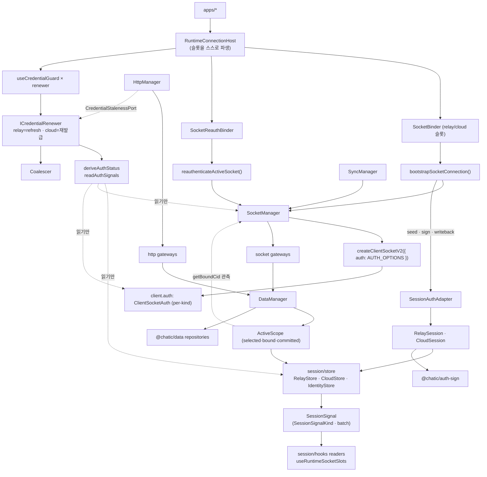
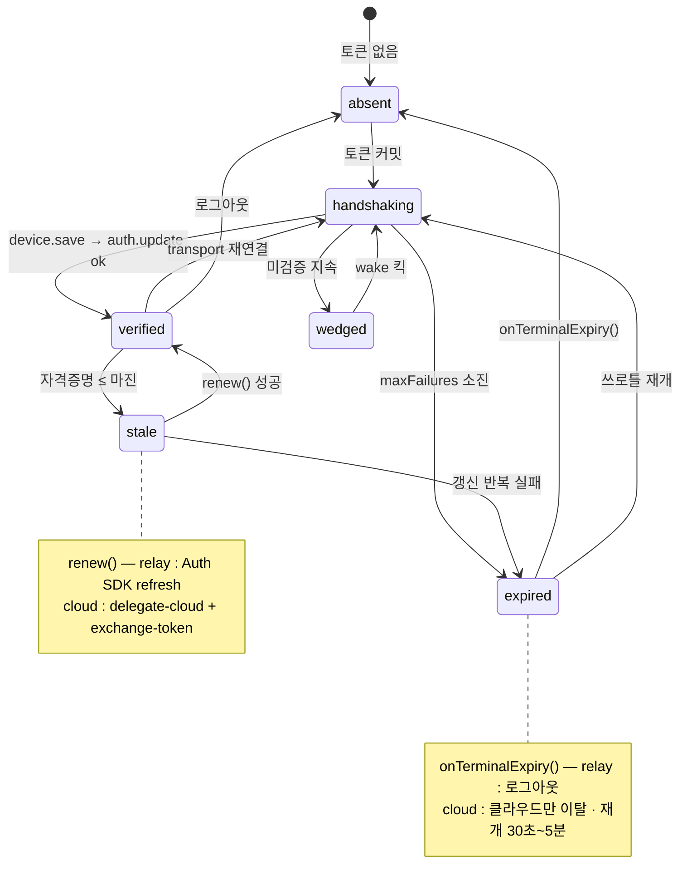
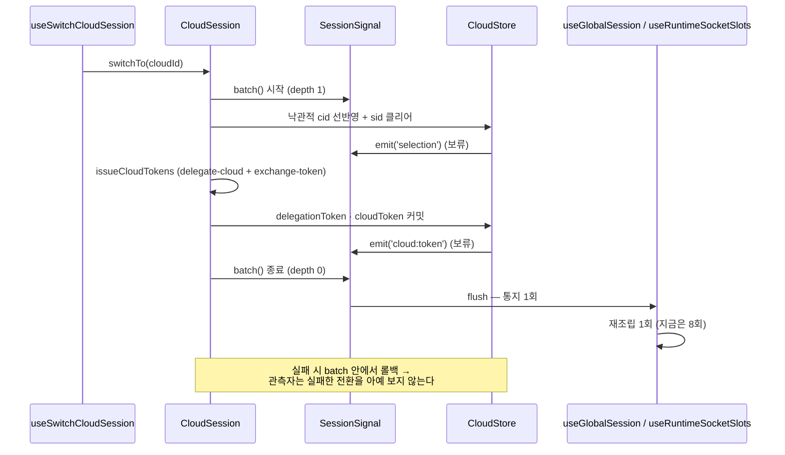

# App Runtime Architecture

> 상태: **Live** · 최종 갱신: 2026-09-07
> 관련 ADR: [ADR-0074](../../../docs/adr/0074-app-runtime-auth-single-verdict-and-typed-session-events.md)
> (인증 단일 판정 · 세션 시그널 타입화 · 자격증명 renewer) ·
> [ADR-0070](../../../docs/adr/0070-app-runtime-session-hub.md) (세션 허브 · HTTP 대칭 · 엔진 분리) ·
> [ADR-0036](../../../docs/adr/0036-data-surface-unification-app-runtime-cleanup.md) (repository 단일 표면)
>
> ADR-0070이 세운 엔진 4축 위에 ADR-0074가 **"상태를 어떻게 읽는가"** 를 얹은 결과다. §범위가 무엇이
> 계승됐고 무엇이 이 라운드에 더해졌는지 한 표로 정리한다.

## 목적

`libs/app-runtime`는 앱이 보는 **유일한 런타임 창구**다. 세션(토큰·선택 상태·identity·스코프)을 소유하고,
그 세션으로부터 소켓 연결·HTTP 클라이언트·repository 그래프·sync 런타임을 파생시키는 **composition root**다.

앱이 직접 보는 패키지는 `@chatic/app-runtime`와 `@chatic/data` 둘뿐이다. `@chatic/http` · `@chatic/db` ·
`@chatic/auth-sign` · `@chatic/web-config` · `@lemoncloud/chatic-sockets-lib`는 전부 이 라이브러리가
조립하는 대상이며 앱 코드에 새지 않는다.

ADR-0074가 더한 책임은 하나다: **"지금 인증·세션 상태가 무엇인가"에 대한 답이 이 패키지 안에 정확히
한 군데 있다.** ADR-0070이 상태의 *소유*를 하나로 만들었고, 이 개정이 상태의 *판정과 통지*를 하나로 만들었다.

## 설계 원칙

앞으로 이 영역을 확장·수정할 때 따르는 기준이다. 1~6은 ADR-0070에서 계승했고, 7~11은 ADR-0074가 더했다.

1. **세션은 여기 하나가 관리한다.** 세션 상태의 유일한 보관처·writer는 `session/store`다.
2. **엔진은 각자 하나만 소유하고, 생성 책임의 단일 지점을 갖는다.** 인증 *수명주기*는 엔진 축이 아니라
   Auth SDK `ClientSocketAuth`가 소유한다.

    | 축                             | 소유                                                        | 생성 책임 단일 지점                   |
    | ------------------------------ | ----------------------------------------------------------- | ------------------------------------- |
    | `session/store`                | 세션 상태 — relay·cloud·identity 토큰, 선택(cid/sid/uid)    | 유일 writer, **수동**(저장·통지만)    |
    | `SocketManager` (`socket/`)    | 소켓 생성/교체/상태 (relay·cloud 듀얼 슬롯 + active-facade) | `createClientSocketV2`                |
    | `HttpManager` (`http/`)        | HTTP 실행기 — route(relay/cloud/oauth/iap)별 endpoint·서명  | `createHttpClient` (`@chatic/http`)   |
    | `SyncManager` (`socket/sync/`) | sync runtime 생성/조작                                      | `createDeviceRuntime`                 |
    | `DataManager` (`data/`)        | data-source 조립 → repository 그래프                        | `createRepositories` (`@chatic/data`) |

3. **refresh 실행은 `ClientSocketAuth` 단독이다.** 이 리포에 refresh 엔드포인트를 치는 코드가 하나도 없고,
   그 부재를 [`src/http/refreshAbsence.test.ts`](../src/http/refreshAbsence.test.ts)가 지킨다.
   `auth.update`를 짓는 것도 SDK 단독이고, 그 부재는
   [`src/socket/authUpdateAbsence.test.ts`](../src/socket/authUpdateAbsence.test.ts)가 지킨다.
4. **모든 HTTP 요청은 게이트웨이 액션이다.** 게이트웨이 인스턴스를 아는 코드는 전부 `data/` 안이고,
   `session/auth`도 repository를 지난다 (ADR-0036 gateway 예외 폐지).
5. **스토어는 수동적이다.** `session/store/**`는 소켓·데이터·HTTP·형제 폴더를 모른다 —
   [`eslint.config.mjs`](../eslint.config.mjs)의 `no-restricted-imports`가 강제선이다.
6. **세 뷰는 합치지 않는다.** 스코프의 `selected`(선택) · `bound`(소켓 관측) · `committed`(커밋 토큰)는 이름
   붙은 별개 값이다. 통일하는 것은 **소유자**(`session/scope/ActiveScope`)이지 값이 아니다.
7. **판정은 한 군데서만 한다.** 인증 상태(`AuthStatus`)를 계산하는 코드는 `deriveAuthStatus` 순수 함수
   하나다. 다른 파일이 원천 7개를 다시 조합하는 것은 회귀다 (ADR-0074 결정 1).
8. **통지는 타입이 있고, 유스케이스 1회는 fan-out 1회다.** 쓰기 메서드는 예외 없이 자기
   `SessionSignalKind`를 emit하고, 유스케이스는 `sessionSignal.batch()`로 경계를 긋는다
   (ADR-0074 결정 2).
9. **비대칭은 클래스로 표현한다.** relay는 refresh, cloud는 재발급 — 이 사실은 주석이 아니라
   `ICredentialRenewer` 구현 두 개다. 공유되는 것은 스케줄링뿐이다 (ADR-0074 결정 3).
10. **경계를 넘는 것은 인터페이스와 도메인 타입뿐** (ADR-0070 §0). 계약은 `I*` 인터페이스, 구현은 클래스 +
    생성자 주입, 구현 클래스는 조립 지점 밖으로 나가지 않는다.
11. **이름은 발명하지 않고, 선례의 강도를 같이 적는다.** 새 심볼은 리포에 이미 있는 형태만 쓰고,
    §네이밍 규약이 형태별 **실측 등장 수**를 표로 들고 있다 — "선례가 있다"와 "선례가 55건이다"는
    다른 주장이므로 숫자 없이 관례를 주장하지 않는다. 실측 0건인 접미사(`*Impl` · `*Service` ·
    `*Strategy` · `*Bus` · `*Verdict` · `*Probe`)와 이미 다른 뜻으로 점유된 단어(`transact`
    — DB·결제 트랜잭션)는 쓰지 않는다. 불가피하게 새 단어를 쓸 때는 표에 **새 단어라고 표시**한다
    (현재 `Renewer` 하나).

## 네이밍 규약

현 트리(`53a2a47e6`)에서 실측한 관례다. 새 심볼을 추가할 때 이 표에서 형태를 고른다. **실측** 열은 그
형태가 리포에 실제로 몇 번 나오는지다 — 선례의 강도가 형태마다 크게 다르므로 숫자를 같이 적는다.

| 형태                       | 규약                                                    | 실측                           | 선례                                                                                |
| -------------------------- | ------------------------------------------------------- | ------------------------------ | ----------------------------------------------------------------------------------- |
| 계약 인터페이스            | `I` + 개념                                              | 55쌍                           | `ISocketManager` · `IDataManager` · `IAuthSigner` · `ICredentialRecoverer`          |
| 구현 클래스                | 인터페이스에서 `I`만 뗀 이름                            | 55쌍                           | `SocketManager` · `CredentialRecoveryRegistry` · `PortCredentialRecoverer`          |
| 싱글턴 export              | 클래스명 camelCase, 타입은 인터페이스로 고정            | **4건뿐**                      | `credentialRecovery` · `staleCredentialMarker` · `webClient`                        |
| 지연 조립 싱글턴           | `get*()` + `reset*()` 테스트 시임                       | 3                              | `getHttpManager`/`resetHttpManager` · `getSocketManager` · `getSyncManager`         |
| 함수 + 주입 인자           | `(args, deps?: *Deps)` + lazy 기본값                    | 2                              | `requestRelaySessionRefresh(deps)` · `recoverUnverifiedSockets(deps)`               |
| 포트 (소비자 쪽 계약)      | `*Port` · `*Provider` · `*Delegate` (`I` 없음)          | 1 · 4 · 2                      | `CredentialStalenessPort` · `DataContextProvider` · `SocketSessionDelegate`         |
| 포트 구현 (세션→포트 변환) | `*Adapter`                                              | 265                            | `SessionCredentialAdapter implements CredentialStalenessPort`                       |
| 행위자 (하나의 일을 수행)  | `-er` / `-or` 명사                                      | `Recoverer` 9 · `Attributor` 8 | `ICredentialRecoverer`(libs/http) · `IAuthSigner` · `IFailureAttributor`            |
| 개념 그 자체인 클래스      | 접미사 없이 개념 명사                                   | 1                              | `ActiveScope implements DataContextProvider`                                        |
| 순수 판정 함수 + 결과 타입 | `derive*` + `*Status` + 입력 `*Signals`                 | 2 · 14 · **1**                 | `deriveConnectivity` · `ConnectivityStatus` · `ConnectivitySignals`                 |
| 순수 헬퍼                  | 클래스가 아니라 함수, `utils/`                          | —                              | `calcSignature` · `msUntilExpiration` · `annotateSocketError` · `socketRebootKey`   |
| 값 묶음 타입               | `*Snapshot` · `*Context` · `*State`                     | 234 · 14 · 20                  | `CloudSessionSnapshot` · `RelayContext` · `SocketState`                             |
| 훅 옵션                    | `*Policy` (정책) · `*Options` (조립) · `*Config` (부팅) | 5 · 49 · 14                    | `SessionStalenessPolicy` · `CacheAssemblyOptions` · `AppRuntimeConfig`              |
| 함수 인자 묶음             | `*Args` (필수) · `*Deps` (주입 가능·기본값 있음)        | 2 · 5                          | `BootstrapSocketConnectionArgs` · `RecoverUnverifiedSocketsDeps`                    |
| 상수                       | SCREAMING_SNAKE                                         | —                              | `AUTH_OPTIONS` · `SLOT_KINDS` · `RELAY_TOKEN_KEY` · `DEFAULT_INTERVAL_MS`           |
| 문자열 유니온 키           | `*Kind` · `*Owner` · `*Route`                           | —                              | `SocketKind` · `CredentialOwner` · `HttpRoute`                                      |
| 훅                         | `runtime/`은 `useRuntime*`, 가드는 `use*Guard`          | 4 · 3                          | `useRuntimeSocketSlots` · `useRuntimeSocketState` · `useCloudCredentialGuard`       |
| 부팅 배선                  | `configure*`                                            | 4                              | `configureSessionStore` · `configureCredentialRecovery` · `configureRelayEndpoints` |
| 파일명                     | 엔진/스코프 클래스만 PascalCase, 그 외 camelCase        | 4 ↔ 나머지                    | `SocketManager.ts` · `ActiveScope.ts` ↔ `credentialFreshness.ts` · `relayStore.ts` |

**쓰지 않는 접미사** (리포 실측 0건): `*Impl` · `*Service`(libs) · `*Strategy` · `*Bus` · `*Verdict` ·
`*Probe`(선언 0). `transact`도 쓰지 않는다 — 0건인데다 `transaction`은 이 리포에서 이미 **DB
트랜잭션**([IndexedDBDatabase.ts](../../db/src/indexeddb/IndexedDBDatabase.ts))과 **결제
트랜잭션**(`FinishPurchaseTransaction`)을 뜻한다. "모아서 한 번만 통지"는 리포 어휘로 `batch`(60) ·
`flush`(74)다.

**ADR-0074가 도입한 이름과 그 근거** — 마지막 열이 근거의 강도다:

| 새 심볼                                                                    | 형태                  | 근거                                                                                                                                                                                                                                                                           |
| -------------------------------------------------------------------------- | --------------------- | ------------------------------------------------------------------------------------------------------------------------------------------------------------------------------------------------------------------------------------------------------------------------------ |
| `SessionAuthAdapter implements SocketSessionDelegate`                      | 포트 구현             | `*Adapter` 265 · `SessionCredentialAdapter`가 같은 패키지의 동형 선례                                                                                                                                                                                                          |
| `SocketAuthSnapshot`                                                       | 값 묶음               | `*Snapshot` 234 · `CloudSessionSnapshot`                                                                                                                                                                                                                                       |
| `IRelayStore` / `RelayStore` (외 2)                                        | 계약+구현             | `I*` 55쌍. 기존 `RelayCore`는 web-core `session/core` 잔재라 관례 밖                                                                                                                                                                                                           |
| `useRuntimeSocketSlots` + `RuntimeSocketSlots`                             | `runtime/` 훅         | `useRuntime*` 4                                                                                                                                                                                                                                                                |
| `relaySession.clearSessionAndRedirect()` · `cloudSession.clearStores()`    | `clear*` 동사         | `clearSession` · `clearToken` · `clearSelectedSite` 등 다수                                                                                                                                                                                                                    |
| `SessionSignalKind`                                                        | 문자열 유니온 키      | `SocketKind` · `CredentialOwner`                                                                                                                                                                                                                                               |
| `AuthStatus` · `AuthSignals` · `deriveAuthStatus`                          | 순수 판정 함수 + 결과 | `deriveConnectivity`/`ConnectivityStatus`/`ConnectivitySignals` — **직계 형제 1쌍뿐이지만 미러링 대상이 바로 그것**                                                                                                                                                            |
| `readAuthSignals` · `getAuthStatus` (+ `AuthSignalDeps`)                   | 함수 + 주입 인자      | 같은 폴더의 `requestRelaySessionRefresh(deps)` · `recoverUnverifiedSockets(deps)`                                                                                                                                                                                              |
| `ISessionSignal` / `SessionSignal` / `sessionSignal` · `batch()`/`flush()` | 계약+구현+싱글턴      | 싱글턴 형태 4건 · 기존 `signal.ts`의 "session signal" 어휘 · `batch` 60/`flush` 74                                                                                                                                                                                             |
| `Coalescer<T>`                                                             | 기존 클래스의 일반화  | `RelayRefreshCoalescer`에서 도메인 접두사만 제거 (1가족)                                                                                                                                                                                                                       |
| `IRelaySession` / `RelaySession` · `ICloudSession` / `CloudSession`        | 개념 그 자체인 클래스 | **`*Session` 클래스는 리포에 0건.** 형태 근거는 `ActiveScope` 하나이고, 단어는 `CloudSessionSnapshot`·`switchCloudSession` 등 명사구로 이미 흔하다 — 그 명사구의 클래스 승격                                                                                                   |
| `selected` (구 `intent`) · `deriveSelectedContext` (구 `deriveIntent`)     | 개명                  | `getSelectedCloudId`·`getSelectedSiteId`·`applySelectedSite`·`useSessionSelection`·`CLOUD_SELECTED_*` 키. 구 `intent`는 스코프 뜻으로 3파일뿐이고 나머지 등장은 안드로이드 `Intent`다 (ADR-0074 §결정 8)                                                                       |
| `mergeRefreshedRelayToken` · `mergeRefreshedCloudToken`                    | 순수 헬퍼 (함수)      | `merge*` 접두 심볼은 리포에 없다. 형태 근거는 "순수 헬퍼는 함수"(`calcSignature` · `msUntilExpiration`)                                                                                                                                                                        |
| `ICredentialRenewer` / `RelayCredentialRenewer` / `CloudCredentialRenewer` | 행위자                | **`Renewer`는 리포에 없는 새 단어다** (0건). `-er` 형태는 `Recoverer` 9·`Attributor` 8에서, 동사 `renew`는 `renewCloudSession`에서 왔다. `libs/http`의 `ICredentialRecoverer`를 재사용하지 않는 이유는 그쪽이 요청 재시도용 회복이고 이쪽은 토큰 갱신이라 독자가 헷갈리기 때문 |

`AuthStatus`의 값도 리포 어휘에서 왔다 — `'verified'`는 `isVerified`/`isKindVerified`, `'stale'`은
`isStale`/`staleCredentialMarker`, `'absent'`는
`useRelaySessionKeepAlive`의 "absent session", `'expired'`는 SDK `AuthControllerState`의 종단값,
`'handshaking'`은 `requestRelaySessionRefresh`의 로그 문구 "handshake not complete on this connection".

## 범위

### ADR-0070에서 계승한 것 (재검토 대상 아님)

| 유지                                                           | 근거                                                                     |
| -------------------------------------------------------------- | ------------------------------------------------------------------------ |
| 엔진 4축 + Auth SDK 소유                                       | ADR-0070 결정 1~5. 축의 개수·경계는 바뀌지 않는다                        |
| refresh/`auth.update` 부재                                     | 부재 검사 테스트 2개가 그대로 지킨다                                     |
| 스코프 3뷰와 그 소유자                                         | ADR-0070 결정 7. **값은 건드리지 않는다**                                |
| `initAppRuntime` 명시 부팅                                     | ADR-0070 5단계. 순서 계약 2경계 유지                                     |
| 스토어 수동성 eslint 강제선                                    | 규칙 그대로. ADR-0074가 여기에 시그널 규약(원칙 7)을 더했다              |
| dual socket 슬롯 · 액티브 파사드                               | `SocketManager`의 슬롯/파사드 구조 유지 (인터페이스만 분할 — §상세 구현) |
| 싱글턴 이름 `relayStore`·`cloudStore`·`identityStore` + 파일명 | 클래스화해도 호출부는 바뀌지 않는다                                      |

### ADR-0074가 더한 것

각 항목이 **몇 벌을 몇 벌로 줄였는지**가 이 라운드의 실제 내용이다. 숫자는 구현 후 실측이다.

| 더한 것                                        | ADR-0074 | 효과                                                    |
| ---------------------------------------------- | -------- | ------------------------------------------------------- |
| 인증 판정 → `deriveAuthStatus` 단일 진리표     | 결정 1   | 판정 사본 **2 → 1**                                     |
| 세션 통지 → `ISessionSignal` + `batch`         | 결정 2   | 클라우드 전환 fan-out **8 → 1** · 무인자 브로드캐스트 0 |
| 자격증명 갱신 → `ICredentialRenewer` 2클래스   | 결정 3   | relay/cloud 비대칭이 산문에서 **타입**으로              |
| 동시성 프리미티브 2종                          | 결정 4   | 손제작 가드 **7 → 2**                                   |
| `session/auth` 클래스 3개                      | 결정 0·5 | `services.ts` 552줄 **→ 삭제**                          |
| 스토어 인터페이스 `*Core` → `I*Store` + 클래스 | 결정 0·5 | 생성자 주입 가능(가짜 스토리지로 테스트)                |
| 배럴 정리                                      | 결정 6   | 공개 값 export **111 → 77**                             |
| 스코프 첫 뷰 `intent` → `selected`             | 결정 8   | 이름이 리포 어휘와 일치 (앱 0곳)                        |
| 이름 충돌 제거 (logout 2벌)                    | 결정 7   | 약한 판이 전역 이름을 잃는다 (admin-v2 1곳)             |
| 호스트가 소켓 슬롯을 스스로 파생               | §상세 6  | 죽은 스코프 사본 제거 · 앱 4곳의 보일러플레이트 제거    |

### 다루지 않는 것

- `ServiceUnavailable` 기능의 존폐 — [2026-09 죽은 코드 스윕 §4-1](../../../docs/audit/2026-09-dead-code-sweep.md)
  소관. 이 트랙은 배럴에서만 내린다.
- 서버 계약 변경 (`expiresIn` 보고) — 마진 상수의 근거가 걸려 있지만 이 트랙 밖이다.
- `@chatic/data` · `@chatic/http` · `@chatic/db` 내부 — 이 트랙은 `app-runtime`만 만진다.
- 두 번째 배럴(`internal.ts`)이나 서브패스 export — 리포에 선례 0이고 필요도 없다(ADR-0074 결정 6).

## 다이어그램

### 1. 시스템 구조 — 엔진 4축 + 판정·시그널 축



핵심: 판정 경로는 **아무것도 쓰지 않는다**(점선 = 읽기 전용). 쓰기는 전부
세션 클래스 → 스토어 → `SessionSignal` 한 방향으로만 흐른다.

### 2. `AuthStatus` 상태 다이어그램 (kind별)



이 그림이 ADR-0074의 중심이다. 이 전이는 예전엔 **네 파일에 흩어진 조건문**으로만 존재했고 어디에도
그려져 있지 않았다. 이제 [`authStatus.test.ts`](../src/socket/auth/authStatus.test.ts) 의 진리표가 이
그림 그대로를 잠근다.

### 3. 클라우드 전환 — `batch`로 fan-out 1회



## 책임 분리

### 1. `session/` — 세션 허브

세션의 SSoT. 네 폴더가 각자 하나를 소유하고, 방향은 `hooks → auth → store`, `scope → store`
한쪽으로만 흐른다.

| 폴더     | 소유                                                       | 비고                                                  |
| -------- | ---------------------------------------------------------- | ----------------------------------------------------- |
| `store/` | relay·cloud·identity 토큰 · 선택 상태 · 파생 컨텍스트 조립 | **수동** — 저장과 통지(`sessionSignal.emit(kind)`)뿐  |
| `auth/`  | `RelaySession` · `CloudSession` · `SessionAuthAdapter`     | HTTP는 repository를 지난다. refresh는 수행하지 않는다 |
| `scope/` | `ActiveScope` — selected·bound·committed 세 뷰 + 합성      | `DataContextProvider` 구현자                          |
| `hooks/` | React 표면 — readers 4 · session actions · auth · app 훅   | `auth`·`store` 소비만                                 |

env는 주입받는다: `store/**`는 `@chatic/web-config`를 직접 import하지 않고,
[`store/configure.ts`](../src/session/store/configure.ts) 한 파일만이 relay endpoint resolver를
꽂는 이음매다(그 파일만 lint 면제).

상세는 [session/architecture.md](./session/architecture.md)가 SSoT다.

### 2. `SocketManager` (`socket/`)

책임:

- kind별 `ClientSocketV2` 생성·교체·destroy (relay·cloud 두 슬롯)
- kind별 인증 상태 미러링(`setAuthenticated`) + transport 연결 합성 `SocketState` 방송
- active-facade `request/send/onType/onMessage/onState/onError` (cloud 우선, 없으면 relay)
- socket 교체 시 listener 재바인딩, `getBoundCid`, `waitUntilVerified`

비책임: token 획득/갱신 정책·`auth.update` orchestration(SDK 소유) · **401 감지/재시도**(제거됨) ·
sync runtime 생성(`SyncManager`).

**`auth.update`의 발신자는 SDK 하나뿐이다.** 이 리포에 그 패킷을 짓는 코드가 없고, 그 부재를
[`src/socket/authUpdateAbsence.test.ts`](../src/socket/authUpdateAbsence.test.ts)가 지킨다(refresh와
같은 형식의 부재 검사). 두 번째 발신자가 있으면 컨트롤러가 **자기가 열지 않은 세션**에 대해 갱신을
계획하게 된다 — 상태 머신의 입력(실패 카운트·종단 `expired`·refresh 타이밍)이 전부 자기 발사 기준이기
때문이다. 그래서 socket 데이터소스 번들에도 `update` 슬롯이 없다(`AuthSocketDomainGateway`).

상세는 [socket/README.md](./socket/README.md).

### 3. 인증: SDK `ClientSocketAuth` + bootstrap/reauth 배선

인증 수명주기는 SDK가 소유한다. app-runtime은 상태를 들고 있는 controller 클래스를 두지 않고 순수
함수/바인더로 **배선만** 한다:

- [`bootstrapSocketConnection({ manager, config, delegate })`](../src/socket/auth/bootstrapSocketConnection.ts)
  — 부팅 시퀀스 `ensure → 구독 → register+stop(게이트 닫기) → device.save:ok/disconnect 구독 → connect`(순서 필수),
  `onAuthState`→`setAuthenticated`, `onTokenRefresh`→`commitRefreshedToken`, `expired`→`onAuthExpired` 배선.
  `auth.update`는 `device.save:ok` 이후에만 발사(백엔드 device 선등록 요구), `ready()` 호출 없음.
- [`reauthenticateActiveSocket({ manager, delegate, kind })`](../src/socket/auth/reauthenticateActiveSocket.ts)
  — same-connection 신원 교체(게스트→소셜 승격)를 `SocketReauthBinder`가 재인증.
  `token===auth.token` no-op 가드 + `logout→register` resume.

SDK가 소유(app-runtime 비책임): 토큰 획득/갱신 타이밍·만료 refresh·재연결 재인증·백오프·site switch 패킷.

세 지점(seed · sign · writeback)만이 app-runtime 몫이고, `commitRefreshedToken`이 새 토큰 뷰의
**유일한** 저장 경로다. 상세 소유 경계·상태 머신·서명 계약은
[socket/auth/README.md](./socket/auth/README.md) · [usage.md](./socket/auth/usage.md) ·
[signing.md](./socket/auth/signing.md)가 SSoT다.

### 4. `HttpManager` (`http/`)

`SocketManager`와 대칭인 HTTP 축. HTTP 요청을 만들거나 실행하는 것은 전부 `http/**` 안에 있다.

책임:

- route(`relay` · `cloud` · `oauth` · `iap`)별 endpoint 해석과 크레덴셜 선택
- lemon transport 조립([`transport.ts`](../src/http/transport.ts)) + 게이트웨이 인스턴스 보관
- 네트워크 로그 sink(redact·truncate) 배선

경계 규칙 둘:

- **`cloud` route는 고정 host가 없다.** 위임 토큰이 준 대상 클라우드 backend를 호출부가
  `baseURL` 오버라이드로 싣는다.
- **`http/` 아래는 app-runtime 안에서 leaf에 가깝다.** 세션을 아는 파일은 합성 루트
  [`factory.ts`](../src/http/factory.ts) 하나뿐이고, 크레덴셜은 import가 아니라
  `CredentialStalenessPort`로 들어온다. 이것이 `session`·`data`·`http`가 서로를 가리키던 매듭을 푼
  지점이다 — 문서화된 단방향 엣지 하나가 순환 대신 남는다.

실행기·retry/bypass·에러 분류의 구현은 [`@chatic/http`](../../http/docs/architecture.md) 소관이다.

> **cloud route는 없다 (2026-09-02).** 클라우드 backend는 여전히 목적지다 — `exchange-token`과 초대
> 조회가 위임 토큰이 알려준 host로 간다 — 하지만 그 요청들은 `baseURL`로 목적지를 싣고 **relay 서명**을
> 탄다. 클라우드 자격증명으로 서명하던 유일한 요청(클라우드 HTTP refresh)은 ADR-0070이 지웠고, 그것을
> 위한 SigV4 실행기·`CloudCredentialPort`도 함께 사라졌다. 목적지와 서명 방식은 독립이다.

### 5. `SyncManager` (`socket/sync/`)

책임:

- 현재 client 기준 `createDeviceRuntime({ client, extraSyncPlans })` 소유
- runtime `start()`/`stop()`, sync target ref-count registry + client-swap 시 replay
- 도메인별 sync plan 등록(`createSyncPlans`), cross-cloud frame 가드

비책임: token refresh, socket bootstrap, chat prime(= `usePrimeChat`가 소유).

상세는 [socket/sync/README.md](./socket/sync/README.md).

### 6. `DataManager` (`data/`)

책임:

- local · socket · http 세 데이터소스를 조립해 repository 그래프를 만든다(생성자에서 1회)
- repository에 `ActiveScope`를 `DataContextProvider`로 주입 — repository가 socket-vs-cache
  클라우드 불일치를 감지해 오염 쓰기를 막는다

표면은 `getRepositories()`·`getContext()` 둘뿐이다. `ensure(context)`·`destroy()`는 스코프가 read 시점
파생으로 바뀐 뒤 no-op으로 남아 있었고 이제 **삭제됐다** — 커밋할 것이 없는데 컨텍스트를 받아 두고
무시하는 메서드는 "밀어 넣으면 반영된다"는 오해를 초대한다. 같은 이유로 스코프를 밀어 넣던
`RuntimeDataBinder`도 파일째 사라졌다. 커밋을 되살리면 관측자가 stale cid로 구독하던 render-lag가
돌아온다.

상세는 [data/README.md](./data/README.md).

## 스코프 — 세 뷰와 판정

cloud 전환은 cid를 **낙관적으로 먼저** 뒤집는다. 그 창 동안 나가는 소켓은 옛 클라우드에 bind된 채
프레임을 계속 내놓으므로, "이 프레임/쓰기를 써도 되는가"의 판정이 필요하다.

| 뷰          | 원천                                   | 성격                                       |
| ----------- | -------------------------------------- | ------------------------------------------ |
| `selected`  | 선택 상태(`selectedCloudId`) + uid/sid | 전환 즉시 뒤집힘 — 캐시 파티션의 축        |
| `bound`     | `SocketManager.getBoundCid()`          | bind 시점 동결 관측값 — 임의로 바꾸지 않음 |
| `committed` | 커밋된 cloud 토큰의 cid                | 소켓 슬롯 config·HTTP 크레덴셜 선택의 기준 |

`selected` 의 파생식은 [`deriveSelectedContext`](../src/session/scope/selectedContext.ts) 하나이고
(ADR-0074 결정 8이 `intent` 에서 개명했다), 소유자는 [`session/scope/ActiveScope`](../src/session/scope/ActiveScope.ts) 하나이고, **판정 함수의
소유자는 `@chatic/data`**다(`scopeGuards` — `isForeignContext` · `isCidActive`). 판정 호출부 다수가
`data` 안에 있어 leaf인 그쪽이 소유해야 성립한다. `session/scope`와 `socket/sync`는 그 소비자다.

## 시나리오

각 시나리오의 **판정 주체가 `deriveAuthStatus` 하나**라는 점이 ADR-0074 이전과의 차이다.

### S1. 콜드 부팅 (게스트, 웹)

1. `main.tsx`가 `initAppRuntime({ data })`를 호출한다 — env → relay endpoint resolver 주입, 자격증명 회복
   배선, 데이터 정책 등록. 네트워크는 건드리지 않는다.
2. `RuntimeConnectionHost`가 `useRelaySessionInit`로 relay transport 부팅을 await하고 그동안 서브트리를
   막는다. 부팅은 **refresh하지 않는다** — 저장된 세션의 존재만 읽는다.
3. relay 토큰이 없으면 `useRelaySessionKeepAlive`가 device 기반 게스트 로그인을 1회 돌린다
   (`Coalescer`가 중복 발사를 막는다).
4. 토큰이 커밋되면 `status: absent → handshaking`. `SocketBinder`가 relay 슬롯을 부팅하고,
   `bootstrapSocketConnection`이 `register → stop(게이트 닫기) → connect` 순서로 배선한다.
5. `device.save:ok`가 오면 게이트를 열어 `auth.update`가 발사되고, `auth.update:ok` 후
   `isKindVerified('relay')`가 true → `status: verified`.

### S2. 슬립 복귀 — relay 자격증명이 만료됐다

1. 포그라운드 신호에 `recoverUnverifiedSockets`가 돈다. `needsSocketKick(getAuthStatus('relay'))` 가
   참인 슬롯만 킥한다 — `verified`로 보이는 슬롯은 건드리지 않는다(따뜻한 재연결 churn 방지).
2. relay 소켓이 재검증되면 [`useSessionStalenessGuard`](../src/session/hooks/app/useSessionStalenessGuard.ts)
   가 검증 상승 엣지에서 평가한다. `status === 'stale'`이면 `credentialRenewers.relay.renew()` →
   Auth SDK `auth.refresh()`.
3. 성공하면 `onTokenRefresh` → `SessionAuthAdapter.commitRefreshedToken('relay', view)` →
   `mergeRefreshedRelayToken`이 세 불변식(`identityToken`·`identityPoolId`·`credential`)을 보존해
   스토어에 쓴다 → `sessionSignal.emit('relay:token')`.
4. 소켓이 없어 갱신이 불가능하면 `renew()`는 `false`를 돌려준다. **HTTP 우회는 없다** (원칙 3).

### S3. 클라우드 전환 (낙관적)

§다이어그램 3 그대로. `selected`는 즉시 뒤집히고, `committed`는 교환 성공 시에만 움직이며, `bound`는
소켓이 실제로 붙은 곳을 말한다 — ADR-0074는 **세 값을 건드리지 않았고**, 바뀐 것은 통지가 8회에서
1회가 된 것뿐이다.

### S4. 게스트 → 소셜 승격 (같은 연결)

1. relay 토큰이 교체되지만 `url|deviceId|wssType`(reboot key)는 그대로다 → `SocketBinder`는 재부팅하지
   않는다.
2. `SocketReauthBinder`가 슬롯의 `identityToken` 변화를 보고 `reauthenticateActiveSocket`을 부른다.
3. SDK가 이미 그 토큰을 들고 있으면 no-op(피드백 루프 차단). 진짜 신원 교체면
   `logout → register`로 같은 연결에서 재인증하고, 연결이 없으면 게이트를 다시 닫아
   `device.save:ok → auth.update` 순서를 지킨다.
4. cloud 슬롯은 이 경로에 없다 — **모든 클라우드 전환은 wss URL을 바꾼다**는 불변식 때문이고, 그 불변식이
   깨지면 `SocketBinder`의 same-wss 가드가 소리를 낸다.

### S5. relay 종단 `expired`

SDK가 `maxFailures`(3) 연속 실패로 종단에 도달 → `status: expired` →
`credentialRenewers.relay.onTerminalExpiry()` → 로그아웃(정책). 좀비 상태(`isVerified=false`가 영구인데 토큰은
스토어에 남아 있음)로 UI가 남지 않는다. 재개는 쓰로틀된다(초기 30초 → 상한 5분, `authenticated`에서 리셋).

### S6. 클라우드 자격증명이 소켓 다운 중에 만료

1. [`useCloudCredentialGuard`](../src/session/hooks/app/useCloudCredentialGuard.ts) 가 자격증명 자신의
   `Expiration`에서 마감을 파생해 잠든다 (상한 5분 — 정지된 탭이 긴 타이머를 늦게 깨우므로).
2. 마감이 오면 `credentialRenewers.cloud.renew()` → `reissueCommittedCloudTokens()`(**커밋된** cid
   기준, 캐시 우회) → 스토어 커밋 → 클라우드 소켓 재등록.
3. relay 레그가 stale해서 실패하면 재시도 sleep. **teardown 신호가 아니다** — 클라우드 상실은 재입장으로
   회복 가능하고, "이 클라우드를 포기한다"는 결정은 `onTerminalExpiry`가 소유한다.

### S7. HTTP 403 — 서명 거부와 네트워크 장애를 가른다

`@chatic/http`가 `CredentialStalenessPort`에 묻는다 → `SessionCredentialAdapter`가 relay renewer의
`timeToExpiry()`를 읽어 답한다(다른 route도 relay 자격증명으로 서명하므로 같은 답). 만료면 `recover()`가
`credentialRenewers.relay.renew()`를 돌리고 호출자가 1회 재시도한다. **회복 구현이 http 아래로 늦게 바인딩되는
이유**는 import 링이며, 그 링을 끊는 지점이 `credentialRecovery` 레지스트리다.

## 상세 구현 — ADR-0074가 바꾼 것

### 1. `socket/auth/authStatus.ts` — 인증 판정 (1파일)

```
socket/auth/
  authStatus.ts   AuthStatus · AuthSignals · SocketAuthSnapshot   (타입)
                  deriveAuthStatus(signals)                       (순수 진리표)
                  readAuthSignals(kind, deps?) · getAuthStatus(kind, deps?)
                  AuthSignalDeps                                  (주입 인자)
```

`socket/auth/`에 두는 이유는 소비자 셋(`bootstrapSocketConnection` · `recoverUnverifiedSockets` ·
`requestRelaySessionRefresh`)이 모두 이 폴더에 있고, 판정 입력의 절반이 소켓 쪽이기 때문이다.
파일명은 이 폴더의 camelCase 관례를 따른다.

**클래스도 싱글턴도 만들지 않는다.** 원천 접근은 `AuthSignalDeps`를 optional 인자로 받아 기본값을 lazy
해석한다 — 스토어 접근자, `Pick<ISocketManager, 'isKindVerified' | 'getClient'>`, renewer의
`timeToExpiry`. 같은 폴더의 `requestRelaySessionRefresh(deps)` · `recoverUnverifiedSockets(deps)`가 이미
쓰는 형태이고, 그래서 지연 싱글턴(`get*`/`reset*`)도 테스트 시임도 필요 없다(테스트는 `deps`로 직접
넣는다). `deriveAuthStatus`는 소켓·스토어 없이 테스트된다
([`deriveConnectivity`](../src/connection/useConnectivity.ts)가 이미 쓰는 형태). `AuthSignals.controller`는
SDK의 `AuthControllerState`(`'' | pending | validating | authenticated | failed | disconnected | expired`)를
그대로 싣는다 — 단, `disconnected`는 컨트롤러가 방출하지 않으므로 판정에 쓰지 않는다
([socket/auth/README.md §2](./socket/auth/README.md)).

**이관된 판정 — 같은 조건을 중복하던 2곳**

| 이관 전                                                                                                         | 이관 후                           |
| --------------------------------------------------------------------------------------------------------------- | --------------------------------- |
| [`requestRelaySessionRefresh`](../src/socket/auth/requestRelaySessionRefresh.ts) 의 사전 조건 두 블록           | `canRefreshThroughSocket(status)` |
| [`recoverUnverifiedSockets`](../src/socket/auth/recoverUnverifiedSockets.ts) 의 `isKindVerified`/`expired` 조합 | `needsSocketKick(status)`         |

**[`useConnectivity`](../src/connection/useConnectivity.ts)는 이관하지 않았다.** 최초 계획은 4곳이
었지만 이것은 인증 판정이 아니라 **표시 판정**이다 — 그것이 답하는 질문은 "사용자에게 무엇을 말할지"
이고 `AuthStatus`는 "런타임이 무엇을 할지"다. `AuthStatus`가 추가로 주는 입력은 배너에서 전부 같은
값으로 접히고(`credentialMs`·`storedSessionExpired`는 사용자에게 할 말이 아니다), 스냅샷은 구독 가능한
값이 아니라서 지금 구독 하나로 되는 것을 셋으로 늘려야 하며, ACTIVE 슬롯 축을 kind 축으로 바꾸려면
`getActiveKind()`를 공개해야 한다. 근거 전문은 ADR-0074 §결정 1.

### 2. `session/store` — 타입 시그널 + 클래스 스토어 (파일 이동 없음)

```
session/store/
  signal.ts        SessionSignalKind · ISessionSignal · SessionSignal · sessionSignal
                   (기존 subscribeSessionSignal은 전 종류 구독 래퍼로 유지)
  relayStore.ts    IRelayStore · RelayStore · export const relayStore    ← 이름·파일 유지
  cloudStore.ts    ICloudStore · CloudStore · export const cloudStore    ← 이름·파일 유지
  identityStore.ts IIdentityStore · IdentityStore · export const identityStore
  contextStore.ts  파생 컨텍스트 조립 + 캐시 3벌 (동등성 게이트 제거 — 시그널이 대신한다)
                   getGlobalSessionContext · getSessionAuthSnapshot · getSocketSlotContext
  expiry.ts        msUntilExpiration (스토어·auth 공용 — 방향 근거는 §상세 3)
  jsonSlot.ts      JsonSlot<T> — raw 문자열이 같으면 파싱을 재사용한다
  configure.ts     env 이음매 (유일한 lint 면제) — relayStore.configureEndpoints 호출
  stores.ts        기존 재수출 유지 (소비자 무변경)
```

- **인터페이스 개명**: `RelayCore` → `IRelayStore`, `CloudCore` → `ICloudStore`,
  `IdentityCore` → `IIdentityStore`. `*Core`는 web-core `session/core` 폴더명의 잔재이고 리포의 `I*`
  관례 밖이다. **싱글턴 이름과 파일명은 그대로**이므로 호출부는 바뀌지 않는다.
- **읽기 메모화**([`jsonSlot.ts`](../src/session/store/jsonSlot.ts)): raw 문자열이 같으면 파싱 결과를
  재사용한다. 예전엔 `buildRelayContext()` 한 번이 relay 토큰을 **3번** 파싱했다.
- **시그널 규약(원칙 7)**: 쓰기 메서드는 자기 `SessionSignalKind`를 emit한다. 순수 캐시 쓰기만 예외이고
  이름으로 드러낸다(`setCachedCloudTokens`).
- **identity 쓰기 5개**(`setSessionAuthenticated` · `rebuildSessionIdentity` · `clearRelaySession` ·
  `setSessionIdentityState` · `markSessionInitialized`)는 전부 `identity` 를 emit한다. 이 다섯이
  `identity` 를 **혼자** 움직이는 유일한 경로이고, 그래서 슬롯 훅이 그 종류를 구독하지 않아도 된다
  (§상세 6).

### 3. `session/auth` — 클래스 3개 + renewer 2개 + 순수 utils

```
session/auth/
  relaySession.ts        IRelaySession · RelaySession · relaySession
                         initialize · persistDeviceId · loginGuestByDevice · loginUser
                         · loginByOAuthCode · loginBySocialToken · loginByToken
                         · clearAndRedirect · registerLogoutCallback
                         (기존 함수 이름 9개는 얇은 래퍼로 남는다 — 5개가 앱까지 공개돼 있다)
  cloudSession.ts        ICloudSession · CloudSession · cloudSession
                         switchTo · clearStores · applySelectedSite
  sessionAuthAdapter.ts  SessionAuthAdapter implements SocketSessionDelegate
                         getAuthRegistration · signAuth · commitRefreshedToken
  credentialFreshness.ts CredentialOwner · timeToExpiry (renewer가 위임하는 계산)
  cloudTokens.ts         issueCloudTokens · reissueCommittedCloudTokens
                         (CloudSession 과 cloud renewer 가 공유)
  utils/
    tokenMerge.ts        mergeRefreshedRelayToken · mergeRefreshedCloudToken
                         (msUntilExpiration은 `session/store/expiry.ts` — 스토어도 써야 하고
                          store 수동성 eslint가 store → auth import를 막는다)
```

renewer 2개는 여기가 아니라 [`socket/auth/renewers.ts`](../src/socket/auth/renewers.ts) 에 있다 —
두 갱신 동작(`requestRelaySessionRefresh` · `renewCloudSession`)이 이미 그 폴더에 있고,
`socket/auth → session` 은 있는 엣지(import 11개)인데 `session/auth → socket` 은 0이라 반대로 두면
순환이 닫힌다.

`onAuthExpired` 는 어댑터에 **없다**. 그 처리는 종단 만료 정책이고(relay=로그아웃 · cloud=클라우드만
버림), 정책의 소유자는 `ICredentialRenewer.onTerminalExpiry()` 다. 어댑터에 두면 `session/auth` 가
`socket/auth` 를 봐야 해서 위의 방향이 뒤집힌다.

### 4. `utils/` — 동시성 프리미티브 2종

```ts
// utils/coalescer.ts — 진행 중인 시도를 공유하고, 방금 정산된 답을 잠깐 재사용한다
export class Coalescer<T> {
    constructor(opts?: { memoMs?: number; now?: () => number });
    run(attempt: () => Promise<T>): Promise<T>;
    reset(): void;
}

// utils/throttle.ts — 동기 "지금 발사해도 되나" 게이트. 고정 간격 또는 지수 성장
export class Throttle {
    constructor(opts: { intervalMs: number; maxIntervalMs?: number; now?: () => number });
    tryAcquire(): boolean;
    reset(): void;
}
```

**둘로 나눈 이유**는 7개가 두 메커니즘이기 때문이다 — 코얼레싱은 값을 공유하고(전부 Promise 반환),
쓰로틀링은 허가를 묻는다(거부는 "건너뛴다"이고, 종단 `expired` 재개 게이트는 **Promise 조차 아니다** —
소켓 메시지 핸들러 안의 동기 판정이다). 하나로 접으면 Promise 호출부마다 `skipped` 센티널이 필요하고
그 동기 게이트는 여전히 담기지 않는다. 근거 전문은 ADR-0074 §결정 4.

호출부 7곳이 이것을 쓴다. **각 호출부의 숫자는 옮기되 바꾸지 않았다** — 메모 3초
(`requestRelaySessionRefresh`) · 쿨다운 60초(staleness `forceRefresh`, 푸시 재등록) · 지수 30초~5분
(종단 `expired` 재개, 2026-08 감사 §5-1이 정한 값). 정책은 호출부에, 메커니즘만 여기에 있다.
`RelayRefreshAttempt` 같은 도메인 `*Attempt` 클래스는 그대로 남는다.

### 5. `socket` — 인터페이스 분할 (구현은 그대로)

`ISocketManager`는 20+ 멤버가 4개 관심사를 한 타입에 담고 있어 게이트웨이 하나가 슬롯 생명주기까지
타입으로 알게 됐다. 구현(`SocketManager`)은 건드리지 않고 계약만 쪼갰다:

```ts
interface ISocketSlotLifecycle {
    ensure;
    connect;
    destroy;
    setAuthenticated;
    rebindCid;
}
interface ISocketTransport {
    request;
    send;
    onType;
    onMessage;
    onState;
    onError;
    disconnect;
}
interface ISocketObservability {
    getSnapshot;
    subscribe;
    subscribeClient;
    subscribeSlotClients;
    isKindVerified;
    subscribeKindVerified;
    waitUntilVerified;
    waitUntilKindVerified;
}
interface ISocketScope {
    getBoundCid;
}

export interface ISocketManager extends ISocketSlotLifecycle, ISocketTransport, ISocketObservability, ISocketScope {}
```

`ISocketManager`를 합성 타입으로 남겼으므로 기존 소비자는 무변경이고, 새 소비자는 필요한 조각만
받는다. [`ActiveScope.BoundCidSource`](../src/session/scope/ActiveScope.ts)가 이미 이 패턴(`Pick` 하나)을
시연하고 있었고, 그것을 규칙으로 올린 것이다.

**이름 충돌 제거(ADR-0074 결정 7)**: 약한 판은 `relaySession.clearAndRedirect()` ·
`cloudSession.clearStores()` 메서드로 들어가 전역 이름을 잃는다. 공개되는 `logoutSession` ·
`logoutCloudSession`은 소켓 통지를 포함한 `socket/auth` 판에만 부여한다.

### 6. `connection` · `runtime` — 호스트가 슬롯을 스스로 파생한다

예전에는 앱 4개가 전부 `const binding = useRuntimeBinding(); <RuntimeConnectionHost binding={binding} />`
를 반복했는데 호스트는 `binding.socket` 만 읽었다. 그리고 `RuntimeBinding.context` 는 **테스트만 읽는
죽은 필드**였고, 그 생성 코드는 [`deriveSelectedContext`](../src/session/scope/selectedContext.ts) 를
글자 단위로 중복했다 (같은 공식 2개 구현, 하나는 죽음 — `RuntimeDataBinder` 삭제 시 소비자가 사라졌다).

```ts
// runtime/types.ts
export interface RuntimeSocketSlots {
    relay?: RuntimeSocketSlot;
    cloud?: RuntimeSocketSlot;
}
// runtime/useRuntimeSocketSlots.ts
export const useRuntimeSocketSlots = (): RuntimeSocketSlots => {
    /* ... */
};
```

- 호스트가 `useRuntimeSocketSlots()`를 내부에서 호출한다. `slots` prop은 테스트/특수 진입점을 위해
  optional로 남아 있다.
- cid/sid/uid 공식은 `deriveSelectedContext` 하나뿐이다.
- 훅은 `['relay:token', 'cloud:token', 'selection']` **세 시그널만** 구독하고, 그에 맞춰 좁힌 스냅샷
  (`getSocketSlotContext` → `SocketSlotContext { relay, cloud }`)만 읽는다. 구독만 좁히고 스냅샷은
  넓게 두면 안 듣는 시그널의 값을 조용히 렌더하므로, 둘은 항상 함께 넓혀야 한다 — 그래서 좁은 쪽이
  타입이다.

### 7. 공개 표면 — `index.ts` 하나

```
src/index.ts                 앱 표면만 (값 export 77). "내부"의 정의는 여기 없다는 것.
src/public-surface.test.ts   EXPECTED 단일 목록이 그것을 잠근다
```

앱이 쓰지 않는 것을 `index.ts`에서 내렸다 — 트랙 시작 111개에서 **77개**로. 대부분은 결정 6의 32개
한 묶음이고, 나머지 둘은 죽은 심볼 1개(0단계)와 `useRuntimeSocketSlots`다. 후자는 이 트랙이 **직접
소비자를 0으로 만든** 경우다 — 호스트가 슬롯을 스스로 파생하게 되면서 앱 4곳이 그 훅을 부를 이유가
없어졌으므로, 같은 규칙을 자기 결과물에도 적용해 내렸다(내부 호출부는 `../runtime` 구체 경로를 쓴다).
내부 소비자는 구체 모듈 경로로 import하는
기존 관례를 따른다([`useSocketSessionDelegate.ts`](../src/connection/useSocketSessionDelegate.ts)가 배럴을 우회해
`../socket/auth/sessionDelegate`를 직접 잡는 것이 선례). `patchRelaySessionUser` /
`getRelaySessionUser`는 계정 프로필 읽기·쓰기 짝(ADR-0062)이고 `apps/web`이 실제로 쓰므로 **남는다**.

## 조립 (composition root)

### `createSocketRuntime()` ([`src/socket/runtime.ts`](../src/socket/runtime.ts))

```ts
const socketManager = new SocketManager();
const syncManager = new SyncManager(socketManager);
// 인증은 SDK ClientSocketAuth가 client당 소유(SocketManager가 auth: AUTH_OPTIONS로 부착).
// bootstrap/reauth 배선은 SocketBinder/SocketReauthBinder가 순수 함수로 수행 — controller 인스턴스 없음.
return { socketManager, syncManager };
```

### `RuntimeConnectionHost` (React 조립 루트)

`useRelaySessionInit` init 게이트 뒤에 바인더들을 마운트하고, `useSocketSessionDelegate`로 만든
per-kind delegate와 `useRuntimeSocketSlots()`로 파생한 슬롯을 소켓 바인더에 넘긴다. relay
keep-alive(`useRelaySessionKeepAlive`)는 게이트 위에서 인라인 호출한다 —
[runtime/session-lifecycle.md](./runtime/session-lifecycle.md).

**앱은 아무것도 넘기지 않는다.** 슬롯을 호스트가 스스로 파생하므로 `slots` prop 은 테스트·특수
진입점용 optional 오버라이드로만 남는다 (§상세 구현 6).

### 부팅 — `initAppRuntime(config)` ([`src/init.ts`](../src/init.ts))

부팅은 **명시 호출**이다. 앱 엔트리(`main.tsx`)가 render 전에 한 번 부른다.

```ts
initAppRuntime({ data: { cache: { maxChatsPerChannel: 1000 } } });
```

하는 일 셋: env → relay endpoint resolver 주입(`configureSessionStore`), route별 자격증명 복구 배선
(`configureCredentialRecovery`), 그리고 넘겨받은 데이터 정책 등록(`configureDataRuntime`). 네트워크는
건드리지 않는다 — resolver는 **함수로** 주입되므로 부팅 이후 잡힌 딥링크 override도 유효하고, lemon
transport는 첫 사용 시 지연 생성된다.

**예전에는 import 부수효과였다.** `session` 배럴 로드가 `configureSessionStore()`를, `connection`
배럴 로드가 `configureCredentialRecovery()`를 돌렸다. 그래서 부팅이 "누가 먼저 import했는가"의
결과였고, 엔트리에 보이지 않았고, import 재배치나 트리셰이킹이 조용히 옮기거나 없앨 수 있었다.

**순서 계약 두 경계.** 호출은 그 사이에 온다:

- **앱의 로깅·브릿지 배선 뒤** — 이 호출은 로그를 낼 수 있다(중복 부팅 경고, 늦은 데이터 정책 경고).
- **세션을 읽을 수 있는 코드보다 앞** — `relayStore`는 resolver가 없으면 추측하지 않고 **throw**하며,
  에러 메시지가 `initAppRuntime()`을 지목한다. 빈 host로 요청이 나가는 대신 큰 소리로 실패한다.

`configureDataRuntime`은 더 이상 개별 공개 표면이 아니다 — `initAppRuntime({ data })`에 흡수됐다.
앱이 순서를 기억해야 하는 configure-\* 함수 집합 대신 부팅 호출 하나를 갖는다.

## 외부 사용 규칙

- **gateway / remote data layer** — `SocketManager` active-facade 또는 `HttpManager`만 사용,
  raw `ClientSocketV2`·raw HTTP 클라이언트 직접 의존 금지.
- **sync hooks / feature layer** — `SyncManager`(또는 `useSyncTarget` 계열)만 사용,
  `createDeviceRuntime` 직접 의존 금지.
- **세션** — 앱은 `session/hooks`의 훅 표면만 소비한다. 스토어 직접 쓰기 금지.
- **auth/session binding** — 인증은 SDK가 소유. `SocketBinder`가 부팅을, `SocketReauthBinder`가
  same-connection 재인증을 배선하며 상태를 들고 있는 controller 클래스는 없다. site 전환은
  `useSiteSwitch`(내부 `socket/auth/switchSite` → `client.auth.switch('<uid>@<siteId>')`).
- **refresh** — 어떤 레이어도 refresh 엔드포인트를 치지 않는다. 트리거가 필요하면
  `requestRelaySessionRefresh()`뿐이고, 소켓이 없으면 `false`를 돌려준다. **relay 전용이다** — cloud
  토큰은 relay 신원에서 재발급되므로(`renewCloudSession`) refresh로 고칠 대상이 아니다.

## 모듈 구조

```text
libs/app-runtime/src/
  connection/
    RuntimeConnectionHost.tsx      # 조립 루트 + init 게이트 + delegate 소유 + relay keep-alive 인라인
    RuntimeAuthHost.tsx            # 데이터 바인딩 없는 축소판 Host
    SocketBinder.tsx               # relay/cloud 슬롯 부팅
    SocketReauthBinder.tsx         # same-connection 재인증
    useSocketSessionDelegate.ts    # per-kind delegate 배선
    useConnectivity.ts             # 연결 상태 진리표 (표시 판정 — 인증 판정과 별개)
  session/                         # 세션 허브 (SSoT)
    store/                         # relay·cloud·identity·context — 유일 writer, 수동성 eslint
      signal.ts                    #   SessionSignalKind 4종 · ISessionSignal · batch
      relayStore.ts · cloudStore.ts · identityStore.ts   # I*Store + 클래스 + 싱글턴
      contextStore.ts              #   파생 컨텍스트 + 캐시 3벌 (global · auth · socketSlot)
      expiry.ts · jsonSlot.ts      #   msUntilExpiration · 파싱 재사용 슬롯
      configure.ts                 #   env 주입 이음매 (유일한 lint 면제)
    auth/                          # RelaySession · CloudSession · SessionAuthAdapter
      relaySession.ts              #   부팅 · 로그인 5경로 · teardown (기존 이름은 래퍼로 유지)
      cloudSession.ts              #   진입 · 이탈 · 선택 사이트
      sessionAuthAdapter.ts        #   SocketSessionDelegate 구현 (seed · sign · writeback)
      credentialFreshness.ts · cloudTokens.ts · authActions.ts
      utils/tokenMerge.ts          #   refresh 병합 불변식 (순수)
    scope/                         # ActiveScope (selected·bound·committed) + selected 파생
    hooks/                         # readers 4 · session actions · auth 8 · app 훅
                                   # app: useSessionStalenessGuard(relay) · useCloudCredentialGuard
  runtime/                         # 앱이 소비하는 value-deriving 훅
    types.ts                       # RuntimeSocketSlots/RuntimeSocketSlot/SessionProfile
    useRuntimeSocketSlots.ts       # 세션 → 소켓 슬롯 파생
    useRuntimeRepositories.ts · useRuntimeSocketState.ts · useRuntimeProfile.ts
    useKindVerified.ts · useGlobalCacheSearch.ts
  utils/                           # 도메인을 모르는 동시성 프리미티브
    coalescer.ts · throttle.ts     # 진행 중 시도 공유 / 동기 발사 허가 게이트
  socket/
    SocketManager.ts               # transport (듀얼 슬롯 + active-facade)
    runtime.ts                     # getSocketManager/getSyncManager 싱글턴
    types.ts                       # SocketKind/SocketBindingConfig/SocketState
                                   # ISocketManager = 관심사 4개 인터페이스의 합성
    authUpdateAbsence.test.ts      # auth.update 부재 검사 (경로 lint 대체)
    auth/                          # 소켓 인증 배선 (transport에서 분리)
      authStatus.ts                #   AuthStatus 단일 진리표 (deriveAuthStatus)
      renewers.ts                  #   ICredentialRenewer relay/cloud 2구현
      bootstrapSocketConnection.ts · reauthenticateActiveSocket.ts · recoverUnverifiedSockets.ts
      applySessionToken.ts · requestRelaySessionRefresh.ts · renewCloudSession.ts
      switchSite.ts · logoutSession.ts · logoutCloudSession.ts
      sessionDelegate.ts · types.ts   # SocketSessionDelegate 계약
    sync/
      SyncManager.ts · plans.ts · types.ts · hooks/useSyncTarget.ts
  http/
    HttpManager.ts                 # route별 endpoint·크레덴셜 (SocketManager와 대칭)
    factory.ts                     # 합성 루트 — 세션을 아는 유일한 http 파일
    transport.ts · gateways.ts
    refreshAbsence.test.ts         # refresh 부재 검사 (경로 lint 대체)
  report/                          # 사용자 이슈 제보 + 로그 배치 업로드
                                   # payload는 세션에서, 전송은 data의 report repository로
  data/
    DataManager.ts                 # 데이터소스 3종 조립 → repository 그래프
    runtime.ts                     # configureDataRuntime 정책 주입
    cacheStorageRouting.ts         # 캐시 타입 → web/native 저장소 결정 단일 지점
    nativeCacheSupport.ts          # 네이티브가 핸드셰이크로 보고한 캐시 capability
    invitedCloudDurability.ts · outbox.ts
    factories/{socketFactory,localFactory,httpFactory,repositoryFactory}.ts
    hooks/                         # 앱 2개 이상이 쓰는 catalog 계열만 남은 REST 훅
  push/
    useDeviceTokenRegistration.ts
  index.ts                         # 앱 표면 (값 export 77)
  public-surface.test.ts           # 그 목록을 잠그는 EXPECTED
```

## 검증 방법

변경마다 아래를 통과해야 한다. 2026-09-02 스윕 배치가 쓴 레시피와 같다.

**워크트리에서는 의존성을 설치하지 않는다.** Node resolution이 부모 리포(`dou-app/node_modules`)로
올라가므로 그 바이너리를 절대경로로 부르면 된다. 워크트리에서 `yarn install`을 돌리면 postinstall이
`apps/mobile/ios/Podfile.lock`(hermes 체크섬)을 건드리고, `node_modules` 심링크를 남기면 이후
워크트리 install이 부모를 오염시킨다.

```bash
# 타입 — libs의 tsconfig.json은 solution 스타일(files:[]/include:[])이라
# tsc --noEmit이 0건 검사 후 통과한다. -b + tsconfig.lib.json이 진짜 검사다.
../../node_modules/.bin/tsc -b libs/app-runtime/tsconfig.lib.json libs/http/tsconfig.lib.json
```

```bash
# 테스트 — nx test는 PATH에 jest가 없어 죽는다. lib 디렉터리에서 직접 부른다.
cd libs/app-runtime && node ../../node_modules/.bin/jest --ci
```

```bash
# lint — eslint 9 flat config라 config가 있는 디렉터리에서 돌린다(--ext 없음)
cd libs/app-runtime && node ../../node_modules/.bin/eslint src
```

```bash
# 문서 — .md도 prettier 검사 대상이고, 커밋 훅(.lintstagedrc)이 staged 전체에
# nx format:write를 걸므로 편집 후 미리 돌려 diff를 예측 가능하게 만든다.
node ../../node_modules/.bin/prettier --config ./.prettierrc --write <편집한 .md>
# mermaid 블록은 커밋 전에 파싱 검증할 수 있다 (repo에 mermaid는 없지만 npx로 동작)
npx -y @mermaid-js/mermaid-cli@11 -i block.mmd -o block.svg
```

**현재 기준선 (2026-09-07, ADR-0074 구현 완료 시점)** — 아래 값에서 벗어나면 내 변경이다:

| 대상                             | 결과                                                   |
| -------------------------------- | ------------------------------------------------------ |
| `tsc -b` app-runtime + http      | **0건**                                                |
| `jest` app-runtime               | **62스위트 / 513케이스 통과**                          |
| `eslint` app-runtime             | **0 error / 2 warning** (둘 다 선재 — 아래)            |
| `apps/admin-v2` · `apps/testbed` | **0건**                                                |
| `apps/web`                       | app-runtime 관련 **0건** (선재 9건은 아래)             |
| `apps/desktop-web`               | **17건** 선재 부채 (수정 금지 대상, 기준선으로만 사용) |

선재 warning 2건은 둘 다 불필요한 `eslint-disable`(`react-hooks/exhaustive-deps`)이고
app-runtime 인증 경로와 무관하다 — `runtime/useRuntimeProfile.ts:68` ·
`socket/sync/hooks/useSyncTarget.ts:26`.

`apps/web` 의 선재 9건은 전부 `@chatic/web-ui-kit` 미해결 export다. 원인은 그 lib 의 `dist` 가 비어
있는 것(앱 typecheck 는 `dist/*.d.ts` 를 본다) — 소스에는 존재하는 심볼이므로 그 lib 를 빌드하면
사라진다.

앱 타입체크는 `libs/data` 등의 선재 오류가 TS6305 캐스케이드를 만들 수 있고, `tsc --build`는 같은
호출 안에서 형제 빌드가 실패하면 유령 오류를 쏟는다 — **부채로 보고하기 전에 단독으로 다시 돌릴 것.**
파일을 옮기거나 지운 뒤에는 `dist` 의 고아 산출물(`tsc -b` 는 지우지 않는다)을 직접 `rm` 할 것:
다운스트림이 사라진 심볼을 계속 보게 된다.

**표면·경계를 지키는 테스트** — 산문이 아니라 실패하는 테스트로 잠근 계약들이다.

| 테스트                             | 잠그는 것                                                               |
| ---------------------------------- | ----------------------------------------------------------------------- |
| `public-surface.test.ts`           | 루트 배럴의 공개 값 export 목록(`EXPECTED` 77개)                        |
| `http/refreshAbsence.test.ts`      | HTTP 레인에 refresh 경로가 다시 생기지 않는다 (ADR-0070 불변조건 1)     |
| `socket/authUpdateAbsence.test.ts` | 앱이 `auth.update` 를 직접 보내지 않는다                                |
| `session/store/**` eslint 규칙     | 스토어 수동성 — `store/**` 는 소켓·데이터·HTTP·유스케이스를 모른다      |
| `socket/auth/authStatus.test.ts`   | §다이어그램 2의 전이 전부 (판정 사본이 다시 갈라지지 않는다)            |
| `session/store/signal.test.ts`     | 무효화기는 즉시 · 리스너는 배치 후 1회 (fan-out 축소가 되돌아가지 않게) |

**수동 확인 포인트** (자동화 불가)

- 슬립 복귀 후 첫 relay-signed 요청이 403하지 않는다 (S2).
- 클라우드 전환 중 홈 레일이 옛 클라우드 데이터를 깜빡이지 않는다 (S3 — fan-out 축소가 회귀를 만들지
  않았는지).
- 게스트 → 소셜 승격 후 목록이 승격된 사용자 기준으로 재앵커된다 (S4 — `setAuthenticated(false)` 강제
  dip이 살아 있는지).

## 관련 문서

- [public-surface.md](./public-surface.md) — 앱이 보는 공개 표면 / 비공개 내부
- [session/architecture.md](./session/architecture.md) — 세션 허브 상세 (store·auth·scope·hooks)
- [runtime/README.md](./runtime/README.md) — `RuntimeSocketSlots` 파생·바인더 역할
- [socket/README.md](./socket/README.md) · [socket/auth/README.md](./socket/auth/README.md) ·
  [socket/sync/README.md](./socket/sync/README.md)
- [data/README.md](./data/README.md) · [push/README.md](./push/README.md)
