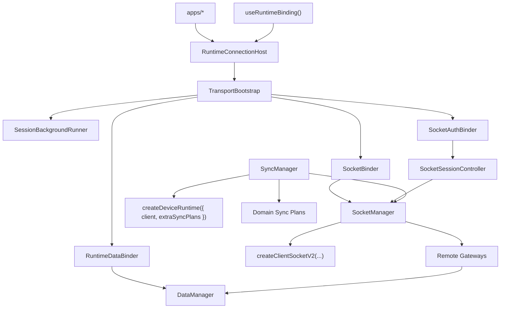

# App Runtime Architecture

Date: 2026-06-24
Status: Target Architecture

## 목적

이 문서는 `libs/app-runtime`의 소켓, 세션, sync 조립 방식을 다른 구현 에이전트가 바로 이해하고 작업할 수 있도록 정의한다.

이 문서는 현재 구현 설명보다 **목표 아키텍처**를 우선한다. 현재 코드와 차이가 있는 부분은 이후 리팩터링 대상이다.

## 결정 요약

`app-runtime`의 transport 계층은 아래 3축으로 정리한다.

1. `SocketManager`
2. `SocketSessionController`
3. `SyncManager`

핵심 원칙:

- `createClientSocketV2`의 생성 책임은 `SocketManager`에만 둔다.
- `createDeviceRuntime`의 생성 책임은 `SyncManager`에만 둔다.
- gateway는 raw client가 아니라 `SocketManager`의 stable socket API를 사용한다.
- sync는 raw runtime이 아니라 `SyncManager`를 통해서만 조작한다.
- `createSocketRuntime()`는 객체 조립만 담당하는 composition root로 유지한다.

## 시스템 구조



## 책임 분리

### 1. `SocketManager`

책임:

- `ClientSocketV2` 생성, 교체, destroy
- 현재 socket state 저장 및 방송
- stable `request/send/onType/onMessage/onState` 제공
- socket 교체 시 listener 재바인딩

비책임:

- token 획득/갱신 정책
- `auth.update` orchestration
- sync runtime 생성

설계 의도:

- 과거의 `ManagedSocketClientProxy` 역할은 별도 클래스로 두지 않고 `SocketManager`로 흡수한다.
- 외부 gateway는 socket 교체 여부를 몰라도 되어야 한다.

### 2. `SocketSessionController`

책임:

- bootstrap sequence
- `device.save` acknowledgement 대기 후 `auth.update`
- 주기적 auth refresh
- 401 recovery

비책임:

- socket client 생성/교체
- sync plan 조립

설계 의도:

- 세션/인증 정책은 transport 객체에서 분리한다.
- `SocketSessionDelegate`를 통해 상위 세션 레이어(`@chatic/web-core`)와 결합한다.

### 3. `SyncManager`

책임:

- 현재 client 기준 `createDeviceRuntime({ client, extraSyncPlans })`
- runtime `start()` / `stop()`
- `startSync()` / `stopSync()`
- 필요 시 target registry, replay, dedupe
- 앱 고유 sync 정책 수용 지점

비책임:

- token refresh
- gateway request 재시도

설계 의도:

- 기존 `AppSyncRuntime`은 제거 대상이라기보다 `SyncManager`로 재편 대상이다.
- `createDeviceRuntime`은 외부로 직접 노출하지 않는다.

## 생성 및 주입 위치

### `createClientSocketV2`

- 위치: `SocketManager` 내부
- 이유: socket transport 생성 책임을 한 곳에 모으기 위함

### `createDeviceRuntime`

- 위치: `SyncManager` 내부
- 이유: sync runtime 생성과 sync target 조작을 한 계층에 모으기 위함

### `createSocketRuntime()`

- 위치: `src/socket/runtime.ts`
- 역할: 아래 객체의 조립만 수행

```ts
const socketManager = new SocketManager();
const sessionController = new SocketSessionController(socketManager);
// request facade는 SocketManager가, 복구 정책은 controller가 — 주입으로 잇는다.
socketManager.setRecoveryHandler(() => sessionController.handle401Recovery());
const syncManager = new SyncManager(socketManager, { runtimeOptions: DEFAULT_SYNC_RUNTIME_OPTIONS });

return {
    socketManager,
    sessionController,
    syncManager,
};
```

## 외부 사용 규칙

### gateway / remote data layer

- `SocketManager`만 사용한다.
- raw `ClientSocketV2`에 직접 의존하지 않는다.

### sync hooks / feature layer

- `SyncManager`만 사용한다.
- raw `ClientSocketRuntime` 또는 `createDeviceRuntime`에 직접 의존하지 않는다.

### auth/session binding

- `SocketSessionController`만 사용한다.
- `SocketAuthBinder`가 site/token 변경 시 `updateAuth()`를 호출한다.

## 모듈 구조

```text
libs/app-runtime/src/
  connection/
    RuntimeConnectionHost.tsx
    RuntimeDataBinder.tsx
    SocketBinder.tsx
    SocketAuthBinder.tsx
    SessionBackgroundRunner.tsx
    TransportBootstrap.tsx
  runtime/
    RuntimeManager.ts
    useRuntimeBinding.ts
  socket/
    SocketManager.ts
    SocketSessionController.ts
    runtime.ts
    types.ts
    sync/
      SyncManager.ts
      plans.ts
      types.ts
      hooks/
        useSyncTarget.ts
  data/
    DataManager.ts
    runtime.ts
    factories/
      remoteFactory.ts
```

## 구현 단계별 전환 규칙

### 1단계

- `ManagedSocketClientProxy`를 새로 확장하지 않는다.
- request/rebind 역할을 `SocketManager`로 흡수한다.

### 2단계

- `AppSyncRuntime`를 `SyncManager`로 교체한다.
- `createDeviceRuntime` 호출은 `SyncManager` 내부로 이동한다.

### 3단계

- sync hook은 `getSyncManager().register(...)` 또는 동등 API만 사용한다.
- `remoteFactory`는 `getSocketRuntime().socketManager`를 사용한다.

## 현재 코드와의 차이

목표 아키텍처와 코드가 정렬되었다 (2026-06-24 리팩터링 완료):

- `ManagedSocketClientProxy`는 제거되었고 request facade는 `SocketManager`로 흡수되었다.
- `AppSyncRuntime`는 `SyncManager`로 재편되었고 `createDeviceRuntime` 소유 + 튜닝 옵션 주입 표면(`SyncManagerDeps.runtimeOptions`)을 갖는다.
- 401 recovery는 `SocketManager.request`가 감지·재시도하되 복구 정책은 주입된 핸들러(`setRecoveryHandler` → `SocketSessionController.handle401Recovery`)에 위임한다.

남은 후속:

- runtime 튜닝 값의 외부 config(connectionDraft류) 연결 — 현재는 composition root의 기본 상수(빈 값=엔진 기본 유지). 주입 표면은 준비됨.

## 완료 기준

- gateway가 `ManagedSocketClientProxy` 없이 동작한다.
- sync 관련 생성 책임이 `SyncManager` 하나로 모인다.
- `createClientSocketV2`와 `createDeviceRuntime`이 외부 호출부에서 사라진다.
- socket/session/sync 책임이 문서와 코드에서 동일하게 보인다.
