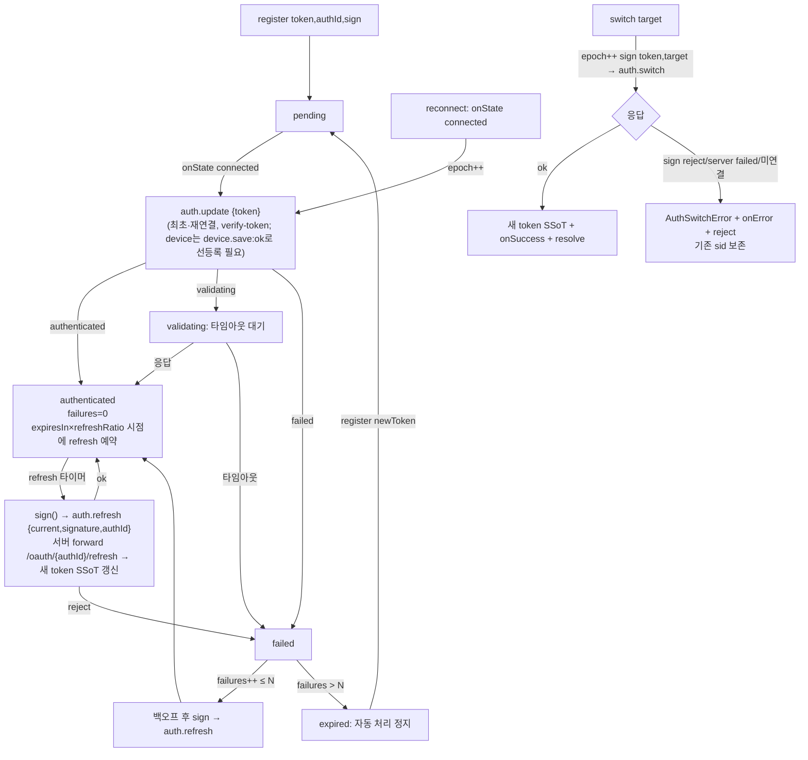

# Auth 도메인 (app-runtime)

> SDK(`@lemoncloud/chatic-sockets-lib`)가 제공하는 **`ClientSocketAuth`(`AuthController`)** 를 app-runtime이 어떻게 소유·배선·노출하는가를 다룬다.
>
> - 앱/UI가 **어떻게 사용하는가**(bootstrap·reauth·switch·logout·구독) → [usage.md](./usage.md)
> - **authId·서명·writeback 계약**(relay vs cloud, per-kind) → [signing.md](./signing.md)
> - 소유 규칙·전체 아키텍처 → [../architecture.md](../architecture.md)
> - sync가 인증 완료에 의존하는 방식 → [../sync/library-internals.md](../sync/library-internals.md)

---

## 0. 한 줄 요약

**인증 수명주기를 SDK `AuthController`가 소유한다.** app-runtime은 소켓 부팅 시 로그인 토큰·`authId`·서명 콜백을 `register`하고, 인증 상태와 갱신 토큰을 **구독만** 한다. 토큰 보관·만료 기반 재인증·재연결 재인증·백오프·in-flight 직렬화는 모두 SDK가 책임진다. **SDK가 토큰 SSoT**이며, refresh 결과는 `onTokenRefresh`를 통해 web-core 토큰 저장소로 단방향 writeback된다([signing.md](./signing.md)).

relay·cloud **두 소켓이 동시에** 각자의 `AuthController`를 돌린다. 서명·seed·writeback은 전역 active server가 아니라 각 소켓의 **`kind`** 를 축으로 분기한다([signing.md §0](./signing.md)).

---

## 1. 소유 경계 (누가 무엇을 소유하나)

| 항목                                                                              | 소유                                                                 |
| --------------------------------------------------------------------------------- | -------------------------------------------------------------------- |
| 현재 토큰(SSoT), 인증/재인증/만료 타이밍, 백오프, 요청 직렬화, switch/logout 패킷 | **SDK `AuthController`** (client당·kind당 1개)                       |
| 로그인 토큰, `authId`, **lemon hmac 서명 콜백**, refresh 결과 writeback           | **web-core 세션 레이어** → app-runtime delegate                      |
| bootstrap 시퀀싱(`register`→`connect`), 구독 배선, same-connection 재인증         | **app-runtime** (`bootstrapSocketConnection` / `SocketReauthBinder`) |
| `signature` 계산식, backend `/oauth/{authId}/refresh` 엔드포인트                  | 각각 web-core / 서버. SDK는 둘 다 모르고 전달만 한다.                |

> 핵심 제약: **app-runtime은 소켓 토큰을 따로 갱신하는 타이머를 돌리지 않는다.** SDK가 SSoT로 들고 있고, refresh한 토큰은 `onTokenRefresh`를 통해 web-core 저장소로 흘려보내(HTTP/AWS 서명용) 두 곳의 토큰을 일치시킨다.

### 왜 SDK가 소유하는가 (결정 이력)

과거 app-runtime은 `SocketSessionController`(수동 `auth.update`·1분 고정 `setInterval` refresh·single-flight `handle401Recovery`)와 `SocketAuthBinder`(토큰 변경 관측 → `updateAuth('session-switch')`)로 인증을 **직접** 운영했다. 이 경로는 (1) 만료와 무관한 고정 주기 refresh, (2) 401 복구와 주기 refresh가 겹칠 때의 stale-토큰 경쟁, (3) 병렬 refresh vs SDK refresh 처닝을 낳았다. SDK `AuthController`가 만료 기반 refresh·재연결 재인증·epoch 직렬화·백오프를 SSoT로 흡수하면서 이 수동 엔진은 **전부 제거**됐다. 지금 코드에는 `SocketSessionController`·`SocketAuthBinder`·`ManagedSocketClientProxy`·`handle401Recovery`·`setRecoveryHandler`가 존재하지 않는다.

---

## 2. 공개 표면 (`client.auth: AuthController`)

`createClientSocketV2`가 만든 client에 `auth`로 노출된다(SDK `client-socket-v2/auth-controller.ts`). app-runtime은 이를 `SocketManager`/delegate 뒤로 감싸서 UI에 직접 노출하지 않는다.

| 멤버             | 시그니처                                        | 용도                                                                                       |
| ---------------- | ----------------------------------------------- | ------------------------------------------------------------------------------------------ |
| `register`       | `(opts: { token, authId, sign }) => void`       | 토큰·authId·서명 콜백 등록. 멱등. `expired`/`logout` 이후 호출 시 인증 재개.               |
| `ready`          | `() => Promise<void>`                           | `authenticated`까지 대기. **bootstrap은 이를 호출하지 않는다**(§3) — 필요한 소비부만 사용. |
| `switch`         | `(target, handlers?) => Promise<AuthTokenView>` | 사이트 전환. 일회성·명시 호출(`switchSite`가 래핑).                                        |
| `logout`         | `() => Promise<void>`                           | 로컬 정리 + best-effort 서버 통지. 예외 안 던짐.                                           |
| `onAuthState`    | `(listener) => unsubscribe`                     | 인증 상태 구독.                                                                            |
| `onTokenRefresh` | `(listener) => unsubscribe`                     | refresh/switch 성공마다 full payload(credential 포함) 통지.                                |
| `token`          | `get => string`                                 | 현재 토큰(identityToken 문자열).                                                           |
| `state`          | `get => AuthControllerState`                    | 현재 상태.                                                                                 |

`AuthControllerState = '' | pending | validating | authenticated | failed | disconnected | expired`. 앞 6개는 서버 상태(`AuthUpdateState`), `expired`는 백오프 소진 시 SDK가 만드는 **클라이언트 터미널 상태**다.

> ⚠️ **`disconnected`는 타입엔 있으나 컨트롤러가 방출하지 않는다**(SDK dist 확인). 서버가 `disconnected`를 응답해도 클라에선 `failed`로 표면화되고, 소켓 close 시엔 상태가 마지막 값으로 유지된다. → `onAuthState`에서 `disconnected`를 기대하는 매핑을 두지 말 것. 연결 끊김은 transport state로 파생한다.

서명 콜백은 **stateless**다:

```ts
type AuthSignCallback = (token: string, ctx?: { target?: string }) => Promise<{ signature: string; current: string }>;
```

SDK가 보유한 현재 토큰을 첫 인자로 주입하지만, lemon hmac 서명은 토큰 문자열에 의존하지 않는다([signing.md](./signing.md)) — delegate는 **소켓 `kind` 기준**으로 서명을 계산한다. `ctx.target`이 있으면 switch용 호출이다(서명 자체는 동일, target은 패킷에만 실림).

### 부착 옵션 (`AUTH_OPTIONS`)

`SocketManager.createClient`가 `createClientSocketV2({ auth: AUTH_OPTIONS })`로 **모든 client에 부착**한다. 현재 값(`SocketManager.ts`):

```ts
const AUTH_OPTIONS = { refreshRatio: 0.8, maxFailures: 3, refreshIntervalMs: 5 * 60 * 1000 };
```

- `refreshRatio 0.8` — 서버가 준 `expiresIn` 잔여시간의 80% 지점에 선제 refresh.
- `maxFailures 3` — 백오프 3회 초과 실패 시 `expired` 터미널로 전이(SDK 기본 5에서 낮춤).
- `refreshIntervalMs 5분` — 서버 응답에 `expiresIn`이 **없을 때만** 쓰는 fallback 주기. SDK 기본 30분에서 낮춘 stopgap이다(no-expiresIn 토큰에서 30분 방치를 피하기 위함).

나머지(`minBackoffMs`/`maxBackoffMs`/`backoffFactor`/`validatingTimeoutMs`)는 SDK 기본값을 따른다.

---

## 3. 부팅·구독 배선 (app-runtime이 하는 것)

인증 수명주기는 SDK가 소유하지만, **소켓 부팅 시퀀싱과 구독 배선**은 app-runtime의 순수 함수 [`bootstrapSocketConnection`](../../src/socket/auth/bootstrapSocketConnection.ts)가 담당한다. `SocketBinder`의 각 슬롯(relay/cloud)이 이 함수를 호출한다.

부팅 시퀀스 — **`ensure` → `register` → `connect`** (순서 필수):

1. `manager.ensure(config, kind)` — client 생성(= `AuthController` 부착).
2. `onAuthState` 구독 → `manager.setAuthenticated(kind, state === 'authenticated')`; `state === 'expired'`면 `delegate.onAuthExpired(kind)`.
3. `onTokenRefresh` 구독 → `delegate.commitRefreshedToken(kind, view)` (web-core writeback).
4. `delegate.getAuthRegistration(kind)`로 `{ token, authId }`를 받아 **`connect` 전에** `client.auth.register({ token, authId, sign })`(토큰 시드)한 뒤 `auth.stop()`으로 컨트롤러를 비활성화(게이트 닫기).
5. `client.onMessage`(‎`device.save:ok` 필터) → `auth.start()`; `client.onState` closed/closing/idle → `auth.stop()` 구독. (`device.save:ok`는 요청 응답이라 `onType`이 아닌 `onMessage`로 온다.)
6. `manager.connect(kind)`.
7. 반환 cleanup은 네 구독(onAuthState/onTokenRefresh/onType/onState)을 해제.

주의점:

- **`auth.update`는 `device.save:ok`에 게이팅된다.** 백엔드는 해당 커넥션에 device가 등록(`device.save:ok`)돼야 `auth.update`를 처리하는데, SDK는 같은 `connected`에서 `device.save`와 `auth.update`를 함께 보내며 `auth.update`를 먼저 dispatch한다 → 기본 핸드셰이크는 device 등록보다 앞질러 실패한다. 실패한 최초 `auth.update`는 재시도되지 않고(SDK 백오프는 `auth.refresh`만 재실행하며 이는 최초 세션을 세우지 못함) 결국 `expired`(로그아웃)로 끝난다. 그래서 `register`가 토큰만 시드하고 `stop()`이 SDK의 connect-time 자동 발사를 억제한 뒤, `device.save:ok` 수신 시 `start()`가 connected+토큰 컨트롤러를 재활성화해 그 자리에서 `auth.update`를 보낸다. 매 disconnect마다 `stop()`으로 게이트를 재폐쇄해 재연결도 동일 순서를 지킨다.
- `start()`/`stop()`은 SDK `AuthControllerImpl`의 public 메서드지만 `AuthController` 인터페이스엔 미노출이라 구조적 타입 캐스트로 접근한다(SDK 업그레이드 취약점 — SDK가 device-게이트 핸드셰이크를 자체 제공하면 그쪽으로 이전).
- **`client.auth.ready()`를 부팅에서 호출하지 않는다.** 인증 완료 게이팅이 필요한 소비부(예: sync는 `requiresAuth` 게이트가 이미 있음)가 스스로 상태를 관측한다.

### same-connection 재인증 — `SocketReauthBinder` / `reauthenticateActiveSocket`

같은 소켓 연결을 유지한 채 **신원(토큰)만 바뀌는** 두 경우가 있다:

1. 게스트 → 소셜/이메일 승격 — relay 토큰 교체.
2. 같은 wss의 cloud site 전환 — cid만 바뀌어 `SocketBinder`가 재부팅하지 않는 config 변경.

SDK의 bare `register`는 active 상태에서 토큰만 조용히 교체하고 `auth.update`를 재발사하지 않으므로, 이 경우 옛 신원이 유지된다. [`SocketReauthBinder`](../../src/connection/SocketReauthBinder.tsx)는 `binding.auth.identityToken` 변화를 관측(reboot 중이 아닐 때만)해 [`reauthenticateActiveSocket`](../../src/socket/auth/reauthenticateActiveSocket.ts)를 호출한다:

- 대상은 `manager.getClient(kind)?.auth` — 전역 active가 아니라 그 **kind의 슬롯**.
- **피드백 루프 가드**: `registration.token === auth.token`이면 no-op. SDK 자체 refresh/switch의 writeback(같은 토큰으로 web-core에 착지)이 재인증을 유발하지 않도록 막는다.
- 그 외에는 verified일 때 fire-and-forget `auth.logout()`(이전 backend 세션 revoke) 후 **무조건 `auth.register(...)`** — `logout → register`가 SDK가 같은 연결에서 `auth.update`를 재전송하는 resume 경로다.

---

## 4. 인증 상태 → 앱 상태

`SocketManager`는 kind별 SDK 상태를 `setAuthenticated(kind, bool)`로 미러링하고, transport 연결과 합쳐 파생한다:

```
isVerified = authenticated && connected
```

`useSocketState()`가 이 파생값(`isConnected`/`isVerified`)을 UI에 노출한다. (`SocketState.connectionId`는 현재 항상 `null`로 미배선 — 알려진 갭.)

### `onAuthExpired` 정책 (kind별)

delegate의 `onAuthExpired(kind)`([`useSocketSessionDelegate`](../../src/connection/useSocketSessionDelegate.ts)):

- **cloud** → `logoutCloudSession()` — cloud 세션만 정리(relay는 유지).
- **relay** → `logger.warn`만. **자동 로그아웃하지 않는다** — relay 로그아웃은 수동(manual-only)이다([../../../web-core/docs/hooks/orchestration.md](../../../web-core/docs/hooks/orchestration.md)).

---

## 5. SDK 내부 동작 (참고)



1. **만료 기반 선제 refresh** — `expiresIn × refreshRatio`(0.8) 시점에 자동 `auth.refresh`. 부재 시 `refreshIntervalMs`(5분) fallback. 상대값이라 시계 동기화 불필요.
2. **재연결 = 재인증 트리거** — WS 재연결 시 `onState=connected`에서 자동 `auth.update`. 단 app-runtime은 이 자동 발사를 stop/start 게이트로 억제하고 `device.save:ok` 이후로 지연시킨다(§3, device 선등록 요구).
3. **epoch 직렬화** — update/refresh/switch는 단일 in-flight. 진입 시 `epoch++`, 응답은 epoch 일치 시에만 반영 → 재연결·주기 refresh·switch가 겹쳐도 stale 토큰이 최종 적용되지 않는다.
4. **백오프 후 만료** — 재인증 실패는 공통 카운터. `authenticated` 성공 시 0 리셋. `maxFailures`(3) 초과 시 `expired` 터미널. 새 토큰 재등록 시 `pending` 복귀.

**서버 패킷 배선(확인됨)**: chatic-sockets-api는 `auth.update`/`auth.refresh`/`auth.switch`/`auth.logout` 4개를 모두 use-case로 등록하고 backend로 forward한다.

---

## 6. sync와의 연결 (전제 조건)

`ChatSyncPlan`·`ChannelSyncPlan` 등 **`requiresAuth = true`인 plan은 `authenticated` 상태가 되어야 scheduler가 sync를 시작**한다(SDK `sync-scheduler` `isEntryAuthReady` 게이트). 즉 **auth 레이어가 sync의 전제 조건**이다. sync target 등록 자체는 언제든 가능하며, 인증 전 등록분은 게이트에 막혀 있다가 `authenticated`가 되면 시작된다. sync 사용 패턴은 [../sync/usage.md](../sync/usage.md).

---

## 7. 관련 문서

- [usage.md](./usage.md) — 앱 사용 패턴 + 트러블슈팅
- [signing.md](./signing.md) — per-kind authId/sign/writeback 계약 (relay vs cloud)
- [../socket/README.md](../socket/README.md) — `SocketManager` 듀얼 슬롯·bootstrap·switch/logout 헬퍼
- [../sync/usage.md](../sync/usage.md) — sync target 등록(인증 완료가 전제)
- [../architecture.md](../architecture.md) — 소유 규칙(manager 2축 + SDK 인증)
