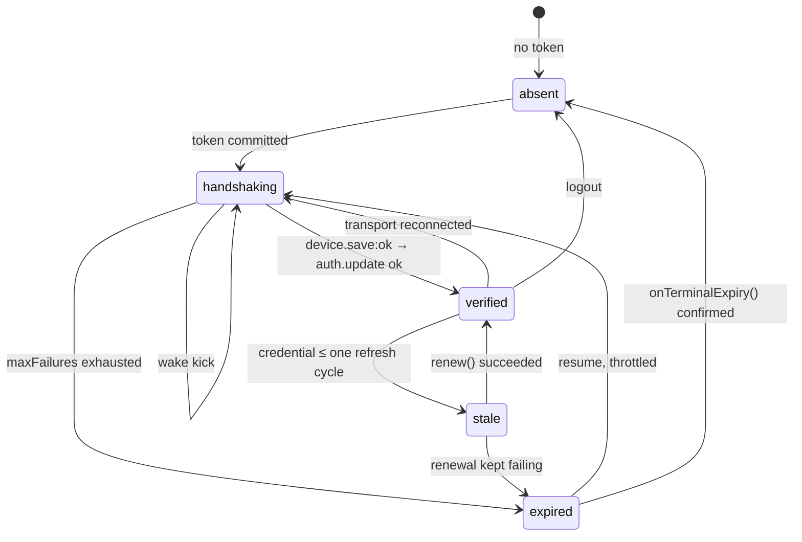

# auth — staying authenticated on two sockets

Two sockets authenticate independently, each with its own SDK `AuthController`, and everything the
app signs — socket packets and HTTP requests alike — depends on the credential those loops keep
fresh. This layer is the wiring around them: what gets registered and when, how the answer "is this
slot authenticated" is computed, what renews a lapsing credential, and what ends a session that
cannot be renewed.

It is spread across three folders on purpose, and the split follows dependency direction rather than
subject: `socket/auth/` holds the wiring and the policy (17 source files, 14 tests), `session/auth/`
holds the material it reads and writes ([docs/session/](../session/README.md)), and the two guards
that _trigger_ renewal are React hooks in `session/hooks/app/`. The renewers live with the socket
because `socket/auth → session` is an existing edge and the reverse is not; putting them under
`session/auth/` would close a cycle.

## Who owns what

| Concern                                                                              | Owner                                                                       |
| ------------------------------------------------------------------------------------ | --------------------------------------------------------------------------- |
| The current token (SSoT), refresh cadence, reconnect re-auth, backoff, serialization | **SDK `AuthController`**, one per client per kind                           |
| Boot sequencing, subscription wiring, same-connection re-auth                        | `socket/auth/` — plain functions, no controller class                       |
| The login token, the `authId`, the HMAC signature, the refresh writeback             | `session/` through `SocketSessionDelegate`                                  |
| When to renew, and what to do when renewal is impossible                             | `ICredentialRenewer` + the two guards                                       |
| The signature formula, and the backend refresh endpoint                              | `libs/auth-sign` and the server. The SDK forwards both without reading them |

**Nothing in this package calls a refresh endpoint and nothing builds an `auth.update` packet.**
[`http/refreshAbsence.test.ts`](../../src/http/refreshAbsence.test.ts) and
[`socket/authUpdateAbsence.test.ts`](../../src/socket/authUpdateAbsence.test.ts) walk `src/**`,
strip comments, and fail on the string. Absence checks, not lint rules: a path-based rule was tried
first and died silently the moment the symbols moved, letting a violating file pass.

A second `auth.update` sender would be worse than duplicated work. Every input to the controller's
state machine — the failure count, the terminal `expired`, the refresh timing — is keyed to packets
it sent itself, so a packet it did not send makes it plan a renewal for a session it did not open.
That is why the socket data-source bundle has no `update` slot either.

### The controller's own surface

`createClientSocketV2` attaches it as `client.auth`. This package never hands it to a screen.

| Member                              | Used for                                                                    |
| ----------------------------------- | --------------------------------------------------------------------------- |
| `register({ token, authId, sign })` | Seeds the loop. Idempotent, and the resume path out of `expired` / `logout` |
| `refresh(): Promise<AuthTokenView>` | Manual renewal. Single-flight with the periodic timer                       |
| `switch(target, handlers?)`         | Site switch. One-shot, explicit                                             |
| `logout()`                          | Local teardown plus a best-effort server notice. Never throws               |
| `onAuthState` · `onTokenRefresh`    | The two subscriptions this layer wires                                      |
| `token` · `state`                   | The current identity token and `AuthControllerState`                        |

`AuthControllerState` is `'' | pending | validating | authenticated | failed | disconnected |
expired`. **The controller never emits `disconnected`** — a server that answers `disconnected`
surfaces as `failed`, and a closed socket leaves the state at its last value. Do not write a mapping
that waits for it; derive disconnection from the transport instead.

`start()` and `stop()` are public on the SDK's implementation but absent from the `AuthController`
interface, so this package reaches them through a structurally typed
`AuthActivationGate { start(): void; stop(): void }`. That cast is the layer's one real SDK coupling
and the first thing to check on an SDK upgrade.

### `AUTH_OPTIONS`

Every client gets the same options, from [`socket/constants.ts`](../../src/socket/constants.ts):

```ts
export const AUTH_OPTIONS = { refreshRatio: 0.8, maxFailures: 3, refreshIntervalMs: 5 * 60 * 1000 } as const;
export const SDK_REFRESH_CYCLE_MS = AUTH_OPTIONS.refreshIntervalMs;
```

- `refreshRatio 0.8` — refresh at 80% of the reported `expiresIn`. Relative, so no clock sync is needed.
- `maxFailures 3` (SDK default 5) — reach the terminal `expired` sooner, because the confirmation window below absorbs the false positives that buys.
- `refreshIntervalMs 5min` (SDK default 30min) — the **fallback** cadence, used only when the auth response omits `expiresIn`, which it currently does. Thirty minutes is long enough for the relay AWS credential to lapse first, and then signed HTTP 403s while the socket still reports `authenticated`. Five minutes stays well under the roughly one-hour credential lifetime. The real fix is the server reporting `expiresIn`, which retires the fallback.

`SDK_REFRESH_CYCLE_MS` exists so three margins can read the cadence instead of restating `5 * 60_000`
— `deriveAuthStatus`, the relay staleness guard and the cloud credential guard. They all rest on one
piece of reasoning: **a healthy socket re-mints its credential every cycle, so a credential with less
than a cycle left proves its socket is not keeping up.** `constants.ts` imports no runtime module,
which is what lets `session/hooks/app/**` read the cadence without pulling in `SocketManager` and the
SDK behind it.

## The status truth table

One pure function answers "what is this slot's auth state", and any file that recombines the sources
itself is a regression. [`authStatus.ts`](../../src/socket/auth/authStatus.ts) exports the type, the
function, two predicates and the two collectors.

```ts
export type AuthStatus = 'absent' | 'handshaking' | 'verified' | 'stale' | 'expired';
```

`AuthSignals` carries six readonly fields — `hasToken`, `verifiedOnThisConnection`, `controller`,
`credentialMs`, `marginMs`, `storedSessionExpired` — and the branch order is the contract:

```ts
if (!signals.hasToken) return 'absent';
if (signals.controller === 'expired') return 'expired';
if (!signals.verifiedOnThisConnection) return 'handshaking';
if (signals.storedSessionExpired === true) return 'stale';
if (signals.credentialMs == null || signals.credentialMs <= signals.marginMs) return 'stale';
return 'verified';
```

An unmeasurable credential reads as `stale`, deliberately: the token view does not always carry one,
and refreshing needlessly is cheaper than signing with a credential nobody checked.



There is no `wedged` state ("unverified for a long time"). Persistence needs a clock, and this is a
read-only projection with no timer of its own; what stands in for it is the self-loop — the wake kick
that `needsSocketKick` drives.

Two predicates keep the callers from re-deriving conditions:

```ts
canRefreshThroughSocket(status); // 'verified' | 'stale'   — a refresh can reach the controller
needsSocketKick(status); // 'handshaking' | 'expired' — the socket, not the credential, is the problem
```

`getAuthStatus(kind, deps?)` and `getAuthSnapshot(kind, deps?)` collect the signals and derive.
There is **no class and no singleton**: sources arrive through an optional `AuthSignalDeps` whose
defaults are resolved lazily, so a test injects `deps` instead of resetting a module. `deriveAuthStatus`
itself needs neither a socket nor a store.

## Booting a slot

[`bootstrapSocketConnection({ manager, kind, config, delegate })`](../../src/socket/auth/bootstrapSocketConnection.ts)
is an async function that returns its own cleanup. `SocketBinder` calls it per slot whenever that
slot's config changes. The order is the contract:

1. `manager.ensure(config, kind)` — creates the client, which attaches the controller. A slot with no `auth` logs an error, connects anyway, and returns a no-op cleanup.
2. Subscribe `onAuthState` → `manager.setAuthenticated(kind, state === 'authenticated')`; `'authenticated'` resets the resume throttle; `'expired'` calls `delegate.onAuthExpired?.(kind)`.
3. Subscribe `onTokenRefresh` → `delegate.commitRefreshedToken(kind, view)`, then re-read the registration and hand it to the `authId` registry ([signing.md](./signing.md#the-authid-registry)).
4. `delegate.getAuthRegistration(kind)` → `auth.register({ token, authId, sign })`, then **`gate.stop()` immediately** — before connecting.
5. Subscribe `client.onMessage` for `device.save:ok`, which calls `gate.start()`; and `client.onState` for `closed` / `closing` / `idle`, which calls `gate.stop()` again.
6. `manager.connect(kind)`.

**Why the gate exists.** The backend refuses `auth.update` on a connection with no registered device,
and the SDK sends `device.save` and `auth.update` from two independent `connected` listeners with
`auth.update` first. The first `auth.update` is not retried — the SDK's backoff re-runs
`auth.refresh`, which cannot establish a session that was never established — so the default
handshake ends at `expired`. Registering with the controller stopped, then starting it when
`device.save:ok` arrives, puts the two in the required order. Re-closing the gate on every disconnect
is what makes reconnections keep it. `device.save:ok` is a _response_, so it arrives on `onMessage`
and never on `onType`.

**This is still true on the pinned SDK.** The check is two lines in the SDK's own dist: the auth
controller's constructor subscribes `client.onState` and sends an update on `connected`, and
`create-device-runtime` subscribes `client.onState` and saves the device on `connected`. Neither
waits for the other; ordering falls out of subscription order alone. The gate can only be removed
together with an SDK version that offers a device-gated handshake explicitly.

**`client.auth.ready()` is never called at boot.** A consumer that needs to wait for authentication
observes the state itself — sync has its own `requiresAuth` gate, and the UI reads
`useRuntimeSocketState().isVerified`.

The `expired` slot has one extra rule: `device.save:ok` may only re-open the gate if a per-bootstrap
`Throttle` grants it — 30 seconds growing to a 5-minute ceiling, reset on `authenticated`. Without
it, a terminally expired slot retries its handshake on every reconnect.

## Re-authenticating without a reboot

The SDK's bare `register` swaps the token silently on an active controller and does not re-send
`auth.update`, so the old identity survives.
[`reauthenticateActiveSocket`](../../src/socket/auth/reauthenticateActiveSocket.ts) is what corrects
that. It always addresses `manager.getClient(kind)`, never the active facade.

- **The no-op guard comes first.** If `registration.token === auth.token`, nothing changed — it only re-syncs the `authId` and returns. Without it, the SDK's own refresh writeback lands in the store and bounces straight back as a re-authentication, and the loop never settles.
- When the identity really changed it optionally re-points the slot's bound cid, then — if the slot was verified — fires `auth.logout()` fire-and-forget to revoke the old backend session **and forces `setAuthenticated(kind, false)`**. That deliberate dip is what makes verification-gated consumers re-anchor on the new user.
- Then it registers unconditionally. `logout → register` is the SDK's resume path for re-sending `auth.update` on a live connection. If the client is not connected it closes the gate again, so the `device.save:ok` ordering holds on the next connect.

Two situations reach it, and only one is watched automatically:

1. **Guest promoted to a social or email login.** The relay token is replaced while `url|deviceId|wssType` is unchanged, so `SocketBinder` does not reboot and `SocketReauthBinder` sees the slot's `identityToken` move.
2. **A cloud token re-issued while staying in the same cloud.** No binder sees it — the cloud slot deliberately carries no `identityToken` — so `renewCloudSession` calls this function directly.

**A cloud _switch_ is in neither list.** Two clouds never share a wss host, so a switch always changes
the URL, the binder rebuilds the slot, and there is no live connection left to re-authenticate. That
is an invariant rather than an observation, and `SocketBinder` raises an error if a switch ever
arrives on the same wss — because the silent failure would be an old identity quietly staying put.

[`applySessionToken($token, options?)`](../../src/socket/auth/applySessionToken.ts) is the one
app-facing entry to this path, used by phone verification: it commits the token view, re-authenticates
the relay slot, and waits up to 10s for `auth.ready()`, then asserts `auth.token` actually became the
new identity token. It **throws** when `$token.$auth.id` is missing, because relay registration is
impossible without it and failing at the source beats failing on every later refresh.

## Renewal: two strategies, two classes

```ts
interface ICredentialRenewer {
    readonly owner: CredentialOwner;
    timeToExpiry(now?: number): number | null;
    renew(): Promise<boolean>;
    onTerminalExpiry(): Promise<void> | void;
}
```

|                    | relay                                           | cloud                                              |
| ------------------ | ----------------------------------------------- | -------------------------------------------------- |
| The token's parent | none — a login is the only issuer               | the relay identity, via `delegate-cloud`           |
| Renewal            | **refresh** through the socket's own controller | **re-issue** — `delegate-cloud` + `exchange-token` |
| With no socket     | impossible; waiting is the only option          | fine, as long as relay is alive                    |
| On terminal expiry | the session is over — log out                   | leave the cloud; relay survives                    |

`credentialRenewers` is a `Record<SocketKind, ICredentialRenewer>` of exactly those two.

**Relay `renew()`** is [`requestRelaySessionRefresh()`](../../src/socket/auth/requestRelaySessionRefresh.ts),
the single entry point for "make the relay credential fresh". It reads the snapshot, returns `false`
unless `canRefreshThroughSocket(status)`, and otherwise awaits `auth.refresh()`. It takes no
`SocketKind` — relay is in the name. **There is no HTTP fallback**; `false` means "get a socket
back", and the caller's answer is `recoverUnverifiedSockets`. A `Coalescer` shares an attempt in
flight and memoizes a settled answer for 3 seconds; the SDK's own single-flight covers the rest.

**Relay `onTerminalExpiry()`** is the only automatic path in this runtime that can end a session, so
it does not act on the first `expired`. That state means two different things at once: a signature
that is genuinely stuck, and three consecutive failures on a link that is dropping. The verdict needs
two answers:

1. **Is the link dead?** `navigator.onLine === false` proves the failures are not the session's fault. Hold. If it is still stuck when the link returns, `expired` arrives again, online this time.
2. **Is it still `expired` after two 30-second rounds?** A stuck signature persists by definition; an exhausted backoff does not. `'handshaking'` is deliberately **not** counted as resolved — the point is to see the slot actually recover, not to see it try.

The window schedules nothing and kicks nothing. It buys time for the recovery paths that already
exist — the first resume after a reconnect, a foreground `recoverUnverifiedSockets` — to be observed,
and repeated `expired` reports join one verdict through a `Coalescer`. Only then does it call
`relaySession.clearAndRedirect()`.

**Cloud `renew()`** is [`renewCloudSession()`](../../src/socket/auth/renewCloudSession.ts):
`reissueCommittedCloudTokens()` — keyed on the **committed** cloud, cache bypassed — then
`reauthenticateActiveSocket({ kind: 'cloud' })`. **Re-registering the socket is not optional.**
Without it the SDK keeps resending the expired token, burns `maxFailures`, and `onAuthExpired` throws
the user out of the cloud — the HTTP problem gets fixed and the place is lost anyway. Cloud
`onTerminalExpiry()` is one synchronous `cloudSession.clearStores()`: losing a cloud is recoverable
by walking back in, so it is not a teardown signal.

## The two guards

An app mounts these; they are not automatic.

**[`useSessionStalenessGuard(policy)`](../../src/session/hooks/app/useSessionStalenessGuard.ts) is
relay-only, and adding a `kind` option to it would be wrong** — relay and cloud recover by different
means, and the cloud counterpart exists. Two properties are not configurable because they are the
reason the hook exists: the probe never refreshes (`webTransport.isAuthenticated()` would fire
lemon-web-core's own HTTP refresh, a second refresh engine that updates only the lemon store and
leaves the socket's signing material stale), and renewal always goes through
`requestRelaySessionRefresh`.

The policy covers `enabled`, `intervalMs` (`null` for edge-driven callers), `checkOnVisible`,
`checkOnRelayVerified`, `missingSessionCountsAsFailure`, `consecutiveFailureLimit`, `onTeardown` and
`forceRefresh`. Only **definitive** failures count toward the teardown streak: a refresh that could
not even reach the socket is not one.

`forceRefresh` closes a specific hole. The boot handshake's `auth.update` emits no token — the SDK
emits one only from `refresh` and `switch` — so the first writeback is a whole refresh cycle away,
and until it lands, relay-signed HTTP is signed with the credential from before the device went to
sleep. The expiry probe cannot see that window because it reads lemon's `expired_time`, not the
credential. So the guard measures the signing material itself: it fires only when
`credentialFreshness.timeToExpiry('relay')` is under one refresh cycle. Firing on every edge
unconditionally was the earlier behaviour and it refreshed credentials minted seconds earlier,
colliding with the re-authentication at login. A 60-second cooldown throttles it, and a preemptive
failure never counts toward teardown — a credential that is still valid is not evidence the session
died.

**[`useCloudCredentialGuard(policy)`](../../src/session/hooks/app/useCloudCredentialGuard.ts) does not
poll.** It derives a deadline from the credential's own `Expiration` minus a margin and sleeps until
then, waking at most every 5 minutes because a suspended tab serves long timers late. The margin is
`SDK_REFRESH_CYCLE_MS`, and that is diagnosis rather than tuning: a healthy cloud socket re-mints
every cycle, so being under the margin at all _is_ the evidence the socket is not keeping up.

The gap it closes was real. A cloud credential lives about an hour, and the only thing that re-minted
it mid-session was the cloud socket's refresh writeback. While that socket was down — sleep, a
dropped link, a long stay in one place — nobody even _measured_ the credential, and once it lapsed
every cloud-signed request 403'd. Re-entering a cloud hid it, because a switch re-issues, so it only
showed up in sessions that sat still.

## Ending a session

| Entry                                     | What it does                                                                         |
| ----------------------------------------- | ------------------------------------------------------------------------------------ |
| `logoutSession(options?)`                 | `auth.logout()` on **both** slots, then `relaySession.clearAndRedirect()`            |
| `logoutCloudSession()`                    | `auth.logout()` on the cloud slot, then `cloudSession.clearStores()`. Relay survives |
| `RelayCredentialRenewer.onTerminalExpiry` | The confirmed-`expired` path above                                                   |
| `handleRevokedRelaySession(scope)`        | Immediate, once per page life                                                        |

The socket notice comes first and is fire-and-forget, so local teardown and redirect keep their
timing. These two are the public names precisely because they notify; the store-only halves live as
methods (`clearAndRedirect`, `clearStores`) and have no global name at all.

**A revoked session is the one auth failure nothing can renew.** The backend stamps it on logout and
then refuses every refresh and every issue with `403 NOT ALLOWED - session revoked`. Refresh 403s,
and `delegate-cloud` — the first step of a cloud switch — is relay-signed, so it 403s too. Without a
verdict the runtime reads a revoked session as an authenticated one, because `isAuthenticated` is a
session-_existence_ probe: the dead token is still in the store, guest keep-alive never re-logs in,
and every screen shows its own generic failure until the terminal-expiry path ends the session 30
seconds later with no attribution.

[`isRevokedSessionError`](../../src/socket/auth/revokedSession.ts) matches on the message and walks
the `cause` chain up to five links, because the message is the only place the fact exists — the
socket carries the server error as text, with no status and no code. **Only `auth.switch` can carry
it today.** `auth.refresh()` rejects with a bare `Error('auth.refresh failed: server')`, dropping the
server error, and signed HTTP never sees a status at all because the API Gateway 403 that carries it
has no CORS header and reaches the browser as a network failure.

## Waking a wedged socket

[`recoverUnverifiedSockets(deps?)`](../../src/socket/auth/recoverUnverifiedSockets.ts) is what an app
calls on its own foreground signal. It walks both kinds, skips unbound slots, and acts only where
`needsSocketKick(status)` holds — a slot that looks `verified` is left alone, because churning a warm
connection costs more than it fixes. For each one it disconnects with code 1000, re-registers from
the delegate when the slot was terminally expired (and closes the gate again), and reconnects.
Concurrent calls share one pass through a `Coalescer`.

## What not to do

- **Do not add a second `auth.update` or refresh sender.** The absence tests will fail, and the reason they exist is in "Who owns what".
- **Do not branch on `disconnected` in `onAuthState`.** The controller does not emit it.
- **Do not remove the `device.save:ok` gate** until the SDK offers a device-gated handshake. The first `auth.update` is not retried, so getting it wrong ends at `expired` with no recovery.
- **Do not drop the `token === auth.token` guard** in `reauthenticateActiveSocket`. Removing it turns every SDK refresh writeback into a re-authentication.
- **Do not give the relay guard a `kind` option**, and do not point the cloud guard at a refresh. The two recover by different means and each has a hook that says so.
- **Do not act on the first `expired`.** Offline and stuck look identical at that moment, and one of them costs the user their session.
- **Do not restate `5 * 60_000`.** Read `SDK_REFRESH_CYCLE_MS`, so changing the cadence moves all three margins with it.

## Notes for implementers and tests

- Fourteen of the seventeen source files here have a matching `*.test.ts`; `reauthDelegate.ts`, `types.ts` and `index.ts` do not. The command is what answers whether they pass.
- Everything takes its dependencies as an argument with a lazily resolved default — `AuthSignalDeps`, `RecoverUnverifiedSocketsDeps`, `RequestRelaySessionRefreshDeps`, `RelayExpiryDeps`. A test injects; it does not reset a module. The two that do need a reset seam expose one: `resetRelayRefreshCoalescing()` and `resetRevokedSessionHandling()`.
- `deriveAuthStatus` is pure and its test is a truth table. If you change a branch, change the table — it is the drawing above in executable form.
- The terminal-expiry confirmation uses real waits. Inject `wait` and `readStatus` through `RelayExpiryDeps` rather than reaching for fake timers across a `Coalescer`.
- Five of the seventeen files are deliberately off `socket/auth/index.ts`: `authStatus.ts`, `renewers.ts`, `authIdRegistry.ts`, `reauthDelegate.ts` and `revokedSession.ts`. In-package callers import them by concrete path, which is what keeps the barrel free of the cycle `sessionDelegate → renewers → renewCloudSession → sessionDelegate`. `reauthDelegate.ts` exists only to hold the seed-and-sign half of the delegate outside that ring.

## Further reading

- [signing.md](./signing.md) — the per-kind `authId`, the signature, the writeback, and the `authId` registry
- [docs/socket/](../socket/README.md) — the slots these controllers sit on, and the binders that call this wiring
- [docs/session/](../session/README.md) — where the registration material and the writeback land
- [docs/http/](../http/README.md) — the staleness port that asks this layer whether a signature can be trusted
- [`libs/auth-sign`](../../../auth-sign/README.md) — the HMAC itself
