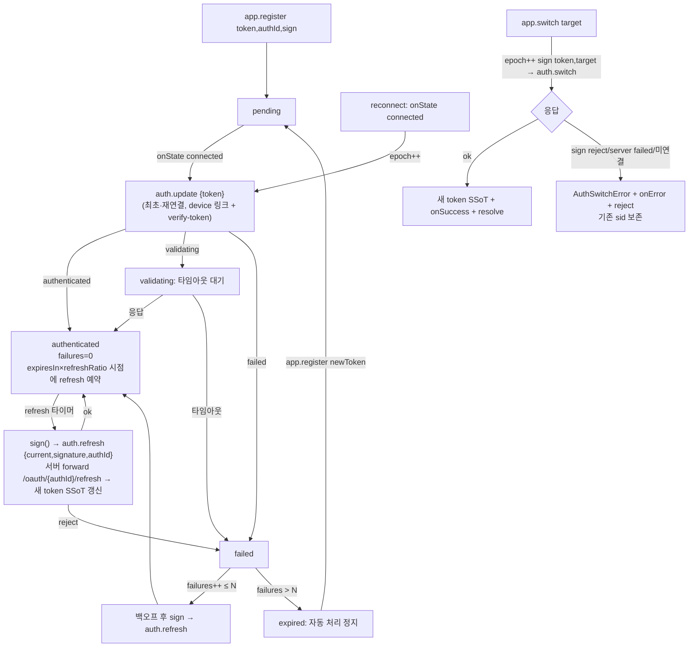

# Auth 도메인 (app-runtime)

Date: 2026-06-29
Status: Adoption Guide (SDK `AuthController` 도입)

> SDK(`@lemoncloud/chatic-sockets-lib`)가 제공하는 **`ClientSocketAuth`(`AuthController`)** 를 app-runtime이 어떻게 소유·배선·노출하는가를 다룬다.
>
> - 앱/UI가 **어떻게 사용하는가**(register·switch·logout·구독) → [usage.md](./usage.md)
> - **authId·서명·writeback 계약**(relay vs cloud 분기) → [signing.md](./signing.md)
> - 소유 규칙·전체 아키텍처 → [../architecture.md](../architecture.md)
> - sync가 인증 완료에 의존하는 방식 → [../sync/library-internals.md](../sync/library-internals.md)

---

## 0. 한 줄 요약

**인증 수명주기를 SDK가 소유한다.** 앱은 로그인 토큰·`authId`·서명 콜백만 등록하고, 인증 상태와 현재 토큰을 **구독만** 한다. 토큰 보관·만료 기반 재인증·백오프·in-flight 직렬화·사이트 전환은 모두 SDK `AuthController`가 책임진다. 사용자 결정에 따라 **SDK가 토큰 SSoT**가 되며, refresh 결과는 web-core 토큰 저장소로 단방향 writeback된다([signing.md](./signing.md)).

---

## 1. 소유 경계 (누가 무엇을 소유하나)

| 항목                                                                              | 소유                                                |
| --------------------------------------------------------------------------------- | --------------------------------------------------- |
| 현재 토큰(SSoT), 인증/재인증/만료 타이밍, 백오프, 요청 직렬화, switch/logout 패킷 | **SDK `AuthController`**                            |
| 로그인 토큰, `authId`, **lemon hmac 서명 콜백**, refresh 결과 writeback           | **앱**(web-core 세션 레이어 → app-runtime delegate) |
| `signature` 계산식, backend `/oauth/{authId}/refresh` 엔드포인트                  | 각각 앱 / 서버. SDK는 둘 다 모르고 전달만 한다.     |

> 핵심 제약: **앱은 소켓 토큰을 따로 갱신하는 타이머를 돌리지 않는다.** SDK가 SSoT로 들고 있고, 앱은 `client.auth.token`/`onTokenRefresh`로 읽기만 한다. SDK가 refresh한 토큰은 `onTokenRefresh`를 통해 web-core 저장소로 다시 흘려보내(HTTP/AWS 서명용) 두 곳의 토큰을 일치시킨다.

---

## 2. 공개 표면 (`client.auth: AuthController`)

`createClientSocketV2`가 만든 client에 `auth`로 노출된다(SDK `client-socket-v2/auth-controller.ts`). app-runtime은 이를 `SocketManager`/세션 레이어 뒤로 감싸서 UI에 직접 노출하지 않는다.

| 멤버             | 시그니처                                        | 용도                                                               |
| ---------------- | ----------------------------------------------- | ------------------------------------------------------------------ |
| `register`       | `(opts: { token, authId, sign }) => void`       | 토큰·authId·서명 콜백 등록. 멱등. `expired`에서 호출 시 인증 재개. |
| `ready`          | `() => Promise<void>`                           | `authenticated`까지 대기(이미면 즉시 resolve, `expired`면 reject). |
| `switch`         | `(target, handlers?) => Promise<AuthTokenView>` | 사이트 전환. 일회성·명시 호출.                                     |
| `logout`         | `() => Promise<void>`                           | 로컬 정리 + best-effort 서버 통지. 예외 안 던짐.                   |
| `onAuthState`    | `(listener) => unsubscribe`                     | 인증 상태 구독.                                                    |
| `onTokenRefresh` | `(listener) => unsubscribe`                     | refresh/switch 성공마다 full payload(credential 포함) 통지.        |
| `token`          | `get => string`                                 | 현재 토큰(identityToken 문자열). HTTP Authorization 헤더용.        |
| `state`          | `get => AuthControllerState`                    | 현재 상태.                                                         |

`AuthControllerState = '' | pending | validating | authenticated | failed | disconnected | expired`. 앞 6개는 서버 상태(`AuthUpdateState`), `expired`는 백오프 소진 시 SDK가 만드는 **클라이언트 터미널 상태**다.

서명 콜백은 **stateless**다:

```ts
type AuthSignCallback = (token: string, ctx?: { target?: string }) => Promise<{ signature: string; current: string }>;
```

SDK가 보유한 현재 토큰을 첫 인자로 주입하지만, lemon hmac 서명은 토큰 문자열에 의존하지 않는다(§[signing.md](./signing.md)) — 앱은 **active server 기준**으로 서명을 계산한다. `ctx.target`이 있으면 switch용 호출이다(서명 자체는 동일, target은 패킷에만 실림).

부착 옵션(`AuthControllerOptionsPartial`): `refreshIntervalMs`(expiresIn 부재 시 fallback), `minBackoffMs`, `maxBackoffMs`, `backoffFactor`, `maxFailures`, `validatingTimeoutMs`. 도입 기본값은 `refreshRatio 0.8` + `maxFailures 3`.

---

## 3. 내부 동작 (SDK가 알아서 하는 것)



4가지 메커니즘:

1. **만료 기반 선제 refresh** — 서버 응답의 `expiresIn`(잔여 ms) × `refreshRatio`(기본 0.8) 시점에 SDK가 알아서 `auth.refresh`. `expiresIn` 부재 시 `refreshIntervalMs` fallback. 상대값이라 시계 동기화 불필요.
2. **재연결 = 재인증 트리거** — WS가 다시 붙으면 `onState=connected`에서 자동 `auth.update`.
3. **epoch 직렬화** — update/refresh/switch는 단일 in-flight. 진입 시 `epoch++`, 응답은 epoch 일치 시에만 반영 → 재연결·주기 refresh·switch가 겹쳐도 stale 토큰이 최종 적용되지 않는다. 기존 수동 `handle401Recovery`의 single-flight를 대체한다.
4. **백오프 후 만료** — 주기·반응 재인증 실패는 공통 카운터. `authenticated` 성공 시 0 리셋. N회(`maxFailures`) 실패 시 `expired` 터미널 → 자동 처리 중단. 앱이 새 토큰 재등록 시 `pending`으로 복귀.

**서버 패킷 배선(확인됨)**: chatic-sockets-api는 `auth.update`/`auth.refresh`/`auth.switch`/`auth.logout` 4개를 모두 use-case로 등록하고 backend로 forward한다(`src/lib/auth/*-auth.ts`, `shared.ts`). 따라서 SDK refresh가 미배선으로 `:error`→백오프→`expired`로 새는 경로는 없다.

---

## 4. sync와의 연결 (전제 조건)

`ChatSyncPlan`·`ChannelSyncPlan` 등 **`requiresAuth = true`인 plan은 `authenticated` 상태가 되어야 scheduler가 sync를 시작**한다(SDK `sync-scheduler` `isEntryAuthReady` 게이트). 즉 **auth 레이어가 sync의 전제 조건**이다.

→ 부팅 순서: `register` → `ready()`(authenticated) → 그 다음 `registerChat`/`registerChannel` 등 sync target 등록. sync 사용 패턴은 [../sync/usage.md](../sync/usage.md).

---

## 5. 현재 상태 vs 목표 상태 ⚠️

**현재(2026-06-29) app-runtime은 SDK `AuthController`를 사용하지 않는다.** 인증은 `SocketSessionController`가 수동으로 수행한다.

|                  | 현재(수동)                                                                      | 목표(SDK `AuthController`)                                                      |
| ---------------- | ------------------------------------------------------------------------------- | ------------------------------------------------------------------------------- |
| 최초/재연결 인증 | `SocketSessionController.updateAuth` → `client.request('auth.update', {token})` | `register` 후 `onState=connected`에서 SDK 자동                                  |
| 주기 재인증      | `startPeriodicRefresh` 1분 고정 `setInterval`                                   | `expiresIn × refreshRatio` 만료 기반 자동                                       |
| 실패 복구        | `handle401Recovery` single-flight + `delegate.refreshSocketToken`               | `failed`/`:error` → 백오프 reauth(epoch 직렬화)                                 |
| 사이트 전환      | `SocketAuthBinder` → `updateAuth('session-switch')`                             | `client.auth.switch(uid@sid)`([usage.md](./usage.md) §1.4)                      |
| 토큰 출처        | `delegate.getSocketToken()`                                                     | `register({token})` + active-server-aware sign 콜백([signing.md](./signing.md)) |
| refresh 결과     | (HTTP refresh가 web-core 저장소 직접 갱신)                                      | `onTokenRefresh` → web-core writeback(SDK가 SSoT)                               |
| 상태 표시        | `markVerified`/`markUnverified`(`isVerified`)                                   | `onAuthState`(authenticated/failed/expired/...)                                 |

- `createClientSocketV2` 호출(`SocketManager.createClient`)은 현재 `auth` 옵션을 넘기지 않는다. `auth !== false`라 `AuthController`가 **기본값으로 붙긴 하지만**, `register()`를 부르지 않아 `pending`에서 멈춰 **아무 동작도 하지 않는다**.
- 따라서 도입 = (1) `register`/`sign` 배선, (2) 수동 경로(periodic refresh·401 recovery·SocketAuthBinder의 updateAuth) 은퇴, (3) `onAuthState`→`isVerified` 매핑, (4) `onTokenRefresh`→web-core writeback.

> **도입 범위(per-app) 주의**: web-core의 주기 토큰 refresh(`useTokenRefresh`의 `setInterval`)는 **AuthController가 활성인 앱(apps/web)에서만** 은퇴한다. `admin`은 app-runtime/소켓을 쓰지 않고 `useTokenRefresh`로만 토큰을 갱신하므로 주기 refresh를 **유지**해야 한다. `useTokenRefresh`의 부팅 초기화/프로필 로딩/만료 로그아웃 책임은 어느 앱에서도 제거하지 않는다.

구체 배선·코드 예시는 [usage.md](./usage.md) §도입(migration), 서명/writeback 계약은 [signing.md](./signing.md) 참조.

---

## 6. 관련 문서

- [usage.md](./usage.md) — 앱 사용 패턴 + 도입(migration) 단계 + 트러블슈팅
- [signing.md](./signing.md) — active-server-aware authId/sign/writeback 계약 (relay vs cloud)
- [../socket/README.md](../socket/README.md) — `SocketManager`/`SocketSessionController`(현재 수동 인증 소유자)
- [../sync/usage.md](../sync/usage.md) — sync target 등록(인증 완료가 전제)
- [../architecture.md](../architecture.md) — 소유 규칙(manager 2축 + SDK 인증)
