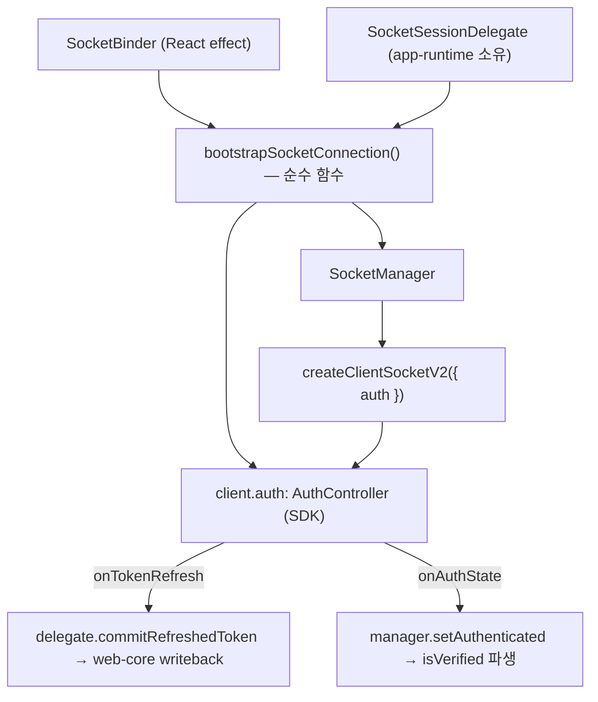

# Client Auth 구현 스펙 — 시나리오 & 아키텍처 (재구현 가이드)

Date: 2026-07-02
Status: 설계 확정 · 구현 대기 (코드는 pre-migration 상태로 롤백됨)

> SDK `@lemoncloud/chatic-sockets-lib`의 `ClientSocketAuth`(`AuthController`, `client.auth`)를 도입해
> app-runtime의 **수동 소켓 인증(`SocketSessionController`)을 걷어내는** 작업의 as-designed 스펙이다.
> 실제 구현을 한 번 완료했다가 롤백했으므로, 이 문서는 그때 확정된 아키텍처 + 시나리오 + **구현 중
> 발견한 함정(배선 불변식)** 을 재구현할 수 있게 담는다.
>
> 계약 배경: [README.md](./README.md)(소유·상태머신) · [usage.md](./usage.md)(사용) · [signing.md](./signing.md)(서명/writeback).
> 단, 이 세 문서는 구현 **이전**에 쓴 Adoption Guide라 §3의 배선 불변식(특히 register 순서·device.save 대기·이중 refresh)을 아직 반영하지 못한다 — **충돌 시 이 문서(implementation.md)가 정정본**이다.
>
> 📌 **다음 스텝**: 이 단일 소켓 채택 위에 relay/cloud **듀얼 소켓** + `switch`/`logout`/로그인 `register`
> 전면 위임 + HTTP 만료 갭 완화를 얹는 총합 설계는 [multi-socket-design.md](./multi-socket-design.md).
> 이 문서(§3 배선 불변식)는 거기서 **계승·확장**된다.

---

## 1. 목표와 소유 경계

**인증 수명주기를 SDK `AuthController`가 소유한다.** 앱은 (1) 로그인 토큰·authId·서명 콜백을 `register`하고,
(2) 인증 상태/토큰을 **구독만** 한다. 만료 기반 refresh · 재연결 재인증 · 백오프 · in-flight 직렬화(epoch) ·
site switch는 전부 SDK가 책임진다. SDK가 소켓 토큰의 SSoT이고, refresh 결과는 web-core 저장소로 **단방향
writeback**된다(HTTP/AWS 서명 경로 동기화).

| 소유                                                | 항목                                                                                          |
| --------------------------------------------------- | --------------------------------------------------------------------------------------------- |
| **SDK `AuthController`**                            | 현재 토큰(SSoT), 인증/재인증/만료 타이밍, 백오프, 요청 직렬화, switch/logout 패킷             |
| **앱(web-core 세션 레이어 → app-runtime delegate)** | 로그인 토큰, `authId`, lemon hmac 서명 콜백, refresh 결과 writeback, 만료 시 teardown         |
| **서버 / 각 앱**                                    | `signature` 계산식(앱), `/oauth/{authId}/refresh` 엔드포인트(서버). SDK는 둘 다 모르고 전달만 |

핵심 제약: **앱은 소켓 토큰 갱신 타이머를 돌리지 않는다.**

---

## 2. 아키텍처 (구성요소)



**추가/변경:**

- `SocketManager.createClient` → `createClientSocketV2({ auth: { refreshRatio: 0.8, maxFailures: 3 } })`.
- `bootstrapSocketConnection({ manager, config, delegate })` — **신규 순수 함수**. `SocketBinder`가 호출.
  bootstrap 시퀀싱 + SDK 구독 배선만 담당(상태 보관 클래스 아님). 반환한 cleanup으로 구독 해제.
- `SocketSessionDelegate` 계약 교체(§6), **app-runtime이 소유**(`connection/useSocketSessionDelegate`).
- `SocketManager`: `markVerified/markUnverified` → `setAuthenticated(bool)`, `isConnected` 필드 제거,
  `setRecoveryHandler`/request-level 401 재시도 제거.
- `useRuntimeBinding`: `binding.socket`을 `identityToken` 존재로 게이트(§3-3).
- `useTokenRefresh`: `skipPeriodicRefresh` 옵션 추가, SDK 소유 앱에서 주기 refresh off(§3-4).

**삭제:**

- `SocketSessionController`(수동 auth 엔진) — bootstrap 로직은 `bootstrapSocketConnection`으로 이관.
- `SocketAuthBinder`(identity token 변경 관측 → `updateAuth('session-switch')`).
- `SocketManager.setRecoveryHandler` + `handle401Recovery` 배선.

---

## 3. 배선 불변식 ⚠️ (구현 중 발견 — 어기면 인증 안 됨)

이 4가지가 이번 작업의 핵심이다. 원래 Adoption Guide엔 없던, 실제 구현에서 겪은 함정.

### 3-1. register는 connect보다 **먼저**

SDK는 client 생성 시 `create-client-socket-v2`가 `auth.start()`를 호출해 **즉시 `active = true`** 로 만든다.
그리고 `register()`는 **이미 active면 토큰만 저장하고 `setState('pending')`/`sendUpdate`를 스킵**한다
(`auth-controller.js` register: `if (!this.active) { ... }`). 실제 `auth.update`는 SDK의
`onState('connected')` 핸들러가 보낸다.

→ 따라서 **토큰을 register한 뒤 connect**해야 connected 이벤트가 등록된 토큰을 실어 보낸다.
**connect 후 register하면** connected가 빈 토큰으로 지나가고(`sendUpdate`는 `if(!_token) return`),
뒤늦은 register는 no-op이라 **`auth.update`가 영영 안 나가고 `isVerified`가 계속 false**다.

```ts
// 올바른 순서
auth.register({ token, authId, sign }); // 토큰 저장 (active라 아직 전송 안 됨)
await manager.connect(); // onState('connected') → SDK가 auth.update 발사
await auth.ready();
```

증상: `RAINE:REGISTER-CALLED`는 뜨는데 `onAuthState`가 한 번도 안 뜸.

### 3-2. `auth.update`가 device 링크를 겸한다 → device.save 대기 불필요

수동 경로는 "device.save ack 관찰 후 auth.update"를 했다(서버가 device 링크 전 거부). 하지만 SDK
`auth.update`(mermaid: "device 링크 + verify-token")가 **device 링크를 겸하므로 별도 device.save ack 대기가
필요 없다.** 서버가 미연결로 거부하면 SDK 백오프가 재시도한다. → bootstrap에서 `waitForDeviceRegistered`
같은 게이트를 두지 말 것(수동 경로의 잔재).

### 3-3. 소켓은 토큰이 있을 때만 부팅 (binding 게이트)

relay `wss`는 정적 env값(`getDynamicRelayWss` → `window.WS_ENDPOINT`)이라 **로그인 전에도 존재**한다.
`useRuntimeBinding`이 `binding.socket`을 `deviceId && endpoint`로만 게이트하면, 신규/게스트 부팅 시
**토큰 준비 전에 소켓이 떠서** bootstrap이 1회 헛돌고(`getAuthRegistration()`=null → register 스킵),
이후 재트리거가 없어(옛 `SocketAuthBinder` 삭제됨) 인증이 영영 안 된다.

→ `binding.socket`을 **`identityToken` 존재까지 게이트**한다:

```ts
socket: deviceId && endpoint && identityToken ? { config: {...} } : null,
```

토큰 refresh는 토큰 값만 바꾸고 존재는 유지 → socket config(url/deviceId/wssType) 불변 → 재부팅 안 함(피드백 루프 없음).
로그인(null→토큰)에 소켓 on, 로그아웃(토큰→null)에 off.

### 3-4. 이중 refresh 금지 (SDK가 유일 refresher)

SDK가 소켓 토큰을 refresh하는데 web-core `useTokenRefresh`(HTTP, 60초 주기)가 **병행 refresh하면 auth
세션이 회전**해, SDK가 register한 `authId`가 서버에서 stale → **`auth.refresh:error "no auth model
@auth.refresh(<authId>)"`**.

→ SDK가 소켓 토큰을 소유하는 앱(apps/web·testbed)에서는 `useTokenRefresh(ready, { skipPeriodicRefresh: true })`로
**주기 setInterval을 끈다**(부팅 초기화·프로필 로딩·만료 로그아웃은 유지). relay HTTP 토큰은 SDK의 소켓
refresh writeback으로 최신 유지된다. `admin`·`desktop-web`(소켓/AuthController 미사용)은 주기 refresh **유지**.

### (부가) `isVerified`는 파생값

`isVerified = authenticated && state === 'connected'`. `onAuthState`로 authenticated 플래그를 미러
(`setAuthenticated`)하고, transport 연결 상태와 AND. 연결이 끊기면 자동으로 false(별도 reset 불필요).
`SocketState.isConnected` 필드는 제거하고 `state === 'connected'`로 파생.

---

## 4. 구현 시나리오 (end-to-end)

### 4-1. 최초 로그인 (신규/게스트)

1. `useTokenRefresh` 부팅 초기화가 relay 게스트 로그인/토큰 확보 → `activeServer.identityToken` 생김.
2. `useRuntimeBinding`이 토큰을 보고 `binding.socket` 생성(그 전엔 null).
3. `SocketBinder` → `bootstrapSocketConnection`: `getAuthRegistration()` → **register → connect** →
   connected에서 SDK `auth.update`(device 링크+verify) → `authenticated`.
4. `onAuthState('authenticated')` → `setAuthenticated(true)` → `isVerified = true`.

### 4-2. 재방문 (저장된 토큰)

토큰이 storage에 있어 `binding.socket` 즉시 생성. 이후 4-1의 3~4와 동일.

### 4-3. 재연결 (WS drop → reconnect)

- drop: `state ≠ connected` → `isVerified` false 파생. SDK는 auth 상태 안 바꿈.
- reconnect: SDK `onState('connected')` → 자동 `auth.update`(register된 토큰 재사용) →
  `pending`→`authenticated` → `isVerified` 다시 true.
- `bootstrapSocketConnection` 재실행 안 됨(같은 소켓). 재인증은 전적으로 SDK.

### 4-4. 만료 선제 refresh

- `expiresIn × refreshRatio(0.8)` 시점에 SDK가 `sign()`(→`signActiveServerAuth`) 후
  `auth.refresh {current,signature,authId}` 자동 발사.
- `:ok` → SDK 토큰 SSoT 갱신 + `onTokenRefresh(view)` → `commitRefreshedToken` writeback.
- 이중 refresh 금지(§3-4).

### 4-5. site 전환 vs cloud 전환

- **같은 소켓 내 site 변경** → `client.auth.switch(uid@sid)` 일회성. 성공분도 `onTokenRefresh` writeback.
  실패는 `AuthSwitchError.phase`('not-connected'|'sign'|'server')로만, 기존 sid 보존.
- **cloud 전환(종류/wss 변경)** → switch 아님. `binding.socket.config`(wss)가 바뀌어 `SocketBinder`가
  **새 소켓으로 재부팅**(register→connect).

### 4-6. 만료 터미널(expired) / 로그아웃

- `maxFailures` 초과 → `expired` → `onAuthExpired` (active-server-aware):
    - **relay = no-op** (relay 세션 유효성은 `useTokenRefresh`가 소유 — 소켓 만료가 전면 로그아웃을 유발하면 안 됨).
    - **cloud = `logoutCloudSession`** (cloud만 정리, relay는 baseline 유지).
- 명시 로그아웃은 web-core 세션 로그아웃(`logoutRelaySession`)이 소켓 destroy까지 정리.

> ⚠️ relay 로그아웃 리스크: `useSessionLogout` = `logoutRelaySession` = relay+cloud 토큰 전부 제거 +
> `/auth/login` 리다이렉트(전면 로그아웃). 그래서 `onAuthExpired`에서 relay는 절대 이걸 부르면 안 된다.

---

## 5. web-core 헬퍼 계약 (active-server-aware)

active server는 `relay` | `cloud` 두 종류(web-core `ActiveServerContext`). 소켓/토큰/서명이 종류별로 다르므로
분기 헬퍼를 web-core에 둔다. **web-core 루트(`src/index.ts`)에서 export** 해야 app-runtime이 쓴다
(주의: 기존 `src/index.ts`는 `./session/services`를 자동 re-export하지 않으므로 **명시 export 필요**).

```ts
// register 초기값: active server 기준 { token, authId } (null이면 register 보류)
getActiveServerAuthRegistration(): Promise<{ token: string; authId: string } | null>;
//   relay: token = activeServer.identityToken, authId = webTransport.getTokenSignature().authId
//   cloud: token = activeServer.identityToken, authId = cloudCore.getCloudToken().Token.authId

// SDK sign 콜백 본문. 서명은 active server 기준, token/target은 서명에 미영향(§signing.md).
signActiveServerAuth(target?): Promise<{ signature: string; current: string }>;
//   relay: webTransport.getTokenSignature() → { signature, current } (lemon-web-core 사전 계산)
//   cloud: calcSignature({ authId, accountId, identityId, identityToken: '' }, current) — Token에서

// SDK refresh/switch 결과를 web-core 저장소로 단방향 writeback (토큰 계층만)
commitSocketRefreshedToken(view): void | Promise<void>;
//   cloud: cloudCore.saveCloudToken({ ...existing, ...view })  (credential은 저장 토큰에서 매번 읽힘)
//   relay: await webTransport.buildCredentialsByToken(view.Token); relayCore.saveRelayToken({ ...existing, ...view })
//   이후 rebuildSessionIdentity(). 프로필/site는 건드리지 않음(프로필=user 캐시, site=switch 개시자 소유).

// cloud 전용 teardown (onAuthExpired용) — cloud만 정리, relay 유지
logoutCloudSession(): void;   // 이미 존재, 루트 export 필요
```

**서명식은 token 문자열 무관**: `calcSignature`의 data = `[current, accountId, identityId, '', userAgent]`,
키는 authId→accountId→identityId 중첩 hmac. identityToken 자리는 항상 `''`. → SDK가 sign 콜백에 주입하는
token은 무시하고 active server 기준으로 계산.

> **authId 정합 주의(§3-4와 연결)**: SDK `auth.refresh`는 register 때 고정된 `this.authId`를 그대로 싣는다.
> 그 authId가 `auth.update`가 만든 소켓 auth 모델의 authId와 일치해야 한다. 이중 refresh로 authId가 회전하면
> "no auth model"이 난다. (relay는 `getTokenSignature().authId`가 세션 내 안정적이라는 전제.)

---

## 6. delegate 계약 (`SocketSessionDelegate`) — app-runtime 소유

```ts
export interface SocketSessionDelegate {
    getAuthRegistration(): Promise<{ token: string; authId: string } | null>;
    signAuth(token: string, target?: string): Promise<{ signature: string; current: string }>;
    commitRefreshedToken(view: AuthTokenView): Promise<void> | void; // AuthTokenView는 SDK 타입
    onAuthExpired?(): Promise<void> | void;
}
```

- 제거: `getSocketToken` / `refreshSocketToken` / `onRefreshFailed`.
- **app-runtime이 소유**: `connection/useSocketSessionDelegate`가 §5 헬퍼에 연결. app-runtime이 이미
  web-core에 의존하므로 앱은 주입하지 않는다 → `RuntimeConnectionHost`에서 `delegate` prop 제거,
  각 앱의 `useSocketDelegate`(apps/web·testbed) 삭제.
- `AuthTokenView`는 sockets-lib 루트에서 export 안 되므로, web-core `commitSocketRefreshedToken`은
  자기 타입(`UserTokenView`)을 받고 delegate 경계에서 `as unknown as UserTokenView` 캐스팅(web-core를
  sockets-lib 의존에서 분리).

---

## 7. 구현 체크리스트 (파일별)

**web-core**

- [ ] `session/services.ts`: `getActiveServerAuthRegistration` / `signActiveServerAuth` / `commitSocketRefreshedToken` 추가.
- [ ] `src/index.ts`: 위 3종 + `logoutCloudSession` **명시 export** (services는 루트 자동 re-export 안 됨).
- [ ] `hooks/app/useTokenRefresh.ts`: `UseTokenRefreshOptions.skipPeriodicRefresh` 추가, 두 곳의 `startInterval()`을 게이트.

**app-runtime**

- [ ] `socket/types.ts`: `SocketSessionDelegate` 교체, `ISocketManager.setAuthenticated`(← mark\*), `SocketRecoveryHandler`/`setRecoveryHandler` 제거, `SocketState.isConnected` 제거.
- [ ] `socket/SocketManager.ts`: `createClientSocketV2({ auth })`, `setAuthenticated` + private `authenticated` + `computeVerified`, 401/recovery 제거, `isConnected` 제거.
- [ ] `socket/bootstrapSocketConnection.ts`: **신규**(register→connect, 구독 배선, cleanup 반환).
- [ ] `socket/SocketSessionController.ts` + `.test.ts`: **삭제**.
- [ ] `socket/runtime.ts`: `sessionController`/`setRecoveryHandler` 제거, `SocketRuntime`에서 제거.
- [ ] `socket/index.ts`: `bootstrapSocketConnection` export.
- [ ] `connection/useSocketSessionDelegate.ts`: **신규**(delegate 구현, onAuthExpired active-server-aware).
- [ ] `connection/SocketBinder.tsx`: delegate prop 수신, `bootstrapSocketConnection` 호출(async cleanup: ref + `active` 플래그 + 언마운트 detach).
- [ ] `connection/SocketAuthBinder.tsx`: **삭제**, `connection/index.ts`에서 제거.
- [ ] `connection/RuntimeConnectionHost.tsx`: `delegate` prop 제거, 내부 `useSocketSessionDelegate` 사용, `SocketAuthBinder` 제거.
- [ ] `connection/SessionBackgroundRunner.tsx`: `useTokenRefresh(ready, { skipPeriodicRefresh: true })`.
- [ ] `runtime/useRuntimeBinding.ts`: `binding.socket`을 `identityToken`까지 게이트.
- [ ] `runtime/RuntimeManager.ts`: 미사용 `bootstrap`(sessionController 참조) 제거.

**apps**

- [ ] `apps/web`·`apps/testbed`: `useSocketDelegate.ts` 삭제, `AppRuntime`/`app.tsx`에서 `delegate` prop 제거, dev `RuntimeOverlay`에서 `isConnected` 행 제거.

---

## 8. 트러블슈팅 (겪은 순서대로)

| 증상                                                           | 원인                                                                           | 대응                                           |
| -------------------------------------------------------------- | ------------------------------------------------------------------------------ | ---------------------------------------------- |
| `isVerified` false, `auth.update` 미발사, `onAuthState` 미발사 | register를 connect **후**에 호출(순서 위반)                                    | register → connect (§3-1)                      |
| 로그인해도 소켓 인증 안 됨(신규/게스트)                        | `binding.socket`이 토큰 전에 떠서 bootstrap 헛돎                               | `identityToken` 게이트 (§3-3)                  |
| `auth.refresh:error "no auth model @auth.refresh(...)"`        | 이중 refresh(`useTokenRefresh` 주기 안 끔)로 authId 회전                       | `skipPeriodicRefresh` (§3-4)                   |
| relay 만료 시 전 세션 날아감                                   | `onAuthExpired`가 전면 로그아웃 호출                                           | relay=no-op, cloud=`logoutCloudSession` (§4-6) |
| 재연결 후 `isVerified`가 false 고착?                           | (오탐) SDK가 재연결 시 `sendUpdate`로 pending→authenticated 재방출 → 정상 복구 | 별도 조치 불필요                               |

---

## 9. 알려진 공백

- **`connectionId` 미배선**: `SocketState.connectionId`는 v2 리팩터링 이후 채워지지 않는다(구 `libs/socket`은
  서버 `connectionId` 메시지로 채웠음). auth와 무관한 별도 배선 대상 — v2 서버의 connection-id 전달 방식
  확인 후 `SocketManager`에 연결 필요.
- **홈 리스트 discovery**: `useBackgroundSync` 제거를 검토했으나, `useHomePlaces`/`useHomeChannels`가 이
  훅의 전역 fetch에 의존(관측-only)한다. 제거 시 뷰-진입 fetch 대체가 필요(auth와 무관, 별도 판단).

---

## 관련 문서

- [multi-socket-design.md](./multi-socket-design.md) — **다음 스텝** 총합 설계(듀얼 소켓 + switch/logout/register 전면 위임)
- [README.md](./README.md) — 소유 경계·공개 표면·상태 머신
- [usage.md](./usage.md) — 사용 패턴·시나리오·트러블슈팅
- [signing.md](./signing.md) — relay/cloud 서명·writeback 계약
- [../architecture.md](../architecture.md) — app-runtime 소유 규칙(manager 2축 + SDK 인증)
- [../socket/README.md](../socket/README.md) — socket 계층 배선
