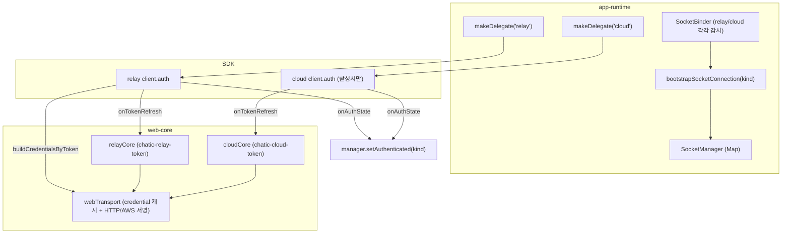

# 멀티소켓 세션 + client.auth 전면 위임 — 총합 설계 (다음 스텝)

Date: 2026-07-09 (재작성)
Status: 설계 확정 · 구현 대기

> 이전 스텝([implementation.md](./implementation.md): SDK `AuthController` **단일 소켓** 채택 —
> register/refresh/state 위임)을 **기반(Phase 0)** 으로, 다음 스텝을 설계한다:
> (1) relay/cloud **듀얼 소켓** 동시 운영, (2) 로그인 `register` · 사이트전환 `switch` · 로그아웃
> `logout` 을 **client.auth로 전면 위임**.
>
> - implementation.md의 단일 소켓 **배선 불변식(§3)** 은 그대로 유효하며 여기서 계승·확장한다.
> - 계약 배경: [README.md](./README.md)(소유·상태머신) · [usage.md](./usage.md)(사용) · [signing.md](./signing.md)(서명/writeback).
> - **충돌 시 우선순위**: 이 문서(다음 스텝 총합) > implementation.md(이전 스텝) > README/usage/signing(도입 가이드).

---

## 0. 이 재작성의 근거 (검증 3종)

이 문서는 세 갈래 코드 검증을 반영한 정정본이다. 이전 버전(2026-07-02)의 §4 상태표가 롤백된 코드와 어긋났고, 내부 모순 몇 건과 문서에 없던 하드 사실이 있었다.

| 검증                | 대상                                                                                   | 핵심 결론                                                                                                                                                |
| ------------------- | -------------------------------------------------------------------------------------- | -------------------------------------------------------------------------------------------------------------------------------------------------------- |
| SDK 스펙 분석       | `chatic-sockets-api/docs/specs/client-auth-layer/*` (00~04)                            | 앱=register+구독만, SDK=토큰 SSoT·refresh·epoch·백오프→expired. 서버 4패킷 forward. 04-review에서 "expired→register 후 재연결 차단" 크리티컬 버그 수정됨 |
| SDK 0.4.5 dist 대조 | `node_modules/@lemoncloud/chatic-sockets-lib/dist` + `chatic-sockets-api/src/lib/auth` | 프론트 문서 주장 16건 중 13 확인·2 부분·**신규 하드 사실 4건**(§6 신규 불변식으로 승격)                                                                  |
| 토큰 주체 분석      | web-core session/hooks/transport + app-runtime socket + apps                           | 발급 5경로·refresh 3(+1)개·소비 3경로가 **원천이 다름** → §3-1 비대칭 writeback이 **필요·충분함**이 코드로 확정, HTTP 토큰 소싱 결정(§6-8) 근거 확보     |

> SDK **단일 인스턴스** 스펙은 있으나 **듀얼 인스턴스(relay+cloud 동시)** 스펙 보장은 없다. 듀얼 소켓은 `createClientSocketV2`가 **모듈 전역 상태 0인 순수 팩토리**라는 구현 속성에 기댄다(dist 확인). 회귀 방지를 위해 SDK 팀에 스펙 수준 보장을 요청할 가치가 있다(§11).

---

## 1. 이전 스텝 vs 이번 스텝

|                  | Phase 0 — 이전 스텝 (implementation.md)    | Phase 1·2 — 이번 스텝 (이 문서)                                    |
| ---------------- | ------------------------------------------ | ------------------------------------------------------------------ |
| 소켓             | **단일** (activeServer 종류 바뀌면 재생성) | **듀얼** (relay 상시 + cloud 활성시)                               |
| register         | SocketBinder config-diff **부수효과**      | fresh client=bootstrap 소유 + **재로그인=`logout→register`**(§6-7) |
| 토큰 refresh     | SDK 소유 + writeback                       | 유지 + **per-socket 라우팅**(§6-6)                                 |
| 사이트 전환      | web-core HTTP 재발급                       | **`auth.switch`**                                                  |
| 로그아웃         | web-core 저장소 정리만                     | **`auth.logout` + web-core HTTP logout 병행**(§6-11)               |
| HTTP 토큰 신선도 | writeback 의존                             | **writeback 유지** (§6-8: SDK token 직접 소비 불가)                |
| web-core 헬퍼    | active-server-aware (활성 1개)             | **per-server(kind) 분기**                                          |

---

## 2. 요구사항

**[전제]**

1. 모든 소켓 인증 기능은 `ClientSocketAuth`(SDK AuthController)에게 위임한다.
2. web-core에서 소켓 토큰 리프레시 관리를 하지 않고 client.auth에게 위임한다.
3. **이번 설계 대상은 apps/web(+참조 구현 testbed)뿐.** `admin`·`desktop-web`은 대상 외이며 이미 pre-migration 레거시다(§2-4).
4. 변경 과정에서 apps/web 기준으로 불필요해진 코드는 제거한다.

**[멀티소켓 세션 관리]**

1. 소켓 세션을 두 개 띄운다 (중계서버(relay) 소켓 / 클라우드(cloud) 소켓).
2. 클라우드 소켓은 클라우드 활성화 시에만 띄워진다.
3. 클라우드 세션을 로그아웃하면 중계서버 세션만 유지된다.
4. 중계서버 소켓을 로그아웃하면 모든 세션이 종료되고 저장소를 클리어한다 (그 사이 게스트 로그인 및 `register` 자동 수행).
5. 클라우드 소켓은 1개만 띄운다. 클라우드 전환 시 소켓 세션은 `auth.logout → register` 과정을 거친다(단 wss 동일 시에만, §6-9).

**[동작별]**

1. 로그인 시(게스트/소셜/클라우드접속 모든 케이스) 해당 kind 소켓에 `register({token,authId,sign}) → ready()`. 서명은 web-core 제공, 생성 토큰은 web-core에 저장.
2. 사이트 전환 시 `auth.switch` 사용 (결과 writeback).
3. 로그아웃 시 `auth.logout` **+ web-core HTTP logout 병행** (§6-11).
4. `onTokenRefresh` 리스너 → web-core writeback (HTTP/AWS 서명용).
5. `onAuthState` 로 상태 추적.

---

## 3. 확정 설계 결정

### 3-0. 왜 멀티소켓인가 (동기) — 주체 분석으로 입증됨

**동기 (핵심)**: cloud 접속 중에도 **relay backend HTTP API를 호출하는 케이스가 있다.** 이번 스텝에서
소켓 토큰 갱신을 `ClientSocketAuth`가 **소켓별로** 소유한다(전제-2). 따라서:

- cloud 소켓만 떠 있으면 cloud 토큰만 갱신됨 → **relay 토큰/credential이 stale** → relay HTTP 실패.
- relay 소켓도 **동시에** 떠 있어야 relay 토큰이 유지된다.

**주체 분석이 이 동기를 코드로 입증**: relay signed HTTP는 요청 시점에 **lemon-web-core의 in-memory AWS credential 캐시(`AWS.config.credentials`)와 `@{project}.identity_token` storage로 서명**하며, **relayCore 토큰을 아예 읽지 않는다**(webTransport / request.ts PATH B). 이 캐시를 갱신하는 유일 수단이 `buildCredentialsByToken`이다. 옛 모델은 web-core `useTokenRefresh`가 relay+cloud HTTP refresh를 동시에 돌려 이 캐시를 살렸으나, **refresh를 소켓에 위임한 순간 소켓도 서버 수만큼 필요**해졌다.

⇒ **두 소켓 동시 운영 = 두 서버의 토큰/credential을 각자의 `ClientSocketAuth` writeback으로 살려두기 위함.** cloud 활성 중 relay 소켓의 임무는 sync가 아니라 **relay 토큰을 살려 relay HTTP를 가능하게 하는 것**(§5-5).

**설계 가정**:

- **소켓은 항상 연결됨** — 단절 중 만료 갭은 가정상 없음. `onTokenRefresh` writeback이 항상 최신이라 web-core store(HTTP용)도 항상 fresh. → 별도 만료 갭 완화 장치 불필요.
- **admin / desktop-web은 고려 대상 아님**(§2-4).

### 3-1. web-core ↔ SDK 소유 규칙

**근본 전제: SDK `ClientSocketAuth`는 소켓(WebSocket) 전용이다.** HTTP/REST 호출·토큰 발급(login)·AWS
서명·프로필/identity 파생은 SDK가 **못 한다.** 따라서 web-core는 없앨 수 없고, 역할이 **좁혀진다** —
"세션 관리자"에서 "HTTP 레이어 + 토큰 발급·저장소·서명 제공자 + 전역 상태"로.

**A. SDK가 소유 — 소켓 세션 엔진 (소켓별로 1벌씩)**

| 항목                                          | 비고                                                   |
| --------------------------------------------- | ------------------------------------------------------ |
| 소켓별 **현재 토큰 SSoT**                     | register된 토큰 보관                                   |
| 인증·재인증·만료 **타이밍**                   | `expiresIn × refreshRatio` 선제 refresh, 재연결 재인증 |
| 백오프 · in-flight 직렬화(epoch)              | 실패 복구·중복 방지                                    |
| `register`·`ready`·`switch`·`logout` **패킷** | 소켓 위 인증 프로토콜                                  |

**B. web-core가 소유 — 소비자/제공자 (5 기둥)**

| #   | 기둥                                                       | 핵심 코드                                                                           |
| --- | ---------------------------------------------------------- | ----------------------------------------------------------------------------------- |
| 1   | **HTTP/REST 레이어** (relay+cloud 모든 API 호출)           | `webTransport`, `executeSignedRelayRequest`, `executeCloudRequest`, `withRetry`     |
| 2   | **토큰 발급(login) + 영속 저장소**                         | `relayCore`(chatic-relay-token) · `cloudCore`(chatic-cloud-token), 로그인 5경로(§4) |
| 3   | **서명 제공** (SDK sign 콜백이 위임)                       | `getTokenSignature`(relay) · `calcSignature`(cloud) · AWS `buildCredentialsByToken` |
| 4   | **전역 identity/상태** (UI가 읽는 "나는 누구/무엇이 활성") | `rebuildSessionIdentity`, `getActiveServerContext`, uid/isAuthenticated/profile     |
| 5   | **선택 상태** (토큰과 별개)                                | `selectedCloudId` · `selectedSiteId` · `delegatorId`                                |

**C. web-core가 잃은 것 (→ SDK로 이관)**: 소켓 토큰의 주기 refresh, 재연결 재인증, 백오프, switch/logout 패킷 발사.
즉 **"소켓 토큰을 굴리는 일"** 만 SDK로 갔고, **"만들고·보관·서명·HTTP·상태"** 는 web-core에 남는다.

**D. 두 SSoT의 관계 (단방향 writeback) — 비대칭이 핵심**

```
로그인(발급)      : web-core (HTTP)  ──register(token,authId,sign)──▶  SDK
소켓 토큰 수명주기 : SDK (소켓쪽 SSoT) ──onTokenRefresh(view)──▶  web-core store (relay/cloud)   ※ per-socket kind 라우팅(§6-6)
HTTP 요청 시 토큰  : web-core를 읽음 (SDK가 써준 최신값 — 소켓 상시 연결이라 항상 fresh)
```

**writeback 비대칭 (주체 분석 확정 — §6-6/§7의 근거)**:

- **relay writeback = 이중 쓰기**: `buildCredentialsByToken(view.Token)`(lemon-web-core credential 캐시 + `@{project}.*` 재기록) **그다음** `relayCore.saveRelayToken(view)`. relay HTTP는 credential 캐시로 서명하므로 첫 쓰기가 없으면 서명이 stale.
- **cloud writeback = 단일 쓰기**: `cloudCore.saveCloudToken(merge)`. cloud HTTP는 **요청마다 cloudCore를 라이브로 읽어** 서명하므로 credential 캐시 재구축 불필요.

**E. 불변식 (하드 규칙)**

1. **web-core는 소켓 토큰을 refresh하지 않는다** — SDK가 유일 refresher. (이중 회전 = `no auth model @auth.refresh`, [implementation.md §3-4](./implementation.md))
2. **SDK는 HTTP를 하지 않는다** — 데이터 API·토큰 발급·프로필은 web-core.
3. **refresh writeback은 소켓 kind로 라우팅** — 전역 active 아님(§6-6).
4. **앱의 능동 동작은 register(로그인) + switch(사이트전환) + logout뿐** — 그 외 토큰 수명은 SDK가 자동.

### 3-2. 확정된 결정

1. **듀얼 소켓 sync** → **활성 소켓 1개만 sync**, relay는 auth-only 상시 소켓(relay HTTP 토큰 유지 겸용). (§5-5, §8-a)
2. **순서** → **단계적**: Phase 0 재구현(선행) → 배선(Phase 1) → 듀얼 소켓(Phase 2).
3. **HTTP 토큰 소싱** → **writeback 경유 store-only**(§6-8). SDK `auth.token` 직접 소비는 relay credential 구조상 불가.
4. **로그아웃** → `auth.logout`(소켓)과 web-core HTTP logout **병행**. SDK logout은 미연결 시 서버 통지를 건너뛰므로 backend revoke를 보장하지 못함(§6-11).

### 3-3. 관통 원칙

- **apps/web(+testbed) 단독 대상** — admin/desktop-web 고려 안 함(§2-4). web-core refresh 함수군·시그니처는 두 앱을 위해 **존치**하되, apps/web에서 사용을 끊는다.
- **소켓 변경은 `libs/app-runtime` 내부, web-core는 per-server 헬퍼로 정리**(추가만, 기존 존치).
- **소켓 상시 연결 가정** — 만료 갭 완화 장치·주입식 토큰 소싱 불필요(§3-0).

### 3-4. apps 범위 (전제-3 정정)

이전 문서의 "두 앱 코드 불변(전제-3)"과 "표면 보존 제약 없음(§2-0)"이 서로 모순이었다. 주체 분석으로 실제 상태가 밝혀졌다:

- `admin`·`desktop-web`은 현재 web-core가 export하지 않는 `useWebCoreStore`를 import한다([apps/admin/app.tsx:12](../../../../apps/admin/src/app/app.tsx), [apps/desktop-web/app.tsx:9](../../../../apps/desktop-web/src/app/app.tsx)) — **이미 현 web-core 기준으로 깨진 pre-migration 레거시**다. 자체 zustand 스토어에 auth를 쓰고 `useTokenRefresh` 게이트와 두 갈래 SSoT를 가진다.
- 따라서 이 설계는 **두 앱을 건드리지도, 보존 제약을 두지도 않는다.** web-core `useTokenRefresh`의 **주기 경로와 `refresh*` 함수군은 두 앱을 위해 존치**(제거하면 이미 깨진 앱이 더 깨짐 — 무의미). apps/web·testbed에서만 `skipPeriodicRefresh:true`로 사용을 끊는다.
- 결론: **A-2 = "apps/web만 변경, admin/desktop-web은 그대로"** (사용자 확정).

---

## 4. 현재 상태 (코드 근거, 수렴 판정) ⚠️ 재판정

🟢 구현됨 · 🟡 부분 · 🔴 미구현

> **중대 정정**: 이 브랜치의 working tree는 **pre-migration 상태**다. Phase 0(단일 소켓 SDK 채택)를 **한 번 구현했다가 롤백**했으므로(implementation.md 헤더), 현재 소스에 `bootstrapSocketConnection`/`skipPeriodicRefresh`/per-server 헬퍼가 **없다**(dist에만 잔재). 따라서 **Phase 0 재구현이 명시적 선행 단계**다. 아래 상태는 소스 기준이다.

| 요구사항                                | 상태 | 근거 (소스 기준)                                                                                                                                                    |
| --------------------------------------- | ---- | ------------------------------------------------------------------------------------------------------------------------------------------------------------------- |
| **Phase 0 (단일 소켓 SDK 채택)**        | 🔴   | 롤백됨. `SocketSessionController` 수동 엔진 존치([SocketManager.ts:44](../../src/socket/SocketManager.ts) 단일 `client`), `createClientSocketV2`에 `auth` 옵션 없음 |
| 전제-1 (전면 위임)                      | 🔴   | switch/logout/register 위임 0건. 수동 `updateAuth`/`handle401Recovery` 경로가 살아 있음                                                                             |
| 전제-2 (web-core refresh 안 함)         | 🔴   | apps/web도 `useTokenRefresh` 60초 주기가 relay/cloud 토큰을 실제 회전(`skipPeriodicRefresh` 미존재)                                                                 |
| 전제-3/2-4 (apps 범위)                  | 🟢   | admin/desktop-web은 자연 격리(이미 레거시). apps/web·testbed만 대상                                                                                                 |
| 멀티소켓-1 (2소켓)                      | 🔴   | `SocketManager` 단일 `client`([SocketManager.ts:44](../../src/socket/SocketManager.ts))                                                                             |
| 멀티소켓-2 (cloud 활성시만)             | 🔴   | cloud 활성은 activeServer 전환에만 연결([contextStore.ts:38](../../../web-core/src/session/contextStore.ts) 파생)                                                   |
| 멀티소켓-3 (cloud 로그아웃→relay 유지)  | 🟡   | `logoutCloudSession` 저장소 시맨틱 정확([services.ts:290](../../../web-core/src/session/services.ts)). 소켓 auth.logout만 신규                                      |
| 멀티소켓-4 (relay 로그아웃=전체)        | 🟡   | `logoutRelaySession` 종료+클리어+게스트 배선됨([services.ts:229](../../../web-core/src/session/services.ts)). 소켓 `register` 자동만 공백                           |
| 멀티소켓-5 (cloud 전환 logout→register) | 🟡   | **SDK 재개 지원 확정**(logout→register resume, dist 확인). cloud별 wss 상이 시 재사용 불가(§6-9)                                                                    |
| 동작-1 (로그인 register+ready)          | 🔴   | 수동 `updateAuth` 경로. register 미배선                                                                                                                             |
| 동작-2 (사이트전환 switch)              | 🔴   | HTTP `switchSiteSession`→`commitSiteSwitch`([services.ts:395,419](../../../web-core/src/session/services.ts)). optimistic sid 선반영+롤백은 **이미 구현됨**         |
| 동작-3 (로그아웃 logout)                | 🔴   | web-core HTTP 정리만([services.ts:229](../../../web-core/src/session/services.ts))                                                                                  |
| 동작-4 (onTokenRefresh→web-core)        | 🔴   | 미배선(Phase 0 롤백). 재구현 시 라우팅을 처음부터 per-socket로(§6-6)                                                                                                |
| 동작-5 (onAuthState 추적)               | 🔴   | 미배선. 수동 `markVerified`/`isVerified`가 현 경로([SocketManager.ts:30](../../src/socket/SocketManager.ts))                                                        |

**SDK 실현 가능성(확정, dist 소스 확인)**: `createClientSocketV2`는 모듈 전역 상태 없는 순수 팩토리라
**독립 client 2개 동시 생성 지원**. `logout()`은 client 파괴 없이 `active=false`만, `register()`는 `!active`일 때
resume("resumes auth when inactive after logout or expiry", auth-controller.d.ts:87) → **멀티소켓-5 재개 사이클 지원**.
단일 소켓 제약은 100% 앱 레이어(`getSocketManager` 싱글턴 + `SocketManager` 단일 client) 문제.

**로그인·refresh 주체 매트릭스 (as-is, 주체 분석)**:

- 발급 5경로: `loginRelayGuestByDevice`(keepAlive 자동, apps/web) · `loginRelayUser`/`loginRelaySocial`(UI) · OAuth 코드(2단계: SDK 캐시→후속 refresh가 relayCore hydrate) · 초대(`registerUserWithInviteCode`+`useInviteFlow`, store 안 씀→`switchCloudSession` 합류) · cloud(`switchCloudSession`).
- refresh 3(+1)개: web-core `useTokenRefresh` 60초 루프(relay 항상+cloud 조건부) · 소켓 401 복구(relay는 복구 불능) · 사이트 전환 · **lemon-web-core 내부 자동 refresh**(§6-12 신규 발견).
- 소비 3경로: relay signed(credential 캐시+identity storage, relayCore 안 읽음) · cloud(cloudCore 라이브) · 소켓 auth.update(`getActiveServerIdentityToken`).

---

## 5. 목표 아키텍처 (듀얼 소켓)



핵심: Phase 0의 단일 delegate/manager/client를 **kind별로 복제**한다. 각 소켓은 자기 서버 기준으로
register/sign/writeback/expire를 독립 수행하고, web-core의 분리된 저장소(relayCore/cloudCore)에 각각 반영한다.
**relay writeback만 `buildCredentialsByToken`으로 credential 캐시도 갱신**(§3-1 D 비대칭).

### 5-1. SocketManager 듀얼화

단일 `client: ClientSocketV2 | null`([SocketManager.ts:44](../../src/socket/SocketManager.ts)) → `Map<'relay'|'cloud', ClientEntry>`. `getSocketManager()` 싱글턴
인터페이스는 유지하되 `ensure/connect/request/send/onType/setAuthenticated/subscribe`에 `kind` 인자 추가.
relay 슬롯은 상시, cloud 슬롯은 config 있을 때만. `isSameConfig`의 `wssType` 축은 슬롯 키로 승격.

> 대안(매니저 2 인스턴스) 대비 이유: SyncManager/RuntimeConnectionHost/DataBinder 등 소비처가 매니저 선택
> 로직을 갖지 않도록 **슬롯 방식이 소비처 변경 최소**. SDK가 인스턴스 완전 격리를 보장하므로 안전(§6-14).
>
> ⚠️ **타이머 스케줄러 공유 금지(§6-13)**: 두 client에 같은 `timerScheduler`를 주입하면 안 된다. 현재 [SocketManager.ts:395](../../src/socket/SocketManager.ts)의 `createClientSocketV2`는 스케줄러를 주입하지 않으므로(각 client가 자기 것 소유) 그대로 두면 안전.

### 5-2. RuntimeBinding 듀얼 config

`socket: { config } | null` → `socket: { relay?: {config}, cloud?: {config} }`. relay config는 relay 토큰
존재 시 항상, cloud config는 `cloud.isActive`([contextStore.ts:38](../../../web-core/src/session/contextStore.ts): `cloudId!=='default' && backend && wss && identityToken`)일 때만 산출. `context(cid/sid/uid)`는
**UI 표시용 단일 축으로 유지**(활성 서버 개념 존치) — 소켓만 2개로 분기.

### 5-3. SocketBinder + delegate per-server

SocketBinder가 `binding.socket.relay`와 `binding.socket.cloud`를 **각각 JSON.stringify 감시**하여 독립적으로
`bootstrapSocketConnection(kind)` 실행. delegate를 `makeDelegate(kind)` 팩토리로 바꿔 kind를 클로저로 보유.

### 5-4. web-core per-server 헬퍼 (§7)

active-server 단일 기준 헬퍼를 kind 파라미터 버전으로 **신규 추가**(기존 존치).

### 5-5. sync = 활성 소켓 1개 (relay는 토큰 keep-alive)

`SyncManager`는 활성 소켓의 runtime만 유지. cloud 활성 시 relay 소켓은 **sync는 안 하지만 auth는 유지**하여
relay 토큰을 살려둔다(§3-0). `DataContext(cid/sid/uid)`와 `rebuildSessionIdentity`는 단일 활성 축 유지.
`isVerified`는 relay master + cloud 별도 셀렉터(§8-a).

---

## 6. 배선 불변식 ⚠️ (계승 + 신규)

### 계승 (implementation.md §3 — 소켓별로 동일 적용)

- **6-1. register → connect 순서** — SDK 0.4.5 dist로 재확인: client는 생성 시 `auth.start()`로 즉시 `active=true`(create-client-socket-v2.js:288-292). active 상태의 `register()`는 **필드 저장만** 하고 `auth.update`는 `onState('connected')` 핸들러가 발사(auth-controller.js:38-51,330-336). **connect 후 register하면** connected가 빈 토큰으로 지나가(`sendUpdate` 토큰 없으면 early-return, :163-164) **인증이 안 나간다**. 소켓 2개 각각 register→connect.
- **6-2. device.save 대기 불필요** — `auth.update`가 device 링크를 겸함.
- **6-3. `identityToken` 게이트** — relay는 relay 토큰, cloud는 cloud 토큰 존재로 게이트.
- **6-4. 이중 refresh 금지** — SDK가 유일 refresher (apps/web `skipPeriodicRefresh:true`).
- **6-5. `isVerified` 파생** — `authenticated && state==='connected'`. 소켓별 authenticated. (SDK는 `disconnected`를 **방출하지 않음** — §6-15)

### 신규 (이번 스텝 하드 규칙)

- **6-6. writeback per-socket 라우팅** ⚠️ **듀얼 하드 블로커** — writeback을 전역 `getActiveServerContext()`로 relay/cloud 분기하면, relay refresh가 cloud 활성 중 도착 시 cloud로 오저장 → relay credential stale. **delegate 클로저 kind로 라우팅**(SDK `AuthTokenView.cloudId`는 relay 토큰에도 실릴 수 있어 신뢰 불가 — dist 확인). relay writeback은 `buildCredentialsByToken`으로 credential 캐시 갱신 필수(§3-1 D 비대칭). **이 교정 전에는 듀얼 소켓 활성화 금지.**

- **6-7. register 소유권 이관 (하이브리드 확정)** — SDK 검증으로 메커니즘 확정: **active+connected 상태의 재register는 토큰만 조용히 교체하고 `auth.update`를 재발사하지 않는다**(auth-controller.js:38-51). 따라서:
    - **fresh client(신규 소켓)**: register는 `bootstrapSocketConnection`이 소유(6-1 순서 보장). 로그인 흐름은 web-core에 토큰을 저장해 `binding.socket`을 생성하고(config-diff가 소켓 부팅 트리거), bootstrap이 register→connect. → **로그인 흐름은 별도 register 트리거를 갖지 않는다** → 이중 트리거 레이스 원천 차단.
    - **재로그인/토큰 교체(게스트→소셜 승격 등, 같은 소켓)**: bare register는 조용한 교체라 옛 신원으로 인증 유지 → **`auth.logout() → register()`**(SDK resume 경로)로 즉시 재인증. 이 경로만 앱이 명시 호출.
    - **cloud 동일-wss 전환**: 같은 cloud 소켓에 `auth.logout → register`(§6-9, §8-4).

- **6-8. HTTP 만료 갭 = writeback으로 해소, SDK token 직접 소비 불가 (확정)** — 이전 §8-7의 "SDK `auth.token` 우선 소비 + 403 재시도"는 **실행 불가능하므로 폐기**. 주체 분석: relay signed HTTP는 토큰 "문자열"이 아니라 **AWS credential 번들**을 소비하며 `client.auth.token`(identityToken 문자열)으로 대체 불가. cloud HTTP는 cloudCore 라이브 읽기. ⇒ **HTTP는 종전처럼 web-core store/캐시를 읽고, 신선도는 `onTokenRefresh` writeback이 보장**(소켓 상시 연결 가정). 별도 완화 장치 불필요.

- **6-9. cloud 전환 wss 동일성** — 멀티소켓-5 "같은 cloud 소켓 재사용"은 `cloudCore.getWss=delegationToken.wss`가 같을 때만 성립. A→B에서 wss가 다르면 `auth.logout→register` 대신 **cloud 슬롯 destroy+recreate 폴백**.

- **6-10. relay expired 정책** — relay 소켓 SDK `expired`는 **재부팅/재register 우선**(전면 로그아웃 승격 금지). 하드 만료(`useTokenRefresh` classifyError `shouldLogout`)만 `logoutRelaySession` 트리거. (Phase 0 §4-6 계승: relay=no-op 기조)

- **6-11. 로그아웃 = auth.logout + HTTP logout 병행 (신규)** — SDK 검증: `logout()`은 **연결 중일 때만** best-effort로 `auth.logout`을 보내고, **미연결이면 서버 통지를 건너뛴다**(auth-controller.js:129-131) → backend 세션 revoke 미보장. 따라서 **web-core HTTP logout(`/users/logout`)을 backend revoke의 최종 소유자로 유지**한다. 순서: 소켓 `auth.logout`(best-effort) → web-core `logoutRelaySession`/`logoutCloudSession`(HTTP revoke + store clear) → 소켓 슬롯 teardown.

- **6-12. lemon-web-core 내부 자동 refresh 인지 (신규 발견)** — 주체 분석: lemon-web-core는 `expired_time`(credential Expiration 또는 JWT exp−5분, **부재 시 now+15분**) 경과 시 `init()/isAuthenticated()/getCredentials()`에서 **자체적으로** refresh하고 자기 storage만 갱신한다(relayCore 미갱신, `skipPeriodicRefresh`로 꺼지지 않음). SDK 소켓 refresh(`buildCredentialsByToken`이 `expired_time` 재기록)가 **항상 앞서** 갱신하면 무해하나, **prod refresh 응답에 `expiresIn`/credential Expiration이 없으면** lemon-web-core가 15분마다 자체 회전 → SDK와 이중 회전 위험(`no auth model` 재발). → §11 구현 전 검증 필수 항목.

- **6-13. timerScheduler 공유 금지 (신규)** — SDK auth 타이머 키가 고정 문자열(`auth:refresh`/`auth:reauth`/`auth:validating`)이라, 두 client에 같은 `timerScheduler`를 주입하면 서로의 타이머를 덮어쓴다(dist 확인). **relay/cloud client에 스케줄러를 주입하지 않는다**(각자 소유). 현 `createClientSocketV2` 호출은 미주입이라 안전.

- **6-14. 듀얼 인스턴스 독립성 (신규)** — `createClientSocketV2`는 모듈 전역 상태 0(순수 팩토리, dist grep 확인). transport·타이머·auth 전부 인스턴스 단위 → relay+cloud 완전 독립. 단 §6-13 스케줄러 공유만 회피.

- **6-15. `disconnected`는 관측되지 않음 (신규)** — SDK `AuthControllerState`에 `disconnected`가 타입엔 있으나 **컨트롤러가 절대 방출하지 않는다**(dist 확인: 서버 `disconnected` 응답은 `failed`로 표면화, 소켓 close 시 상태는 마지막 값 유지). → `onAuthState`에서 `disconnected`를 기대하는 매핑을 두지 말 것. `isVerified`는 transport `state==='connected'`와 AND로 파생(§6-5).

### 서버 배선 (확인됨, dist + chatic-sockets-api 소스)

chatic-sockets-api는 `auth.update`/`auth.refresh`/`auth.switch`/`auth.logout` 4개를 모두 use-case로 등록·forward한다([src/lib/auth/index.ts:14-17](../../../../../chatic-sockets-api/src/lib/auth/index.ts), api-sockets.ts:69 registerSocketModule). refresh/switch는 backend `POST /oauth/{authId}/refresh`, logout은 `POST /users/0/logout`로 forward. switch 실패는 saveAuth 전에 throw→`:error`라 **기존 sid 보존**. refresh/switch는 device 재링크 생략. ⇒ SDK refresh가 미배선으로 새는 경로 없음.

> ⚠️ **서버 auth 모델은 device 단위 키**(`device:${md5(deviceId)}`). 같은 sockets 서버에 같은 deviceId로 붙은 두 연결은 auth 모델을 공유하므로 한쪽 `auth.logout`이 다른 쪽도 `disconnected`로 만든다. relay/cloud는 **서로 다른 서버**라 듀얼 소켓은 안전하지만, 같은 서버에 2연결을 두면 안 된다.

---

## 7. web-core 헬퍼 계약 (active-server → per-server, 추가만)

기존 active-server 헬퍼(Phase 0 §5)는 **존치**(admin/desktop-web·주기 루프 사용). 아래를 **신규 추가**:

```ts
// register 시드: 명시적 kind 기준 { token, authId }
getServerAuthRegistration(kind: 'relay' | 'cloud'): Promise<{ token: string; authId: string } | null>;
//   relay: token=relayCore.getIdentityToken(), authId=webTransport.getTokenSignature().authId
//   cloud: token=cloudCore.getIdentityToken(),  authId=cloudCore.getCloudToken().Token.authId

// SDK sign 콜백 본문: 명시적 kind 기준 (서명식은 token 문자열 무관 — signing.md)
signServerAuth(kind: 'relay' | 'cloud', target?: string): Promise<{ signature: string; current: string }>;

// SDK refresh/switch 결과를 kind 저장소로 단방향 writeback (per-socket 라우팅, §6-6)
commitServerRefreshedToken(kind: 'relay' | 'cloud', view): void | Promise<void>;
//   cloud: cloudCore.saveCloudToken({ ...existing, ...view })  (단일 쓰기 — cloud HTTP는 라이브 읽기)
//   relay: await webTransport.buildCredentialsByToken(view.Token); relayCore.saveRelayToken({ ...existing, ...view })  (이중 쓰기 — credential 캐시 필수)
//   이후 rebuildSessionIdentity().
```

relay/cloud 저장소가 이미 물리 분리(`chatic-relay-token` / `chatic-cloud-token`)돼 있어 분기는 각 core를
직접 호출하면 된다. **web-core 루트(`src/index.ts`) 명시 export** 필요(services는 자동 re-export 안 됨).

---

## 8. 시나리오 (end-to-end, 듀얼)

- **8-1. 로그인 5경로** — 로그인 함수가 토큰을 web-core에 저장한 직후, 해당 kind 소켓이 부팅되며 bootstrap이 `register({token,authId,sign}) → ready()`(fresh client는 bootstrap 소유, §6-7). `getServerAuthRegistration(kind)` 반환형이 `AuthRegisterOptions`와 동형. OAuth 코드 로그인의 SDK-캐시-우선 2단계·초대의 store-미기록 경로는 web-core 존치.
- **8-2. 사이트 전환** — 활성 서버 소켓에 `auth.switch(`${uid}@${sid}`)`. 성공분은 `onTokenRefresh` → `commitServerRefreshedToken`. **optimistic sid 선반영+롤백은 web-core `switchSiteSession`에 이미 구현됨**([services.ts:395](../../../web-core/src/session/services.ts)) — 존치. `AuthSwitchError.phase` 실패 시 롤백. **미연결이면 `ready()`로 잠시 대기 후 switch**(HTTP 재발급 폴백은 제거 — 소켓 상시 연결 가정, §6-8). `commitSiteSwitch` HTTP 분기 제거.
- **8-3. cloud 접속 (default→cloud)** — cloud 토큰 발급([switchCloudSession](../../../web-core/src/session/services.ts:326) 유지, cid optimistic 선반영+롤백 존치) → cloud config 생성 → cloud 소켓 신규 부팅(bootstrap register). relay 소켓은 그대로.
- **8-4. cloud 전환 (cloud→cloud, 멀티소켓-5)** — 새 cloud 토큰 발급 후, **wss 동일하면** 기존 cloud 소켓 `auth.logout → register`(resume), **wss 다르면** cloud 슬롯 재생성 (§6-9).
- **8-5. cloud 로그아웃 (멀티소켓-3)** — cloud 소켓 `auth.logout` + cloud 슬롯 teardown. `logoutCloudSession`이 cloudCore만 정리, **relay 소켓·세션 유지**.
- **8-6. relay 로그아웃 (멀티소켓-4)** — relay+cloud 두 소켓 `auth.logout` + web-core `logoutRelaySession`(HTTP revoke + 저장소 클리어, [services.ts:229](../../../web-core/src/session/services.ts)) + teardown → keepAlive 게스트 재로그인 → relay 소켓 재부팅 시 bootstrap register 자동. (리다이렉트 UX 존치)
- **8-7. HTTP 요청** — auth 헤더/서명은 **web-core store/credential 캐시**를 읽는다(§6-8). `onTokenRefresh` writeback이 최신 유지. 403이 나면 하드 만료로 간주(classifyError) → 로그아웃. SDK token 직접 소비·403 재시도 로직 없음.

---

## 8-a. 데이터/sync 레이어 영향 점검 (멀티소켓)

**결론**: 데이터 레이어는 **무관·무변경**(소켓 client 미참조), sync 레이어는 **조건부 OK** — "단일 활성 client"
가정이 `SyncManager` 한 곳에 집약돼 있어, `subscribeActiveClient`로 활성 소켓만 흘리면 **기존 스왑 머신이
그대로 "활성 소켓만 sync"** 가 된다. runtime은 2개 필요 없이 **활성 1개** 유지가 정답.

### 데이터 레이어 — 무변경 ✅

- `DataManager`는 소켓 client를 **전혀 참조하지 않고** `cid/sid/uid` DataContext만 소비([data/runtime.ts:10](../../src/data/runtime.ts)). `RuntimeDataBinder`는 context diff에만 반응([RuntimeDataBinder.tsx](../../src/connection/RuntimeDataBinder.tsx)).
- 로컬 캐시가 `cid/sid/uid`로 파티션. cloud 활성 시 `cid=cloudId` → 쿼리가 cloud 파티션으로만 향하고 **relay 데이터는 자동 제외**(의도된 귀결).
- ⚠️ **확인 필요**: cloud 활성 중 **relay 데이터를 캐시로 보여줘야 하는 UI가 없어야** 한다. relay HTTP(§3-0)는 relay 토큰 keep-alive로 지원되나 그 결과가 relay 캐시 파티션에 쌓이진 않는다.

### sync 레이어 — 조건부 OK 🟡

- 단일 가정 집약 지점: `SyncManager`가 단일 client 구독·단일 runtime, client 교체 시 재생성+replay. 넘어온 client를 무조건 sync 대상으로 삼음.
- **권장안**: `SocketManager.subscribeActiveClient(listener)` 추가(활성 슬롯 client만 방출; cloud 활성이면 cloud, 아니면 relay). `SyncManager`는 이것만 구독 → relay auth-only 슬롯은 sync 콜백을 **안 받는다.** 본체 거의 무변경.
- `plans`는 **무변경** — 모든 plan이 `getContext()`만 참조, client 무관.

### isVerified 게이트 — 활성 소켓 기준으로 좁혀야 함 ⚠️

- `usePrimeChat`가 **통합** `isVerified`로 chat prime 게이트. 듀얼에서 relay만 verified인데 cloud 미verified면 오게이팅.
- → `SocketState`를 kind별로 갖거나 "활성 소켓 verified" 셀렉터 추가. prime 게이트는 **활성(=sync 대상) 소켓의 verified**로.

### 전환 시 함정 (구현 시 반드시 처리)

1. **runtime 재바인딩 순서 레이스** — 활성 client 방출이 context 스왑보다 **먼저**면 새 runtime이 옛 cid로 prime. **활성-client 스왑과 context 스왑의 순서 보장** 필요.
2. **cloud 로그아웃 시 watchEntries 오염** — cloud 로그아웃 → relay 복귀 → SyncManager가 replay로 남은 cloud 채널 타겟을 relay에 재등록할 수 있음. 전환 시 **watchEntries 정리 정책**(cloud 스코프 타겟 drop) 필요.
3. **정책 확인**: cloud 로그아웃 후 relay 단독이면 relay가 다시 sync 대상(자연스럽지만 명시).

---

## 9. 구현 플랜 (Phase 0 → 1 → 2)

각 Step은 disciplined-implementation 규율(영어 주석 · 변경 로직 유닛 테스트 실행·통과 · 검증 체크리스트)로 진행.

### Phase 0 — 단일 소켓 SDK 채택 재구현 (선행, implementation.md §7 체크리스트)

롤백된 Phase 0를 재구현한다. 상세는 [implementation.md](./implementation.md) §7. 요지: `createClientSocketV2({auth})`, `bootstrapSocketConnection`(register→connect), `SocketSessionController`/`SocketAuthBinder` 삭제, delegate 계약 교체, `onAuthState→isVerified`/`onTokenRefresh→writeback`/`expired→onAuthExpired` 배선, `binding.socket` identityToken 게이트, apps/web·testbed `skipPeriodicRefresh:true`.

| Step | 내용                                                                                                       | 주요 파일                                                                   |
| ---- | ---------------------------------------------------------------------------------------------------------- | --------------------------------------------------------------------------- |
| 0a   | web-core active-server 헬퍼 3종 + 루트 export (implementation.md §5)                                       | `web-core services.ts`, `index.ts`                                          |
| 0b   | delegate 계약 교체 + `useSocketSessionDelegate`(app-runtime 소유)                                          | `app-runtime socket/types.ts`, `connection/useSocketSessionDelegate.ts`     |
| 0c   | `SocketManager` `createClientSocketV2({auth})` + `setAuthenticated` + 401/recovery 제거                    | `SocketManager.ts`                                                          |
| 0d   | `bootstrapSocketConnection` 신규 + `SocketBinder` 배선 + `SocketSessionController`/`SocketAuthBinder` 삭제 | `socket/*`, `connection/*`                                                  |
| 0e   | `binding.socket` identityToken 게이트 + apps `skipPeriodicRefresh`                                         | `useRuntimeBinding.ts`, `SessionBackgroundRunner.tsx`, `useTokenRefresh.ts` |

### Phase 1 — switch/logout/로그인 register 위임 (단일 소켓 위에서)

| Step | 내용                                                                                            | 주요 파일                                               | 요구사항 |
| ---- | ----------------------------------------------------------------------------------------------- | ------------------------------------------------------- | -------- |
| 1a   | 로그인 5경로 register 소유권 정리(§6-7 하이브리드): fresh=bootstrap, 재로그인=`logout→register` | `web-core services.ts`(login), delegate, `SocketBinder` | 동작-1   |
| 1b   | 사이트 전환 `auth.switch`. `commitSiteSwitch` HTTP 분기 **제거**, optimistic sid 롤백 존치      | `web-core services.ts:419`, delegate                    | 동작-2   |
| 1c   | 로그아웃 `auth.logout` **+ HTTP logout 병행**(§6-11)                                            | `web-core services.ts`, delegate                        | 동작-3   |
| 1d   | apps/web·testbed 주기 refresh 사용 중단 확정(§2-4: 함수군은 존치)                               | `SessionBackgroundRunner`, `useTokenRefresh`            | 전제-2   |

### Phase 2 — 듀얼 소켓

| Step | 내용                                                                                                                                                                               | 주요 파일                                                            | 요구사항       |
| ---- | ---------------------------------------------------------------------------------------------------------------------------------------------------------------------------------- | -------------------------------------------------------------------- | -------------- |
| 2a   | web-core per-server 헬퍼 신규(§7). 기존 active-server 존치                                                                                                                         | `web-core services.ts`, `index.ts`                                   | 전제-1         |
| 2b   | writeback per-socket 라우팅(§6-6 하드 블로커 해소, relay 이중 쓰기)                                                                                                                | delegate, `commitServerRefreshedToken`                               | 동작-4         |
| 2c   | SocketManager 듀얼화 `Map<kind, client>` (스케줄러 미주입 유지, §6-13)                                                                                                             | `SocketManager.ts`, `runtime.ts`, `types.ts`                         | 멀티소켓-1     |
| 2d   | RuntimeBinding 듀얼 config + SocketBinder per-server + `makeDelegate(kind)`                                                                                                        | `useRuntimeBinding`, `SocketBinder`, delegate                        | 멀티소켓-1/2   |
| 2e   | cloud 로그아웃(relay 유지) / relay 로그아웃(전체) / cloud 전환(wss 분기, §6-9)                                                                                                     | `web-core services.ts`, delegate                                     | 멀티소켓-3/4/5 |
| 2f   | `subscribeActiveClient` 추가 → SyncManager 활성-1 스코핑 + watchEntries 정리 + isVerified 활성 기준(§8-a). **`gateSyncOnAuth: false` override 제거 → SDK 기본 `true`로 복귀**(§10) | `SocketManager.ts`, `SyncManager.ts`, `useSocketState`, `runtime.ts` | 결정-1         |
| 2g   | 안전 제거(§10) + signing.md per-server 갱신 + 전 워크스페이스 빌드 그린. **`gateSyncOnAuth` override 제거 확인**                                                                   | `cloudCore.ts`, `runtime.ts`, docs                                   | 전제-4         |

---

## 10. 불필요 코드 (apps/web 기준)

> admin/desktop-web은 대상 외(§2-4). 이들의 참조는 고려하지 않되, **web-core 공용 함수는 두 앱을 위해 존치**한다(그 앱들이 import). 제거는 apps/web·testbed 내부 참조 정리 + 진짜 dead only.

| 대상                                                                                                                              | 판정                     | 근거                                                                                                                                                                                                                                                                                                                                                                                |
| --------------------------------------------------------------------------------------------------------------------------------- | ------------------------ | ----------------------------------------------------------------------------------------------------------------------------------------------------------------------------------------------------------------------------------------------------------------------------------------------------------------------------------------------------------------------------------- |
| `cloudCore.getIsActive/setIsActive/CLOUD_IS_ACTIVE_KEY` ([cloudCore.ts:7,41-47](../../../web-core/src/session/core/cloudCore.ts)) | ✅ 제거                  | isActive는 [contextStore.ts:38](../../../web-core/src/session/contextStore.ts) 파생, storage 플래그 미사용 (주체 분석 재확인)                                                                                                                                                                                                                                                       |
| `SocketAuthBinder`/`SocketSessionController`                                                                                      | ✅ 삭제                  | Phase 0 재구현으로 대체                                                                                                                                                                                                                                                                                                                                                             |
| apps/web·testbed 주기 refresh 사용처                                                                                              | ✅ 사용 중단             | `skipPeriodicRefresh:true`. **함수군 자체는 web-core에 존치**(admin/desktop-web용)                                                                                                                                                                                                                                                                                                  |
| `commitSiteSwitch` HTTP 재발급 분기 ([services.ts:419](../../../web-core/src/session/services.ts))                                | ✅ 제거                  | `auth.switch`로 대체(1b), 소켓 상시 연결이라 HTTP 폴백 불필요                                                                                                                                                                                                                                                                                                                       |
| `DEFAULT_SYNC_RUNTIME_OPTIONS = { gateSyncOnAuth: false }` ([runtime.ts:20](../../src/socket/runtime.ts))                         | ✅ **제거(마무리 필수)** | SDK 내장 auth 게이트를 **꺼두는 전환용 override**. 수동 auth 경로엔 `client.auth.state`가 없어 게이트를 켜면 sync가 영영 막히므로 현재 `false`. ClientSocketAuth 도입으로 각 client의 `auth.state`가 authoritative해지면 **override를 제거해 SDK 기본값 `true`로 복귀** → 사용자 범위 sync가 `authenticated` 전까지 시작 안 됨(00-requirement 동기화 게이팅 충족). §11 검증 후 제거 |
| `contexts.ts clearCloudSession`                                                                                                   | 🟡 검토                  | `logoutCloudSession`과 기능 중복(외부 호출자 없음) — 정리 후보                                                                                                                                                                                                                                                                                                                      |

> 이전 문서가 제거 대상으로 적었던 `refreshRelaySession`/`refreshCloudSession`/`refreshActiveCloudSession`은 **존치**로 정정한다 — admin/desktop-web이 `useTokenRefresh`를 통해 사용하므로(§2-4).

---

## 11. 리스크 & 구현 전 검증

**Critical**

- **6-6 writeback 오라우팅**: 듀얼 소켓 하드 블로커. per-socket 라우팅 전 듀얼 활성화 금지. 연결 여부와 무관한 correctness 문제.
- **6-12 lemon-web-core 이중 회전**: prod refresh 응답에 `expiresIn`/credential Expiration이 없으면 lemon-web-core 자체 15분 회전이 SDK와 충돌 → `no auth model` 재발.
- **6-9 cloud wss 가정**: wss 상이 시 재생성 폴백 필수.
- **6-11 logout 미연결 갭**: SDK logout이 미연결 시 backend revoke 미보장 → HTTP logout 병행 필수.

**구현 전 검증 (Phase 2 진입 시)**

- [ ] **prod `/oauth/{authId}/refresh` 200 응답에 `expiresIn`이 실리는지** (없으면 6-12 발동 + refreshRatio fallback 30분이 토큰 수명보다 길어 끊김). 개발 캡처 샘플(`token-refresh-sample.json`)엔 없음.
- [ ] relay/cloud 실제 토큰·credential 수명 (refreshRatio 0.8 마진이 lemon-web-core exp−5분보다 앞서는지).
- [ ] cloud A→B 전환 시 **wss 동일 여부** → 8-4 재사용 vs 재생성.
- [ ] SDK `AuthTokenView.cloudId`가 relay 토큰에도 실리는지 (현재는 delegate kind가 안전).
- [ ] SDK 팀에 **듀얼 인스턴스 동시 운용 스펙 보장** 요청(§0, §6-14 회귀 방지).
- [ ] **`gateSyncOnAuth` override 제거 후** 사용자 범위 sync(chat/channel/place/profile/join)가 `authenticated` 전에 시작되지 않고, `authenticated` 도달 시 자동 재개되는지 확인(device sync는 무관하게 계속). 각 소켓 `client.auth.state`가 실제로 `authenticated`를 방출하는지 선확인 — 안 그러면 sync가 영영 막힘([runtime.ts:20](../../src/socket/runtime.ts) 제거 = SDK 기본 게이트 복원).

---

## 12. 트러블슈팅 (예상)

| 증상                                 | 원인 후보                                                                             | 대응                                               |
| ------------------------------------ | ------------------------------------------------------------------------------------- | -------------------------------------------------- |
| relay HTTP 서명이 stale/403          | writeback이 cloud로 오라우팅, 또는 relay writeback에서 `buildCredentialsByToken` 누락 | per-socket kind 라우팅 + 이중 쓰기 (§6-6)          |
| 인증이 "첫 재연결 후에만" 됨         | connect 후 register(순서 위반) → 다음 reconnect에서 자가치유                          | register→connect (§6-1)                            |
| `auth.refresh:error "no auth model"` | 이중 refresh(useTokenRefresh 안 끔) 또는 lemon-web-core 자체 회전                     | skipPeriodicRefresh + expiresIn 확인 (§6-4, §6-12) |
| 게스트→소셜 승격 후 옛 신원 유지     | bare re-register(조용한 교체)                                                         | `auth.logout→register` (§6-7)                      |
| cloud 로그아웃 후 relay까지 끊김     | relay 소켓 teardown 오발동, 또는 같은 서버 device-키 공유                             | cloud 슬롯만 destroy (§8-5), deviceId 분리         |
| cloud 전환 후 인증 안 됨             | wss 변경인데 register만 시도                                                          | wss 상이 → 재생성 폴백 (§6-9)                      |
| 로그아웃했는데 서버 세션 잔존        | 미연결 상태 SDK logout이 통지 스킵                                                    | HTTP logout 병행 (§6-11)                           |

---

## 관련 문서

- [implementation.md](./implementation.md) — **이전 스텝**(SDK 단일 소켓 채택) 구현 스펙·배선 불변식 · Phase 0 체크리스트
- [README.md](./README.md) — 소유 경계·공개 표면·상태 머신 _(정정 예정: §2 상태 목록 `disconnected` 주석, SDK 기본 maxFailures 5 vs 도입 3)_
- [usage.md](./usage.md) — 사용 패턴·시나리오 _(정정 예정: device.save ack 서술, 재로그인=logout→register, ready() reject 경로)_
- [signing.md](./signing.md) — relay/cloud 서명·writeback 계약 _(정정 예정: per-server 확장 — Phase 2 2g)_
- [../architecture.md](../architecture.md) — app-runtime 소유 규칙
- SDK 스펙: `chatic-sockets-api/docs/specs/client-auth-layer/00~04`
