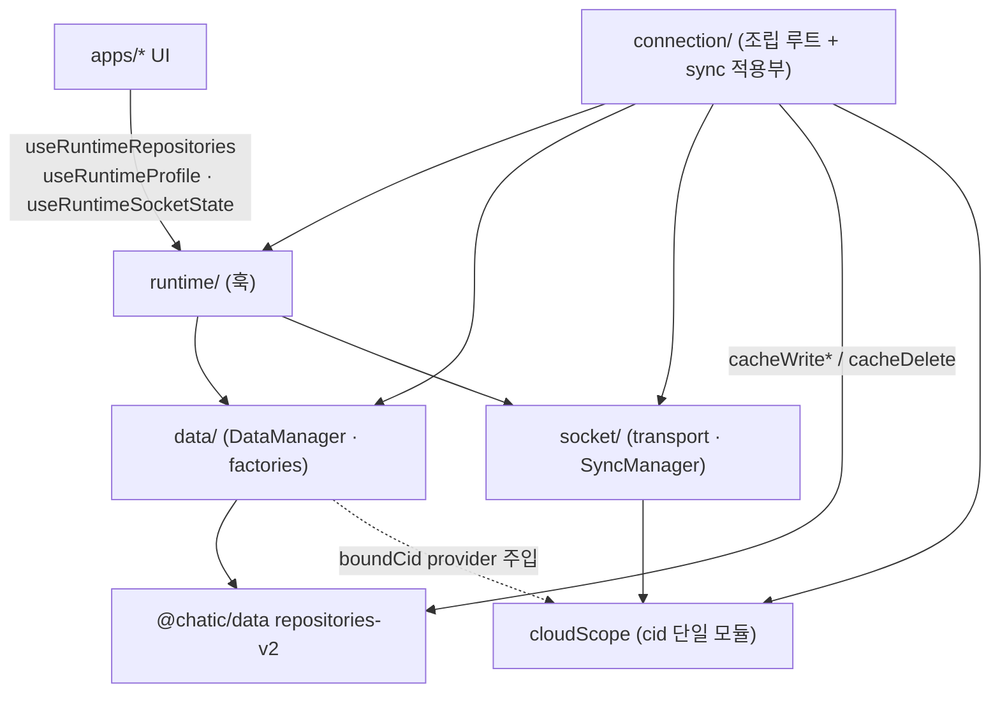
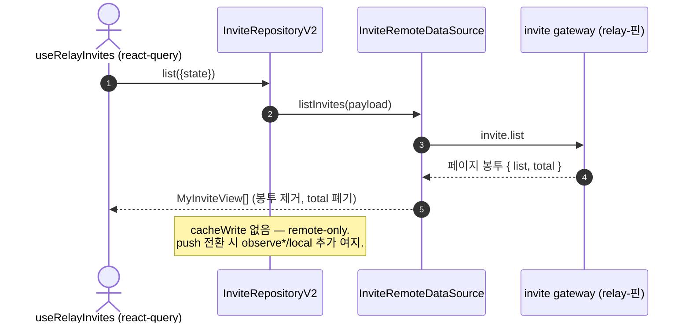

# 데이터 접근 아키텍처 — repository 단일 표면과 모듈 계층

> 상태: Approved · 최종 갱신: 2026-07-30 · 관련 ADR: [ADR-0036](../../../docs/adr/0036-data-surface-unification-app-runtime-cleanup.md)

## 목적

앱(UI)이 도메인 데이터에 닿는 표면을 `useRuntimeRepositories` **하나로** 만들고,
app-runtime 내부의 data/socket/runtime 모듈을 단방향 계층으로 편다. ADR-0036이
확정한 "모든 데이터 콜은 repository를 거친다" 원칙의 구현 형상을 이 문서가
정의하며, 완료 후에는 이 영역의 아키텍처 문서로 남는다.

## 설계 원칙

1. **단일 접근 표면** — UI의 도메인 데이터 콜은 `useRuntimeRepositories`로만
   나간다. gateway·socket manager·raw storage를 앱이 직접 만지지 않는다.
2. **repository는 접근 표면이지 캐시 의무가 아니다** — 영속화 요구가 없는
   도메인은 remote-only repository로 만든다. 선례:
   `DeviceRepositoryV2`(local data source 없이 조립됨 —
   `libs/data/src/data/repositories-v2/index.ts:49`).
3. **모듈 의존은 단방향** — `runtime → {data, socket}`, `connection(조립/orchestration)
→ {runtime, data, socket}`. `data ↛ socket`(필요 값은 주입), `data ↛
runtime/React`, `socket ↛ data`(sync 적용은 orchestration 소유).
4. **한 관심사는 한 모듈이 소유한다** — cid/스코프 판정 규칙은 단일 모듈로
   모은다. 같은 원리의 기존 선례: `socketRebootKey.ts:8` ("computing it in one
   place keeps them from drifting").
5. **명령형 매니저 표면은 조립 루트 전용** — 앱 계층은 선언형 훅만 소비한다.
   `getSocketManager()`/`getSyncManager()` 직접 호출은 app-runtime 내부와 조립
   루트에만 허용.

## 범위

**포함** (ADR-0036 결정 1–3):

- invite/auth gateway 직접 노출 폐지 → repository 승격, `useRuntimeGateways`
  표면 제거.
- app-runtime 구조 정리: cid 부기 단일화, data↔socket↔runtime 순환 해소,
  레이어 역전 정리, profile 경로 수렴, 싱글턴↔React 이중 관리 정리,
  ConnectionHost/AuthHost 통합.
- repository 크로스-스코프 읽기 API (desktop-web raw IndexedDB 우회 흡수).

**제외** (ADR-0036 결정 4): web-core REST 병렬 레이어(유지), apps/admin 별도
스택, 디버그/랩 도구, 일회성 콜드 마이그레이션의 raw 리더, V2 접미사 리네임,
SDK 비공개 API(start/stop) 의존.

## 시나리오

### S1. 초대 발급/목록/수락 (승격 후)

1. `ContactInvitePage`가 `useRelayInvites()` 호출 → 훅 내부는
   `useRuntimeRepositories().invite.list(...)`를 react-query로 감싼다 (폴링
   캐던스는 지금처럼 호출부 소유).
2. `InviteRepositoryV2.list()`는 pass-through — local cache 없이
   `InviteRemoteDataSource`로 위임하고 받은 배열을 그대로(같은 참조) 반환한다.
   페이지 봉투를 벗기는 것은 relay-핀 gateway에 붙은 데이터소스의 몫이다.
3. 발급/수락도 동일 경로의 command (`invite.create/accept`). UI는 gateway의
   존재를 모른다.

### S2. cloud 전환 중 프레임 판정 (cid 단일화 후)

1. cloud 전환이 cache cid를 낙관적으로 선반영. 나가는 cloud의 socket은 아직
   프레임을 흘린다.
2. sync 적용부는 프레임마다 **cloudScope 모듈 하나**에 "이 프레임을 써도
   되는가"를 묻는다 (현행 `dropForeignFrame` · `isCidActive` ·
   `socketAwareProvider`의 socketCid 주입 판정이 이 모듈로 수렴).
3. 판정 규칙이 한 곳이므로 §6-9/§8-4류 cross-cloud 오염 방어가 한 파일에서
   읽힌다.

### S3. 프로필 읽기 (수렴 후)

1. 화면은 `useRuntimeProfile()` 하나만 부른다. `useMyUser`·`getActiveSessionUser`
   직접 호출 등 보조 경로는 이 훅으로 수렴.
2. 훅 내부 병합 규칙(토큰 seed → 캐시 우선)은 유지하되 문서화된 단일 지점이
   된다.

### S4. 푸시 라우팅의 크로스-클라우드 조회 (크로스-스코프 API 후)

1. desktop-web 푸시 리졸버가 `repos.channel`의 크로스-스코프 읽기 API(예:
   `cacheReadAcrossScopes`)를 호출한다.
2. raw `indexedDB.open`(`readCacheRecords.ts:18-38`)은 제거된다.

## 다이어그램

목표 의존 그래프 (실선 = 정적 import, 점선 = 주입):

승격 후 초대 흐름:

## 상세 구현

### A. invite/auth repository 승격

- **`InviteRemoteDataSource` 신설** (`libs/data/src/data/remote/data-sources/`):
  invite gateway(`remoteFactory.ts:44`에서 relay-핀 생성)를 감싸
  `listInvites`/`createInvite`/`getInvite`/`acceptInvite` 제공. gateway의
  `<T>` 제네릭은 이 경계에서 확정된다 — `MyInviteView`·`RelayInviteView`(=
  `MyInviteView & { needVerify?: boolean }`)로 못 박아 호출부가 응답 모양을 고르지
  않게 한다. `listInvites`는 `invite.list`의 페이지 봉투를 벗겨 배열을
  반환한다(`total`은 페이지 건수라 의도적으로 버린다 — `UserRemoteDataSource.fetchUsers`와
  같은 관례).
- **`AuthRemoteDataSource` 확장** — 기존 `updateSocketAuth`에 더해
  `sendHashAliasOtp`/`checkHashAliasOtp`/`attachSocial`을 추가한다 (gateway 배선은
  이미 relay-핀: `remoteFactory.ts:58-63`). `verifyHashAlias`를 그대로 반출하지
  않고 step별로 쪼갠 이유: 응답 모양이 step에 종속(`send`→`sent/expiredAt`,
  `check`→`attached/$token`)이라 단일 메서드로는 제네릭을 확정할 수 없다. `resend`
  스위치→step 매핑과 "미지정 스위치는 페이로드에서 제외"(literal `false`는 채널을
  끈다) 규칙도 이 경계가 소유한다.
- **`InviteRepositoryV2` + `AuthRepositoryV2` 신설** — 둘 다 remote-only
  (`DeviceRepositoryV2` 패턴). auth를 `UserRepositoryV2`에 합치지 않는 이유:
  user repo는 이미 4개 데이터소스를 물고 있고(`repositories-v2/index.ts:53-59`),
  verifyHashAlias/attachSocial은 세션 정체성 커맨드라 도메인 성격이 다르다.
  표면은 `invite.list/create/get/accept`,
  `auth.sendPhoneVerification/checkPhoneVerification/attachSocial`. `get`/`accept`는
  코드 문자열을 받아 데이터소스가 body(`{ code }`)로 감싼다 — 코드는 자격증명이라
  본문 한 자리에만 실린다.
- **`DataRepositoriesV2`에 `invite`/`auth` 슬롯 추가**
  (`repositories-v2/index.ts`) — `repositoryFactory`는
  `createRepositoriesV2`에 그대로 위임하므로 별도 배선 변경이 없다.
- **표면 제거**: `DirectGateways` 타입·`getGateways()`(`data/types.ts:12`,
  `DataManager.ts:20,52-54`), `useRuntimeGateways`, `remoteFactory`의 gateways
  반출(`remoteFactory.ts:101-106`), app-runtime 배럴 export.
- **소비처 전환** (apps/web 3훅): `useRelayInvites.ts:38,67` ·
  `useVerifyHashAlias.ts` · `useAttachSocial.ts` — react-query 구조는 유지하고
  호출 대상만 repository로.

### B. cid/스코프 단일화 — `cloudScope` 모듈

현행 6곳에 흩어진 규칙을 한 모듈(가칭 `socket/cloudScope.ts`)로 모은다:

| 현행 위치                                  | 규칙                       | 이후                       |
| ------------------------------------------ | -------------------------- | -------------------------- |
| `SocketManager.ts` boundCid/rebindCid      | 슬롯별 cid freeze          | 저장은 유지, 판정만 위임   |
| `sync/plans.ts:30-34` `dropForeignFrame`   | boundCid ≠ cacheCid → drop | cloudScope로 이동          |
| `SyncManager.ts` `isCidActive`             | target.cid vs boundCid     | cloudScope로 이동          |
| `DataManager.ts:27-34` socketAwareProvider | socketCid 주입             | cloudScope가 provider 제공 |
| `useRuntimeBinding.ts:16-17` 낙관적 cid    | 선반영 규칙                | 주석으로 cloudScope 참조   |
| `socketRebootKey.ts:10` cid 제외           | reboot key에서 cid 배제    | 그대로 (이미 단일 지점)    |

### C. 순환 해소·레이어 역전

- **data → socket 컷**: `DataManager`가 `getSocketManager()`를 직접 부르는
  대신(`DataManager.ts:9,30`) 생성자에서 `boundCidProvider: () => string | null`을
  주입받는다. 조립은 `connection/`이 담당.
- **socket → data 컷**: sync plan 생성(`plans.ts:10,38-108`)과 등록을 socket
  모듈에서 `connection/`(조립·orchestration 계층)으로 올린다. socket은
  transport와 plan 실행 엔진만 남고, "무엇을 어느 repository에 쓰나"는
  orchestration이 소유한다.
- **data → runtime 컷**: `invitedCloudColdSync.ts`의 React 훅 2개를 `runtime/`
  으로 이동 (raw 리더 `createHotInviteCloudStorage`는 data에 남되 훅에 주입).

### D. profile 수렴·선언형 API·Host 통합

- profile: `useRuntimeProfile`을 유일 표면으로. `useMyUser`(apps/web),
  `getActiveSessionUser` 직접 소비처, 시딩 러너를 이 훅 뒤로 수렴.
- sync 등록: `getSyncManager().register*`를 useEffect에서 부르는 15+파일을
  선언형 훅(가칭 `useSyncRegistration(target)`)으로 교체.
- Host: `RuntimeAuthHost`는 자기 주석대로 "stripped-down RuntimeConnectionHost"
  — 옵션 prop(예: `dataBinding?: boolean`)으로 `RuntimeConnectionHost`에 통합.

### E. 크로스-스코프 읽기 API

`CacheStorage.loadAll`은 scope 파티션을 탄다. repository 계층에 명시적
크로스-스코프 읽기(예: `IChannelRepositoryV2.cacheReadAcrossScopes(filter)`)를
추가하고, `apps/desktop-web/.../readCacheRecords.ts`와 소비처
`resolvePushCloudId.ts`를 이 API로 전환한다. 시그니처는 "명시적으로 위험을
드러내는" 이름을 유지한다 (기본 read 경로와 혼동 금지).

## 검증 방법

- 기존 테스트 유지 통과: `libs/app-runtime`의 `useRuntimeBinding.test.ts` ·
  `useRuntimeProfile.test.ts` · `RuntimeConnectionHost.test.tsx` ·
  `SocketBinder.test.tsx` · `SocketReauthBinder.test.tsx` ·
  `invitedCloudColdSync.test.ts`, `libs/data` 스위트 전체.
- 신규 유닛 테스트: InviteRemoteDataSource(봉투 제거·코드 body 한정),
  AuthRemoteDataSource(step 매핑·미지정 스위치 제외),
  InviteRepositoryV2/AuthRepositoryV2(pass-through 계약 — 같은 참조 반환, reject
  전파, 캐시 부재), cloudScope(프레임 drop 판정 표), 크로스-스코프 읽기.
- 명령: `pnpm nx test data` · `pnpm nx test app-runtime` (+ 소비처 앱 lint/build).
- 수동 확인 포인트: cloud 전환 중 채널 목록 flicker 없음(§8-4), 초대
  발급→수락 플로우, guest→main 승격 시 `isGuest` 즉시 반영, desktop-web 푸시
  탭 라우팅.

---

## 구현 체크리스트 (임시 — Live 전환 시 삭제)

> ADR-0036 §5: **relay 트랙 완료 전 착수 금지.** 착수 시 트랙 1개 = 세션 1개.

**트랙 1 — invite/auth 승격 (libs/data → app-runtime → apps/web 순)**

1. ✅ `InviteRemoteDataSource` 신설 + `AuthRemoteDataSource` 확장 + 테스트.
2. ✅ `InviteRepositoryV2`/`AuthRepositoryV2` 신설(remote-only), `DataRepositoriesV2`
   슬롯 추가 + 테스트. `repositoryFactory`는 `createRepositoriesV2` 위임이라 무변경.
3. ⏸ app-runtime: `DirectGateways`/`getGateways`/`useRuntimeGateways`/배럴 export
   제거.
4. ⏸ apps/web 3훅 전환 (`useRelayInvites`/`useVerifyHashAlias`/`useAttachSocial`),
   react-query 키·동작 불변 확인.

> 3–4번 보류 이유: 표면 제거는 소비처 전환과 한 커밋이어야 하는데, relay 트랙이
> 아직 `useRelayInvites`·invite 화면을 수정 중이다(미커밋). 1–2번은 순수 추가라
> 충돌 없이 먼저 들어갔다. relay 브랜치 머지 후 3–4번을 한 세션으로 처리한다.
> 신규 표면은 이미 `useRuntimeRepositories().invite`/`.auth`로 닿으므로, 전환은
> 훅 안의 호출 대상만 바꾸는 기계적 작업이다.

**트랙 2 — cloudScope 단일화 + 순환 컷** 5. `cloudScope` 모듈 신설, `dropForeignFrame`·`isCidActive`·socketAwareProvider
판정 이전 + 판정 표 테스트. 6. `DataManager` boundCid 주입화 (data→socket 컷). 7. sync plan 조립을 `connection/`으로 이동 (socket→data 컷). 8. `invitedCloudColdSync` 훅 `runtime/` 이동 (data→runtime 컷).

**트랙 3 — 표면 정리** 9. profile 소비처 수렴 (`useMyUser`·직접 호출 → `useRuntimeProfile`). 10. `useSyncRegistration` 선언형 훅 도입, 15+파일 교체. 11. Host 통합 (`RuntimeAuthHost` → `RuntimeConnectionHost` 옵션화).

**트랙 4 — 크로스-스코프 API** 12. repository 크로스-스코프 읽기 추가 + desktop-web 전환.

**마감** 13. 문서 Live 전환: libs/data `README.md`(repository 재정의 반영) ·
`architecture.md`·`public-surface.md` 갱신, 이 문서 임시 섹션 삭제.

## 리스크와 미지수 (임시 — Live 전환 시 삭제)

- **동작 불변 검증**: invite 훅의 react-query 키·폴링 캐던스가 승격 후에도
  동일해야 한다. UI 회귀는 초대 E2E 시나리오로 확인.
- **cid 규칙 이전 회귀**: §6-9/§8-4 방어가 이전 중 한 곳이라도 빠지면
  cross-cloud 오염이 재발한다. cloudScope 판정 표 테스트를 이전 **전에** 현행
  동작 기준으로 먼저 작성(characterization test)하고 이전한다.
- **SocketManager 분해는 범위 아님**: coordinator 추출만 한다. 532줄 본체
  리팩토링은 별도 작업.
- **auth 승격의 경계**: `verifyHashAlias` 성공 후 세션 토큰 반영은 여전히
  web-core 소유다. repository는 커맨드 전달만 하며 세션 상태를 만지지 않는다.
- **병렬 트랙 충돌**: relay 트랙이 `useRelayInvites`·invite 화면을 계속 만지는
  중이다. 트랙 1의 1–2번(libs/data 순수 추가)은 겹치는 파일이 없어 선행했고,
  3–4번(표면 제거 + 소비처 전환)은 relay 로드맵 종료 후로 보류했다. 그 사이 구
  gateway 표면과 신규 repository 표면이 공존하지만, 신규 쪽 소비처가 아직 없어
  동작 중복은 없다.
