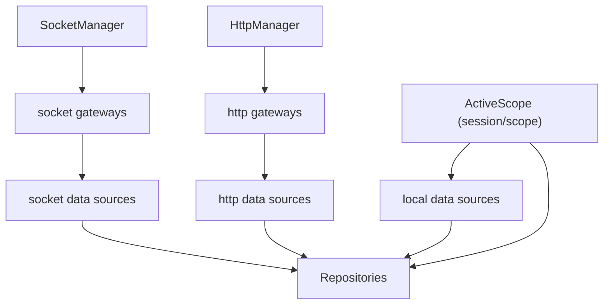

# Data Domain Spec

## 목적

`data` 도메인은 repository, local data source, remote data source를 조립해 앱이 사용할 headless data runtime을 제공한다.

이 문서에서 중요한 점은 `data`가 소켓 lifecycle을 소유하지 않는다는 것이다.

## 조립 구조

## 책임

### `DataManager`

- local · socket · http 세 데이터소스 번들을 조립해 **생성자에서 1회** repository 그래프를 만든다
- repository에 [`ActiveScope`](../../src/session/scope/ActiveScope.ts)를 `DataContextProvider`로
  주입한다. scope는 매 read마다 intent(`{cid, sid, uid}`)에 live `socketCid`(= `getBoundCid()`)를
  합성하므로, repository가 socket이 붙은 클라우드와 캐시 컨텍스트 클라우드의 **불일치를 감지해 오염
  쓰기를 스킵**할 수 있다(cross-cloud 가드 — [../session/architecture.md](../session/architecture.md)).
- **local 데이터소스는 intent만 받는다** — `socketCid` 없이. 그들의 일은 캐시 파티션 키
  (`${type}:${cid}:${uid}:${id}`)를 만드는 것이고, bound-socket 관점의 판정은 repository 층의 몫이다.
- `getSocketManager()`는 **매 호출마다 해석**한다(생성 시점에 캡처하지 않는다). 런타임이 지연 조립되므로
  생성 시점 인스턴스를 붙들면 아직 없는 매니저를 고정하거나 재조립을 놓친다.

> **`ensure(context)`·`destroy()`는 없다.** 스코프가 매 read마다 `session/store`에서 파생되면서
> 커밋할 것이 없어졌고, 컨텍스트를 받아 두고 무시하는 메서드는 "밀어 넣으면 반영된다"는 오해를
> 초대하므로 표면에서 지웠다. 커밋을 되살리면 관측자가 stale cid로 구독하던 render-lag가 돌아온다.
> 세션을 비우는 것은 로그아웃 경로의 일이지 이 매니저의 일이 아니다. 남은 표면은 `getRepositories()`와
> `getContext()` 둘뿐이다.

### `socketFactory` · `httpFactory` · `localFactory`

- `socketFactory` — socket 기반 gateway 조립 → socket data source 번들
- `httpFactory` — `HttpManager`의 게이트웨이 → http data source 번들
- `localFactory` — 캐시 백엔드 실체화(`getCacheStorage`) + 공유 IndexedDB 연결, `getCacheMetricsSource`
- 셋 다 repository가 사용할 인터페이스만 반환한다. 게이트웨이 인스턴스는 밖으로 나오지 않는다.

### repository

- local/remote 결과 해석
- cache merge/remove
- observe stream 제공

## 비책임

`data`는 아래를 직접 처리하지 않는다.

- token refresh
- 401 recovery orchestration
- socket reconnect policy
- sync runtime 생성/정지

## transport 의존 규칙

- `socketFactory`는 raw client에 직접 의존하지 않는다 — `SocketManager`의 stable active-facade를 쓴다.
- `httpFactory`는 HTTP 클라이언트를 만들지 않는다 — `http/`가 조립한 게이트웨이를 받는다.

이 규칙의 목적:

- socket 교체·슬롯 전환이 data 조립 로직으로 새지 않게 하기 위함
- retry/rebind/서명 책임을 data가 떠안지 않게 하기 위함

## sync와의 경계

- sync plan의 lifecycle은 `SyncManager`가 소유한다.
- sync plan callback 결과를 local cache에 반영하는 것은 repository가 소유한다.

정리:

- `SyncManager` = 언제 sync할지
- `repository` = sync 결과를 어떻게 반영할지

## 런타임 반응 시나리오

### cloud/site 전환

- 밀어넣는 단계가 없다. 선택 상태가 `session/store`에서 바뀌는 순간 `ActiveScope`가 다음 read부터
  새 scope를 보고하고, repository는 그 기준으로 캐시를 읽는다.
- 낙관 창(cid는 뒤집혔지만 소켓은 아직 옛 클라우드) 동안의 오염은 `socketCid` 합성 + scope guard가 막는다.
- socket/session 계층의 재인증은 별도 책임이다.

### logout

- 세션 teardown은 세션 레이어가 소유한다. `DataManager`에는 teardown 표면이 없다 — 지울 로컬 상태가
  없기 때문이다.
- 로컬 캐시는 비우지 않는다 — scope가 바뀌면 다른 파티션을 읽을 뿐이다.

## 저장소 선택과 web↔app 배포 스큐

`resolveCacheBackend(type)`(`cacheStorageRouting.ts`)가 도메인별 저장소를 고른다 — 라우팅
결정의 단일 지점이며, `getCacheStorage`(`factories/localFactory.ts`)는 그 결과를 어댑터로
실체화만 한다. 전체 설계는 [cache-storage-routing.md](cache-storage-routing.md) 참고. 판정은 셋뿐이다.

1. 브라우저(네이티브 브리지 없음) → 항상 web(IndexedDB).
2. `WEB_PINNED_CACHE_TYPES`에 고정된 타입 → web(IndexedDB). 현재 비어 있다.
3. **네이티브가 못 다루는 도메인** → web(IndexedDB). 그 외 → native(NativeDB/SQLite).

3번이 배포 스큐 대응이다. 웹은 앱보다 먼저 배포되므로 **웹이 아는 CacheType이
설치된 앱이 아는 것보다 많을 수 있다**. 그런 타입을 그냥 보내면 네이티브 `CacheCrudService`의
`default:` 분기가 `success: true` + `null`로 답한다 — 에러가 아니라 **영원히 빈 캐시**로 보인다.

판정은 **도메인별 계약 판번호**로 한다(ADR-0053): 앱은 자신이 **구현한** 판을 핸드셰이크로 보고하고,
웹은 자신이 **요구하는** 판을 선언해 도메인마다 비교한다. 앱 보고는 실제 도달한 DB 상태에서 도출하고,
서버 목록 API가 없어 캐시가 곧 권위인 도메인(`invitecloud`)은 아예 게이트 대상에서 뺀다. 판번호 체계,
보고 형식, 새 도메인·새 판 추가 절차는 **[cache-contract-versions.md](cache-contract-versions.md)가
소유한다** — 이 절은 라우팅에서 그 판정이 어디에 끼는지만 가리킨다.

## 관련 문서

- [cache-storage-routing.md](cache-storage-routing.md) — 캐시 저장소 라우팅 설계 (ADR-0051)
- [cache-contract-versions.md](cache-contract-versions.md) — 도메인별 캐시 계약 판번호 협상 (ADR-0053) — 위 3번 판정의 소유 문서
- [invite-local-cache.md](invite-local-cache.md) — 초대 목록 로컬 캐시·자격증명 분리 (ADR-0052) — `invite` CacheType이 스큐 게이트를 실제로 처음 통과한 사례
- [invite-cloud-durability.md](invite-cloud-durability.md) — 초대클라우드 푸시 복구·이름 동기화
- [../session/architecture.md](../session/architecture.md) — `ActiveScope` 세 뷰·판정 함수 소유자
- [../architecture.md](../architecture.md) — 전체 아키텍처·소유 규칙
- [../socket/sync/README.md](../socket/sync/README.md) — sync 결과의 cache 반영 경계
