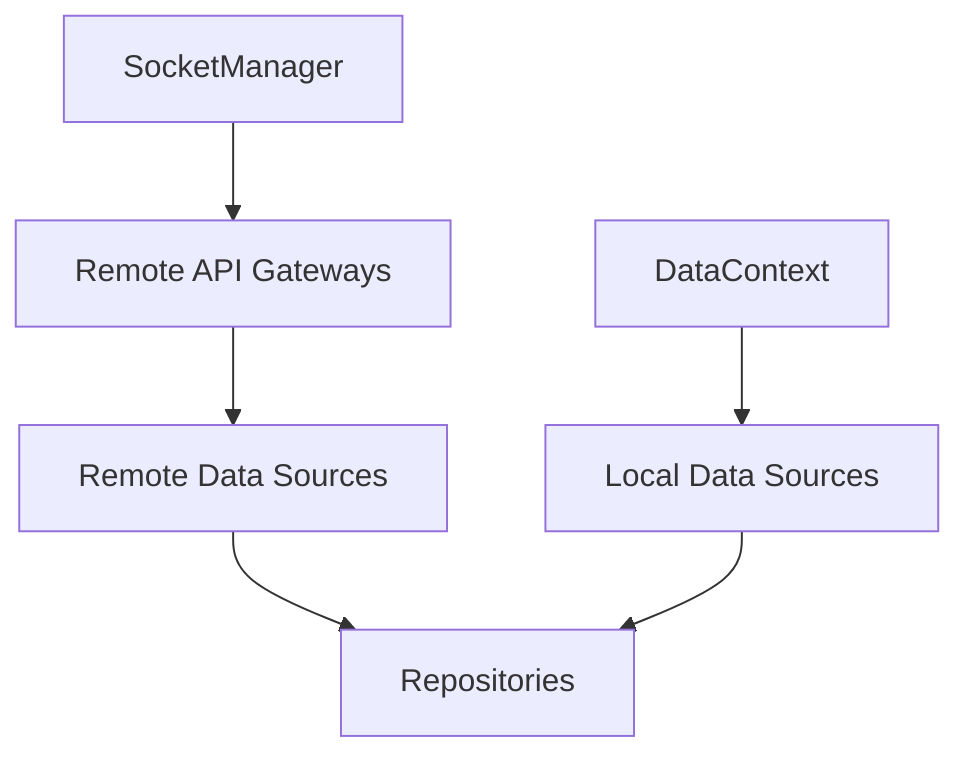

# Data Domain Spec

## 목적

`data` 도메인은 repository, local data source, remote data source를 조립해 앱이 사용할 headless data runtime을 제공한다.

이 문서에서 중요한 점은 `data`가 소켓 lifecycle을 소유하지 않는다는 것이다.

## 조립 구조

## 책임

### `DataManager`

- data context 생명주기 관리 — `DataContextHolder`에 현재 `{ cid, sid?, uid? }` 보관
- `ensure(context)`로 context 갱신 후 repository 반환
- `destroy()`로 context를 `DEFAULT_CONTEXT`로 리셋 (**캐시는 비우지 않는다**)
- **`socketAwareProvider`** — context holder를 감싸 `getContext()`마다 live `socketCid = getSocketManager().getBoundCid()`를 주입한다. repository가 socket이 붙은 클라우드와 캐시 컨텍스트 클라우드의 **불일치를 감지해 오염 쓰기를 스킵**하도록 한다(cross-cloud 가드).

### `remoteFactory`

- socket 기반 gateway 조립
- remote data source 조립
- repository가 사용할 remote interface 제공

### repository

- local/remote 결과 해석
- cache merge/remove
- observe stream 제공

## 비책임

`data`는 아래를 직접 처리하지 않는다.

- token refresh
- 401 recovery orchestration
- socket reconnect policy
- sync runtime 생성/정지

## socket 의존 규칙

- `remoteFactory`는 raw client에 직접 의존하지 않는다.
- `remoteFactory`는 `SocketManager`의 stable socket API를 사용한다.

이 규칙의 목적:

- socket 교체가 data 조립 로직으로 새지 않게 하기 위함
- retry/rebind 책임을 data가 떠안지 않게 하기 위함

## sync와의 경계

- sync plan의 lifecycle은 `SyncManager`가 소유한다.
- sync plan callback 결과를 local cache에 반영하는 것은 repository가 소유한다.

정리:

- `SyncManager` = 언제 sync할지
- `repository` = sync 결과를 어떻게 반영할지

## 런타임 반응 시나리오

### cloud/site 전환

- `RuntimeDataBinder`가 `DataManager.ensure(context)`를 호출한다.
- repository는 새 scope 기준 캐시를 읽는다.
- socket/session 계층의 재인증은 별도 책임이다.

### logout

- 외부 세션 레이어가 필요 시 `DataManager.destroy()`를 호출한다.
- data는 자기 리소스만 정리한다.
- socket/session 상태를 직접 제어하지 않는다.

## 저장소 선택과 web↔app 배포 스큐

`resolveCacheBackend(type)`(`cacheStorageRouting.ts`)가 도메인별 저장소를 고른다 — 라우팅
결정의 단일 지점이며, `getCacheStorage`(`factories/localFactory.ts`)는 그 결과를 어댑터로
실체화만 한다. 전체 설계는 [cache-storage-routing.md](cache-storage-routing.md) 참고. 판정은 셋뿐이다.

1. 브라우저(네이티브 브리지 없음) → 항상 web(IndexedDB).
2. `WEB_PINNED_CACHE_TYPES`에 고정된 타입(`profile`) → web(IndexedDB).
3. **네이티브가 못 저장하는 타입** → web(IndexedDB). 그 외 → native(NativeDB/SQLite).

3번이 배포 스큐 대응이다. 웹은 앱보다 먼저 배포되므로 **웹이 아는 CacheType이
설치된 앱이 아는 것보다 많을 수 있다**. 그런 타입을 그냥 보내면 네이티브 `CacheCrudService`의
`default:` 분기가 `success: true` + `null`로 답한다 — 에러가 아니라 **영원히 빈 캐시**로 보인다.

판정 근거는 브릿지 핸드셰이크(`OnWebAppReady`)가 실어 오는 두 필드다.

| 필드                  | 출처(앱)                | 쓰임                                          |
| --------------------- | ----------------------- | --------------------------------------------- |
| `supportedCacheTypes` | `SUPPORTED_CACHE_TYPES` | 새 도메인(테이블)이 그 앱에 있는지            |
| `cacheSchemaVersion`  | SQLite `TARGET_VERSION` | 추출 컬럼·인덱스가 필요한 쿼리를 쓸 수 있는지 |

웹은 이를 `setNativeCacheSupport`(main.tsx, 렌더 전)로 기록하고, `nativeCacheSupport.ts`가 판정한다.
규칙 두 가지가 안전을 담보한다.

- **legacy 집합은 동결이다.** 이미 출시된 모든 앱이 저장할 수 있는 타입 목록은 보고와 무관하게
  네이티브를 쓴다. 보고는 타입을 **더할 수만** 있고 뺄 수 없다 — 앱이 목록을 빠뜨리는 버그가 따뜻한
  cold 캐시를 조용히 웹 저장소로 옮기지 못하게 한다.
- **모르면 legacy로 본다.** 응답이 아직 안 왔거나 필드가 없는 구버전 앱이면, 동결 집합 밖은 web
  저장소로 간다. 보수적일 뿐 틀리지 않는 방향이다.

### 새 캐시 도메인/스키마를 추가할 때

1. 네이티브에 마이그레이션 + 데이터 소스 + `SUPPORTED_CACHE_TYPES` 등록을 **먼저** 배포한다.
2. 모델 필드만 늘어나는 변경은 아무것도 선언할 필요가 없다 — 네이티브는 모델을 `data` JSON blob으로
   통째 저장하므로 구버전 앱도 그대로 왕복시킨다.
3. 추출 컬럼·인덱스에 의존하게 되는 경우에만 `MIN_SCHEMA_VERSION_BY_TYPE`에 요구 `TARGET_VERSION`을
   선언한다.

## 관련 문서

- [cache-storage-routing.md](cache-storage-routing.md) — 캐시 저장소 라우팅 설계 (ADR-0051)
- [invite-cloud-durability.md](invite-cloud-durability.md) — 초대클라우드 마이그레이션·푸시 복구·이름 동기화
- [context-design.md](context-design.md) — 전역/요청 context 분리 설계
- [../architecture.md](../architecture.md) — 전체 아키텍처·소유 규칙
- [../sync/README.md](../socket/sync/README.md) — sync 결과의 cache 반영 경계
