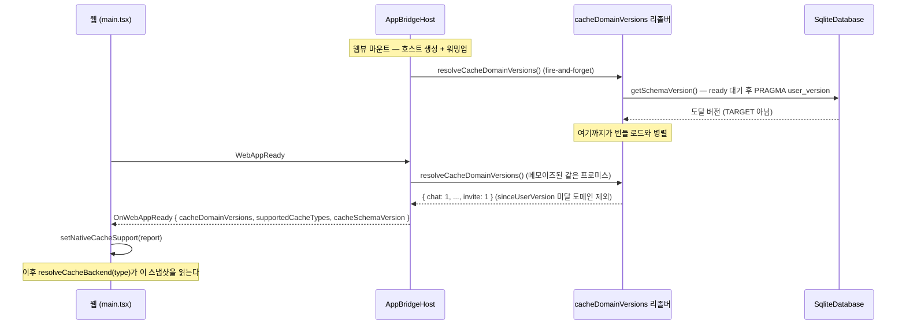
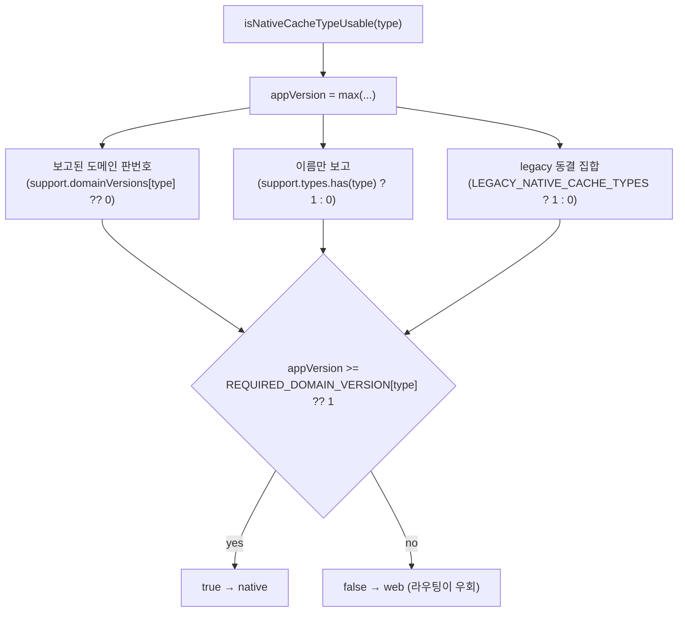
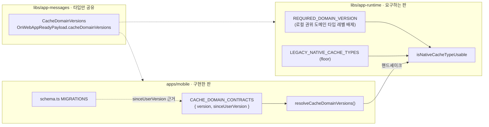

# 캐시 도메인 계약 버전 (Cache Domain Contract Versions)

> 상태: Live · 최종 갱신: 2026-08-14 · 관련 ADR: [ADR-0053](../../../../docs/adr/0053-per-domain-cache-contract-versions.md)
>
> 캐시 타입이 **어느 저장소로 가는지**(web/IndexedDB vs native/SQLite)는
> [cache-storage-routing.md](cache-storage-routing.md)가 소유한다. 이 문서는 그 라우팅이 던지는
> 질문 하나 — **"설치된 앱이 이 도메인을 웹이 기대하는 방식으로 다룰 수 있는가"** — 에 답하는
> 협상 메커니즘을 소유한다.

## 목적

웹은 앱보다 먼저 배포된다. 그래서 웹은 자기가 아는 `CacheType`을 설치된 앱도 안다고 가정할 수 없다.
모르는 타입을 그냥 보내면 네이티브 `CacheCrudService`의 `default:` 분기가 `success: true` + `null`로
답한다 — 에러가 아니라 **영원히 빈 캐시**다.

이 문서는 그 스큐를 넘는 협상을 기록한다. 앱은 **자신이 구현한 계약의 판번호**를, 웹은 **자신이
요구하는 판번호**를 각각 선언하고, 웹이 도메인마다 `앱 판 >= 웹 요구 판`을 확인한다.

이전 설계는 서로 다른 세 메커니즘(동결 집합 · 타입 이름 목록 · 전역 SQLite 스키마 번호)의 조합이었고,
"도메인을 껐다가 다시 켜면 첫 버전에 머문 사용자에게 오판이 난다"는 결함이 있었다. 원인 분석과
대안 비교는 [ADR-0053](../../../../docs/adr/0053-per-domain-cache-contract-versions.md)에 있다.

## 설계 원칙

- **판번호는 단조 증가한다.** on→off→on이라는 상태 전이를 만들지 않는다. 도메인을 배제해야 하면
  요구 판번호를 올리지, 목록에서 빼지 않는다. 되돌릴 일이 없으므로 "재도입 시 구버전 구별" 문제가
  개념적으로 성립하지 않는다.
- **값은 공유하지 않고 타입만 공유한다.** 앱은 **구현한** 판을, 웹은 **요구하는** 판을 말한다. 같은
  상수를 양쪽이 import하면 협상이 아니라 항등식이 된다.
- **보고는 더할 수만 있고 뺄 수 없다(floor).** 동결된 legacy 집합은 하한선이다. 배선 버그나 잘린
  페이로드로 앱이 도메인을 빠뜨려도 legacy 8종은 네이티브에서 밀려나지 않는다.
- **게이트의 실패 모드는 도메인마다 다르다.** 대부분의 도메인에서 오판은 "내구성 하락 + 서버
  재동기화"지만, 서버에 목록 API가 없는 도메인에서는 **소실**이다. 그 도메인은 게이트 대상에서 뺀다.
- **앱은 의도가 아니라 실측을 보고한다.** 컴파일타임 상수를 그대로 내보내지 않는다. 마이그레이션이
  실패했는데 성공한 척 보고하면 게이트가 신뢰할 근거를 잃는다.
- **논리 계약은 물리 DB 버전과 분리한다.** 게이트를 걸기 위해 no-op 마이그레이션을 넣지 않는다.
  `PRAGMA user_version`은 계속 보고하되 라우팅 판정에서는 읽지 않는다.

## 범위

**포함** — `CacheDomainVersions` 타입과 핸드셰이크 필드, `AppBridgeHost` 배선, 앱 측 도메인 계약 맵과
도달 `user_version` 기반 실측 도출, 웹 `REQUIRED_DOMAIN_VERSION`·`isNativeCacheTypeUsable` 재작성,
`LOCAL_AUTHORITY_CACHE_TYPES`, `MIN_SCHEMA_VERSION_BY_TYPE` 제거, 웹→네이티브 이관 다리 제거.

**제외**

- 저장소 라우팅 결정 일반 → [cache-storage-routing.md](cache-storage-routing.md).
- `supportedCacheTypes`/`cacheSchemaVersion` 필드 자체의 제거 — 하위 호환 기간 종료 후 별건.
- SQLite 마이그레이션 실패의 **복구** 전략. 이 문서는 실패를 정직하게 **보고**하는 것까지만 다룬다.
- `invitecloud` 서버 목록 API 신설(백엔드 작업). 생기면 로컬 권위 분류 자체가 해소된다.

## 도메인 분류

| 구분             | 도메인                                                        | 게이트 오판 시               | 판번호 정책       |
| ---------------- | ------------------------------------------------------------- | ---------------------------- | ----------------- |
| 서버 재구성 가능 | channel · chat · user · join · site · profile · meta · invite | 내구성 하락, 재동기화로 복구 | 상향 가능         |
| 로컬 권위        | **invitecloud**                                               | **소실, 복구 불가**          | 1 고정, 상향 금지 |

`invitecloud`는 서버에 목록 API가 없어 캐시가 곧 권위인 유일한 타입이다 —
[invite-cloud-durability.md](invite-cloud-durability.md). 저장소를 옮기면 행이 채워지지 않고 사라진다.
그래서 이 도메인은 `REQUIRED_DOMAIN_VERSION`에 **타입 레벨로** 등장할 수 없게 막는다(아래 상세 구현).

`invite`는 [ADR-0052](../../../../docs/adr/0052-invite-local-cache-and-native-table.md)가
stale-while-revalidate로 못박아 `invite.list`가 항상 재검증하므로 위쪽이다. `meta`는 sync cursor라
잃어도 전체 재동기화 1회 비용으로 끝난다.

## 시나리오

### S1. 앱 부팅 — 실측 보고 만들기

1. 웹뷰가 마운트되며 브릿지 호스트가 생성된다. `cacheSchemaVersion`(TARGET)과 정적
   `SUPPORTED_CACHE_TYPES`는 상수라 그대로 들고 있고, 도메인 판번호는 **리졸버(thunk)**로 넘긴다.
2. **같은 마운트에서 리졸버를 fire-and-forget으로 깨운다(워밍업).** 리졸버가 SQLite를 열고
   마이그레이션 완료를 기다린 뒤 **도달한** `PRAGMA user_version`을 읽어, 계약 맵과 대조해
   `sinceUserVersion`을 만족한 도메인만 담는다. 이 일은 웹뷰가 번들을 받는 동안 **병렬로** 끝난다.
3. 웹 번들이 로드되고 `WebAppReady`가 도착한다. 핸들러가 리졸버를 await하는데, 메모이즈된
   프로미스라 보통 이미 resolved다 — 핸드셰이크가 SQLite를 기다리지 않는다.
4. 그 결과로 세 필드를 채워 응답한다 — `cacheDomainVersions`(실측), `supportedCacheTypes`(실측 맵의
   키), `cacheSchemaVersion`(TARGET, 디버깅용).

**왜 마운트에서 깨우는가.** 웹은 이 보고를 **한 번**, 데이터 런타임이 캐시 스토리지를 조립할 때만
읽는다. 그 뒤에 도착한 보고는 라우팅을 되돌리지 못하므로, 늦은 응답은 그 세션 내내 도메인 하나를 웹
저장소에 묶는다. 번들 로드가 DB 오픈보다 훨씬 길어서, 마운트에서 시작하면 직렬 비용이 병렬 비용이
된다. 호스트 자신은 여전히 DB를 모른다 — 언제 깨울지는 리졸버를 가진 쪽(앱)이 정한다.

이로써 boot-optimization 4.4의 "핸드셰이크 상수는 SQLite를 열지 않는다"는 성질은 깨진다. SQLite가
열리는 시점이 **첫 캐시 메시지에서 웹뷰 마운트로 앞당겨진 것**이지 새 비용이 생긴 것은 아니지만,
렌더와 겹치는 구간인 것은 사실이다 — 실기기 콜드부팅 BootMetrics 비교가 이 판단의 검증 조건이다.

### S2. 웹이 판정한다 — 전환 시점의 무변화

1. `setNativeCacheSupport(report)`가 스냅샷을 기록한다(main.tsx, 렌더 전).
2. `resolveCacheBackend('invite')` → `isNativeCacheTypeUsable('invite')` → 앱 판번호를 **세 근거의
   최댓값**으로 읽는다: 도메인 판번호 · 이름 보고(있으면 1) · legacy 집합(속하면 1).
3. 요구 판번호(`REQUIRED_DOMAIN_VERSION['invite']`, 미지정이면 1) 이상이면 `'native'`.
4. **구버전 앱(도메인 판번호를 안 보냄)도 결과가 같다** — 이름만 보고해도 1판으로 환산되므로 전환
   시점에 라우팅이 한 건도 바뀌지 않는다. 이 무변화가 이 설계의 안전 조건이고, 테스트로 고정한다.

### S3. 도메인 계약을 실제로 바꿔야 할 때 (판번호 2판)

`profile`의 네이티브 저장 방식이 바뀌어 구버전 앱이 쓴 행을 웹이 더는 신뢰할 수 없게 됐다고 하자.

1. **앱** — `CACHE_DOMAIN_CONTRACTS.profile.version`을 2로 올리고 새 앱을 배포한다. 필요하면
   마이그레이션도 함께 넣지만, 판번호를 올리기 위해 no-op 마이그레이션을 넣지는 않는다.
2. **웹** — 새 앱이 충분히 퍼진 뒤 `REQUIRED_DOMAIN_VERSION.profile = 2`를 배포한다.
3. 1판 앱은 `profile`만 웹 저장소로 내려가고 서버 재동기화로 채워진다. 나머지 도메인은 영향 없다.
4. 순서가 뒤집히면(웹 먼저) 전 사용자의 `profile`이 잠시 웹 저장소로 간다 — 내구성만 낮아지고
   데이터는 유지되므로 사고가 아니라 지연이다. 단 `invitecloud`에는 이 여유가 없다(아래 S5).

### S4. 마이그레이션이 실패한 앱

1. `initTables`의 트랜잭션이 던지면 **전부 롤백**되고 `user_version`은 오르지 않는다.
2. 리졸버가 읽는 도달 버전이 낮으므로, 그 버전 이후에 만들어진 테이블의 도메인은 보고에서 빠진다
   (예: `invites` 테이블이 없으면 `invite` 항목 없음).
3. 웹은 그 도메인을 웹 저장소로 보낸다 — 존재하지 않는 테이블에 쓰는 대신.
4. legacy 8종은 floor 덕에 계속 네이티브로 간다. **의도된 비대칭이다**: 이미 출시된 모든 앱이 가진
   테이블이라 없을 리 없고, floor를 포기하면 우발적 미보고 한 번이 `invitecloud`를 날린다.

### S5. 긴급 킬스위치

앱 릴리스를 기다릴 수 없을 때만 `WEB_PINNED_CACHE_TYPES`([cacheStorageRouting.ts](../../src/data/cacheStorageRouting.ts))로
웹 배포만으로 전 버전을 즉시 off한다. 네이티브 내구성을 IndexedDB로 낮추는 임시방편이다.
**로컬 권위 도메인에는 이 레버도 쓸 수 없다** — 웹 저장소로 보내는 것 자체가 소실이다.

## 다이어그램

### 판번호 협상



### 앱 판번호 도출 (웹 측)



### 선언 지점



## 상세 구현

### 공유 타입 — [libs/app-messages](../../../app-messages/src/types/model/cache.ts)

```ts
/** 도메인별 계약 판번호. 앱은 구현한 판을, 웹은 요구하는 판을 각각 독립 선언한다. */
export type CacheDomainVersions = Partial<Record<CacheType, number>>;
```

[system.ts](../../../app-messages/src/types/model/system.ts)의 `OnWebAppReadyPayload`에
`cacheDomainVersions?: CacheDomainVersions`를 optional로 추가한다. optional인 이유는 두 가지다 —
구버전 앱은 보내지 않고, 로컬 캐시 DB가 없는 호스트(desktop main process,
[index.ts:681](../../../../apps/desktop/src/main/index.ts))는 앞으로도 보내지 않는다.

### 브릿지 배선 — [AppBridgeHost.ts](../../../bridges/src/app/AppBridgeHost.ts)

`AppBridgeHostConfig`에 리졸버를 받는다. 값이 아니라 thunk인 이유는 실측이 비동기이고, **언제
측정할지를 호스트가 정하지 않기 위해서**다 — 느린 자원을 가진 쪽이 시점과 한도를 모두 정한다.
앱은 이 리졸버를 웹뷰 마운트 시 미리 깨워둔다(위 S1).

```ts
/**
 * Resolves the per-domain cache contract versions this host actually implements. A thunk, not a
 * value: the answer is measured from the local DB, and the host must not touch that DB until the
 * web actually asks. Awaited inside the WebAppReady handler, so it MUST settle promptly — bound
 * any slow work on the implementing side. A rejection is swallowed and the field omitted.
 */
resolveCacheDomainVersions?: () => Promise<CacheDomainVersions | undefined>;
```

핸들러는 `try/catch`로 감싸 실패 시 필드를 생략한다. 타임아웃은 **호스트가 아니라 구현 측**이
건다 — 느린 자원을 아는 쪽이 한도를 정해야 하고, 호스트가 숫자를 발명하면 그게 정책이 된다.

**리졸버가 답하면 응답의 `supportedCacheTypes`는 그 키에서 도출된다**(정적 선언 대신). 두 정책이
아니라 같은 말을 두 번 하는 것이다 — 앱이 실제로 만들지 못한 도메인을 "지원한다"고 이름으로
보고하면, 웹의 이름 기반 환산(목록에 있으면 1판)이 실측을 그대로 상쇄해버린다. 리졸버가 답하지
못하면 정적 목록이 그대로 나가고, 그것이 ADR-0053 이전과 완전히 동일한 페이로드다.

### 앱 측 계약 맵 — [cacheContract.ts](../../../../apps/mobile/src/app/database/sqlite/cacheContract.ts)

```ts
export const CACHE_DOMAIN_CONTRACTS: Record<CacheType, { version: number; sinceUserVersion: number }> = {
    channel: { version: 1, sinceUserVersion: 1 }, // migration 0
    // ...
    meta: { version: 1, sinceUserVersion: 10 }, // dropped in 5, recreated in 9
    profile: { version: 1, sinceUserVersion: 9 }, // migration 8
    invite: { version: 1, sinceUserVersion: 11 }, // migration 10 (ADR-0052)
};
```

**두 숫자는 같은 축이 아니다.** 하나는 웹으로 나가는 협상 값이고, 하나는 앱 안에서만 소모되는 자기
검증 좌표다. 이 구분이 이 설계 전체의 요점이므로 표로 못박는다.

|                    | `version`                                | `sinceUserVersion`                                |
| ------------------ | ---------------------------------------- | ------------------------------------------------- |
| 무슨 질문에 답하나 | **무엇을 약속하는가**                    | 그 약속을 **지킬 수 있는 상태인가**               |
| 층위               | 논리 계약                                | 물리 DB                                           |
| 비교 대상          | 웹의 `REQUIRED_DOMAIN_VERSION[type]`     | 앱이 실제로 도달한 `PRAGMA user_version`          |
| 웹으로 나가나      | **나간다**(`cacheDomainVersions`에 실림) | **안 나간다**                                     |
| 언제 바뀌나        | 계약이 실제로 바뀔 때(사람이 올린다)     | 테이블을 만든 마이그레이션이 결정하는 역사적 사실 |
| 지금 값            | 전 도메인 1                              | 도메인마다 다름 (1 · 9 · 10 · 11)                 |

순서대로 쓰인다 — `sinceUserVersion`이 **1단계 게이트(앱 내부)**, `version`이 **2단계 게이트(웹)**다.
서로를 보지 않는다.

```
도달 user_version ──[sinceUserVersion과 비교]──▶ 이 도메인을 보고할까?
                                                     │ yes
                                                     ▼
                                              version을 실어 보냄
                                                     │
                                                     ▼
                                    [REQUIRED_DOMAIN_VERSION과 비교] ──▶ native / web
```

예를 들어 `invite`는 `{ version: 1, sinceUserVersion: 11 }`인데 이 둘 사이에는 아무 관계가 없다.
리포에서 가장 최근에 추가된 도메인이라 물리 좌표는 11로 크지만, 그 계약은 아직 한 번도 바뀐 적이
없으므로 1판이다 — **판번호는 도메인이 추가된 시점을 뜻하지 않는다.**

| 앱이 도달한 user_version     | `invites` 테이블 | 보고 내용          | 웹의 판정      |
| ---------------------------- | ---------------- | ------------------ | -------------- |
| 11 (정상)                    | 있음             | `{ invite: 1 }`    | 1 ≥ 1 → native |
| 9 (migration 10이 던져 롤백) | 없음             | `invite` 항목 없음 | 0 < 1 → web    |

**둘이 따로 움직이는 경우와 같이 움직이는 경우.**

- `version`만 오른다 — `profile`의 직렬화 규칙이 바뀌어 구버전 앱이 쓴 행을 웹이 못 믿게 됐다. 테이블
  구조는 그대로(blob 안의 문제)이므로 `{ version: 2, sinceUserVersion: 9 }`. **마이그레이션을 추가하지
  않는다** — 게이트를 걸려고 no-op 마이그레이션을 넣던 짓이 사라지는 지점이 여기다.
- 둘 다 오른다 — 계약 변경이 실제로 새 추출 컬럼을 요구해 migration 11을 넣었다면
  `{ version: 2, sinceUserVersion: 12 }`. 같이 움직이지만 이유가 다르다: `version`은 웹에 한 약속이
  갱신돼서, `sinceUserVersion`은 그 약속을 담는 테이블이 이제 migration 11 뒤에만 존재해서.
- `sinceUserVersion`만 오르는 경우는 없다. 테이블을 다시 만들었다면 계약이 바뀐 것이다.

**전역 카운터 의존이 되살아난 것이 아니다.** ADR-0053 결함 2가 지적한 것은 *웹이 요구하는 하한선*을
전역 카운터로 표현해 무관한 도메인의 마이그레이션이 기준값을 밀어올린다는 점이었다.
`sinceUserVersion`은 그 자리에 없다 — 웹은 이 값을 보지도 못하고, 무관한 도메인이 migration 12·13을
추가해도 `profiles` 테이블을 만든 것은 여전히 migration 8이므로 `profile.sinceUserVersion = 9`는
움직이지 않는다. `TARGET_VERSION`(항상 최신)을 기준으로 자동으로 밀리던 옛 방식과 정반대다.

굳이 말하면 `sinceUserVersion`은 `sqlite_master`를 조회해 테이블 존재를 확인하는 것의 **더 싼
대체물**이다. 마이그레이션이 단일 트랜잭션이라 두 방법의 결과가 항상 같기 때문에 성립한다 — 원래
묻고 싶은 것은 "테이블이 있는가"이지 "전역 버전이 몇인가"가 아니다.

### 실측 도출 — 도달한 `user_version`

[SqliteDatabase.ts](../../../../apps/mobile/src/app/database/sqlite/SqliteDatabase.ts)의 마이그레이션은
**단일 트랜잭션**이다. 어느 한 스텝이 던지면 전부 롤백되고 `user_version`도 오르지 않는다. 따라서
도달 버전 하나가 "어떤 테이블이 존재하는가"를 **완전히** 결정한다 — `sqlite_master` 조회 없이도
실측이 성립한다.

- `ISqliteDatabase`에 `getSchemaVersion(): Promise<number>`를 추가한다. 기존 `execute`가 이미
  `ready`(=마이그레이션)를 await하므로 `PRAGMA user_version` 한 줄이면 되고, **의도한 TARGET이 아니라
  도달한 값**을 돌려준다. `initTables`의 `catch`는 그대로 둔다 — 앱을 죽이지 않는 건 유지하되,
  거짓 보고만 닫는다.
- 리졸버([cacheDomainVersions.ts](../../../../apps/mobile/src/app/services/cache/cacheDomainVersions.ts))는
  `Promise.race`로 상한(3초)을 건다. 웹의 `request` 타임아웃이 10초이므로 그 안에서 끝나야 한다.
- 웹뷰 마운트 시 [useBaseBridge.ts](../../../../apps/mobile/src/app/webview/hooks/useBaseBridge.ts)가
  리졸버를 미리 깨운다. 결과를 쓰지 않는 호출이라 rejection에 핸들러가 없으므로 `.catch`로 삼킨다 —
  워밍업이 자기가 데우는 화면을 깨뜨릴 수는 없다.
- **메모이즈는 실제 답에만 한다.** 측정된 보고는 프로세스 안에서 바뀔 수 없으니 WebView 리로드마다
  다시 읽을 이유가 없다. 반면 실패·타임아웃은 일시적 상태(마이그레이션이 잡은 락, 느린 첫 부팅)이고,
  그걸 캐시하면 느린 부팅 한 번이 이후 모든 핸드셰이크를 폴백에 묶어버린다.
- **타임아웃·실패 시 폴백은 "오늘과 똑같이"** — 정적 `SUPPORTED_CACHE_TYPES` + `TARGET_VERSION`을 보내고
  `cacheDomainVersions`만 생략한다. 회귀가 아니라 현행 유지로 떨어지는 것이 가장 보수적이다.

보고되는 `supportedCacheTypes`가 실측 맵의 키로 바뀌는 것(위 브릿지 배선 절)은
[ADR-0053](../../../../docs/adr/0053-per-domain-cache-contract-versions.md) 결정 7의 "목록에서 빼지
마라"와 충돌하지 않는다 — 금지 대상은 **정책 레버로서의 제거**이고, 여기서 빠지는 것은 앱이 실제로
그 테이블을 못 가진 경우뿐이다. [CacheCrudService.ts](../../../../apps/mobile/src/app/services/cache/CacheCrudService.ts)의
정적 `SUPPORTED_CACHE_TYPES`는 "switch 암을 데이터로 적은 선언"으로 남고, 계약 맵과 키가 일치하는지
테스트가 고정한다 — 여기가 어긋나면 웹이 쓰기를 버리는 저장소를 믿게 된다.

### 웹 측 게이트 — [nativeCacheSupport.ts](../../src/data/nativeCacheSupport.ts)

```ts
/** 서버에 목록 API가 없어 캐시가 곧 권위인 도메인 — 게이트로 이동시키지 않는다. */
export const LOCAL_AUTHORITY_CACHE_TYPES = ['invitecloud'] as const;
type LocalAuthorityCacheType = (typeof LOCAL_AUTHORITY_CACHE_TYPES)[number];
type GateableCacheType = Exclude<CacheType, LocalAuthorityCacheType>;

/** 웹이 요구하는 최소 판번호. 미지정 = 1판이면 충분. 로컬 권위 도메인은 타입이 거부한다. */
export const REQUIRED_DOMAIN_VERSION: Partial<Record<GateableCacheType, number>> = {};

const legacyVersion = (type: CacheType) => (LEGACY_NATIVE_CACHE_TYPES.has(type) ? 1 : 0);
const reportedByName = (type: CacheType) => (support?.types.has(type) ? 1 : 0);

const appVersion = (type: CacheType) =>
    Math.max(support?.domainVersions[type] ?? 0, reportedByName(type), legacyVersion(type));

/** 미지정 = 1판이면 충분. 로컬 권위 도메인은 키 타입에서 제외돼 항상 여기로 떨어진다. */
const requiredVersion = (type: CacheType): number => REQUIRED_DOMAIN_VERSION[type as GateableCacheType] ?? 1;

export const isNativeCacheTypeUsable = (type: CacheType): boolean => appVersion(type) >= requiredVersion(type);
```

- **`GateableCacheType`이 ADR의 테스트 요구를 타입으로 승격한다.** ADR-0053 결정 3은 "로컬 권위
  도메인이 `REQUIRED_DOMAIN_VERSION`에 등장하지 않음을 테스트로 고정"을 요구하는데, 키 타입에서 아예
  제외하면 컴파일이 거부한다. 테스트는 런타임 계약(그 도메인이 항상 usable) 쪽을 고정한다.
- **`LEGACY_NATIVE_CACHE_TYPES`는 존치하고 의미도 그대로다** — 미보고 시의 기본값이 아니라 **하한선**.
  현재 코드가 legacy를 보고보다 먼저 검사해 얻고 있는 보장("보고는 더할 수만 있다")을 `Math.max`가
  그대로 유지한다.
- `NativeCacheSupport.schemaVersion`은 스냅샷에 **남기되 판정에서 읽지 않는다**(로깅·디버깅 가치).
  전역 스키마 번호로 판정하던 `MIN_SCHEMA_VERSION_BY_TYPE`은 제거됐다 — 프로덕션에서 비어 있어
  이전할 항목이 0건이었다.
- ORDERING은 변하지 않는다: 스냅샷이 아직 없으면 legacy 집합만 1판이므로, 이른 판정은 틀린 게 아니라
  보수적이다.

### 판번호를 올릴 때의 규율

비교가 `>=` 단방향이라 "이 판 이상"은 표현하지만 "너무 최신은 안 됨"은 표현하지 못한다. 기계로 막는
대신 규율로 고정한다:

> **판번호를 올리는 변경은 구버전 웹과 호환되어야 한다.** 구버전 웹을 깨는 변경이라면 판번호를
> 올리는 것이 아니라 새 `CacheType`을 만든다.

### 이관 다리는 더 이상 없다

[ADR-0030](../../../../docs/adr/0030-app-runtime-cold-db-migration-and-invite-cloud-recovery.md)의
웹→네이티브 일회성 이관 다리(`migrateInvitedCloudsIntoNativeStore` · `useInvitedCloudMigration` ·
`createWebInviteCloudStorage`)는 제거됐다 — 상세는
[invite-cloud-durability.md](invite-cloud-durability.md).

그 결과 **로컬 권위 도메인의 저장소를 옮길 다리가 존재하지 않는다.** 그럼에도 옮겨야 한다면 다리를
새로 쓰는 것이 **선행 조건**이다. 사후 보완이 아니다. 다리 없이 라우팅만 바꾸는 변경은
`LOCAL_AUTHORITY_CACHE_TYPES`의 도메인에 대해 금지한다.

## 검증 방법

- [nativeCacheSupport.test.ts](../../src/data/nativeCacheSupport.test.ts) — 게이트 판정.
  floor 유지(앱이 빠뜨려도 legacy는 네이티브), 도메인 판번호 반영, 요구 판번호 미달 시 배제,
  로컬 권위 도메인은 어떤 보고 형태에서도 usable.
- [localFactory.test.ts](../../src/data/factories/localFactory.test.ts) — 라우팅 표. 전 타입 × 양 환경
  매트릭스에 더해, **보고 형태 × 전 타입 매트릭스**가 전환 전후 동일함을 고정한다(미보고 / 이름만 /
  이름+판번호 / 부분 마이그레이션). 이 무변화가 설계의 안전 조건이다.
- [AppBridgeHost.spec.ts](../../../bridges/src/app/AppBridgeHost.spec.ts) — 리졸버 미선언 시 필드 생략,
  답하면 `supportedCacheTypes`가 그 키로 도출됨, reject·undefined면 정적 선언으로 폴백.
- [cacheContract.test.ts](../../../../apps/mobile/src/app/database/sqlite/cacheContract.test.ts) —
  계약 맵 키 == `SUPPORTED_CACHE_TYPES`, 전 도메인 1판, 도달 버전별 포함/제외, 그리고 각
  `sinceUserVersion`을 근거가 되는 마이그레이션 SQL과 대조(특히 두 번 만들어진 `metas`).
- [cacheDomainVersions.test.ts](../../../../apps/mobile/src/app/services/cache/cacheDomainVersions.test.ts) —
  DB 실패·타임아웃 시 reject가 아니라 `undefined`, 성공은 1회만 측정, **실패는 캐시하지 않고 재시도**.
- [useBaseBridge.test.ts](../../../../apps/mobile/src/app/webview/hooks/useBaseBridge.test.ts) —
  마운트 시 워밍업 1회(재렌더에도 1회), 리졸버가 reject해도 마운트가 깨지지 않음, 호스트에 리졸버와
  정적 폴백이 함께 전달됨.
- 실행: `npx jest --config libs/app-runtime/jest.config.js` · `--config libs/bridges/jest.config.js` ·
  `--config apps/mobile/jest.config.js`.
- **타입체크는 `npx tsc -b libs/app-runtime/tsconfig.lib.json`으로 한다.** 각 lib의 `tsconfig.json`은
  `files: []` + `include: []`인 solution 파일이라 그 디렉터리에서 `tsc --noEmit`을 돌리면 **아무 파일도
  검사하지 않고 성공한다**. `app-messages`/`bridges`를 먼저 빌드해야 앱 타입체크에 반영된다.
- **수동 QA (네이티브 WebView)** — 구버전 앱 + 최신 웹에서 `invite`가 여전히 네이티브로 가는지(무변화),
  신버전 앱에서 `cacheDomainVersions`가 실린 응답이 오는지(브릿지 로그).
