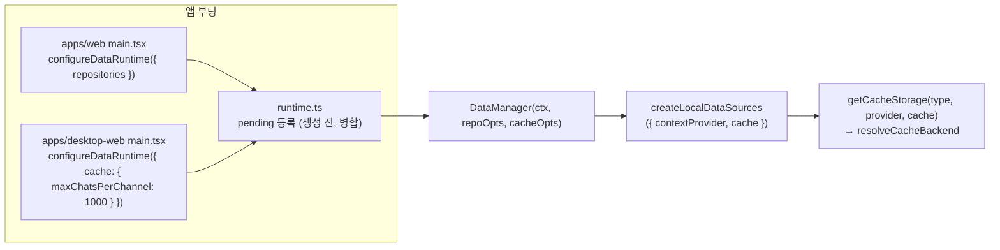

# 캐시 저장소 라우팅 (Cache Storage Routing)

> 상태: Live · 최종 갱신: 2026-08-14 · 관련 ADR: [ADR-0051](../../../../docs/adr/0051-cache-storage-routing-simplification.md) · [ADR-0053](../../../../docs/adr/0053-per-domain-cache-contract-versions.md)
>
> "설치된 앱이 이 도메인을 저장할 수 있는가"라는 판정 하나는 이 문서가 아니라
> [cache-contract-versions.md](cache-contract-versions.md)가 소유한다. 이 문서는 그 답을 포함한
> **라우팅 결정 전체**를 다룬다.

## 목적

"이 캐시 타입은 어떤 저장소에 저장되는가"라는 질문에 **한 곳에서** 답한다.

역사적으로 이 답은 Hot(IndexedDB)+Cold(NativeDB) 2-tier 전략 계층이 담당했지만, 네이티브가
Cold-only로 전환된 뒤 실질 결정은 "타입별로 웹 저장소(IndexedDB)냐 네이티브 저장소(SQLite)냐"
하나로 줄었다. 이제 그 결정은 선언적 라우팅 함수 하나(`resolveCacheBackend`)가 내리고, 죽은
2-tier 기계는 제거됐으며, 조립부는 `remoteFactory` 결의 상태 없는 함수다.

## 설계 원칙

- **라우팅 결정은 단일 지점.** 새 캐시 타입을 추가하거나 저장 위치를 바꿀 때 수정하는 곳은
  라우팅 모듈 하나여야 한다. 팩토리·어댑터·앱 코드에 라우팅 분기를 추가하지 않는다.
- **핀과 게이트는 사유와 함께 선언한다.** 특정 타입을 웹에 고정할 때는 테이블 항목에 이유(버그
  우회, 스큐 방어)를 주석으로 남긴다. **사유가 사라지면 항목도 지운다** — `profile`이 그렇게
  들어왔다 나갔다(네이티브 writer 수정 배포 후 제거).
- **팩토리는 상태가 없다.** 데이터 레이어 팩토리 3형제(local/remote/repository)는 모두
  "받아서 조립해 반환"만 한다. 모듈 레벨 뮤터블 상태는 물리 공유 자원(공유 IndexedDB 연결)과
  런타임 싱글톤(runtime.ts)에만 허용한다.
- **앱 정책은 조립 시점에 주입한다.** chat 상한 같은 앱별 정책은 부팅 순서에 의존하는 세터가
  아니라 데이터 런타임 조립 옵션(`CacheAssemblyOptions`)으로 전달한다.
- **웹 선배포 스큐는 보수적으로 판정한다.** 네이티브가 지원을 보고하지 않은 타입은 웹
  저장소로 보낸다 — 이른 판정은 틀린 게 아니라 보수적일 뿐이어야 한다([nativeCacheSupport](../../src/data/nativeCacheSupport.ts) 참고).
- **단, 그 보수성이 안전하지 않은 도메인이 있다.** 서버에 목록 API가 없어 캐시가 곧 권위인
  도메인(`invitecloud`)은 웹 저장소로 보내는 것이 내구성 하락이 아니라 **소실**이다. 핀도 게이트도
  이 도메인에는 쓰지 않는다 — [cache-contract-versions.md](cache-contract-versions.md)의 도메인 분류.

## 시나리오

1. **네이티브 WebView, 일반 타입(chat 등).** `resolveCacheBackend('chat')` → 환경=native,
   핀 없음, chat은 프로즌 레거시 지원 집합에 포함 → `'native'`. NativeDBAdapter(SQLite)가
   저장을 담당한다. WebView IndexedDB가 OS에 의해 비워져도 데이터가 살아남는다.
2. **웹 핀 테이블은 현재 비어 있다.** `profile`이 여기 있었으나(네이티브 writer가 프로필 소유자
   uid를 스코프 uid로 덮어써 장소 멤버 전원이 한 키로 뭉개지던 버그) `ProfileDataSource.serialize`
   수정이 배포되면서 제거됐다. 핀은 임시 방편이지 거처가 아니다 — 네이티브의 durability를 OS가
   비울 수 있는 웹 저장소와 맞바꾸는 것이라, 서버가 다시 만들어줄 수 있는 데이터에만 쓴다.
3. **네이티브 WebView, 앱보다 새로운 타입.** 웹이 앱보다 먼저 배포되므로 웹만 아는 타입이
   생긴다. 레거시 집합에 없고 핸드셰이크 보고에도 없음 → `'web'`. 구형 앱의 `default:` 암이
   `null`+`success:true`로 답해 "영원히 빈 캐시"가 되는 함정을 피한다. 이후 앱 업데이트가
   해당 타입을 보고하면 `'native'`로 복귀한다.
4. **일반 브라우저(apps/web, admin-v2, desktop-web).** 네이티브 브리지 없음 → 모든 타입
   `'web'`. chat은 조립 옵션 `maxChatsPerChannel`이 주입된 경우에만 채널당 상한이
   걸린다(미주입=무제한).
5. **라우팅을 우회하는 경로는 없다.** 초대 클라우드를 웹 IndexedDB에서 네이티브로 회수하던
   일회성 마이그레이션과 그 전용 웹 리더(`createWebInviteCloudStorage`)는 ADR-0053에서 함께
   제거됐다. 저장소는 예외 없이 `resolveCacheBackend`가 정한다 —
   [invite-cloud-durability.md](invite-cloud-durability.md).

## 다이어그램

## 상세 구현

**[cacheStorageRouting.ts](../../src/data/cacheStorageRouting.ts)** — 라우팅 결정의 단일 지점.

- `resolveCacheBackend(type) → 'web' | 'native'`: ① 브라우저 환경이면 `'web'`
  ② `WEB_PINNED_CACHE_TYPES`(현재 비어 있음 — 항목마다 사유 주석 필수)면 `'web'`
  ③ `isNativeCacheTypeUsable(type)` 부정이면 `'web'` ④ 그 외 `'native'`.
- `isNativeApp()`(환경 축)도 여기 산다. 순수 판정 모듈 — I/O·어댑터 생성 없음.

**[localFactory.ts](../../src/data/factories/localFactory.ts)** — 상태 없는 조립.

- `getCacheStorage(type, contextProvider, cache?)`: 라우팅 결과를 어댑터로 실체화만 한다 —
  `'web'`이면 IndexedDBAdapter(chat이면 `cache?.maxChatsPerChannel` 동반), `'native'`면
  NativeDBAdapter. chat 상한은 무조건 동반해도 안전하다: 어댑터가 chat 외 타입에서 무시하고,
  네이티브 WebView의 chat은 레거시 집합 보장으로 항상 `'native'`라 웹 경로를 타지 않는다.
- 공유 `IndexedDBDatabase`가 **유일한 모듈 상태**(물리 공유 자원)다.
- `getGlobalCacheSearchSource()`: 환경 직결 — 네이티브면 `NativeGlobalSearchSource`(SQLite가
  source of truth), 아니면 `IndexedDbGlobalSearchSource`(ADR-0033: 기대 동작 동일).
- `createLocalDataSources({ contextProvider, cacheStorageFactory?, cache? })`: `cache`를 기본
  팩토리 클로저에 바인딩해 storage 묶음을 조립한다.

**[runtime.ts](../../src/data/runtime.ts)** — 앱 정책의 pre-boot 등록.

- `configureDataRuntime({ repositories?, cache? })`: 런타임 싱글톤 생성 전 등록. 두 정책 종류를
  각각 따로 등록할 수 있도록 호출은 **병합**된다(apps/web은 `repositories`, desktop-web은 `cache`).
  늦은 호출은 경고 후 무시(레포지토리·스토리지는 DataManager 생성자에서 1회 조립되므로).
- `getDataRuntime()`이 pending 등록을 `DataManager(ctx, repoOpts, cacheOpts)`로 전달한다.

**[nativeCacheSupport.ts](../../src/data/nativeCacheSupport.ts)** — 핸드셰이크 게이트.

- 앱이 보고한 도메인 계약 판번호와 웹이 요구하는 판번호를 비교해 `isNativeCacheTypeUsable`을
  판정한다. 판정 규칙·보고 형식·로컬 권위 도메인 예외는 모두
  [cache-contract-versions.md](cache-contract-versions.md)가 소유한다.

**삭제된 것들** — `HotColdCacheStorageStrategy`·`AppPolicyResolver`·read-policy 표
(`cacheStorageStrategies.ts` 전체)와 `@chatic/data`의 `DynamicCacheStorage`·
`defaultPolicies`·`dynamicCacheTypes`(eviction/capacity/stampede 포함). 복원이 필요하면 git
이력(ADR-0051 삭제 커밋)에서 찾는다. `stableHash`는 라이브 데이터 소스가 써서 남았다.

## 검증 방법

- [localFactory.test.ts](../../src/data/factories/localFactory.test.ts) — 라우팅 계약: 개별 케이스 5종 + **전 타입 × 양 환경
  매트릭스 테스트**(라우팅 변화가 부수효과로 스며들 수 없게 고정) + chat 상한 주입 2종.
- [runtime.test.ts](../../src/data/runtime.test.ts) — 옵션 주입 경로: `repositories`·`cache`가 각각
  DataManager에 도달하는지, 여러 호출이 병합되는지, 늦은 등록이 무시되는지.
- [nativeCacheSupport.test.ts](../../src/data/nativeCacheSupport.test.ts) — 게이트 판정. 상세는
  [cache-contract-versions.md](cache-contract-versions.md)의 검증 방법 절이 소유한다.
- 실행: `libs/app-runtime`에서 `../../node_modules/.bin/jest`(libs/data도 동일 명령).
- **타입체크는 반드시 `npx tsc -b libs/app-runtime/tsconfig.lib.json`으로 한다.** 각 lib의
  `tsconfig.json`은 `files: []` + `include: []`인 solution 파일이라 그 디렉터리에서 `tsc --noEmit`을
  돌리면 **아무 파일도 검사하지 않고 성공한다**(0건 검사 = exit 0). 실제로 이 함정 때문에 배럴
  이동 후의 깨진 import가 한 커밋 늦게 발견됐다.
- `apps/web`은 TS project reference로 lib의 `dist/*.d.ts`를 보므로, 배럴을 바꾼 뒤에는 lib을 먼저
  빌드해야 앱 타입체크에 반영된다.
