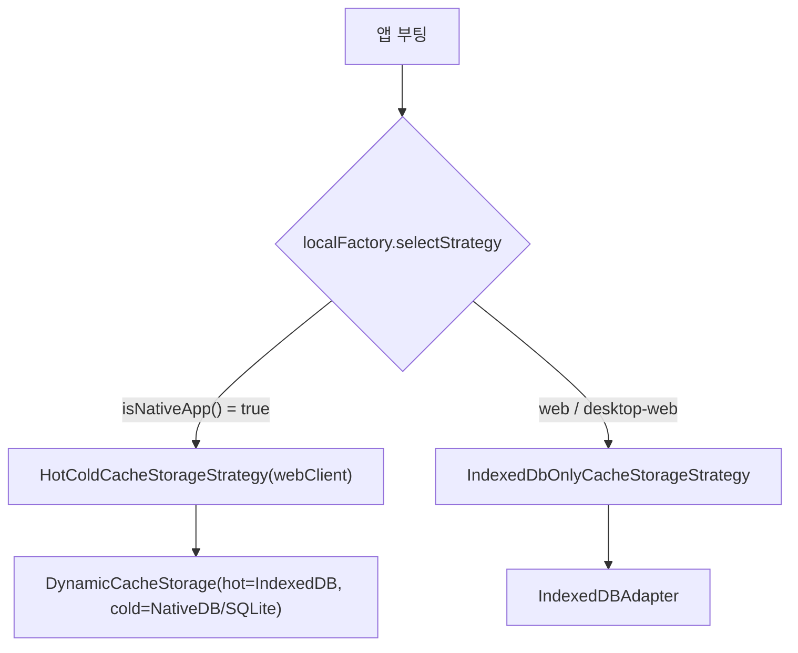
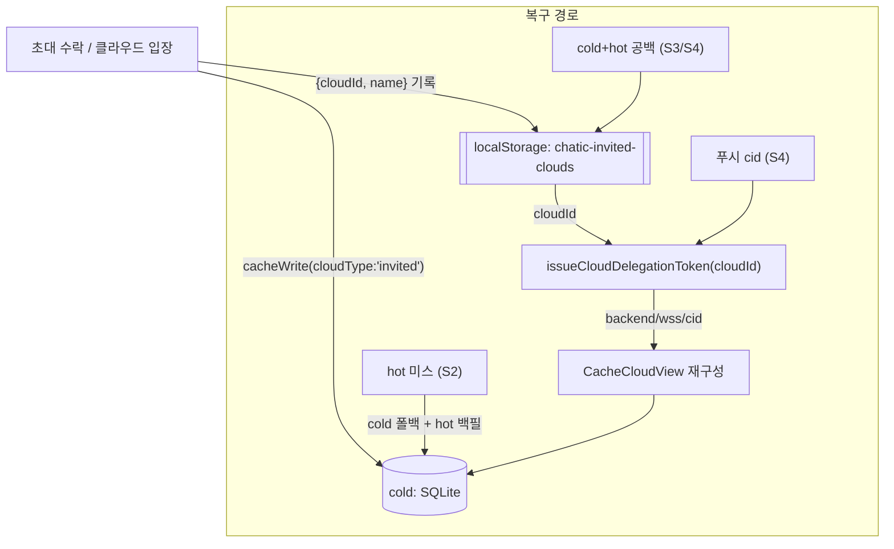
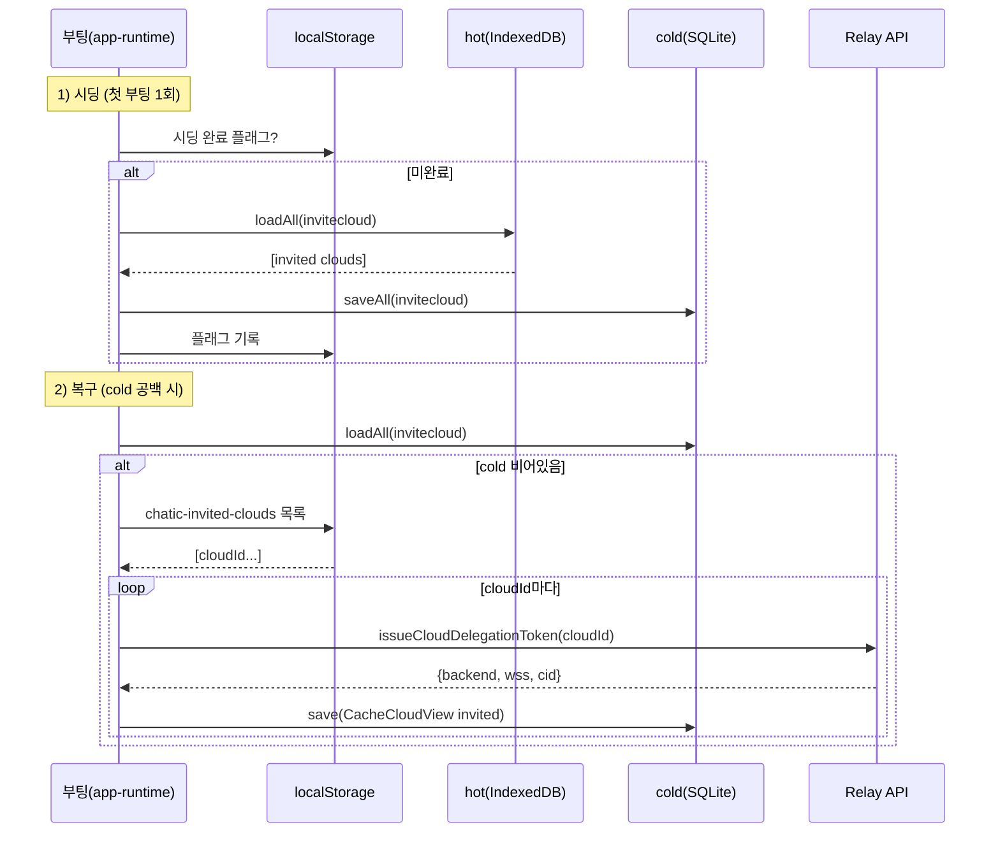

# Cold DB 활성화 · 초대클라우드 마이그레이션/복구

> 상태: Live · 최종 갱신: 2026-07-24 · 관련 ADR: [ADR-0030](../../../../docs/adr/0030-app-runtime-cold-db-migration-and-invite-cloud-recovery.md)
>
> Hot/Cold 캐시 머신 자체의 설계는 [hot-cold-cache-strategy.md](../../../../docs/specs/cache/hot-cold-cache-strategy.md)가 소유한다. 이 문서는 그 전략을 **모바일에서 실제로 켜는 것**과, 그 전환에 필요한 **초대클라우드 마이그레이션/복구**만 다룬다.

## 목적

`libs/app-runtime`의 Hot/Cold 2-tier 캐시 머신(`DynamicCacheStorage`: cold=진실원본, hot=파생캐시)은 이미
완성·테스트돼 있으나, `factories/localFactory.ts`의 `selectStrategy()`가 모든 환경에서
`IndexedDbOnlyCacheStorageStrategy`를 하드리턴해 cold(native SQLite) 계층이 휴면 상태다.

이 작업은 **모바일(native WebView)에서 cold 계층을 실제로 활성화**한다. 그런데 이미 배포된 유저의 캐시는
전부 hot(IndexedDB)에만 있고 cold(SQLite)는 비어 있어, 전환이 두 가지 문제를 유발한다.

1. cold-first 읽기 경로(`join`, 커서 기반 `chat`)가 cold 공백으로 잠깐 파손될 수 있다.
2. **초대클라우드(`cloudType: 'invited'`)** 는 어떤 sync/list API에도 없는 로컬 전용 데이터라, cold로 옮기지
   않으면 서버에서 되살릴 방법이 없다. 게다가 "hot 캐시에서 초대클라우드가 가끔 사라지는" 문제가 실제
   관측된다.

목표: cold 활성화 + 초대클라우드를 durable하게 보관/복구해서, 위 두 문제 없이 안전하게 전환한다.

## 설계 원칙

1. **cold = 진실원본, hot = 파생캐시** — hot/cold 머신의 기존 불변식을 그대로 따른다. hot 유실은
   `DynamicCacheStorage`의 `hot 미스 → cold 폴백 → hot 재백필`로 자가복구된다.
2. **서버에서 되살릴 수 있는 건 옮기지 않는다** — 명시적 마이그레이션 대상은 서버 출처가 없는
   `invitecloud`뿐. 나머지 타입은 정상 사용 중 서버 재수화 + cold-first 쓰기로 자연 충전된다.
3. **초대클라우드의 엔드포인트는 로컬에 영구 복제하지 않고, cloudId만 있으면 릴레이에서 재발급받는다** —
   `issueCloudDelegationToken(cloudId)`가 `backend`/`wss`/`cid`를 돌려주므로, 캐시가 비어도 cloudId 목록만
   살아있으면 복구 가능하다.
4. **캐시 DB와 별개인 저장소에 복구 씨앗을 둔다** — 초대클라우드 id 레지스트리는 캐시 DB(IndexedDB/SQLite)와
   독립인 저장소(localStorage)에 두어 캐시 클리어에도 살아남게 한다.
5. **모바일에만 적용** — cold는 네이티브 브릿지가 있는 모바일에만 존재한다. 웹/데스크톱-웹은
   `IndexedDbOnlyCacheStorageStrategy`를 그대로 유지한다.

## 범위

**포함**

- `selectStrategy()`를 네이티브에서 `HotColdCacheStorageStrategy`로 전환(+ `webClient` 브릿지 주입,
  `AppPolicyResolver` 유지).
- 첫 부팅 시 `invitecloud` 타입만 hot→cold 일회 시딩(영구 완료 플래그).
- 초대클라우드 id 레지스트리(localStorage `chatic-invited-clouds` 부활) write 지점 추가.
- 부팅 복구: cold에 초대클라우드가 없고 레지스트리에 id가 있으면 릴레이 재발급으로 cold 재구성.
- 푸시 안전망(best-effort): 유효한 `cid` 푸시 도착 시 재구성 + 해당 클라우드 채널 재싱크.

**제외**

- 웹/데스크톱-웹 캐시 전략 변경.
- `chat`을 포함한 다른 타입의 명시적 시딩.
- 앱 재설치 등으로 localStorage까지 소실 + 푸시 `cid`도 빈 경우의 완전 소실 복구 →
  푸시 페이로드 확장 또는 `view=invited` 열거 API 등 **백엔드 지원 필요, 후속 과제**(ADR-0030 참조).

## 시나리오

### S1. 기존 배포 유저의 첫 부팅 (cold 활성화 직후)

1. 네이티브 WebView 부팅 → `selectStrategy()`가 `HotColdCacheStorageStrategy` 반환.
2. 시딩 완료 플래그(localStorage) 미존재 → 시딩 실행: hot(IndexedDB)의 `invitecloud` 행 전체를 읽어
   cold(SQLite)로 `saveAll`. 완료 후 플래그 기록.
3. 이후 정상 사용 중 서버 재수화(sync/fetch)가 일어나면 채널/조인/채팅 등이 cold-first 쓰기로 cold에 채워짐.
4. 전환 직후 첫 재싱크 전까지 `join`(readNo)·커서 `chat`은 잠깐 공백일 수 있으나 재싱크로 복원됨.

### S2. hot 캐시에서 초대클라우드가 사라짐 (통상 케이스, 코드 추가 없이 자가복구)

1. 어떤 이유로 hot(IndexedDB)에서 `invitecloud` 행이 사라짐. cold(SQLite)에는 남아있음.
2. UI가 초대클라우드를 읽음 → `invitecloud`는 hot-first지만 hot 미스.
3. `DynamicCacheStorage`가 cold 폴백 → cold 값 반환 + hot 재백필. 초대클라우드가 자동 복구됨.

### S3. cold·hot 둘 다 비었지만 복구 (캐시 클리어 시나리오)

1. 캐시 DB(IndexedDB/SQLite)가 통째로 비워짐. 그러나 localStorage 레지스트리 `chatic-invited-clouds`는 생존.
2. 부팅 시 복구 루틴: cold에 `invitecloud`가 없고 레지스트리에 cloudId 목록이 있음을 감지.
3. 각 cloudId에 대해 `issueCloudDelegationToken(cloudId)` 호출 → `backend`/`wss`/`cid` 재발급.
4. `CacheCloudView { id, cid, name(레지스트리), backend, wss, cloudType:'invited' }`를 재구성해 cold에 write.
5. 초대클라우드 목록 복원 완료.

### S4. 초대클라우드 없는 상태에서 푸시 도착 (푸시 안전망, best-effort)

1. 푸시 도착. 페이로드 `cid`가 유효(비어있지 않음).
2. 그 `cid`로 S3와 동일하게 재구성(레지스트리에 없어도 cid만으로 재발급 시도) + 해당 클라우드 채널 재싱크.
3. 푸시 `cid`가 비어있으면(배포 백엔드 다수) 어느 클라우드인지 특정 불가 → 안전망 미작동(후속 과제).

## 다이어그램

### 전략 선택 (변경 지점)

### 초대클라우드 durability 흐름

### 부팅 시딩 + 복구 순서

## 상세 구현

### 1) 전략 활성화 — `localFactory.ts`

- 현재 `selectStrategy()`는 TODO와 함께 `IndexedDbOnlyCacheStorageStrategy`를 하드리턴한다
  ([localFactory.ts:27-33](../../src/data/factories/localFactory.ts:27)).
- 변경: `isNativeApp()`([localFactory.ts:16-18](../../src/data/factories/localFactory.ts:16))이면
  `new HotColdCacheStorageStrategy(webClient, { policyResolver: new AppPolicyResolver() })` 반환.
  브릿지는 `@chatic/bridges`의 싱글턴 `webClient`([provider.ts:11](../../../bridges/src/provider.ts:11))를 주입한다.
- `HotColdCacheStorageStrategy`([cacheStorageStrategies.ts:132-171](../../src/data/cacheStorageStrategies.ts:132))와
  `AppPolicyResolver`(`join`만 cold-first,
  [cacheStorageStrategies.ts:64-84](../../src/data/cacheStorageStrategies.ts:64))는 그대로 사용.
- **전제(확인됨)**: cold 계층이 참조하는 8개 CacheType(`channel/chat/user/join/site/invitecloud/profile/meta`)은
  모두 네이티브 CRUD 서비스([CacheCrudService.ts](../../../../apps/mobile/src/app/services/cache/CacheCrudService.ts))의
  fetch/save/delete/clear 스위치에 매핑돼 있다. TODO가 우려한 "미등록 타입 충돌"은 해소된 상태라 플립이 안전하다.
- 전략은 module-level로 메모이즈해 8개 타입이 한 인스턴스/`AppPolicyResolver`를 공유한다.

### 2) 초대클라우드 시딩 — 첫 부팅 1회

- 위치: `reconcileInvitedCloudsIntoCold()`
  ([invitedCloudColdSync.ts](../../src/data/invitedCloudColdSync.ts)) 내부. 별도 hot/cold 핸들을 만들지 않고
  리포지토리 공개 API만 쓴다: `cloud.cacheReadList()`(invitecloud는 hot-first → 기존 hot 데이터 반환)로 읽고,
  `cloud.cacheWriteMany(invited)`(쓰기는 cold-first)로 되써서 cold에 시딩한다.
- 완료 플래그: localStorage `chatic-invitecloud-cold-seeded`. 있으면 대량 되쓰기를 건너뛴다. 초대클라우드는
  global scope로 저장되므로(`libs/data/.../storages/utils.ts`의 invitecloud 스코프 예외) 스코프는
  리포지토리가 그대로 보존한다.

### 3) 초대클라우드 레지스트리 — `chatic-invited-clouds` 부활

- 이 키는 정의만 돼 있고([cloudCore.ts:12](../../../web-core/src/session/core/cloudCore.ts:12)) `clearSession`에서
  제거만 되던 죽은 키였다. `cloudCore`에 `getInvitedCloudRegistry`/`upsertInvitedCloud`/`removeInvitedCloud`를
  추가하고 web-core 루트에서 standalone 함수로 노출한다.
- write 지점: 초대 수락 `cloud.cacheWrite(... cloudType:'invited')` 직후 `upsertInvitedCloud({cloudId, name})`
  ([useInviteAccept.ts](../../../../apps/web/src/app/features/home/hooks/useInviteAccept.ts)). owner 승격 시
  `useReconcileInvitedClouds`가 캐시 삭제와 함께 `removeInvitedCloud`를 호출한다
  ([useReconcileInvitedClouds.ts](../../../../apps/web/src/app/features/home/hooks/useReconcileInvitedClouds.ts)).
- 부팅 시 `reconcileInvitedCloudsIntoCold`가 현재 캐시된 invited 목록으로 레지스트리를 backfill하므로, 이
  기능 이전에 초대를 수락한 기존 유저도 durable하게 등록된다.
- 저장 매체: localStorage(캐시 DB와 독립, 캐시 클리어에도 생존).

### 4) 부팅 복구 + 5) 푸시 안전망

- 부팅 복구: `reconcileInvitedCloudsIntoCold`가 현재 캐시 목록에 없는 레지스트리 id마다
  `issueCloudDelegationToken(cloudId)`([users.ts:38](../../../web-core/src/api/users.ts:38))로 backend/wss/cid를
  재발급 → `CacheCloudView`([cache.ts:60-69](../../../app-messages/src/types/model/cache.ts:60))로 재구성 →
  `cloud.cacheWrite`. 릴레이 호출은 `switchCloudSession`에서 이미 쓰이던 경로다
  ([services.ts:350-357](../../../web-core/src/session/services.ts:350)).
- 푸시 안전망: `recoverInvitedCloudIfMissing(cloud, cid)`가 캐시에 없는 클라우드만 위와 동일하게 재구성한다.
  마운트는 `InvitedCloudColdSyncRunner`
  ([apps/web/.../runtime/InvitedCloudColdSyncRunner.tsx](../../../../apps/web/src/app/runtime/InvitedCloudColdSyncRunner.tsx))가
  `useOnReceiveNotification`으로 푸시를 구독해 `data.cid`를 넘긴다. `cid`가 빈 경우 no-op(완전 소실은 후속 과제).
- 마운트: 위 Runner를 AppRuntime에 배치해 부팅 훅 `useInvitedCloudColdRecovery`(네이티브 한정 1회)와 푸시
  구독을 함께 건다.

## 검증 방법

- **단위 테스트**
    - 레지스트리 (6): [cloudCore.registry.test.ts](../../../web-core/src/session/core/cloudCore.registry.test.ts) —
      빈 목록, 삽입, id 병합(name 갱신), cloudId 없는 항목 무시, 삭제, 손상 JSON 내성.
    - coldSync (9): [invitedCloudColdSync.test.ts](../../src/data/invitedCloudColdSync.test.ts) — 레지스트리
      backfill, 시딩 1회(플래그 가드), 빈 목록도 플래그 기록, 누락 id 재발급 복구, 캐시에 이미 있으면 미발급,
      grant 소실 시 skip; 푸시 복구의 빈 cid/기존 캐시 no-op와 재구성.
    - 실행: `cd libs/app-runtime && npx jest invitedCloudColdSync`,
      `npx nx test web-core -- --testPathPatterns=cloudCore.registry`.
    - `localFactory.selectStrategy` 플립은 module-level 메모이즈 + jsdom의 indexedDB 부재로 유닛 테스트가 취약해
      두지 않는다. 선택되는 전략 클래스(`HotColdCacheStorageStrategy`/`IndexedDbOnlyCacheStorageStrategy`)는
      hot-cold 스펙에서 이미 검증됐고, 플립 자체는 아래 수동 QA로 커버한다.
- **수동 QA (네이티브 WebView)**
    - 기존 캐시 보유 기기 업데이트 후: 초대클라우드 목록 유지, 채팅/조인 재싱크 후 정상.
    - IndexedDB만 초기화 → 초대클라우드 자가복구(S2).
    - 캐시 DB 전체 초기화(localStorage 유지) → 부팅 복구(S3).
- **런타임 로깅**: `CacheErrorReporter`로 cold 폴백/에러 빈도 관찰(hot-cold 스펙 §7 재사용).
