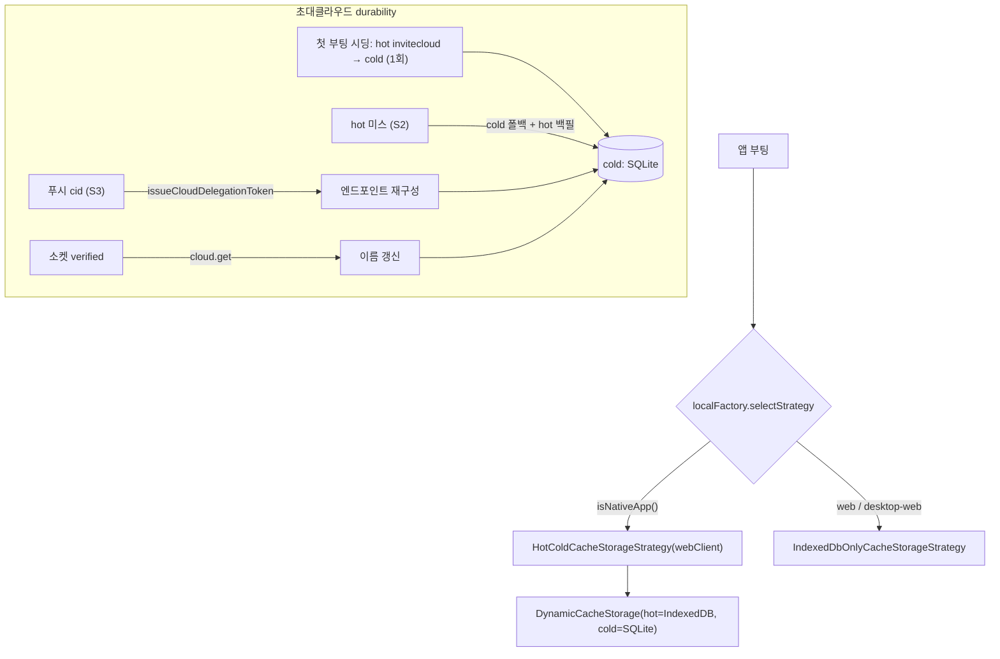

# Cold DB 활성화 · 초대클라우드 마이그레이션/복구

> 상태: Live · 최종 갱신: 2026-07-27 · 관련 ADR: [ADR-0030](../../../../docs/adr/0030-app-runtime-cold-db-migration-and-invite-cloud-recovery.md)
>
> Hot/Cold 캐시 머신 자체의 설계는 [hot-cold-cache-strategy.md](../../../../docs/specs/cache/hot-cold-cache-strategy.md)가 소유한다. 이 문서는 그 전략을 **모바일에서 실제로 켜는 것**과, 그 전환에 필요한 **초대클라우드 마이그레이션/복구**만 다룬다.

## 목적

`libs/app-runtime`의 Hot/Cold 2-tier 캐시 머신(`DynamicCacheStorage`: cold=진실원본, hot=파생캐시)은 완성돼
있으나 `factories/localFactory.ts`의 `selectStrategy()`가 모든 환경에서 IndexedDB-only를 반환해 cold(native
SQLite) 계층이 휴면 상태였다. 이 작업은 **모바일에서 cold 계층을 활성화**하고, 그 전환에서 유일하게 문제가
되는 **초대클라우드**(`cloudType: 'invited'`)를 안전하게 다룬다.

초대클라우드는 어떤 sync/list API에도 없는 **로컬 전용 데이터**라, cold로 옮기지 않으면 서버에서 되살릴 수
없다. 게다가 "hot 캐시에서 초대클라우드가 가끔 사라지는" 문제도 관측된다.

## 설계 원칙

1. **cold = 진실원본, hot = 파생캐시** — hot 유실은 `DynamicCacheStorage`의 `hot 미스 → cold 폴백 → hot 재백필`로
   자가복구된다.
2. **캐시 DB가 초대클라우드의 단일 원천** — 별도의 병행 저장소(localStorage 레지스트리 등)를 두지 않는다.
   두 원천은 divergence로 데이터가 꼬일 수 있어 의도적으로 배제한다.
3. **서버에서 되살릴 수 있는 건 옮기지 않는다** — 명시적 마이그레이션(시딩) 대상은 서버 출처가 없는
   `invitecloud`뿐. 나머지 타입은 서버 재수화 + cold-first 쓰기로 자연 충전된다.
4. **엔드포인트는 로컬에 영구 복제하지 않고 relay에서 재발급** — `issueCloudDelegationToken(cloudId)`가
   `backend`/`wss`/`cid`를 돌려주므로, cid만 알면 재구성할 수 있다.
5. **모바일에만 적용** — cold는 네이티브 브릿지가 있는 모바일에만 존재한다. 웹/데스크톱-웹은 IndexedDB-only 유지.

## 범위

**포함**

- `selectStrategy()`를 네이티브에서 `HotColdCacheStorageStrategy`로 전환(+ `webClient` 주입, `AppPolicyResolver`).
- 첫 부팅 시 `invitecloud` 타입만 hot→cold 일회 시딩(localStorage 완료 플래그).
- 푸시 안전망: 유효한 `cid` 푸시 도착 시 relay 재발급으로 초대클라우드 엔드포인트 재구성.
- 이름 동기화: 초대클라우드 소켓 verified 시 `cloud.get`으로 권위있는 이름 갱신.

**제외**

- 웹/데스크톱-웹 캐시 전략 변경, `chat` 등 다른 타입의 명시적 시딩.
- **cold·hot 둘 다 비워진 완전 초기화(앱 재설치·캐시 전체 삭제)의 프론트 복구** — 단일 원천 원칙상 별도 durable
  저장소를 두지 않으므로 복구 불가. 푸시 페이로드에 `cid`/`backend` 탑재, 또는 초대클라우드 열거
  API(`view=invited`) 등 **백엔드 지원 필요, 후속 과제**(ADR-0030 참조).

## 시나리오

### S1. 기존 배포 유저의 첫 부팅 (cold 활성화 직후)

1. 네이티브 WebView 부팅 → `selectStrategy()`가 `HotColdCacheStorageStrategy` 반환.
2. 시딩 완료 플래그 미존재 → hot(IndexedDB)의 `invitecloud` 행을 읽어 cold(SQLite)로 `cacheWriteMany`. 플래그 기록.
3. 이후 정상 사용 중 채널/조인/채팅 등은 서버 재싱크의 cold-first 쓰기로 cold에 채워짐.

### S2. hot 캐시에서 초대클라우드가 사라짐 (자가복구, 코드 추가 없음)

1. hot(IndexedDB)에서 `invitecloud` 행이 사라짐. cold(SQLite)에는 남아있음.
2. UI가 읽음 → hot 미스 → `DynamicCacheStorage`가 cold 폴백 + hot 재백필. 자동 복구.

### S3. 초대클라우드 없는 상태에서 푸시 도착 (푸시 안전망, best-effort)

1. 푸시 도착. 페이로드에서 `cid` 추출(중첩 `payload` 우선, top-level fallback).
2. `cid`가 유효하고 캐시에 없으면 `issueCloudDelegationToken(cid)`로 엔드포인트 재구성 → cold write.
3. 이후 그 클라우드에 접속(verified)하면 `cloud.get`으로 이름이 채워짐.
4. `cid`가 비었으면(배포 백엔드 다수) 특정 불가 → no-op(후속 과제).

## 다이어그램

## 상세 구현

### 1) 전략 활성화 — `localFactory.ts`

- `isNativeApp()`([localFactory.ts:16](../../src/data/factories/localFactory.ts:16))이면
  `new HotColdCacheStorageStrategy(webClient, { policyResolver: new AppPolicyResolver() })` 반환, 아니면
  `IndexedDbOnlyCacheStorageStrategy`. 전략은 module-level 메모이즈(8개 타입이 한 인스턴스 공유).
  브릿지는 `@chatic/bridges`의 싱글턴 `webClient`.
- **전제(확인됨)**: 8개 CacheType이 네이티브 CRUD 서비스
  ([CacheCrudService.ts](../../../../apps/mobile/src/app/services/cache/CacheCrudService.ts))에 모두 매핑됨.

### 2) 시딩 · 3) 복구 · 4) 이름 동기화 — `invitedCloudColdSync.ts`

[invitedCloudColdSync.ts](../../src/data/invitedCloudColdSync.ts)

- `reconcileInvitedCloudsIntoCold(cloud)` — 첫 부팅 1회. 플래그 없으면 `cacheReadList`(hot-first)로 invited를
  읽어 `cacheWriteMany`(cold-first)로 되써 cold에 시딩, 플래그 기록. **별도 레지스트리 없음** — 캐시 DB가 단일 원천.
- `recoverInvitedCloudIfMissing(cloud, cid)` — 캐시에 없는 cid만 `rehydrateInvitedCloud`(relay 재발급 →
  엔드포인트 cacheWrite)로 재구성. 이름은 넣지 않음(연결 후 채움).
- `syncInvitedCloudName(cloud, cid)` — active cloud가 invited이고 소켓 verified일 때 `cloud.getCloud({ id })`로
  권위있는 이름을 받아 cacheWrite. 릴레이 delegation 토큰엔 이름이 없어 이게 유일한 이름 출처.
- 훅: `useInvitedCloudColdRecovery`(부팅 1회 시딩), `useInvitedCloudNameSync`(verified 시 이름 동기화). 마운트는
  [InvitedCloudColdSyncRunner.tsx](../../../../apps/web/src/app/runtime/InvitedCloudColdSyncRunner.tsx)가 AppRuntime에서.
  푸시는 이 Runner가 `useOnReceiveNotification` + `extractPushContext`로 cid를 뽑아 `recoverInvitedCloudIfMissing` 호출.

## 검증 방법

- **단위 테스트** ([invitedCloudColdSync.test.ts](../../src/data/invitedCloudColdSync.test.ts))
    - 시딩: invited만 필터해 1회 `cacheWriteMany` + 플래그, 빈 목록도 플래그, 플래그 있으면 재read/재seed 안 함.
    - 푸시 복구: 빈 cid/기존 캐시 no-op, 누락 cid는 엔드포인트 재구성, relay 실패 시 swallow.
    - 이름 동기화: non-invited/이름 동일/실패 시 no-op, 변경 시 cacheWrite.
    - 실행: `cd libs/app-runtime && npx jest invitedCloudColdSync`.
    - `selectStrategy` 플립은 module-level 메모이즈 + jsdom indexedDB 부재로 유닛 테스트가 취약해 수동 QA로 커버.
- **수동 QA (네이티브 WebView)**: 업데이트 후 초대클라우드 유지 / IndexedDB만 초기화 시 자가복구(S2) / 푸시 복구(S3).
