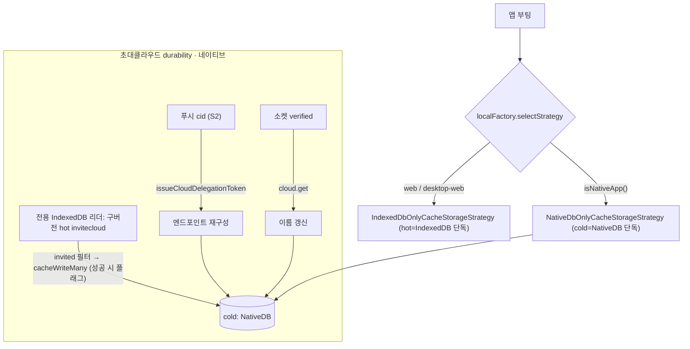

# Cold DB 활성화 · 초대클라우드 마이그레이션/복구

> 상태: Live · 최종 갱신: 2026-07-28 · 관련 ADR: [ADR-0030](../../../../docs/adr/0030-app-runtime-cold-db-migration-and-invite-cloud-recovery.md)
>
> Hot/Cold 캐시 머신 자체의 설계는 [hot-cold-cache-strategy.md](../../../../docs/specs/cache/hot-cold-cache-strategy.md)가 소유한다. 이 문서는 그 전략을 **모바일에서 실제로 켜는 것**과, 그 전환에 필요한 **초대클라우드 마이그레이션/복구**만 다룬다.
>
> **⚠️ 최신 상태(2026-07-28)**: ADR-0030이 채택한 2-tier(`HotColdCacheStorageStrategy`) 전환은
> [`796aa3cf`](../../src/data/factories/localFactory.ts)에서 **플랫폼별 단일 티어로 대체**되었다 —
> 네이티브는 cold(NativeDB) 단독, 웹/데스크톱-웹은 hot(IndexedDB) 단독. 2-tier의 cold-first 쓰기 게이트와
> cold-미스→hot 폴백 부재가 네이티브에서 채널/채팅 목록을 빈 목록으로 만들었기 때문이다. 따라서 아래
> 시나리오는 이 단일-티어 현실 기준으로 갱신되었고, `DynamicCacheStorage` 기반 자가복구(옛 S2)는 더 이상
> 존재하지 않는다.

## 목적

`libs/app-runtime`의 캐시 계층은 플랫폼별 **단일 티어**로 동작한다: 네이티브 WebView는 cold(NativeDB/SQLite)
단독, 웹/데스크톱-웹은 hot(IndexedDB) 단독. 이 작업은 **모바일에서 cold 계층을 활성화**하고, 그 전환에서
유일하게 문제가 되는 **초대클라우드**(`cloudType: 'invited'`)를 안전하게 다룬다.

초대클라우드는 어떤 sync/list API에도 없는 **로컬 전용 데이터**라, cold로 옮기지 않으면 서버에서 되살릴 수
없다. 구버전(2-tier 시절) 빌드는 초대클라우드를 hot(IndexedDB)에 써 두었는데, 네이티브가 cold 단독으로
전환되면서 활성 repository는 더 이상 hot을 읽지 않는다. 그래서 구버전 hot 데이터를 cold로 넘기는
**일회성 마이그레이션 브릿지**가 필요하다.

## 설계 원칙

1. **플랫폼별 단일 티어** — 네이티브=cold(NativeDB) 단독, 웹=hot(IndexedDB) 단독. 2-tier의 hot/cold 조율
   함정(cold-first 쓰기 게이트, cold-미스→hot 폴백 부재)을 제거하기 위해 단일 티어로 간다.
2. **캐시 DB가 초대클라우드의 단일 원천** — 별도의 병행 저장소(localStorage 레지스트리 등)를 두지 않는다.
   두 원천은 divergence로 데이터가 꼬일 수 있어 의도적으로 배제한다. (완료 플래그만 localStorage에 둔다.)
3. **서버에서 되살릴 수 있는 건 옮기지 않는다** — 명시적 마이그레이션 대상은 서버 출처가 없는
   `invitecloud`뿐. 나머지 타입은 서버 재수화로 자연 충전된다.
4. **엔드포인트는 로컬에 영구 복제하지 않고 relay에서 재발급** — `issueCloudDelegationToken(cloudId)`가
   `backend`/`wss`/`cid`를 돌려주므로, cid만 알면 재구성할 수 있다.
5. **모바일에만 적용** — cold는 네이티브 브릿지가 있는 모바일에만 존재한다. 웹/데스크톱-웹은 hot(IndexedDB) 단독 유지.

## 범위

**포함**

- `selectStrategy()`를 네이티브에서 `NativeDbOnlyCacheStorageStrategy`(cold 단독), 그 외에서
  `IndexedDbOnlyCacheStorageStrategy`(hot 단독)로 전환.
- 첫 부팅 시 구버전 hot(IndexedDB)의 `invitecloud`만 cold(NativeDB)로 **일회 마이그레이션**(localStorage 완료 플래그).
  활성 전략이 cold 단독이라, hot은 전용 IndexedDB 리더로 **직접** 읽는다.
- 푸시 안전망: 유효한 `cid` 푸시 도착 시 relay 재발급으로 초대클라우드 엔드포인트 재구성.
- 이름 동기화: 초대클라우드 소켓 verified 시 `cloud.get`으로 권위있는 이름 갱신.

**제외**

- 웹/데스크톱-웹 캐시 전략 변경, `chat` 등 다른 타입의 명시적 마이그레이션.
- **cold·hot 둘 다 비워진 완전 초기화(앱 재설치·캐시 전체 삭제)의 프론트 복구** — 단일 원천 원칙상 별도 durable
  저장소를 두지 않으므로 복구 불가. 푸시 페이로드에 `cid`/`backend` 탑재, 또는 초대클라우드 열거
  API(`view=invited`) 등 **백엔드 지원 필요, 후속 과제**(ADR-0030 참조).

## 시나리오

### S1. 구버전(2-tier) 유저의 첫 부팅 (cold 단독 전환 직후)

1. 네이티브 WebView 부팅 → `selectStrategy()`가 `NativeDbOnlyCacheStorageStrategy` 반환(활성 repository = cold 단독).
2. 마이그레이션 완료 플래그 미존재 → 구버전이 hot(IndexedDB)에 남긴 `invitecloud` 행을 **전용 IndexedDB 리더로
   직접** 읽어 `cloudType: 'invited'`만 필터, cold(NativeDB)로 `cacheWriteMany`. **성공 시에만** 플래그 기록.
3. hot 읽기 실패·cold 쓰기 실패 시 플래그를 남기지 않아 다음 부팅에서 재시도(쓰기는 id 머지라 멱등).
4. 이후 정상 사용 중 채널/조인/채팅 등은 서버 재싱크의 cold 쓰기로 채워짐.

### S2. 초대클라우드 없는 상태에서 푸시 도착 (푸시 안전망, best-effort)

1. 푸시 도착. 페이로드에서 `cid` 추출(중첩 `payload` 우선, top-level fallback).
2. `cid`가 유효하고 캐시에 없으면 `issueCloudDelegationToken(cid)`로 엔드포인트 재구성 → cold write.
3. 이후 그 클라우드에 접속(verified)하면 `cloud.get`으로 이름이 채워짐.
4. `cid`가 비었으면(배포 백엔드 다수) 특정 불가 → no-op(후속 과제).

> **폐기된 S2(2-tier 자가복구)**: 예전 문서의 "hot 미스 → `DynamicCacheStorage` cold 폴백 + hot 백필"
> 시나리오는 2-tier 전용이었다. 단일 티어에서는 `DynamicCacheStorage`가 인스턴스화되지 않으므로 해당 없음.

## 다이어그램

## 상세 구현

### 1) 전략 선택 — `localFactory.ts`

- `isNativeApp()`([localFactory.ts:21](../../src/data/factories/localFactory.ts:21))이면
  `new NativeDbOnlyCacheStorageStrategy(webClient)`(cold/NativeDB 단독), 아니면
  `IndexedDbOnlyCacheStorageStrategy`(hot/IndexedDB 단독). 전략은 module-level 메모이즈(8개 타입이 한 인스턴스 공유).
  브릿지는 `@chatic/bridges`의 싱글턴 `webClient`.
- 옛 `HotColdCacheStorageStrategy`/`AppPolicyResolver`/`DynamicCacheStorage`는
  [cacheStorageStrategies.ts](../../src/data/cacheStorageStrategies.ts)에 정의만 남고 **어디에서도 인스턴스화되지 않는다.**
- **전제(확인됨)**: 8개 CacheType이 네이티브 CRUD 서비스
  ([CacheCrudService.ts](../../../../apps/mobile/src/app/services/cache/CacheCrudService.ts))에 모두 매핑됨.

### 2) 마이그레이션 · 3) 복구 · 4) 이름 동기화 — `invitedCloudColdSync.ts`

[invitedCloudColdSync.ts](../../src/data/invitedCloudColdSync.ts)

- `createHotInviteCloudStorage()`([cacheStorageStrategies.ts](../../src/data/cacheStorageStrategies.ts)) — 활성
  전략(cold 단독)을 우회해 공유 IndexedDB의 `invitecloud` 슬롯을 읽는 전용 리더. `invitecloud`는 global 스코프
  고정(`resolveScopedContext`)이라 live 컨텍스트 없이 stub provider로 안전하게 만든다.
- `reconcileInvitedCloudsIntoCold(cloud, readHotClouds)` — 첫 부팅 1회. 플래그 없으면 `readHotClouds()`(hot
  IndexedDB 직접 읽기)로 invited를 필터해 `cacheWriteMany`(cold write)로 옮긴다. **성공 시에만 플래그 기록** —
  hot 읽기·cold 쓰기 실패 시 플래그 미기록으로 다음 부팅 재시도(멱등). **별도 레지스트리 없음** — 캐시 DB가 단일 원천.
- `recoverInvitedCloudIfMissing(cloud, cid)` — 캐시에 없는 cid만 `rehydrateInvitedCloud`(relay 재발급 →
  엔드포인트 cacheWrite)로 재구성. 이름은 넣지 않음(연결 후 채움).
- `syncInvitedCloudName(cloud, cid)` — active cloud가 invited이고 소켓 verified일 때 `cloud.getCloud({ id })`로
  권위있는 이름을 받아 cacheWrite. 릴레이 delegation 토큰엔 이름이 없어 이게 유일한 이름 출처.
- 훅: `useInvitedCloudColdRecovery`(부팅 1회 마이그레이션, hot 리더를 thunk로 지연 생성), `useInvitedCloudNameSync`
  (verified 시 이름 동기화). 마운트는
  [InvitedCloudColdSyncRunner.tsx](../../../../apps/web/src/app/runtime/InvitedCloudColdSyncRunner.tsx)가 AppRuntime에서.
  푸시는 이 Runner가 `useOnReceiveNotification` + `extractPushContext`로 cid를 뽑아 `recoverInvitedCloudIfMissing` 호출.

## 검증 방법

- **단위 테스트** ([invitedCloudColdSync.test.ts](../../src/data/invitedCloudColdSync.test.ts))
    - 마이그레이션: hot 리더에서 invited만 필터해 1회 `cacheWriteMany` + 플래그, 빈 목록도 플래그, 플래그 있으면
      재read/재마이그레이션 안 함, **hot 읽기 실패·cold 쓰기 실패 시 플래그 미기록(다음 부팅 재시도)**.
    - 푸시 복구: 빈 cid/기존 캐시 no-op, 누락 cid는 엔드포인트 재구성, relay 실패 시 swallow.
    - 이름 동기화: non-invited/이름 동일/실패 시 no-op, 변경 시 cacheWrite.
    - 실행: `npx jest --config libs/app-runtime/jest.config.js invitedCloudColdSync`.
    - `selectStrategy` 플립은 module-level 메모이즈 + jsdom indexedDB 부재로 유닛 테스트가 취약해 수동 QA로 커버.
- **수동 QA (네이티브 WebView)**: 구버전에서 업데이트 후 초대클라우드 유지(S1) / 푸시 복구(S2).
