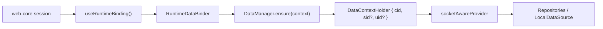

# Data Context 모델

> app-runtime이 data context(`cid`/`sid`/`uid`)를 어떻게 추적하고, cross-cloud 오염을 어떻게 막는지 다룬다. cache key 포맷과 repository 구현은 `@chatic/data`가 소유한다.

## 1. 현재 구조

data context는 **단일 mutable holder**로 추적된다.

- 전역 context는 [`useRuntimeBinding`](../../src/runtime/useRuntimeBinding.ts)이 `session.activeServer`·`cloud`·`identity`로부터 계산한다 — `cid`는 선택된 cloud(optimistic), `sid`=`activeServer.siteId`, `uid`=`identity.userId`. (프로필 파생값은 web-core가 아니라 app 레이어 `useSessionProfile`이 계산한다.)
- [`RuntimeDataBinder`](../../src/connection/RuntimeDataBinder.tsx)가 `binding.context` 변경(JSON 비교)마다 [`DataManager.ensure(context)`](../../src/data/DataManager.ts)를 호출해 holder를 갱신한다.
- `DataManager.destroy()`는 context를 `DEFAULT_CONTEXT`(`{ cid: 'default' }`)로 리셋할 뿐 **로컬 캐시를 비우지 않는다**.

## 2. cross-cloud 오염 가드

cloud 전환 시 "cache가 가리키는 cloud"와 "socket이 실제로 붙어 인증된 cloud"가 잠깐 어긋날 수 있다. 두 지점에서 이를 막는다:

- **`socketAwareProvider`** ([`DataManager.ts`](../../src/data/DataManager.ts)) — context holder를 감싸 `getContext()`마다 live `socketCid = getSocketManager().getBoundCid()`를 주입한다. repository는 socket cid와 cache context cid의 불일치를 감지해 **오염 쓰기를 스킵**한다.
- **`dropForeignFrame`** (sync plans) — sync callback도 socket `boundCid` ≠ data context cid인 frame을 버린다([../sync/README.md](../sync/README.md)).

즉 optimistic cid 선반영(전환 즉시 UI가 대상 cloud 캐시를 구독)과 실제 socket 인증 완료 사이의 window에서, 이전 cloud로 흘러온 응답이 새 cloud 캐시를 오염시키지 않는다.

## 3. 미래 방향 (미구현)

전역 mutable holder에 요청 단위 context를 수동 주입하는 것은 동시 요청 오염 위험이 있어, request-bound facade(`repositories.withContext(ctx)`)로 요청 시작 시점 snapshot을 고정하자는 설계가 논의됐다. 이는 **아직 구현되지 않았다** — 현재는 단일 holder + 위 가드로 동작한다. 도입 시 주 사용처는 디버깅/테스트로 한정하고 일반 런타임 표면에는 열지 않는 방향이다.

## 관련 문서

- [README.md](README.md) — data 도메인 스펙
- [../sync/README.md](../sync/README.md) — sync frame의 cross-cloud 가드
- [../runtime/README.md](../runtime/README.md) — `RuntimeDataBinder` / context 파생 규칙
