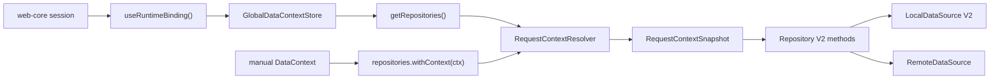
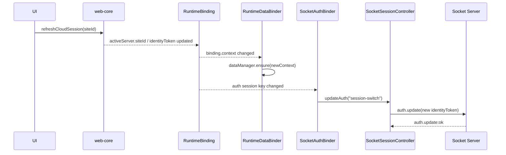

# Data Context 설계 (전역/요청 context 분리)

Date: 2026-06-23 · 상태: 확정 설계 (구현 진행 기준)

> data context 모델을 전역 추적과 요청 단위 snapshot으로 분리하는 설계 결정 기록. site 전환 후 socket `auth:update` 재실행 규칙의 정본은 [../socket/README.md](../socket/README.md) 참조.

## Decision Summary

- 선택안: **B안. 전역 context 추적과 수동 context 주입을 분리한 request-bound facade 구조**
- 기각안: **A안. 단일 mutable context holder에 set/reset override를 얹는 구조**
- 이유:
    - 현재 구조는 `DataManager -> DataContextHolder -> Repository/LocalDataSource`가 하나의 mutable context를 공유한다.
    - 이 구조에 수동 override를 그대로 추가하면 동시 요청 간 누수, 비동기 완료 시점 오염, sync/background 작업과의 충돌을 피하기 어렵다.
    - 사용자가 요구한 주입 유형은 정확히 2가지다.
        - 전역적인 context 따라가기
        - 요청 시 context 수동 주입하기
    - 다만 수동 주입은 주 사용처가 디버깅이므로, 일반 기능 surface가 아니라 제한된 debug surface로 다루는 편이 맞다.
    - 이 둘을 API 차원에서 분리해야 문맥이 단순해지고, "요청 시점 context" 규칙도 강제할 수 있다.

## 1. Goal

- 데이터 모듈의 context 모델을 단순화한다.
- context 주입 경로를 아래 2가지로 명시적으로 고정한다.
    - 기본 경로: 현재 전역 session/runtime context를 요청 시작 시점에 읽는다.
    - 수동 경로: 호출자가 명시한 context로 해당 요청만 실행한다. 이 경로는 주로 디버깅 목적에 한정한다.
- 수동 주입 시에는 전역 context를 merge하지 않고 **요청 단위로 완전히 덮어쓴다**.
- 모든 repository/local cache 작업은 **요청 시작 시점의 context snapshot**을 기준으로 끝까지 일관되게 동작해야 한다.

## 2. Non-goals

- 이번 문서에서 socket lifecycle 자체를 재설계하지 않는다.
- session source of truth(`@chatic/web-core`)를 변경하지 않는다.
- cache key 포맷(`cid`, `uid`, `sid`) 자체를 바꾸지 않는다.
- 수동 context 주입을 일반 사용자 플로우나 프로덕션 기본 경로로 확대하지 않는다.
- observer/react hook 외부 API 전체를 한 번에 개편하지 않는다.
    - 필요 시 `withContext()` facade를 먼저 추가하고, 개별 메서드 옵션 확장은 후속으로 검토한다.

## 3. Current State Evidence

현재 코드 기준으로 확인한 사실:

- 전역 context는 [libs/app-runtime/src/runtime/useRuntimeBinding.ts](/Users/raine/Project/lemon/chatic-front/libs/app-runtime/src/runtime/useRuntimeBinding.ts)에서 `session.activeServer`와 `identity.activeProfile`로부터 계산된다.
- 이 값은 [libs/app-runtime/src/connection/RuntimeDataBinder.tsx](/Users/raine/Project/lemon/chatic-front/libs/app-runtime/src/connection/RuntimeDataBinder.tsx)에서 `dataManager.ensure(binding.context)`로 mutable holder에 반영된다.
- [libs/app-runtime/src/data/DataManager.ts](/Users/raine/Project/lemon/chatic-front/libs/app-runtime/src/data/DataManager.ts)는 `DataContextHolder.setContext()`를 직접 호출한다.
- [libs/data/src/data/repositories/types.ts](/Users/raine/Project/lemon/chatic-front/libs/data/src/data/repositories/types.ts)와 [libs/data/src/data/repositories-v2/types.ts](/Users/raine/Project/lemon/chatic-front/libs/data/src/data/repositories-v2/types.ts)는 repository가 provider를 통해 최신 context를 읽는 구조를 사용한다.
- [libs/data/src/data/local/data-sources-v2/types.ts](/Users/raine/Project/lemon/chatic-front/libs/data/src/data/local/data-sources-v2/types.ts)는 이미 `contextOverride`를 지원한다.
- 반면 V2 repository public API는 대체로 manual context override surface를 노출하지 않는다. 즉, 수동 주입 능력은 local layer에는 있으나 repository/runtime boundary에서는 드러나지 않는다.
- 일부 repository는 요청 시작 시 `requestContext`를 snapshot으로 잡고, remote 완료 후 `isSameContext()`로 write 여부를 방어한다. 이는 "요청 시작 시 context를 별도로 잡아야 한다"는 근거는 되지만, 최종 정책 자체를 확정한 것은 아니다.
- site 전환은 `web-core`에서 cloud site session refresh 의도로 구현되어 있지만, 현재 `app-runtime`의 socket binding key는 `url/deviceId/wssType` 기준이라 site 전환이 항상 새 socket client 생성으로 이어지지는 않는다. 현재 의미는 "새 소켓 생성"보다 "기존 소켓의 auth context가 다시 갱신되어야 하는 흐름"에 가깝다.
- 이때 site 전환 후 `auth:update`가 재실행되지 않으면, data context는 새 `sid`를 가리키더라도 remote/socket 응답은 이전 site 세션 기준으로 흘러올 수 있다. 즉 "클라이언트 context"와 "서버가 인식하는 socket session"이 어긋날 위험이 있다.

## 4. Problem Statement

현재 문제는 기능 부족보다 **context 책임이 한 객체에 과하게 섞여 있는 것**이다.

- `DataContextHolder`는 전역 추적용 상태이면서 동시에 모든 데이터 작업의 context read source다.
- 이 구조에서는 수동 주입을 넣는 순간 아래 두 의미가 충돌한다.
    - "지금 앱이 보고 있는 전역 cloud/place/user"
    - "이번 요청만 다른 cloud/place/user로 실행"
- 따라서 manual override를 `setContext()` 기반으로 구현하면 위험하다.
    - 다른 동시 요청이 잘못된 context를 읽을 수 있다.
    - remote 응답 완료 시점에 원래 전역 context와 섞일 수 있다.
    - sync plan/background refresh가 override된 context를 우연히 타버릴 수 있다.

## 5. Proposed Architecture

### 5.1 핵심 원칙

- 전역 context와 요청 context를 분리한다.
- repository는 "항상 최신 전역 context를 읽는 객체"가 아니라, "요청 시작 시점 snapshot을 만들고 그 snapshot으로 작업하는 객체"가 되어야 한다.
- manual override는 mutable global state 변경이 아니라, **request-bound repository facade 생성**으로 표현한다.

### 5.2 구조



### 5.3 책임 분리

#### 1) `GlobalDataContextStore`

- 책임: 현재 앱의 전역 runtime context 보관
- 입력: `RuntimeDataBinder`의 binding.context
- 출력: `getCurrentContext(): DataContext`
- 금지: request override, 임시 push/pop, 비동기 set/reset

#### 2) `RequestContextResolver`

- 책임: repository 호출 시 실제 사용할 context를 결정
- 규칙:
    - 기본 호출: `globalStore.getCurrentContext()`를 읽어 snapshot 생성
    - 수동 호출: 전달받은 context를 그대로 snapshot으로 사용
- 결과: 이후 repository/local/remote path는 이 snapshot만 사용

#### 3) `ContextBoundRepositoriesFacade`

- 책임: 수동 context 요청용 진입점
- 사용 범위: debug page, debug tool, test helper 같은 제한된 경로
- 예시 API:

```ts
const repositories = getRepositories();

await repositories.chat.refreshList({ channelId: 'c1' }); // 전역 context 추적

const crossCloud = repositories.withContext({
    cid: 'cloud-b',
    sid: 'site-9',
    uid: 'user-1',
});

await crossCloud.place.refreshList();
await crossCloud.profile.setProfile({ siteId: 'site-9', userId: 'user-2' });
```

- `withContext()`가 반환하는 facade는 내부적으로 "고정 snapshot provider"를 가진 lightweight wrapper여야 한다.
- 이 facade는 global store를 바꾸지 않는다.
- 일반 화면 훅과 일반 mutation helper는 기본적으로 이 facade에 직접 의존하지 않는다.

### 5.4 요청 시점 규칙

요청 유형별 규칙:

| 유형                        | context 결정 시점 | 실행 중 context 변경 반영 | 비고                                               |
| --------------------------- | ----------------- | ------------------------- | -------------------------------------------------- |
| 기본 repository 호출        | 메서드 시작 시    | 반영 안 함                | 전역 context를 요청 시작 시 snapshot               |
| manual `withContext()` 호출 | facade 생성 시    | 반영 안 함                | debug 전용 경로, 같은 facade는 같은 context를 유지 |
| observer/subscribe          | subscribe 시      | 자동 반영 안 함           | 전역 전환 시 상위 hook 재구독으로 처리             |

문서상 기본 규칙은 단순하다.

- **한 번 시작한 요청은 중간에 context가 바뀌어도 원래 snapshot으로 끝난다.**
- **다음 요청부터는 새 전역 context를 읽는다.**

## 6. API Contract Proposal

### A안. 메서드 옵션마다 `context` 추가

```ts
chat.refreshList(query, { context });
profile.setProfile(payload, { context });
```

- 장점: 직접적이다.
- 단점: repository public surface 전체에 옵션 확장이 퍼진다.

### B안. `repositories.withContext(context)` facade 추가

```ts
const contextual = repositories.withContext(context);
await contextual.chat.refreshList(query);
```

- 장점:
    - 주입 유형이 2가지라는 요구를 API 레벨에서 그대로 표현한다.
    - 일반 호출과 수동 호출의 사용법이 분리되어 읽기 쉽다.
    - 기존 메서드 시그니처 변경을 최소화할 수 있다.
    - debug 전용 surface로 제한하기 쉽다.
- 단점:
    - facade 생성 레이어가 추가된다.

### 선택

- **기본안은 B안**
- 단, 내부 구현에서는 repository 메서드가 결국 `requestContextSnapshot`을 명시적으로 받아 local/remote 작업에 전달하도록 정리한다.
- 필요하면 후속 단계에서 A안을 일부 mutation/utility에만 제한적으로 병행할 수 있다.
- `withContext()`는 우선 debug module 또는 test helper에서만 노출하고, 일반 runtime public surface에는 바로 열지 않는 방향을 우선 검토한다.

## 7. Component Map

### `RuntimeDataBinder`

- 책임: 전역 context 갱신
- 입력/출력:
    - 입력: `binding.context`
    - 출력: `globalDataContextStore.setCurrentContext(context)`
- 상태 owner: 전역 session 파생 context
- 실패 모드:
    - binder가 늦게 반영되면 다음 요청이 이전 context를 읽을 수 있다.
- 대응:
    - binding 변경 직후 동기적 store update 보장
    - `JSON.stringify` 비교 대신 구조적 비교 helper 검토

### `Repository V2`

- 책임: 요청 시작 시 context snapshot 획득, async 전체 경로에 동일 snapshot 전달
- 입력/출력:
    - 입력: global context 또는 manual context
    - 출력: local cache read/write, remote fetch/mutation
- 상태 owner: 요청 단위 snapshot
- 실패 모드:
    - 메서드 중간에 `this.getRepositoryContext()`를 다시 읽으면 context가 흔들린다.
- 대응:
    - 메서드 첫 줄에서 snapshot 확보 후 재사용

### `LocalDataSource V2`

- 책임: 전달받은 snapshot 기준으로 context key 계산 및 cache 접근
- 입력/출력:
    - 입력: `contextOverride` 또는 request snapshot
    - 출력: context-bound cache read/write/observe
- 상태 owner: 없음
- 실패 모드:
    - 동일 요청 안에서 provider 재조회 시 다른 context 접근 가능
- 대응:
    - repository가 넘긴 snapshot을 우선 사용

## 8. Failure Modes and Mitigations

### 1) 동시 cross-cloud 요청 충돌

- 위험: mutable global override 방식이면 요청 A/B가 서로의 cloud context를 오염시킨다.
- 대응: manual path는 facade snapshot만 사용한다.
- 추가 제한: manual path를 debug 전용 surface로 한정해 일반 기능 코드 확산을 막는다.

### 2) remote 응답이 늦게 돌아와 다른 cloud에 write

- 위험: 요청 시작 후 전역 cloud가 바뀐 상태에서 old response가 current context에 써질 수 있다.
- 대응:
    - request snapshot을 로컬 write에도 유지한다.
    - "현재 전역과 다르면 버린다"가 아니라, "이 요청의 snapshot에 쓴다"를 기본으로 삼는다.
    - 다만 UI가 이미 다른 cloud를 보고 있으면 해당 write는 보이지 않는다.

### 3) sync/background 작업이 manual context를 탐

- 위험: 전역 store 자체를 override하면 background sync가 잘못된 context로 동작한다.
- 대응: sync plan은 항상 global store만 사용하고, manual facade는 sync path에 연결하지 않는다.

### 4) site 전환 후 socket auth 미갱신

- 위험: site 전환 직후 `auth:update`가 재실행되지 않으면 remote fetch/sync가 이전 site 세션 기준 데이터를 반환할 수 있다.
- 대응:
    - site 전환은 "새 socket 생성"과 분리해서 "현재 socket에 대한 `auth:update` 재실행" 요구사항으로 명시한다.
    - 새 site session refresh 성공 후 socket auth 갱신이 이어져야 한다.

### 5) destroy 동작 오해

- 현재 [libs/app-runtime/src/data/DataManager.ts](/Users/raine/Project/lemon/chatic-front/libs/app-runtime/src/data/DataManager.ts)의 `destroy()`는 context를 `DEFAULT_CONTEXT`로 되돌릴 뿐, 로컬 캐시 삭제를 수행하지 않는다.
- 따라서 후속 구현 문서에서는 `destroy()` 의미를 다음 중 하나로 명확히 정해야 한다.
    - 이름 그대로 context reset only
    - 또는 실제 cache/resource disposal까지 수행하도록 확장

## 9. Rollout Plan

1. `DataContextHolder`를 전역 store 역할과 request-bound snapshot 역할로 분리한다.
2. `DataManager.ensure()`는 repository 전체 context를 바꾸는 메서드가 아니라, 전역 store 갱신 메서드로 축소한다.
3. `getRepositories()`는 전역 추적 facade를 반환하도록 유지한다.
4. debug 전용 `repositories.withContext(context)` 또는 동등한 context-bound facade 진입점을 추가한다.
5. 주요 V2 repository 메서드를 request snapshot 기반으로 통일한다.
6. site 전환 후 socket `auth:update`가 재실행되어 server-side session 문맥이 새 `sid`와 맞춰지도록 요구사항을 명시하고 테스트로 고정한다.
7. sync/runtime path가 manual override를 읽지 않음을 테스트로 고정한다.

## 10. Agent Decomposition

### Data

- 대상:
    - `libs/data/src/data/repositories-v2/*`
    - `libs/data/src/data/local/data-sources-v2/*`
- Definition of done:
    - repository 메서드가 request snapshot만 사용
    - debug 전용 manual facade API 확정

### Runtime

- 대상:
    - `libs/app-runtime/src/data/*`
    - `libs/app-runtime/src/connection/RuntimeDataBinder.tsx`
- Definition of done:
    - 전역 context store와 request context path 분리
    - sync/runtime이 global path만 사용

### QA

- 대상:
    - repository/context unit tests
    - runtime binding tests
- Definition of done:
    - cloud 전환 중 요청 완료 시나리오 검증
    - cross-cloud manual read/write 격리 검증

## 11. Execution Plan

1. `DataContext` 관련 타입 명세를 정리한다.
    - 전역 store 계약
    - request snapshot 계약
    - `withContext()` facade 계약
2. `app-runtime`의 `DataManager`를 전역 store manager 중심으로 축소한다.
3. `repositories.withContext()`를 구현한다.
    - 노출 범위는 debug surface 우선 원칙으로 제한한다.
4. V2 repository에서 `getRepositoryContext()` 반복 호출을 request snapshot 기반으로 정리한다.
5. site 전환 직후 socket `auth:update` 재실행 경로를 명시하거나 보강한다.
6. local data source/helper가 전달받은 snapshot을 우선 사용하도록 통일한다.
7. 테스트를 추가한다.
    - 전역 context 추적
    - manual override 격리
    - 요청 중 context 변경 시 snapshot 유지
    - site 전환 후 `auth:update` 재실행
    - sync path의 global-only 보장

## 12. Site Switch Auth Update Design

### 문제

- 현재 `RuntimeDataBinder`는 `binding.context` 변경만 감지한다.
- 현재 `SocketBinder`는 `binding.socket.config` 변경만 감지한다.
- 따라서 site 전환으로 `sid`와 `identityToken`이 바뀌어도 `url/deviceId/wssType`가 같으면 socket bootstrap이 재실행되지 않을 수 있다.
- 이 경우 data context는 새 site를 보지만, socket 서버 세션은 이전 site를 계속 볼 수 있다.

### 선택지

#### A안. `SocketBinder`가 site/context 변경까지 함께 감지

- 입력:
    - `binding.socket.config`
    - `binding.context.sid`
    - `activeServer.identityToken` 또는 그에 준하는 auth key
- 동작:
    - config 변경 시: 기존처럼 `bootstrap()`
    - config 동일 + auth key 변경 시: `controller.updateAuth('session-switch')`

장점:

- binder 수가 늘지 않는다.
- socket 관련 생명주기 판단이 한 곳에 모인다.

단점:

- `SocketBinder`가 "연결 재구성"과 "인증 재동기화"를 동시에 책임지게 된다.

#### B안. `SocketAuthBinder`를 별도 추가

- 입력:
    - `binding.context.sid`
    - `activeServer.identityToken`
    - `activeServer.kind`
- 동작:
    - site/session 토큰이 바뀌면 `controller.updateAuth('session-switch')`
    - 단, `binding.socket`이 없으면 아무것도 하지 않음

장점:

- 책임이 분리된다.
    - `SocketBinder`: 물리 연결/config
    - `SocketAuthBinder`: 논리 인증 문맥
- 문서와 코드에서 site 전환 요구사항을 더 명시적으로 드러낼 수 있다.

단점:

- 바인더 하나가 추가된다.

### 권장안

- **B안 권장**
- 이유:
    - 현재 문제는 socket 재생성이 아니라 auth 문맥 재동기화다.
    - 따라서 물리 연결 binder와 auth binder를 분리하는 편이 설계 의도를 드러내기 쉽다.
    - 이후 relay/cloud token 갱신, site 전환, reconnect 후 auth 보강 같은 요구도 같은 binder에서 다룰 수 있다.

### 권장 시퀀스



### 구현 포인트

1. `RuntimeBinding` 또는 binder 입력에서 다음 값을 안정적으로 비교 가능해야 한다.
    - `activeServer.kind`
    - `activeServer.siteId`
    - `activeServer.identityToken`
2. `SocketSessionController.updateAuth()` reason enum에 `session-switch`를 추가하는 안을 우선 검토한다.
    - 최소 변경을 원하면 기존 `reconnect` reason 재사용도 가능하다.
3. `SocketAuthBinder`는 아래 조건을 만족해야 한다.
    - `binding.socket === null`이면 no-op
    - 첫 mount 때는 중복 `auth:update`를 피하도록 bootstrap과 충돌하지 않게 조정
    - site 전환으로 auth key가 바뀐 경우에만 실행
4. 실패 시 정책:
    - `updateAuth()` 실패는 기존 401 복구 플로우와 동일한 복구 경로를 탄다.
    - 최종 실패 시 UI는 새 context를 보더라도 remote 기능은 보호 상태로 들어갈 수 있음을 명시한다.

## 13. Open Questions (미결정 사항)

1. `withContext(context)`의 context는 완전한 snapshot만 허용할지, partial context도 허용할지 결정이 필요하다.
    - 현재 요구만 보면 "덮어쓰기" 의미가 강하므로 complete snapshot 강제가 더 안전하다.
2. `destroy()`를 context reset으로 둘지, 실제 cache dispose/clear까지 확장할지 결정이 필요하다.
3. observer API도 장기적으로 `withContext()` facade를 지원할지, 기본은 전역 재구독 전략으로 둘지 정해야 한다.
4. `session-switch`를 새로운 auth reason으로 추가할지, 기존 `reconnect`를 재사용할지 결정이 필요하다.

## 관련 문서

- [README.md](README.md) — data 도메인 스펙
- [../socket/README.md](../socket/README.md) — site 전환 시 socket `auth:update` 재실행 규칙
- [../runtime/README.md](../runtime/README.md) — `RuntimeDataBinder` / binder 역할
