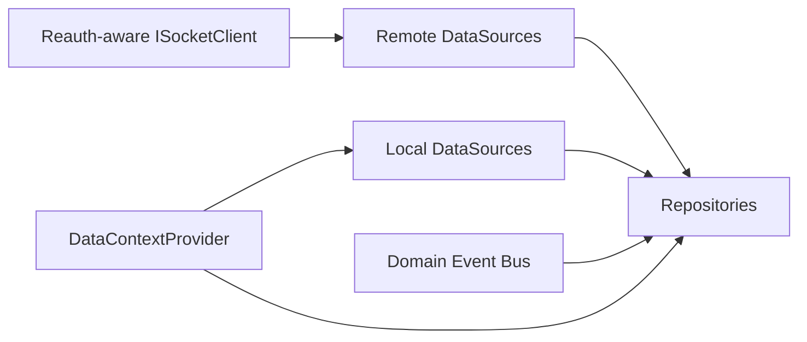

# Data Domain Spec

Date: 2026-06-18

## 1. 목적

`data` 도메인은 `@chatic/data` repository, local/remote datasource, cache strategy를 조립하는 headless data runtime이다.

## 2. 핵심 결정

- `data` 도메인은 재인증을 모른다.
- `data` 도메인은 `ISocketClient` 추상화만 사용한다.
- socket 재인증은 `ISocketClient` 경계에서 완료된 것으로 가정한다.

## 3. 책임

- context provider 보유
- event bus lifecycle 보유
- repositories 조립
- remote/local datasource 조립
- dispatcher destroy
- cache storage strategy 선택

## 4. 비책임

- refresh token 호출
- `401` 판별
- cloud fallback
- socket verification 정책
- 세션 hook 또는 인증 orchestration 제공

## 5. 입력 계약

```ts
export interface DataRuntimeOptions {
    socketClient: ISocketClient;
    initialContext?: {
        cid: string;
        sid?: string;
        uid?: string;
    };
}
```

## 6. 구조



## 7. 경계 규칙

- repository는 refresh를 직접 호출하지 않는다.
- remote datasource는 auth 만료를 복구하려고 시도하지 않는다.
- local datasource는 세션 정책을 모른다.
- `DataManager.ensure()`는 context 변경만 수행한다.

## 8. 개선 기준

### 조립 API

- `createDataRuntime(socketClient, options)`를 기본 경로로 사용한다.
- `getDataRuntime()` singleton은 편의용으로만 둔다.

### 환경 전략

- 환경 판별은 capability 또는 strategy 주입 방식으로 추상화한다.
- `window.ReactNativeWebView` 직접 의존은 축소 대상이다.

### 타입 계약

- `remoteFactory.ts`의 unsafe cast는 제거 대상이다.
- gateway/dispatcher adapter 계약은 별도 타입으로 명시한다.

## 9. 검증 기준

- repository 사용처는 reauth 존재를 몰라도 기존처럼 동작해야 한다.
- 재연결/재인증 후에도 subscription과 dispatcher가 유지되어야 한다.
- `DataManager.destroy()`는 data lifecycle만 정리하고 세션 상태는 건드리지 않아야 한다.
- `app-runtime/src/hooks`에 남는 hook은 data/socket 상태 접근용만 허용하고, 세션/인증 hook은 허용하지 않는다.
