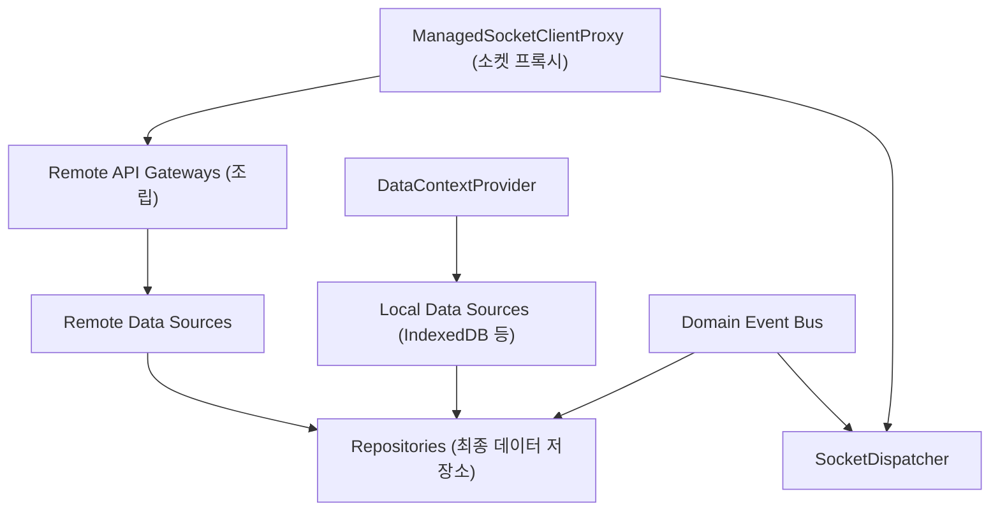

# Data Domain Spec

Date: 2026-06-19

## 1. 목적

`data` 도메인은 `@chatic/data` 저장소(Repositories), 로컬/원격 데이터 소스(Local/Remote Data Sources), 그리고 캐시 정책들을 한곳에 버무려 앱에서 소비할 수 있는 헤드리스 데이터 런타임(Headless Data Runtime)을 조립하고 제공한다.

---

## 2. 런타임 조립 구조

`data` 도메인은 소켓의 인증 갱신이나 연결 복구 세부사항에 직접 개입하지 않는다. 싱글톤 소켓 프록시(`ManagedSocketClientProxy`)를 주입받아 API 게이트웨이 및 원격 데이터 레이어를 조립한다.

---

## 3. 핵심 책임과 경계

### 1) DataManager

- [DataManager.ts](file:///Users/raine/Project/lemon/chatic-front/libs/app-runtime/src/data/DataManager.ts)는 데이터 컨텍스트(`DataContext`)의 생명주기를 관장한다.
- `ensure(context)`를 통해 현재 런타임 바인딩에서 내려온 `cid`, `sid`, `uid`를 `DataContextProvider`에 안전하게 동기화한다.

### 2) remoteFactory

- [remoteFactory.ts](file:///Users/raine/Project/lemon/chatic-front/libs/app-runtime/src/data/factories/remoteFactory.ts)는 소켓 프록시 싱글톤(`getSocketRuntime().proxy`)을 활용하여 채팅, 채널, 유저, 디바이스 등 소켓 통신을 담당하는 게이트웨이 번들을 유기적으로 조립한다.

### 3) 런타임 비책임 (경계 규칙)

- 레포지토리 및 데이터 소스들은 토큰이 만료되었거나, 소켓이 끊어졌다 해도 이를 **스스로 알아채거나 복구하려고 시도하지 않는다**.
- 401 에러는 아래 프록시(`ManagedSocketClientProxy`)와 컨트롤러 영역에서 가로채고 해결하기 때문에, 데이터 레이어는 기존 동작대로 요청을 발송하면 알아서 복구되고 수신되는 형태로 결합도가 분리된다.

---

## 4. 데이터 런타임 반응 시나리오

### 1) 클라우드/사이트 전환 시 (캐싱 데이터 우선 표시)

- 상위 레이어가 클라우드 혹은 사이트 전환을 선반영하여 `RuntimeBinding`이 바뀌면, `RuntimeDataBinder` 컴포넌트가 `DataManager.ensure()`를 호출한다.
- 데이터 레이어의 컨텍스트(`cid`, `sid`)가 갱신되면, 저장소(Repositories)는 새로운 스코프에 맞춰 데이터를 즉시 가져온다.
- 이때 **캐시 우선 정책(Cache-First)**에 따라 기존에 캐싱된 데이터를 화면에 즉각적으로 노출한 뒤, 백그라운드 소켓 연결이 확인되면 데이터를 투명하게 갱신(Refetch/Sync)한다.

### 2) 로그아웃 시 캐시 클리어

- 사용자가 중계 서버 또는 클라우드에서 로그아웃하는 경우, 데이터 무결성 및 다른 유저로 로그인했을 때의 데이터 꼬임을 방지하기 위해 로컬 캐시를 즉시 파괴해야 한다.
- `data` 도메인은 외부 로그아웃 완료 흐름에 동기화할 수 있도록 `DataManager.destroy()` 진입점을 노출한다.
- `destroy()`가 호출되면 내부의 소켓 디스패처 생명주기를 정리하고 로컬 쿼리 캐시 및 데이터 소스 핸들을 안전하게 해제한다.

---

## 5. 최종 검증 기준

- 레포지토리를 사용하는 React UI 컴포넌트나 비즈니스 훅들은 재인증/재시도가 발생하는 것을 의식하지 않고 평소와 다름없이 작동해야 한다.
- 소켓이 물리적으로 일시 단절되었다가 재인증을 거쳐 재연결되는 와중에도, `data` 레이어의 이벤트 구독(Subscription) 및 디스패처 흐름이 안정적으로 유지되어야 한다.
- `DataManager.destroy()`는 세션 관리 컨트롤러의 상태를 직접 조작하지 않고 데이터 소스 리소스 정리 목적에만 집중해야 한다.
