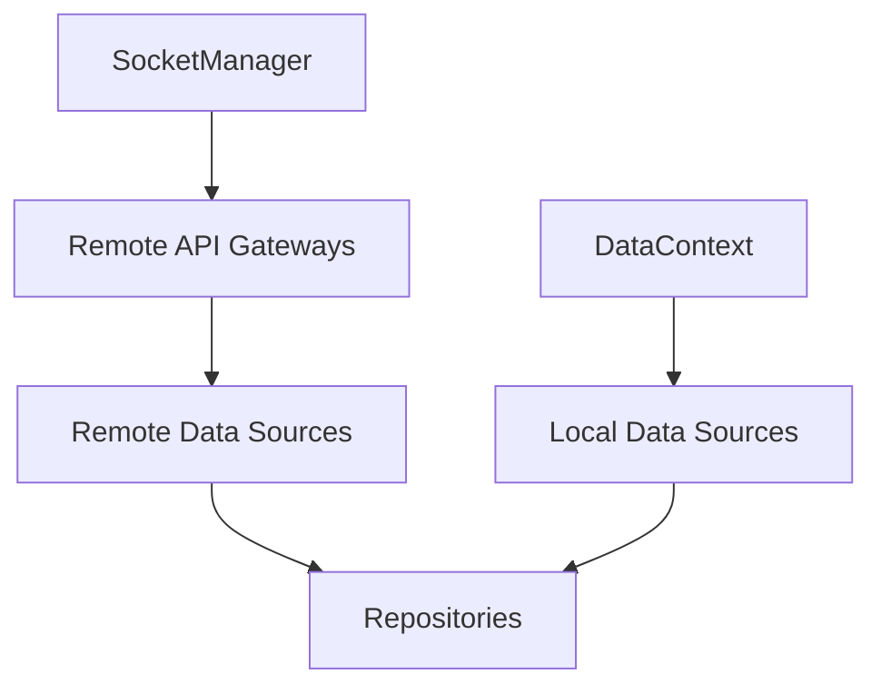

# Data Domain Spec

Date: 2026-06-25
Status: As-Built (현재 구현 기준)

## 목적

`data` 도메인은 repository, local data source, remote data source를 조립해 앱이 사용할 headless data runtime을 제공한다.

이 문서에서 중요한 점은 `data`가 소켓 lifecycle을 소유하지 않는다는 것이다.

## 조립 구조

## 책임

### `DataManager`

- data context 생명주기 관리
- `ensure(context)`로 `cid/sid/uid` 동기화
- `destroy()`로 data runtime 정리

### `remoteFactory`

- socket 기반 gateway 조립
- remote data source 조립
- repository가 사용할 remote interface 제공

### repository

- local/remote 결과 해석
- cache merge/remove
- observe stream 제공

## 비책임

`data`는 아래를 직접 처리하지 않는다.

- token refresh
- 401 recovery orchestration
- socket reconnect policy
- sync runtime 생성/정지

## socket 의존 규칙

- `remoteFactory`는 raw client에 직접 의존하지 않는다.
- `remoteFactory`는 `SocketManager`의 stable socket API를 사용한다.

이 규칙의 목적:

- socket 교체가 data 조립 로직으로 새지 않게 하기 위함
- retry/rebind 책임을 data가 떠안지 않게 하기 위함

## sync와의 경계

- sync plan의 lifecycle은 `SyncManager`가 소유한다.
- sync plan callback 결과를 local cache에 반영하는 것은 repository가 소유한다.

정리:

- `SyncManager` = 언제 sync할지
- `repository` = sync 결과를 어떻게 반영할지

## 런타임 반응 시나리오

### cloud/site 전환

- `RuntimeDataBinder`가 `DataManager.ensure(context)`를 호출한다.
- repository는 새 scope 기준 캐시를 읽는다.
- socket/session 계층의 재인증은 별도 책임이다.

### logout

- 외부 세션 레이어가 필요 시 `DataManager.destroy()`를 호출한다.
- data는 자기 리소스만 정리한다.
- socket/session 상태를 직접 제어하지 않는다.
