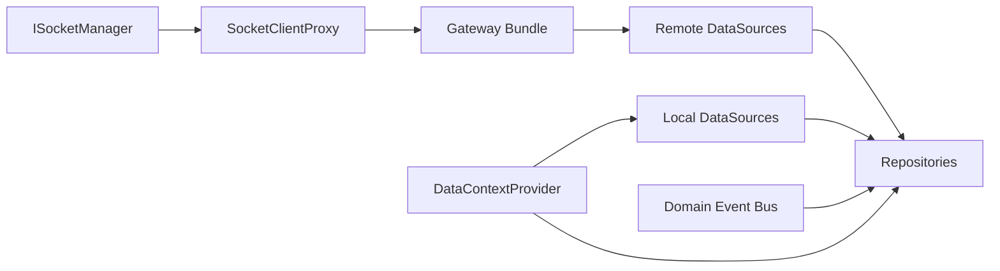

# Data Domain Spec

Date: 2026-06-18

## 1. 목적

`data` 도메인은 `@chatic/data` repository, local/remote datasource, cache strategy를 조립하는 headless data runtime이다. 현재 구조에서는 socket gateway assembly도 함께 담당한다.

## 2. 현재 구현 관찰

- `DataManager`는 `ISocketManager`를 받아 remote/local/repository를 한 번에 조립한다.
- `remoteFactory.ts`는 `SocketClientProxy`를 생성하고 gateway bundle을 만든 뒤 `SocketDispatcher`를 조립한다.
- `data`는 더 이상 `ISocketClient`를 직접 주입받지 않는다.

## 3. 목표 책임

- context provider 보유
- event bus lifecycle 보유
- gateway bundle 조립
- remote/local datasource 조립
- repositories 조립
- dispatcher destroy
- cache storage strategy 선택

## 4. 비책임

- refresh token 호출
- `401` 판별
- cloud fallback
- socket verification 정책
- 세션 hook 또는 인증 orchestration 제공

## 5. 입력 계약

```ts
export interface DataRuntimeOptions {
    socketManager: ISocketManager;
    initialContext?: {
        cid: string;
        sid?: string;
        uid?: string;
    };
}
```

## 6. 구조



## 7. 경계 규칙

- repository는 refresh를 직접 호출하지 않는다.
- remote datasource는 auth 만료를 복구하려고 시도하지 않는다.
- local datasource는 세션 정책을 모른다.
- `DataManager.ensure()`는 context 변경만 수행한다.
- `data`는 `SocketManager`의 connection lifecycle을 직접 제어하지 않는다.

## 7-1. cid / sid 변경 반응 (캐싱 데이터 우선 표시)

클라우드 전환·사이트 전환은 web-core가 `cid`/`sid`를 선반영하고, `runtime` binding이 그 변경을 `data`에 전달한다. binding 반응의 구성(명령형 `ensure` vs `RuntimeDataBinder` 컴포넌트)은 [runtime/runtime.md](../runtime/runtime.md) §14를 참조한다.

- `cid`/`sid`가 바뀌면 `DataManager.ensure()`로 context를 갱신한다.
- DataProvider는 활성화된 cid/sid를 따라 데이터를 불러오며, **캐시 우선(cache-first)으로 기존 캐싱 데이터를 즉시 표시**한 뒤 백그라운드로 갱신한다.
- `cid` 변경 시 중계서버/cloud 소켓 재연결도 binding 반응으로 함께 일어난다.
- `data`는 cid/sid가 _왜_ 바뀌었는지(전환·로그아웃·복구)는 모른다. 변경된 context를 따라가기만 한다.

## 7-2. 캐시 클리어 진입점 (로그아웃)

중계서버 로그아웃 시에는 반드시 캐시를 비워야 한다 (로그아웃 후 다른 유저로 로그인하면 데이터가 꼬임).

- web-core는 캐시를 모르므로 비우지 않는다. **외부 레이어가 logout 완료 후 캐시 클리어를 수행**한다.
- `data`는 이를 위한 진입점을 외부에서 호출 가능하게 노출한다: `DataManager.destroy()`(data lifecycle 정리) + query cache clear는 외부 레이어가 함께 호출한다.
- `DataManager.destroy()`는 data lifecycle만 정리하고 세션 상태는 건드리지 않는다 (§9 검증 기준과 일치).

## 8. 개선 기준

### 조립 API

- `createDataRuntime(socketManager, options)`를 현재 기본 경로로 본다.
- `getDataRuntime()` singleton은 편의용으로만 둔다.
- 장기적으로는 `socketManager` 전체 대신 `SocketGatewayRuntime` 또는 `SocketClientProxy` 수준의 더 좁은 의존으로 줄이는 것이 바람직하다.

### 환경 전략

- 환경 판별은 capability 또는 strategy 주입 방식으로 추상화한다.
- `window.ReactNativeWebView` 직접 의존은 축소 대상이다.

### 타입 계약

- `remoteFactory.ts`의 `as any` gateway 조립은 축소 대상이다.
- proxy/gateway/dispatcher adapter 계약은 별도 타입으로 명시한다.

## 9. 검증 기준

- repository 사용처는 reauth 존재를 몰라도 기존처럼 동작해야 한다.
- 재연결/재인증 후에도 subscription과 dispatcher가 유지되어야 한다.
- `DataManager.destroy()`는 data lifecycle만 정리하고 세션 상태는 건드리지 않아야 한다.
- `data` 도메인은 socket policy가 아니라 gateway assembly 계층으로 읽혀야 한다.
