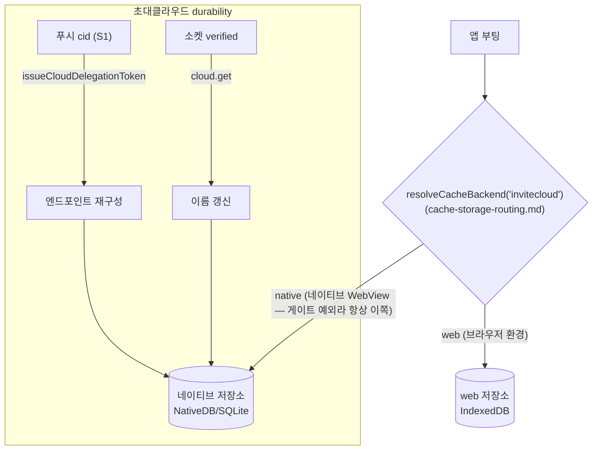

# 초대클라우드 durability — 푸시 복구 · 이름 동기화

> 상태: Live · 최종 갱신: 2026-08-14 · 관련 ADR: [ADR-0030](../../../../docs/adr/0030-app-runtime-cold-db-migration-and-invite-cloud-recovery.md) · [ADR-0053](../../../../docs/adr/0053-per-domain-cache-contract-versions.md)
>
> 캐시 타입이 **어느 저장소로 가는지**(web/IndexedDB vs native/SQLite)는 이 문서가 아니라
> [cache-storage-routing.md](cache-storage-routing.md)가 소유한다. 이 문서는 그 라우팅 위에서
> **초대클라우드만 겪는 durability 문제**를 다룬다. 이 도메인이 왜 저장소 게이트의 예외인지는
> [cache-contract-versions.md](cache-contract-versions.md)가 소유한다.

## 목적

초대클라우드(`cloudType: 'invited'`)는 어떤 sync/list API에도 없는 **로컬 전용 데이터**다. 서버에
열거 API가 없어 캐시에서 사라지면 되살릴 데가 없다 — 다른 타입은 서버 재수화로 자연 충전되지만
초대클라우드만은 그렇지 않다. 이 문서는 그 하나를 지키는 두 장치를 기록한다.

1. **푸시 안전망** — 캐시에 없는 클라우드의 푸시가 도착하면 relay 재발급으로 엔드포인트를 재구성한다.
2. **이름 동기화** — delegation 토큰에는 이름이 없어, 소켓 verified 시점에 권위있는 이름을 받아온다.

**세 번째 장치였던 웹→네이티브 일회성 마이그레이션은 ADR-0053에서 제거됐다.** 웹 번들로 배포되어
앱 업데이트와 무관하게 3주간 실행됐고 활성 사용자를 소진했다고 판단했다. 그 결과 푸시 안전망이
**유일한 복구 경로**로 남았는데, 반응형(푸시가 cid를 지목할 때만 동작)이라 목록 복구가 아니다 —
이 격차는 서버 열거 API가 생기기 전까지 해소되지 않는다.

## 설계 원칙

1. **캐시 DB가 초대클라우드의 단일 원천** — 별도의 병행 저장소(localStorage 레지스트리 등)를 두지
   않는다. 두 원천은 divergence로 데이터가 꼬일 수 있어 의도적으로 배제한다.
2. **엔드포인트는 로컬에 영구 복제하지 않고 relay에서 재발급** — `issueCloudDelegationToken(cloudId)`가
   `backend`/`wss`/`cid`를 돌려주므로 cid만 알면 재구성할 수 있다.
3. **이 도메인의 저장소를 옮기는 변경은 이관 다리를 전제 조건으로 한다** — 사후 보완이 아니다.
   다른 도메인과 달리 저장소 이동이 "재동기화로 복구되는 내구성 하락"이 아니라 **소실**이기 때문이다.
   현재 다리는 존재하지 않으므로 새로 써야 한다(ADR-0053 결정 4).
4. **복구는 모두 best-effort이고 멱등하다** — 실패해도 조용히 넘어가고, 쓰기는 id 머지라 반복이
   안전하다.

## 범위

**포함** — 푸시 기반 엔드포인트 재구성, verified 시 이름 동기화.

**제외**

- 저장소 라우팅 결정 일반 → [cache-storage-routing.md](cache-storage-routing.md).
- 이 도메인이 저장소 게이트의 예외인 이유와 그 정책 → [cache-contract-versions.md](cache-contract-versions.md).
- `chat` 등 다른 타입의 명시적 마이그레이션 — 서버 재수화로 채워진다.
- **저장소가 완전히 비워진 초기화(앱 재설치·캐시 전체 삭제) + 푸시 `cid`도 없는 경우** — 단일 원천
  원칙상 복구 불가. 푸시 페이로드에 `cid`/`backend` 탑재, 또는 초대클라우드 열거 API(`view=invited`)
  같은 **백엔드 지원이 필요한 후속 과제**(ADR-0030 참조).

## 시나리오

### S1. 초대클라우드 없는 상태에서 푸시 도착 (best-effort)

1. 푸시 도착. 페이로드에서 `cid` 추출(중첩 `payload` 우선, top-level fallback).
2. `cid`가 유효하고 캐시에 없으면 `issueCloudDelegationToken(cid)`로 엔드포인트 재구성 → 캐시 write.
3. 이후 그 클라우드에 접속(verified)하면 `cloud.get`으로 이름이 채워진다.
4. `cid`가 비었으면(배포 백엔드 다수) 특정 불가 → no-op(후속 과제).

### S2. 부팅 — 아무 일도 하지 않는다

`invitecloud`는 라우팅상 항상 네이티브 저장소로 가고(게이트 예외), 부팅 시 옮길 것도 확인할 것도
없다. 저장소가 통째로 비워진 상태(앱 재설치·캐시 전체 삭제)에서 푸시 `cid`도 없으면 복구 경로가
없다 — 단일 원천 원칙의 대가이고, 백엔드 열거 API가 필요한 후속 과제다.

## 다이어그램

## 상세 구현

핵심 모듈은 [invitedCloudDurability.ts](../../src/data/invitedCloudDurability.ts) 하나다.

- `recoverInvitedCloudIfMissing(cloud, cid)` — 캐시에 없는 cid만 `rehydrateInvitedCloud`(relay 재발급
  → 엔드포인트 cacheWrite)로 재구성. 이름은 넣지 않는다(연결 후 채움). 다리를 걷은 뒤 **유일한
  안전망**이다.
- `syncInvitedCloudName(cloud, cid)` — active cloud가 invited이고 소켓 verified일 때
  `cloud.getCloud({ id })`로 권위있는 이름을 받아 cacheWrite. 릴레이 delegation 토큰엔 이름이 없어
  이것이 유일한 이름 출처.
- 훅: `useInvitedCloudNameSync`(verified 시 이름 동기화) 하나. 마운트는
  [InvitedCloudDurabilityRunner.tsx](../../../../apps/web/src/app/runtime/InvitedCloudDurabilityRunner.tsx)가
  AppRuntime에서. 푸시는 이 Runner가 `useOnReceiveNotification` + `extractPushContext`로 cid를 뽑아
  `recoverInvitedCloudIfMissing`을 호출한다.

## 검증 방법

- **단위 테스트** ([invitedCloudDurability.test.ts](../../src/data/invitedCloudDurability.test.ts))
    - 푸시 복구: 빈 cid/기존 캐시 no-op, 누락 cid는 엔드포인트 재구성, relay 실패 시 swallow.
    - 이름 동기화: non-invited/이름 동일/실패 시 no-op, 변경 시 cacheWrite.
    - 실행: `npx jest --config libs/app-runtime/jest.config.js invitedCloudDurability`.
- **라우팅 자체의 검증**은 [cache-storage-routing.md](cache-storage-routing.md)의 검증 방법 절이 소유한다
  (`localFactory.test.ts`의 전 타입 × 양 환경 매트릭스).
- **수동 QA (네이티브 WebView)**: 푸시 복구(S1), 재접속 시 이름 채워짐.
- **라우팅 예외 고정**: [nativeCacheSupport.test.ts](../../src/data/nativeCacheSupport.test.ts)의
  '로컬 권위 도메인' describe — 어떤 보고 형태에서도 `invitecloud`가 네이티브를 유지하는지.
