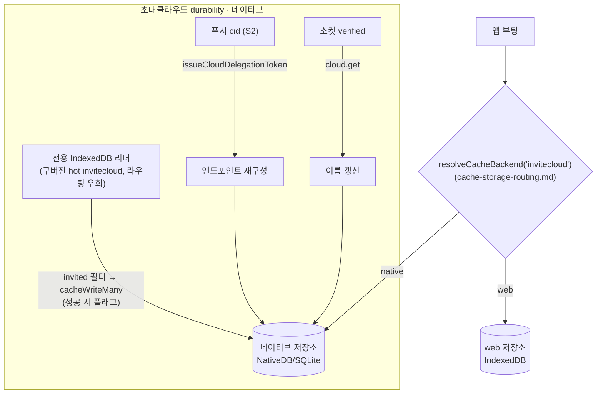

# 초대클라우드 durability — 마이그레이션 · 푸시 복구 · 이름 동기화

> 상태: Live · 최종 갱신: 2026-08-12 · 관련 ADR: [ADR-0030](../../../../docs/adr/0030-app-runtime-cold-db-migration-and-invite-cloud-recovery.md)
>
> 캐시 타입이 **어느 저장소로 가는지**(web/IndexedDB vs native/SQLite)는 이 문서가 아니라
> [cache-storage-routing.md](cache-storage-routing.md)가 소유한다. 이 문서는 그 라우팅 위에서
> **초대클라우드만 겪는 durability 문제**를 다룬다.

## 목적

초대클라우드(`cloudType: 'invited'`)는 어떤 sync/list API에도 없는 **로컬 전용 데이터**다. 서버에
열거 API가 없어 캐시에서 사라지면 되살릴 데가 없다 — 다른 타입은 서버 재수화로 자연 충전되지만
초대클라우드만은 그렇지 않다. 이 문서는 그 하나를 지키는 세 장치를 기록한다.

1. **일회성 마이그레이션** — 구버전(2-tier) 빌드가 hot(IndexedDB)에 남긴 초대클라우드를 네이티브
   저장소로 옮긴다. 네이티브가 web 저장소를 더 이상 읽지 않게 되면서 생긴 고아 데이터다.
2. **푸시 안전망** — 캐시에 없는 클라우드의 푸시가 도착하면 relay 재발급으로 엔드포인트를 재구성한다.
3. **이름 동기화** — delegation 토큰에는 이름이 없어, 소켓 verified 시점에 권위있는 이름을 받아온다.

## 설계 원칙

1. **캐시 DB가 초대클라우드의 단일 원천** — 별도의 병행 저장소(localStorage 레지스트리 등)를 두지
   않는다. 두 원천은 divergence로 데이터가 꼬일 수 있어 의도적으로 배제한다. (마이그레이션 완료
   플래그만 localStorage에 둔다.)
2. **서버에서 되살릴 수 있는 건 옮기지 않는다** — 명시적 마이그레이션 대상은 서버 출처가 없는
   `invitecloud`뿐.
3. **엔드포인트는 로컬에 영구 복제하지 않고 relay에서 재발급** — `issueCloudDelegationToken(cloudId)`가
   `backend`/`wss`/`cid`를 돌려주므로 cid만 알면 재구성할 수 있다.
4. **마이그레이션은 멱등하고, 성공했을 때만 완료로 친다** — 실패 시 플래그를 남기지 않아 다음 부팅에
   재시도한다.

## 범위

**포함** — 구버전 hot(IndexedDB) `invitecloud`의 일회 마이그레이션, 푸시 기반 엔드포인트 재구성,
verified 시 이름 동기화.

**제외**

- 저장소 라우팅 결정 일반 → [cache-storage-routing.md](cache-storage-routing.md).
- `chat` 등 다른 타입의 명시적 마이그레이션 — 서버 재수화로 채워진다.
- **저장소가 완전히 비워진 초기화(앱 재설치·캐시 전체 삭제) + 푸시 `cid`도 없는 경우** — 단일 원천
  원칙상 복구 불가. 푸시 페이로드에 `cid`/`backend` 탑재, 또는 초대클라우드 열거 API(`view=invited`)
  같은 **백엔드 지원이 필요한 후속 과제**(ADR-0030 참조).

## 시나리오

### S1. 구버전(2-tier) 유저의 첫 부팅

1. 네이티브 WebView 부팅. `invitecloud`는 라우팅상 네이티브 저장소로 간다.
2. 마이그레이션 완료 플래그 미존재 → 구버전이 hot(IndexedDB)에 남긴 `invitecloud` 행을 **전용
   IndexedDB 리더로 직접** 읽어(활성 라우팅을 우회) `cloudType: 'invited'`만 필터, 네이티브로
   `cacheWriteMany`. **성공 시에만** 플래그 기록.
3. hot 읽기 실패·네이티브 쓰기 실패 시 플래그를 남기지 않아 다음 부팅에서 재시도(쓰기는 id 머지라 멱등).

### S2. 초대클라우드 없는 상태에서 푸시 도착 (best-effort)

1. 푸시 도착. 페이로드에서 `cid` 추출(중첩 `payload` 우선, top-level fallback).
2. `cid`가 유효하고 캐시에 없으면 `issueCloudDelegationToken(cid)`로 엔드포인트 재구성 → 캐시 write.
3. 이후 그 클라우드에 접속(verified)하면 `cloud.get`으로 이름이 채워진다.
4. `cid`가 비었으면(배포 백엔드 다수) 특정 불가 → no-op(후속 과제).

## 다이어그램

## 상세 구현

핵심 모듈은 [invitedCloudColdSync.ts](../../src/data/invitedCloudColdSync.ts) 하나다.

- `createHotInviteCloudStorage()`([localFactory.ts:70](../../src/data/factories/localFactory.ts:70)) —
  활성 라우팅을 우회해 공유 IndexedDB의 `invitecloud` 슬롯을 읽는 전용 리더. `invitecloud`는 global
  스코프 고정(`resolveScopedContext`)이라 live 컨텍스트 없이 stub provider로 안전하게 만든다.
- `reconcileInvitedCloudsIntoCold(cloud, readHotClouds)` — 첫 부팅 1회. 플래그 없으면
  `readHotClouds()`로 invited를 필터해 `cacheWriteMany`로 옮긴다. **성공 시에만 플래그 기록** —
  실패 시 미기록으로 다음 부팅 재시도(멱등). **별도 레지스트리 없음** — 캐시 DB가 단일 원천.
- `recoverInvitedCloudIfMissing(cloud, cid)` — 캐시에 없는 cid만 `rehydrateInvitedCloud`(relay 재발급
  → 엔드포인트 cacheWrite)로 재구성. 이름은 넣지 않는다(연결 후 채움).
- `syncInvitedCloudName(cloud, cid)` — active cloud가 invited이고 소켓 verified일 때
  `cloud.getCloud({ id })`로 권위있는 이름을 받아 cacheWrite. 릴레이 delegation 토큰엔 이름이 없어
  이것이 유일한 이름 출처.
- 훅: `useInvitedCloudColdRecovery`(부팅 1회 마이그레이션, hot 리더를 thunk로 지연 생성),
  `useInvitedCloudNameSync`(verified 시 이름 동기화). 마운트는
  [InvitedCloudColdSyncRunner.tsx](../../../../apps/web/src/app/runtime/InvitedCloudColdSyncRunner.tsx)가
  AppRuntime에서. 푸시는 이 Runner가 `useOnReceiveNotification` + `extractPushContext`로 cid를 뽑아
  `recoverInvitedCloudIfMissing`을 호출한다.

## 검증 방법

- **단위 테스트** ([invitedCloudColdSync.test.ts](../../src/data/invitedCloudColdSync.test.ts))
    - 마이그레이션: hot 리더에서 invited만 필터해 1회 `cacheWriteMany` + 플래그, 빈 목록도 플래그,
      플래그 있으면 재read/재마이그레이션 안 함, **읽기·쓰기 실패 시 플래그 미기록(다음 부팅 재시도)**.
    - 푸시 복구: 빈 cid/기존 캐시 no-op, 누락 cid는 엔드포인트 재구성, relay 실패 시 swallow.
    - 이름 동기화: non-invited/이름 동일/실패 시 no-op, 변경 시 cacheWrite.
    - 실행: `npx jest --config libs/app-runtime/jest.config.js invitedCloudColdSync`.
- **라우팅 자체의 검증**은 [cache-storage-routing.md](cache-storage-routing.md)의 검증 방법 절이 소유한다
  (`localFactory.test.ts`의 전 타입 × 양 환경 매트릭스).
- **수동 QA (네이티브 WebView)**: 구버전에서 업데이트 후 초대클라우드 유지(S1) / 푸시 복구(S2).
