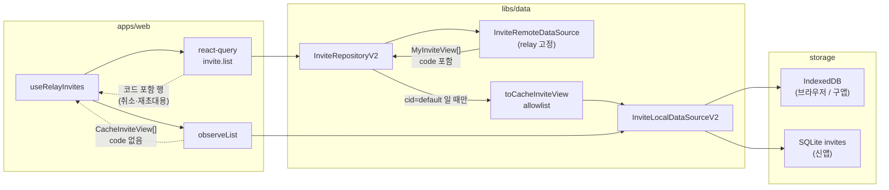
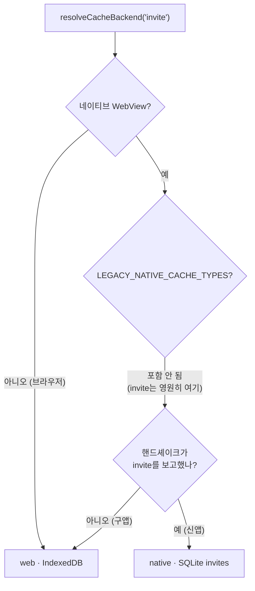
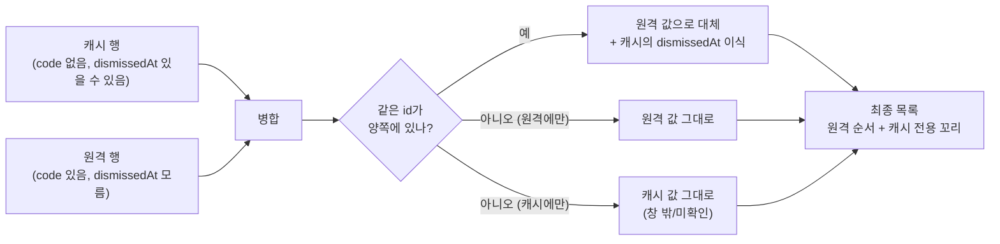
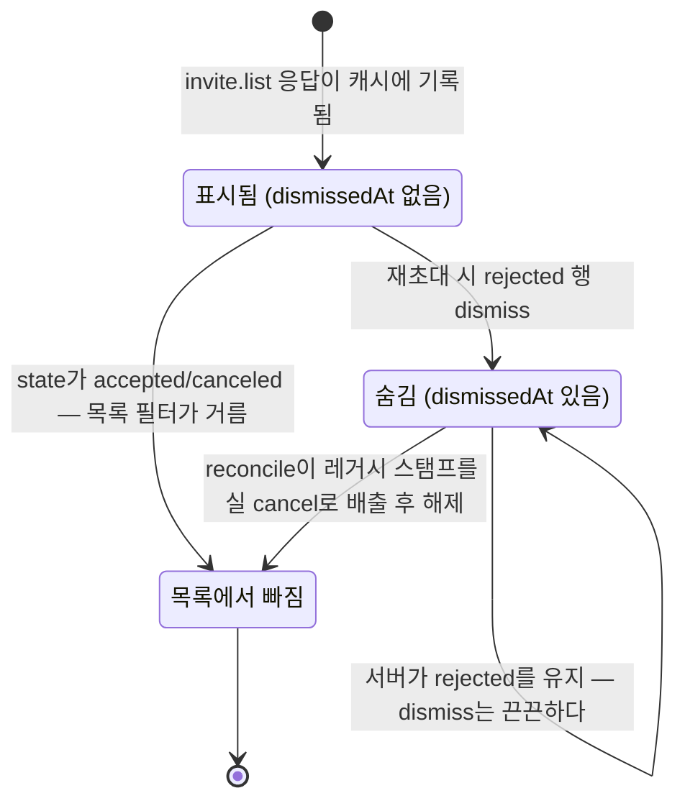

# 초대 목록 로컬 캐시 (Invite Local Cache)

> 상태: Live · 최종 갱신: 2026-08-13 · 관련 ADR: [ADR-0052](../../../../docs/adr/0052-invite-local-cache-and-native-table.md) (이 트랙), [ADR-0051](../../../../docs/adr/0051-cache-storage-routing-simplification.md) (스큐 게이트), [ADR-0043](../../../../docs/adr/0043-relay-invite-cancel-reject-adoption.md) (취소·거절 실 API), [ADR-0033](../../../../docs/adr/0033-relay-dm-invite-and-auth-parallel-tracks.md) (relay 고정)

## 목적

발신자의 초대 카드(`invite.list`)를 다른 도메인과 같은 **로컬 우선 읽기**로 만든다. 콜드 부팅마다
relay 핸드셰이크가 끝날 때까지 목록이 비어 있던 문제와, 오프라인에서 아무것도 못 보여주던 문제를
해소한다 — 채널·메시지·플레이스는 이미 로컬 저장소를 1차 소스로 쓰므로 초대만 예외였다.

이 트랙은 두 가지를 처음으로 실증했다.

- **`invite`는 이 리포에 처음 추가된 `CacheType`이다.** ADR-0051이 만든 배포 스큐 게이트(브릿지
  핸드셰이크로 앱의 저장 가능 타입을 보고 → 웹이 저장소를 고름)가 지금까지 가상의 타입으로만
  테스트돼 있었는데, `invite`가 그 기계를 실제 타입으로 처음 통과했다.
- **자격증명을 타입에서 제거한다.** `code`(와 그것을 통째로 품은 `deeplink`)가 디스크에 닿지 않는
  것을 런타임 방어가 아니라 저장 모델의 형태로 보장한다.

## 설계 원칙

- **캐시는 즉시 렌더용이지 권위가 아니다.** 수락·거절은 남의 기기에서 일어나고 알림 패킷이 없다
  (백엔드 요청 4번). 캐시를 읽어 먼저 그리고 `invite.list`는 **항상** 발사한다. 캐시 값만 보고
  상태를 판정하는 경로는 없다(stale-while-revalidate).
- **자격증명은 타입에서 뺀다.** `CacheInviteView`에 `code`·`deeplink`가 **없다**. 저장 직전 변환은
  스프레드가 아니라 **허용 목록(allowlist) 매퍼**(`toCacheInviteView`)다 — 타입만으로는 런타임
  초과 프로퍼티를 막지 못하고, chat 경로에서 `{...query}` 스프레드가 키에 없는 필드를 저장소까지
  흘려보낸 전례가 있다.
- **코드가 필요한 동작은 서버 응답에서만 코드를 얻는다.** 취소·재초대는 캐시 히트여도 방금 받은
  `invite.list` 행에서 코드를 조립한다(`resolveInviteCode`). 조립에 실패하면 목록을 재조회하고 한
  번 더 시도한다 — 캐시 행으로는 절대 코드를 만들 수 없다.
- **응답 범위 안은 응답이 권위, 범위 밖은 보존.** `limit` 창 안에 들어온 행은 응답 값으로 갈아엎고,
  창 밖 캐시 행은 지우지 않는다. 좀비 행이 남을 수 있지만 창 밖으로 밀린 초대가 조용히 사라지는
  것보다 낫다. **로컬 전용 필드(`dismissedAt`)는 이 갈아엎기에서 예외다** — 서버 응답이 그 필드를
  아예 모르므로, 병합 시 옮겨 붙지 않으면 dismiss가 새 응답이 올 때마다 사라진다.
- **로컬 상태의 원천은 하나다.** dismiss(로컬 숨김)는 캐시 행의 `dismissedAt` 필드이고,
  localStorage에 두 번째 원천을 남기지 않는다.
- **초대 캐시의 로컬 쓰기는 전부 기본 클라우드에서만 한다.** 조회(`invite.list`)는 게이트되지
  않아 클라우드 활성 중에도 돈다. 그때 쓰면 그 클라우드 파티션에 고아 행이 쌓이므로,
  `list`의 캐시 미러링뿐 아니라 `dismiss`/`undismiss`/`cacheWriteMany`/`cacheWrite`/`cacheDelete`/
  `cacheClear` 전부가 `cid === 'default'`가 아니면 스킵한다. `contextOverride`로 물리 파티션을
  바꾸는 방식은 쓸 수 없다(읽기 경로가 override를 무시한다).
- **네이티브가 먼저 배포된다.** 새 `CacheType`은 테이블·마이그레이션·`SUPPORTED_CACHE_TYPES` 등록이
  먼저 출시돼야 durable해진다. 그전까지는 스큐 게이트가 웹 저장소로 흡수한다 — 별도 플래그 없이.

## 범위

**포함**

- `CacheType`에 `invite` 추가 — `CacheInviteView`·`InviteQueryOptions`·TTL·스토리지 묶음.
- 네이티브 `invites` 테이블 + 마이그레이션(스키마 버전 10) + `InviteDataSource` +
  `SUPPORTED_CACHE_TYPES` 등록.
- 웹 `InviteLocalDataSourceV2`와 `InviteRepositoryV2` 배선(remote-only → local-first).
- 자격증명 제거 매퍼(`toCacheInviteView`)와 그 회귀 테스트.
- dismiss 필드(`dismissedAt`) 도입과 `canceledInviteIds`(localStorage) 일회성 마이그레이션,
  `useCanceledInviteReconcile`의 원천 교체.
- `useRelayInvites`의 캐시-우선화와 코드 재조회 경로(`resolveInviteCode`).
- 디버그 패널(`DBBrowser`, apps/web·apps/testbed)에 `invite` 타입 노출.

**제외**

- 커서 페이징(창 밖 판정의 근본 해결) — `InviteListInput`에 커서가 없다.
- 초대 상태 푸시 알림(백엔드 요청 4번).
- `invite` 캐시의 전역 검색 노출(`CacheSearchService`는 channel/chat/site만 다룬다).
- `useSentInviteLog`(phone→inviteId 로컬 발급 이력) — 서버에 원문 번호가 없어 성격이 다르고, 이번
  트랙이 건드리지 않는다.
- 캐시 행 수 상한/청소 정책 — 좀비 행은 여전히 무한정 남을 수 있다(아래 "알려진 한계" 참고).

## 시나리오

### S1. 콜드 부팅 (온라인)

1. 앱이 부팅하고 `main.tsx`가 렌더 전에 `setNativeCacheSupport`로 앱의 보고를 기록한다.
2. 홈이 마운트되고 `useRelayInvites`가 **두 소스를 동시에** 연다 — `invite.observeList` (로컬)와
   react-query의 `invite.list` (원격, `useKindVerified('relay')` 게이트).
3. 로컬 관찰자가 먼저 응답한다. 지난 세션의 초대 카드가 relay 핸드셰이크를 기다리지 않고 그려진다.
   이 행들에는 `code`·`deeplink`가 없다.
4. relay가 verified가 되면 `invite.list`가 발사되고, `InviteRepositoryV2.list`가 응답을
   자격증명 제거 후 캐시에 갈아엎는다(기본 클라우드일 때만). 관찰자가 재발화하고, 훅은 캐시·원격
   행을 병합한다 — 겹치는 id는 원격 값(코드 포함)으로 완전히 대체하되 캐시의 `dismissedAt`은
   옮겨 붙인다.
5. 화면이 최신 상태로 수렴한다.

### S2. 콜드 부팅 (오프라인)

1~3은 같다. 4는 게이트를 통과하지 못해 발사되지 않는다(또는 실패한다). 목록은 캐시 값으로 남고,
카드의 상태 뱃지는 마지막으로 본 서버 값이다. 창을 다시 포커스하거나 온라인이 되면 4로 이어진다.

### S3. 취소 (캐시 행에서 출발)

1. 사용자가 캐시로 그려진 카드를 눌러 대기 화면에 들어온다 — 이 시점의 행에는 `code`가 없다.
2. 대기 화면이 마운트되며 `invite.list`(30초 폴링 포함)가 돌아 원격 행으로 교체된다.
3. "초대 취소"를 누르면 `resolveInviteCode(invites, refetch, inviteId)`가 현재 목록 행에서 코드를
   조립한다. 조립에 실패하면(아직 캐시 행뿐) **목록을 재조회하고 한 번 더 시도**한다.
4. 그래도 실패하면 취소 실패 토스트 — 캐시 행만으로 취소를 시도하는 경로는 없다.
5. 성공하면 목록이 무효화되고, 다음 응답이 `canceled` 상태로 캐시를 덮는다. 목록 필터가 거른다.

### S4. 거절 행 dismiss

1. 수신자가 거절하면 서버는 그 초대를 영구히 `rejected`로 남긴다(만료로 퇴화하지 않는다).
2. 발신자가 재초대하면 `useRetireInvite`가 그 행을 dismiss 처리한다 —
   `invite.dismiss(id)` → 캐시 행에 `dismissedAt` 스탬프(기본 클라우드일 때만 실제로 쓰인다).
3. `useInviteListRows`가 `dismissedAt`이 있는 행을 거른다(`useLocallyCanceledInvites.isCanceled`
   경유). localStorage는 관여하지 않는다.
4. dismiss는 **끈끈하다**: 서버가 그 초대를 다시 `pending`으로 돌리는 경로가 없고(종국 표식은
   덮이지 않는다 — ADR-0043), 재초대는 새 `id`를 만들므로 해제 규칙이 필요 없다. 원격 응답이
   갱신돼도 병합 시 `dismissedAt`이 보존된다(설계 원칙 참고).

### S5. 레거시 취소 기록 마이그레이션 (일회성)

1. 첫 부팅에서 `useInviteDismissMigration`이 `dou.relayInvite.locallyCanceled.v1`
   (`canceledInviteIds`)을 읽는다. 기록이 비어 있으면 즉시 완료로 표시한다.
2. 기록이 있고 활성 클라우드가 `default`면, 각 id에 대해 `{ id, dismissedAt: now }` 스텁 행을
   `invite.cacheWriteMany`로 캐시에 쓴다 — 목록 창 밖으로 밀려 대응 행이 아직 없는 id도 스텁으로
   만들어 둔다. 활성 클라우드가 `default`가 아니면(리포지토리 게이트가 쓰기를 삼키므로) 미룬다.
3. 쓰기가 성공하면 각 id를 `clearInviteCanceled`로 store에서 지우고 플래그(`localStorage`
   `chatic-invite-dismiss-migrated`)를 세운다. 실패하면 플래그를 세우지 않아 **다음 부팅**(같은
   마운트의 재시도가 아니다)에 재시도한다.
4. `useCanceledInviteReconcile`은 이제 `useRelayInvites()`가 병합해 주는 목록에서
   `dismissedAt`이 있는 행을 직접 걸러 원천으로 삼는다(더 이상 localStorage id 목록을 읽지 않는다).
   분기:
    - `state`가 없는 행(마이그레이션 스텁, 서버 응답과 한 번도 매칭된 적 없음) → `invite.cacheDelete`로
      스텁 자체를 지운다.
    - `rejected` → 유지(정상 dismiss 마커).
    - `canceled`/`accepted` → `invite.undismiss`.
    - `pending`/`expired` → 실제 `invite.cancel` 발사 후 성공/409면 `undismiss`, 그 외 실패는
      dismiss를 남겨 다음 기회에 재시도(멱등이라 안전).

### S6. 배포 스큐 — 구앱 → 신앱

1. **구앱**: 핸드셰이크에 `invite`가 없다. `LEGACY_NATIVE_CACHE_TYPES`에도 없다(정의상 넣지 않는다)
   → `resolveCacheBackend('invite')`가 `'web'` → WebView IndexedDB에 저장된다. 동작은 정상이고,
   OS가 IndexedDB를 비우면 캐시가 사라진다(서버 재조회로 복구되므로 유실은 아니다).
2. **신앱**: `SUPPORTED_CACHE_TYPES`에 `invite`가 실려 보고된다 → `'native'` → SQLite `invites`
   테이블(스키마 버전 10)에 저장된다.
3. 전환 시점에 IndexedDB에 있던 초대 행은 네이티브로 옮겨지지 **않는다** — 초대는 서버 목록에서
   전부 다시 받아오므로 invitecloud 같은 회수 마이그레이션이 필요 없다. 잃는 것은 그 시점의
   dismiss 스탬프뿐이고, 사용자는 다시 재초대로 걷어낸다(알려진 한계로 아래에 남긴다).

### S7. 클라우드 활성 중

`selectedCloudId !== 'default'`여도 `invite.list`는 돈다(조회는 게이트되지 않는다). 이때
`InviteRepositoryV2`는 모든 로컬 쓰기(`mirrorToCache`/`dismiss`/`undismiss`/`cacheWriteMany`/
`cacheWrite`/`cacheDelete`/`cacheClear`)를 `isDefaultCloud()` 확인 후 건너뛴다. 렌더도 홈/플레이스
양쪽에서 `isDefaultCloud`로 이미 게이트돼 있다
([HomePage.tsx:356](../../../../apps/web/src/app/features/home/pages/HomePage.tsx),
[PlaceChannelManagePage.tsx:79](../../../../apps/web/src/app/features/place/pages/PlaceChannelManagePage.tsx)).

## 다이어그램

### 읽기·쓰기 흐름



### 저장소 판정 (스큐 게이트)



### 목록 병합 (캐시 + 원격)



### dismiss 상태



## 상세 구현

### 1. 타입 — `libs/app-messages`

[cache.ts](../../../app-messages/src/types/model/cache.ts)의 `CacheType` 유니온에 `'invite'`를
추가하고, `CacheModelMap`/`CacheQueryMap`에 항목을 달았다.

```ts
/** 발신자가 보낸 relay 1:1 초대 카드의 캐시 뷰. code/deeplink는 의도적으로 뺐다. */
export type CacheInviteView = Omit<MyInviteView, 'code' | 'deeplink'> &
    CacheViewBase & {
        id: string;
        cid: string;
        uid: string;
        /** 로컬에서 이 행을 숨긴 시각(epoch ms). 서버 상태가 아니라 이 기기의 표시 결정이다. */
        dismissedAt?: number;
    };

export type InviteQueryOptions = BaseQueryOptions;
```

`Omit`은 컴파일 시점 보증일 뿐이고, 실제 방어는 §4의 허용 목록 매퍼다.

TTL은 [storages/utils.ts](../../../data/src/data/local/storages/utils.ts)의 `CACHE_TTL_MS`에
`invite: 100 * 12 * 30 * DAY_MS`(무만료, `chat`·`invitecloud`와 동일)로 넣었다. 만료 판정은 서버
`state`/`expiredAt`이 전부이고, 캐시 TTL로 행을 죽이면 즉시 렌더 목적이 훼손되기 때문이다.

### 2. 네이티브 — `apps/mobile`

- [tables.ts](../../../../apps/mobile/src/app/database/sqlite/tables.ts)에 `INVITES: 'invites'`.
- [schema.ts:278](../../../../apps/mobile/src/app/database/sqlite/schema.ts)에 마이그레이션 `10`
  — 표준 `(cid, uid, id, data)` blob 스키마. 추출 컬럼·인덱스가 없어 웹이 네이티브 materialize에
  의존하지 않으므로 웹의 요구 판번호(`REQUIRED_DOMAIN_VERSION`)에는 넣지 않았다 — `invite` 계약은
  1판 그대로다([cache-contract-versions.md](cache-contract-versions.md)). `TARGET_VERSION`이 9→11로
  올랐다.
- [InviteDataSource.ts](../../../../apps/mobile/src/app/data/cache/InviteDataSource.ts) —
  `MetaDataSource`/`UserDataSource`와 동형(표준 CRUD, 저장 payload에 `{...item, id, cid, uid}`로
  스코프 찍음).
- [provider.ts](../../../../apps/mobile/src/app/services/provider.ts) DI에 `invite` 항목,
  `CacheCrudService` 생성자 인자 **맨 뒤에 추가**(기존 위치 인자 호출부 보존).
- [CacheCrudService.ts](../../../../apps/mobile/src/app/services/cache/CacheCrudService.ts)의
  7개 switch에 `case 'invite'` 추가 + `SUPPORTED_CACHE_TYPES`에 `'invite'` 등록.

### 3. 저장소 배선 — `libs/data` / `libs/app-runtime`

- `LocalCacheStorages`에 `invite`, `createCacheStorages`에 `storageFactory('invite', ...)`
  ([storages/index.ts](../../../data/src/data/local/storages/index.ts)).
- `LocalDataSourcesV2`에 `invite`, `createLocalDataSourcesV2`에 생성
  ([data-sources-v2/index.ts](../../../data/src/data/local/data-sources-v2/index.ts)).
- [localFactory.ts](../../src/data/factories/localFactory.ts)의 `createLocalDataSources`
  storages 맵에 `invite: storages.invite`.
- IndexedDB/`NativeDBAdapter`는 손댈 것이 없었다 — 둘 다 타입 제네릭이라 그대로 통과한다
  (`DB_VERSION` 상승 불필요).

### 4. 자격증명 제거 매퍼

[inviteCacheView.ts](../../../data/src/data/local/data-sources-v2/inviteCacheView.ts).

저장 직전 변환은 스프레드가 아니라 **허용 목록**이다 — `Omit` 타입은 초과 프로퍼티를 런타임에서
막지 못하고, 서버가 뷰에 무엇을 더 실을지 우리가 정하지 않는다. 실제로 존재가 확인되지 않은
`$envs`(딥링크 생성용 엔드포인트)·`Location`(브라우저로 열 위치)·`phone`·`hashPhone` 같은 필드는
허용 목록에 없어 자연히 빠진다. 매핑 대상은 현재 이 기능이 실제로 읽는 필드로 한정했다: `id`,
`name`, `state`, `channelId`, `cloudId`, `cloudName`, `inviterId`, `mid`, `last4`, `expiredAt`,
`canceledAt`, `rejectedAt`, `createdAt`, `updatedAt`. 필드를 늘릴 때는 여기 한 줄을 추가하는 것이
유일한 경로다.

회귀 테스트(`inviteCacheView.test.ts`)는 결과 키 집합이 허용 목록과 정확히 일치하는지 확인한다 —
`code`/`deeplink`가 없는지만 보는 테스트는 다음에 추가되는 자격증명 필드를 놓친다.

### 5. `InviteLocalDataSourceV2`

[InviteLocalDataSourceV2.ts](../../../data/src/data/local/data-sources-v2/InviteLocalDataSourceV2.ts).
`PlaceLocalDataSourceV2`와 같은 형태(`BaseLocalDataSourceV2` 상속)에 초대 고유 규칙 둘:

- `cacheReadList`는 **`createdAt` 내림차순**, 동률/부재는 `id` 역순으로 tie-break한다.
- `cacheWrite`/`cacheWriteMany`는 **평범한 필드 스프레드 병합**(`{...existing, ...item, id, cid,
uid}`)이다 — 별도 분기 없이 이것만으로 "응답이 언급한 필드는 갈아엎고, 언급하지 않은 필드
  (`dismissedAt`)는 그대로 둔다"가 성립한다. `toCacheInviteView`가 만든 목록-동기화 아이템은
  `dismissedAt` 키를 아예 담지 않으므로, 목록 재동기화는 자동으로 dismiss를 보존한다.
- 목록 반영 경로에 삭제가 없다 — 창 밖 행을 지우지 않는다는 결정은 "응답에 없는 id는 건드리지
  않는다"이므로 upsert만으로 성립한다. `cacheDelete`는 reconcile의 스텁 정리 전용이다.

### 6. `InviteRepositoryV2`

[InviteRepositoryV2.ts](../../../data/src/data/repositories-v2/InviteRepositoryV2.ts). remote-only에서
local-first 접근면으로 승격했다. 생성자는 `(remote, local, context)` 순서.

```ts
list(filter); // 원격 조회 → (cid==='default'일 때만) 캐시 갈아엎기 → 코드 포함 원본을 반환
observeList(cb); // 로컬 관찰 (코드 없음)
cacheReadList(); // 로컬 1회 읽기
dismiss(id); // dismissedAt 스탬프 (cid==='default'일 때만)
undismiss(id); // dismissedAt 제거 — reconcile 배출용 (cid==='default'일 때만)
cacheWriteMany(); // 마이그레이션 스텁 주입용 (cid==='default'일 때만)
cacheWrite(item); // 단건 쓰기 — 디버그 패널 전용 (cid==='default'일 때만)
cacheDelete(id); // reconcile이 스텁을 걷을 때 (cid==='default'일 때만)
cacheClear(); // 스코프 전체 삭제 — 디버그 패널 전용 (cid==='default'일 때만)
```

`list`가 캐시에 쓰되 **호출자에게는 코드가 붙은 원본을 그대로 돌려준다** — 취소·재초대는 이
반환값에서만 코드를 얻는다. 자격증명 제거는 저장 경로에만 적용된다.

쓰기 게이트(`isDefaultCloud()` 헬퍼, `getNormalizedContext().cid === 'default'`)는 이 리포지토리가
노출하는 **로컬 쓰기 전부**에 적용된다 — 처음에는 `list`의 미러링에만 뒀으나, dismiss/undismiss/
스텁 마이그레이션/reconcile 정리가 전부 같은 문제(다른 클라우드 파티션에 고아 행)를 일으킬 수 있어
공통 헬퍼로 통일했다. 화면 게이트(`isDefaultCloud`)는 렌더만 막고 조회는 못 막으므로, 파티션
오염을 막는 책임은 쓰기 지점에 있어야 한다.

`create`/`accept`/`cancel`/`reject`는 캐시를 직접 건드리지 않는다 — 뮤테이션이 목록을 무효화하고
(`relayInviteKeys.all`) 뒤따르는 `list`가 캐시를 맞춘다.

### 7. `useRelayInvites` — 캐시 우선화

[useRelayInvites.ts](../../../../apps/web/src/app/hooks/useRelayInvites.ts).
react-query 부분(게이트·`staleTime: 0`·포커스 refetch·`pollIntervalMs`)은 그대로 두고 로컬 관찰을
더했다. 병합 함수(`mergeCachedAndRemoteInvites`)는:

```
merged = remote.map(row => 캐시에 같은 id가 있고 dismissedAt이 있으면 그 값을 이식)
       + (캐시에만 있는 행, 원격 순서 뒤에 원본 캐시 정렬 순서로 붙임)
```

**구현 중 발견한 회귀 지점**: 처음에는 "겹치는 id는 원격이 통째로 이긴다"로 짰는데, 이러면
`dismissedAt`(서버가 절대 안 보내는 로컬 전용 필드)이 다음 `invite.list` 응답이 올 때마다
사라져 — 거절 행을 재초대로 숨긴 직후 목록이 재조회되면 dismiss가 풀려버렸다. 회귀 테스트
(`useRelayInvites.test.ts` "원격 응답이 겹치는 id를 갈아엎어도 캐시의 dismissedAt은 살아남는다")로
잠갔다.

- `isLoading`의 의미가 바뀌었다: `query.isLoading && invites.length === 0` — 캐시 행이 하나라도
  있으면 로딩 스켈레톤을 띄우지 않는다.
- `RelayInviteRow = MyInviteView & { dismissedAt?: number }` 타입을 새로 노출해 `dismissedAt`을
  읽는 소비자(`useLocallyCanceledInvites`, `useCanceledInviteReconcile`)가 캐스트 없이 접근한다.

`resolveInviteCode`는 [`useRelayInvites.ts`가 아니라](.) **`utils/inviteCode.ts`**에 두었다 —
설계 문서 초안은 같은 파일을 제안했지만, `apps/web/src/app/hooks/`(낮은 계층)가
`features/invite/utils/`(더 위 계층)를 참조하는 것은 이 리포의 레이어링 방향과 반대라 구현 중
옮겼다. `composeInviteCode`와 같은 파일에 두어 "코드 조립 규칙은 한 곳" 원칙을 유지한다.

```ts
resolveInviteCode(invites, refetch, inviteId); // 현재 목록에서 조립 시도 → 실패하면 refetch 후 재시도
```

`useRetireInvite`(자체 `useRelayInvites()` 구독으로 `invites`/`refetch` 확보)와
`InviteWaitingPage.handleCancelConfirm`(`useInviteWaitingStatus`가 `invites`/`refetch`를 함께
반환하도록 확장)이 이걸 쓴다.

### 8. dismiss 이관

- [usePreferenceStore.ts](../../../../apps/web/src/app/stores/usePreferenceStore.ts)의
  `canceledInviteIds`/`clearInviteCanceled`는 **남겼다** — `useInviteDismissMigration`이 읽고
  드레인하는 유일한 소비자다. `markInviteCanceled`(쓰기 경로)는 **삭제했다** — 아무도 새 레거시
  기록을 만들지 않는다.
- [useLocallyCanceledInvites.ts](../../../../apps/web/src/app/features/invite/hooks/useLocallyCanceledInvites.ts) —
  `isCanceled`는 `useRelayInvites()`의 병합 목록에서 `dismissedAt`을 읽고, `markCanceled`/
  `clearCanceled`는 `useRuntimeRepositories().invite.dismiss`/`undismiss`를 호출한다.
- [useInviteDismissMigration.ts](../../../../apps/web/src/app/features/invite/hooks/useInviteDismissMigration.ts)
  (신규) — S5의 절차. 플래그 키 `chatic-invite-dismiss-migrated`(localStorage),
  `invitedCloudDurability`의 `SEED_FLAG_KEY` 패턴 그대로: 성공한 패스 뒤에만 플래그를 세워 실패는
  다음 부팅(리마운트)에 재시도한다. 레거시 기록이 비어 있으면 클라우드 게이트 없이 즉시 완료로
  표시한다(쓸 것이 없으므로).
- [useCanceledInviteReconcile.ts](../../../../apps/web/src/app/features/invite/hooks/useCanceledInviteReconcile.ts) —
  분기 표는 그대로 두고 입력만 바꿨다(localStorage ids → `useRelayInvites()`가 병합해 주는
  `dismissedAt` 행). "행이 없음" 분기는 "스텁만 있고 `state`가 없음"이 됐다 — 처리는 동일하게
  `cacheDelete`.
- [HomePage.tsx](../../../../apps/web/src/app/features/home/pages/HomePage.tsx)가
  `useInviteDismissMigration()`을 `useCanceledInviteReconcile()` 앞에 마운트한다. 실행 순서는
  중요하지 않다 — 마이그레이션의 캐시 쓰기가 관찰자를 재발화시키면 reconcile의 이펙트가
  `invites` 의존성 변화로 다시 돈다.

### 9. 디버그 패널

`apps/web`·`apps/testbed`의 `DBBrowser.tsx`에 `invite` 타입을 추가했다. `observeList(callback)`이
쿼리 인자를 받지 않는 점(초대는 필터가 없다)이 `invitecloud`와 같아, 그 분기에 합류시켰다. 단건
`cacheWrite`/`cacheClear`가 리포지토리에 없어서(원래는 `cacheWriteMany`/`cacheDelete`뿐) §6에서
추가했다 — 디버그 패널이 필요로 한 표면이 곧 이 트랙의 스큐 동작을 눈으로 확인할 유일한 앱 내
수단이었다.

## 검증 방법

**타입**

```bash
npx tsc --build libs/app-messages/tsconfig.lib.json libs/data/tsconfig.lib.json libs/app-runtime/tsconfig.lib.json
npx tsc --noEmit -p apps/web/tsconfig.app.json
npx tsc --noEmit -p apps/mobile/tsconfig.app.json
npx tsc --noEmit -p apps/testbed/tsconfig.app.json
```

`libs/*`에서 `tsc --noEmit`은 0건 검사 후 성공하므로(파일 목록이 비어 있다) 반드시 `-b`로 돈다.

**단위 테스트**

전부 실행해 통과를 확인했다(2026-08-13 기준).

| 스위트                               | 결과                                                                                                                                    |
| ------------------------------------ | --------------------------------------------------------------------------------------------------------------------------------------- |
| `libs/data` 전체                     | 339 passed                                                                                                                              |
| `libs/app-runtime` 전체              | 229 passed                                                                                                                              |
| `apps/web` 전체                      | 1728 passed                                                                                                                             |
| `apps/mobile` 전체(신규/변경분)      | 261 passed — 나머지 2개 스위트는 이 트랙과 무관한 기존 환경 이슈(react-native-nitro-modules/ESM 파싱)로 develop에서도 동일하게 실패한다 |
| `apps/testbed` (vitest, `DBBrowser`) | 3 passed                                                                                                                                |

```bash
npx jest --config libs/data/jest.config.js --runInBand --watchman=false
npx jest --config libs/app-runtime/jest.config.js --runInBand --watchman=false
npx jest --config apps/web/jest.config.js --runInBand --watchman=false
npx jest --config apps/mobile/jest.config.js --runInBand --watchman=false
npx vitest run --config apps/testbed/vite.config.mts
```

핵심 회귀 스위트:

- `inviteCacheView.test.ts` — 허용 목록 키 집합 정확 일치, 미지의 여분 필드·`code`/`deeplink`/
  `phone`/`hashPhone` 차단.
- `InviteLocalDataSourceV2.test.ts` — 정렬, 갈아엎기 + `dismissedAt` 보존, 응답에 없는 행 보존.
- `InviteRepositoryV2.test.ts` — `list`의 캐시 미러링·코드 포함 원본 반환, 로컬 쓰기 7종 전부의
  `cid!=='default'` 스킵.
- `localFactory.test.ts` — `invite` 라우팅 매트릭스(보고 전 web / 보고 후 native), 두 환경 모두의
  전체 매트릭스.
- `useRelayInvites.test.ts` — 캐시 우선 렌더(로딩 중 표시), 병합 우선순위, **dismissedAt 보존
  회귀**, 캐시 비었을 때 원격 순서 그대로 통과.
- `useCanceledInviteReconcile.test.ts` — 5분기(스텁 삭제/rejected 유지/canceled·accepted
  undismiss/pending·expired 취소/409) + 세션당 1회.
- `useInviteDismissMigration.test.ts` — 빈 기록 즉시 완료, 기록 있으면 스텁 주입 후 드레인, 비활성
  클라우드에서 미루기, 실패 시 플래그 미설정 + 다음 마운트 재시도, 이미 마이그레이션됨 스킵.
- `InviteDataSource.test.ts`(mobile) — 표준 CRUD + `(cid, uid, id)` 스코프.

**수동 (dev 스테이지) — 아직 수행하지 않음, 배포 전 권장**

1. 브라우저(`apps/web`)에서 초대 발급 → 새로고침 → relay 핸드셰이크 전에 카드가 그려지는지.
2. DevTools에서 IndexedDB `ChaticWebCacheDB` → `cache_store`의 `invite` 행을 열어
   **`code`·`deeplink`가 없는지 눈으로 확인**.
3. 오프라인 토글 후 새로고침 → 카드가 남아 있고 취소 버튼이 실패 토스트로 끝나는지.
4. 캐시로 그려진 카드에서 바로 취소 → 재조회 후 성공하는지.
5. 스텁 시절 `dou.relayInvite.locallyCanceled.v1`이 있는 계정에서 부팅 → 키가 비고 숨김이 유지되는지.
6. **구앱 시뮬레이션**: `setNativeCacheSupport`가 `invite`를 보고하지 않게 하고 네이티브에서 부팅 →
   IndexedDB에 저장되며 목록이 정상 동작하는지. 신앱에서는 SQLite `invites`에 행이 생기는지
   (디버그 패널 DB 브라우저, `invite` 카드).

## 알려진 한계

- **좀비 행이 무한히 쌓인다.** 삭제 경로가 없으므로 창 밖으로 밀린 초대는 영구히 남는다. 초대 행은
  작고 발급 빈도가 낮아 실질 문제는 아니지만, 상한이 없다는 사실은 남는다. 커서 페이징이 생기면
  함께 재검토한다.
- **스토리지 플립(구앱→신앱) 시 그 시점의 dismiss가 유실될 수 있다.** IndexedDB→SQLite 전환에서
  캐시가 빈 상태로 시작하므로, 이미 걷어낸 `rejected` 행이 한 번 다시 나타날 수 있다. 서버 목록은
  다시 받아오므로 데이터 유실은 아니고, 재초대로 다시 걷힌다. invitecloud 같은 회수 마이그레이션을
  붙일 만한 가치가 없다고 판단해 감수한다.
- **재초대·취소가 서버 왕복을 유지한다.** 코드를 캐시에 두지 않기로 한 대가다(ADR-0052 결정 2).
- **`CacheCrudService`(mobile) 생성자 인자가 10개가 됐다.** 위치 인자 방식이 한계에 다다랐다.
  다음 타입 추가 전에 객체 인자로 바꾸는 것을 별건으로 제안한다.
