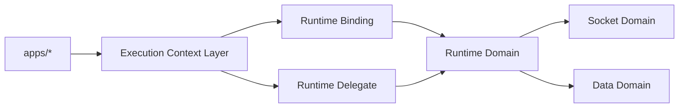

# Runtime Domain Spec

Date: 2026-06-18

## 1. 목적

`runtime` 도메인은 `app-runtime`의 composition root다. 각 하위 도메인인 `socket`, `data`를 조립하고, 상위 실행 컨텍스트 레이어가 제공하는 binding과 delegate를 연결한다.

## 2. 책임

- runtime binding 수용
- execution context 반영
- `socket`과 `data` 조립
- lifecycle 진입점 제공
- singleton 편의 API 제공

## 3. 비책임

- 토큰 발급
- 토큰 refresh 정책
- cloud fallback 결정
- 사용자 세션 저장/복구
- 로그인 상태 판별
- 클라우드 선택 정책 결정
- 세션/인증 hook 제공

## 4. 입력 계약

### runtime binding

```ts
export interface RuntimeBinding {
    context: {
        cid: string;
        sid?: string;
        uid?: string;
    };
    socket: {
        config: {
            url: string;
            deviceId: string;
            wssType?: 'relay' | 'cloud';
        };
        scope: {
            cid: string | null;
            sid: string | null;
            uid: string | null;
        };
    } | null;
}
```

### runtime delegate

`runtime`은 상위 실행 컨텍스트 레이어가 제공하는 delegate를 `socket` 도메인에 전달한다.

## 5. 출력 계약

- runtime manager
- repositories accessor
- socket state accessor

## 6. 상태 소유권

- runtime binding 소유자: 상위 실행 컨텍스트 레이어
- socket 연결/검증 상태 소유자: `socket` 도메인
- data context 소유자: `data` 도메인

## 7. 목표 구조



## 8. 조립 원칙

- `runtime`은 직접 `web-core` 토큰 API를 호출하지 않는다.
- `runtime`은 `socket`과 `data`를 명시적 생성 API로 조립하는 것을 기본 경로로 한다.
- singleton은 편의용이며, 설계의 기본 전제는 아니다.

## 9. 구현 기준

- `RuntimeManager.ensure()`는 context와 socket binding 반영만 담당한다.
- bootstrap과 reauth 세부는 `socket` 도메인으로 이동한다.
- `getRuntimeManager()`는 유지하되, `createRuntime()` 계열 명시 API를 우선 경로로 둔다.
- `runtime`과 `hooks` 계층에는 세션/인증 정책이 들어오면 안 된다.
- `useCloudSession`, `useCloudTokenRefresh` 같은 hook은 `app-runtime` 외부로 이동 대상이다.

## 10. 용어 정리

- `runtime`이 관리하는 것은 사용자 세션이 아니라 runtime binding이다.
- runtime binding은 세션에서 파생된 실행 컨텍스트다.
- 여기에는 `cid`, `sid`, `uid`, socket endpoint, `deviceId`, `wssType` 같은 실행 값이 포함된다.
