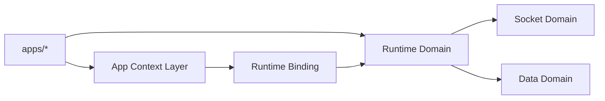

# Runtime Domain Spec

Date: 2026-06-18

## 1. 목적

`runtime` 도메인은 `app-runtime`의 composition root다. `socket`, `data`를 조립하고 runtime binding을 반영하는 역할만 가진다.

## 2. 현재 구현 관찰

- `RuntimeManager.ensure()`는 context 반영과 socket ensure를 함께 수행한다.
- `RuntimeManager.bootstrap()`은 connect, device 등록, `auth.update`까지 수행한다.
- `useRuntimeBinding.ts`는 현재 `@chatic/web-core` 세션 상태를 직접 읽어 binding을 계산한다.
- `WebSocketV2Connection.tsx`는 `useCloudSession`, `useCloudTokenRefresh`에 의존한다.

현재 구조는 `runtime`이 composition root를 넘어 세션/인증 흐름에 개입하고 있다.

## 3. 목표 책임

- runtime binding 수용
- `socket`과 `data` 조립
- lifecycle 진입점 제공
- singleton 편의 API 제공

## 4. 비책임

- 세션 상태 조회
- 토큰 발급
- 토큰 refresh 정책
- cloud fallback 결정
- 사용자 세션 저장/복구
- 로그인 상태 판별
- 세션/인증 hook 제공
- `@chatic/web-core` 세션 API 직접 의존

## 5. 입력 계약

```ts
export interface RuntimeBinding {
    context: {
        cid: string;
        sid?: string;
        uid?: string;
    };
    socket: {
        config: {
            url: string;
            deviceId: string;
            wssType?: 'relay' | 'cloud';
        };
        scope: {
            cid: string | null;
            sid: string | null;
            uid: string | null;
        };
    } | null;
}
```

## 6. 상태 소유권

- runtime binding 소유자: 상위 앱 컨텍스트 레이어
- socket 연결/검증 상태 소유자: `socket` 도메인
- data context 소유자: `data` 도메인

## 7. 목표 구조



## 8. 조립 원칙

- `runtime`은 binding 적용만 한다.
- bootstrap과 reauth 세부는 `socket` 도메인으로 이동한다.
- `runtime`은 세션 관련 hook을 export하지 않는다.
- singleton은 편의용이며, 설계의 기본 전제는 아니다.

## 9. 구현 기준

- `RuntimeManager.ensure()`는 유지 가능하다.
- `RuntimeManager.bootstrap()`은 장기적으로 socket bootstrap entry 위임 계층으로 축소한다.
- `useRuntimeBinding()`은 장기적으로 `app-runtime` 밖으로 이동한다.
- `connection` 계층은 세션/인증 hook을 직접 사용하지 않는다.

## 10. 용어 정리

- `runtime`이 관리하는 것은 사용자 세션이 아니라 runtime binding이다.
- runtime binding은 세션에서 파생된 실행 컨텍스트다.
- 여기에는 `cid`, `sid`, `uid`, socket endpoint, `deviceId`, `wssType` 같은 실행 값이 포함된다.

## 11. cid / sid / uid 관측 (활성 서버 기준)

**원칙: `cid`/`sid`/`uid`는 web-core의 활성 서버 상태(`activeServer`)를 관측해 파생한다.** relay/cloud 필드를 수동으로 조합하지 않는다.

web-core `contextStore`는 `cloud.isActive`를 기준으로 활성 서버를 resolve해 `GlobalSessionContext.activeServer`(`ActiveServerContext`)로 노출한다.

```ts
type ActiveServerContext =
    | { kind: 'relay'; backend; wss; siteId: string | null; identityToken }
    | { kind: 'cloud'; cloudId: string; siteId: string | null; backend; wss; identityToken };
```

binding 파생 규칙:

- `activeServer.kind === 'cloud'` → `cid = activeServer.cloudId`, `sid = activeServer.siteId`
- `activeServer.kind === 'relay'` → `cid = 'default'`(중계서버 sentinel), `sid = activeServer.siteId`
- `uid`는 활성 서버의 active profile(`cloudProfile ?? relayProfile`)에서 관측한다.

기본값 불변식:

- `cid`의 기본값은 `'default'`다. cloud가 active가 아니면 항상 `cid = 'default'`이며, 이는 `buildCloudContext` 활성화 조건과 일치한다.
- `sid`의 기본값은 `null`이다. **`sid`는 없을 수 있다** (클라우드 전환 후 사이트 전환을 아직 안 한 상태 등).
- `RuntimeBinding.context`의 `cid`/`sid`/`uid`는 위 활성 서버 관측 + 기본값 규칙을 그대로 따른다.

> **현재 구현과의 간극:** `useRuntimeBinding`은 아직 `activeServer`를 쓰지 않고 `currentWSS`/`cloud`/`relay`/`activeTarget`을 수동 조합한다. 목표는 `activeServer` 단일 관측으로 일원화하는 것이다.

## 12. cid / sid 선반영과 반응

클라우드 전환·사이트 전환은 web-core가 활성 서버(`activeServer`) 상태(cid/sid)를 **선반영**한다. `runtime`은 그 변경을 binding으로 받아 반응만 한다.

- web-core가 `cloudCore`/`relayCore`의 selected cloud/site를 선반영 → binding의 `cid`/`sid`가 갱신됨
- binding 변경 → `runtime`이 `socket`/`data`에 반영 → 새 `cid`/`sid` 기준으로 데이터/소켓이 따라감
- "캐싱 데이터 우선 표시"는 `data` 도메인이 cid/sid 변경에 반응하는 결과다 (data/data.md 참조)
- 롤백 로직은 이후 추가될 수 있다. 현재는 선반영만 정의한다.

## 13. 새 와이어링: 훅 vs 컴포넌트

기존 `connection/WebSocketV2Connection` + `SocketAuthCoordinator` 와이어링은 **제거·교체 대상**이다 ([socket/socket.md](../socket/socket.md) §2 참조). 새 와이어링을 **훅으로 둘지 render-null 컴포넌트로 둘지**가 핵심 설계 결정이다.

현재 `apps/web/src/app/app.tsx`에는 이미 두 스타일이 공존한다.

- 값 파생은 훅: `useInitWebCore()`(ready 반환), `useTokenRefresh()`(상태 반환), `useRuntimeBinding()`(binding 반환)
- lifecycle은 render-null 컴포넌트: `ForegroundTokenRefresh`(훅을 감싼 헤드리스 컴포넌트)

| 축               | 훅 (`useX(binding)`)                                | render-null 컴포넌트 (`<X binding/>`)              |
| ---------------- | --------------------------------------------------- | -------------------------------------------------- |
| 조건부 lifecycle | 조건부 호출 불가 → ready 게이팅이 내부 guard로 번짐 | `{ready && <X/>}`로 마운트/언마운트가 곧 lifecycle |
| 독립 격리        | 부모 한 곳에 누적(god-component 경향)               | 관심사별 독립 마운트·재렌더 격리                   |
| 값 반환/소비     | 반환값을 트리가 직접 사용하기 쉬움                  | 값 공유는 prop/context 필요                        |
| 테스트           | `renderHook`                                        | 마운트/언마운트 시나리오 테스트                    |

**권장: 역할별 하이브리드.**

- **값 파생은 훅 유지** — `useRuntimeBinding`(binding 계산), `useRuntimeRepositories`(repo 조회).
- **lifecycle 오케스트레이션은 render-null 컴포넌트** — binding 반응(§14)과 백그라운드 세션 시나리오([session-runner.md](./session-runner.md)). 둘 다 "ready일 때만 켜고 조건 따라 독립적으로 끄는" 성격이라 조건부 마운트가 자연스럽고, `ForegroundTokenRefresh` 선례와 일치한다.

> 최종 확정은 구현 시점으로 열어둔다. 본 절은 비교와 권장만 제공한다.

## 14. binding 반응 구성 (data/socket)

cid/sid/uid 또는 socket config가 부분 변경되면 해당 모듈의 컨텍스트(endpoint, data context)와 socket scope를 갱신해야 한다. 여기서 cid/sid/uid는 §11대로 활성 서버(`activeServer`)를 관측해 파생된 값이며, binder는 그 값의 diff에만 반응한다. 현재는 `RuntimeManager.ensure()`가 명령형으로 `DataManager.ensure(context)` + `SocketManager.ensure(config, scope)`를 한 번에 호출한다.

§13 권장(컴포넌트)을 적용한 분해 아이디어:

- `<RuntimeDataBinder binding>` (render-null): binding의 `context` 슬라이스를 구독, cid/sid/uid diff 시 `DataManager.ensure(context)`.
- `<SocketBinder binding>` (render-null): binding의 `socket` 슬라이스를 구독, config/scope diff 시 `SocketManager.ensure` 또는 `destroy`.

슬라이스별로 나누는 이유: 데이터 컨텍스트 변경과 소켓 재연결이 **독립적으로** 반응한다(예: sid만 바뀌면 data context는 갱신하되 소켓 재연결 조건은 별도 판단). 명령형 단일 `ensure` 진입은 더 단순하지만 두 반응이 한 묶음으로 묶이는 트레이드오프가 있다.

## 15. session 서브

세션 상태를 흐르게 하는 백그라운드 병렬 시나리오 러너와 webTransport 초기화는 별도 문서로 정의한다 → [session-runner.md](./session-runner.md).

- 관계: session 러너는 세션 상태(로그인·토큰·deviceId)를 흐르게 하고, §14 binder는 그 결과(cid/sid/uid)를 data/socket에 반영하는 소비자다.
