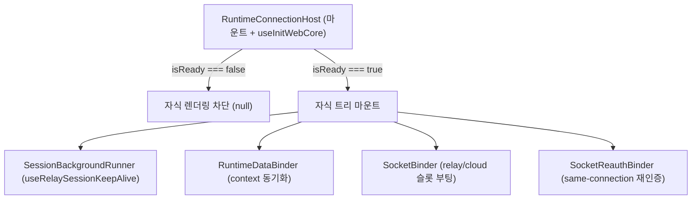

# Runtime 마운트 라이프사이클 (Host & Runner)

## 1. 목적

`RuntimeConnectionHost`가 `webTransport` 초기화 선행 조건을 보장하고, `@chatic/web-core`의 백그라운드 세션 훅과 `app-runtime`의 바인더들을 올바른 순서로 마운트하는 방식을 다룬다.

---

## 2. `RuntimeConnectionHost` — 조립 루트 + init 게이트

과거 별도의 `TransportBootstrap` 컴포넌트가 하던 transport 준비 게이팅은 **`RuntimeConnectionHost`에 흡수**됐다. Host가 세 가지를 직접 소유한다:

1. **웹코어 init 게이트** — `useInitWebCore()`가 `initializeRelaySession`을 1회 구동한다. 완료 전(`isInitialized === false`)에는 자식 트리를 렌더하지 않고 `null`을 반환해, 선행 의존성 없는 상태에서 바인더/러너가 일찍 마운트되는 것을 차단한다.
2. **delegate 소유** — `const delegate = useSocketSessionDelegate()`로 per-kind 소켓 인증 delegate를 만들어 소켓 바인더에 넘긴다. 앱이 delegate를 주입하지 않는다(Host props는 `{ binding, children }`뿐).
3. **자식 마운트 순서**.

```tsx
export const RuntimeConnectionHost = ({ binding, children }) => {
    const isReady = useInitWebCore(); // web-core 단일 init 드라이버
    const delegate = useSocketSessionDelegate();

    if (!isReady) return null; // 초기화 완료 전 하위 트리 렌더 차단

    return (
        <>
            <SessionBackgroundRunner />
            <RuntimeDataBinder binding={binding} />
            <SocketBinder binding={binding} delegate={delegate} />
            <SocketReauthBinder binding={binding} delegate={delegate} />
            {children}
        </>
    );
};
```

---

## 3. `SessionBackgroundRunner`

백그라운드에서 지속 구동돼야 하는 web-core 세션 훅을 묶어 실행하는 render-null 컴포넌트. **현재는 relay 세션 keep-alive 하나만** 구동한다.

```tsx
export const SessionBackgroundRunner = () => {
    useRelaySessionKeepAlive(true); // relay 세션이 부재하면 백그라운드 게스트 로그인으로 복구
    return null;
};
```

- Host의 init 게이트 뒤에 마운트되므로 `enabled=true`로 호출된다.
- **역할 분리**: 상태 전이·API 호출은 web-core 훅이 소유하고, Runner는 마운트 단위일 뿐이다.
- 토큰 refresh는 여기서 돌리지 않는다 — 소켓 토큰은 SDK `AuthController`가(만료 기반 자동), relay 토큰 주기 refresh는 web-core `useTokenRefresh`가 소유하며 SDK가 소켓 refresh를 소유하는 앱에서는 `sdkOwnsRefresh`로 주기 루프를 끈다([../../../web-core/docs/hooks/orchestration.md](../../../web-core/docs/hooks/orchestration.md)).

---

## 4. 라이프사이클 흐름도



1. **세션 데이터 흐름** — `SessionBackgroundRunner`가 web-core 세션을 유지·갱신한다.
2. **반영** — 세션이 갱신돼 활성 서버가 바뀌면 `useRuntimeBinding`을 거쳐 `RuntimeDataBinder`/`SocketBinder`/`SocketReauthBinder`가 이를 data/socket 엔진에 주입한다.

---

## 관련 문서

- [../architecture.md](../architecture.md) — 전체 아키텍처·오케스트레이션 매핑
- [./README.md](./README.md) — `RuntimeBinding` 파생 규칙 + 바인더 역할
- [../socket/README.md](../socket/README.md) — 소켓 부팅·재인증·switch/logout
