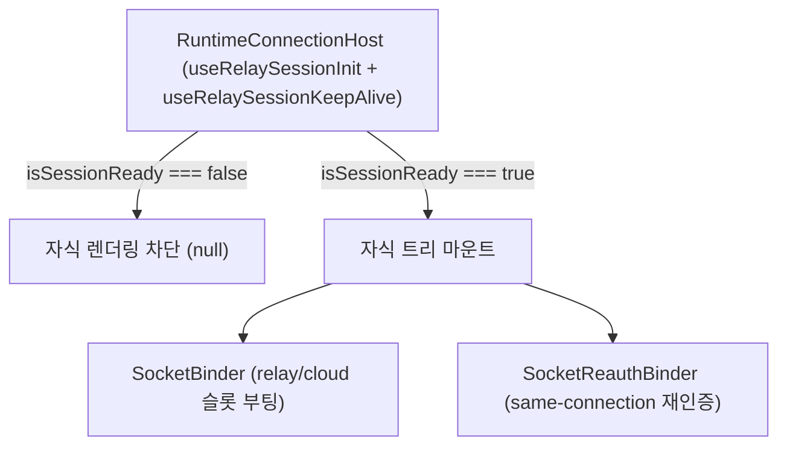

# Runtime 마운트 라이프사이클 (Host)

## 1. 목적

`RuntimeConnectionHost`가 세션 초기화 선행 조건을 보장하고, 백그라운드 세션 훅(relay keep-alive)을
인라인으로 호출하면서 `app-runtime`의 바인더들을 올바른 순서로 마운트하는 방식을 다룬다.

---

## 2. `RuntimeConnectionHost` — 조립 루트 + init 게이트

과거 별도의 `TransportBootstrap` 컴포넌트가 하던 transport 준비 게이팅은 **`RuntimeConnectionHost`에
흡수**됐다. Host가 다음을 직접 소유한다:

1. **세션 init 게이트** — [`useRelaySessionInit()`](../../src/session/hooks/app/useRelaySessionInit.ts)가
   `initializeRelaySession`을 1회 구동한다. 완료 전(`isSessionReady === false`)에는 자식 트리를 렌더하지
   않고 `null`을 반환해, 선행 의존성 없는 상태에서 바인더가 일찍 마운트되는 것을 차단한다. Host는
   **유일한 init 드라이버**다 — 예전에 `TransportBootstrap`이 독립적으로 init을 다시 트리거하던
   중복 초기화가 이 통합으로 사라졌다.
2. **delegate 소유** — `const delegate = useSocketSessionDelegate()`로 per-kind 소켓 인증 delegate를
   만들어 소켓 바인더에 넘긴다. 앱이 delegate를 주입하지 않는다(Host props는 `{ binding, children }`뿐).
3. **relay keep-alive** — `useRelaySessionKeepAlive(true)`를 Host에서 직접 호출한다(게이트보다 위에서
   호출돼 init 진행 여부와 무관하게 relay 세션 부재 시 백그라운드 게스트 로그인으로 복구). 별도
   render-null 러너 컴포넌트는 없다.
4. **자식 마운트 순서**.

```tsx
export const RuntimeConnectionHost = ({ binding, children }: RuntimeConnectionHostProps) => {
    const isSessionReady = useRelaySessionInit(); // 유일한 세션 init 드라이버
    const delegate = useSocketSessionDelegate();
    useRelaySessionKeepAlive(true); // relay 세션 부재 시 백그라운드 게스트 로그인으로 복구

    if (!isSessionReady) return null; // 초기화 완료 전 하위 트리 렌더 차단

    return (
        <>
            <SocketBinder binding={binding} delegate={delegate} />
            <SocketReauthBinder binding={binding} delegate={delegate} />
            {children}
        </>
    );
};
```

- **역할 분리**: 상태 전이·유스케이스 실행은 `session/` 훅이 소유하고, Host는 인라인 훅 호출 + 바인더
  마운트 단위일 뿐이다.
- **토큰 refresh는 Host에서 돌리지 않는다** — 소켓 토큰(relay 주기 refresh 포함)은 SDK
  `ClientSocketAuth`가 만료 기반으로 소유한다. 이 패키지 어디에도 주기 refresh 루프가 없고, refresh
  엔드포인트를 치는 코드 자체가 없다([../session/architecture.md](../session/architecture.md)).
- 데이터 스코프를 밀어 넣는 바인더는 **없다**. `ActiveScope`가 read 시점에 파생하므로 커밋할 것이
  없고, 그래서 자리만 지키던 `RuntimeDataBinder`도 삭제했다([./README.md](./README.md)).

---

## 3. `RuntimeAuthHost` — 인증 전용 축소판

세션 토큰만 신선하게 유지하고 chat 데이터 sync·게스트 keep-alive는 원치 않는 호스트(예: 관리 콘솔)를
위한 판이다. `SocketBinder` + `SocketReauthBinder`만 마운트한다.

의도적으로 뺀 것:

- `useRelaySessionKeepAlive` — 명시 로그인이 필요한 호스트가 조용히 게스트 세션을 얻으면 안 된다.

데이터 스코프 바인더는 두 Host 모두 마운트하지 않는다 — 그런 바인더가 더는 존재하지 않는다.

`RuntimeConnectionHost`와 마찬가지로 `useRelaySessionInit` 게이트를 갖고, 소켓은 binding이 identity
토큰을 실을 때만 연결하므로 로그인 전 마운트는 무해하다.

---

## 4. 라이프사이클 흐름도



1. **세션 유지** — Host의 인라인 `useRelaySessionKeepAlive`가 relay 세션을 유지·복구한다.
2. **반영** — 세션이 갱신되면 `useRuntimeBinding`을 거쳐 `SocketBinder`/`SocketReauthBinder`가 이를
   소켓 슬롯에 반영한다. 데이터 스코프는 별도 반영 없이 `ActiveScope`가 read 시점에 파생한다.

---

## 관련 문서

- [../architecture.md](../architecture.md) — 전체 아키텍처·오케스트레이션 매핑
- [./README.md](./README.md) — `RuntimeBinding` 파생 규칙 + 바인더 역할
- [../session/architecture.md](../session/architecture.md) — 세션 허브·refresh 소유·가드 둘
- [../socket/README.md](../socket/README.md) — 소켓 부팅·재인증·switch/logout
