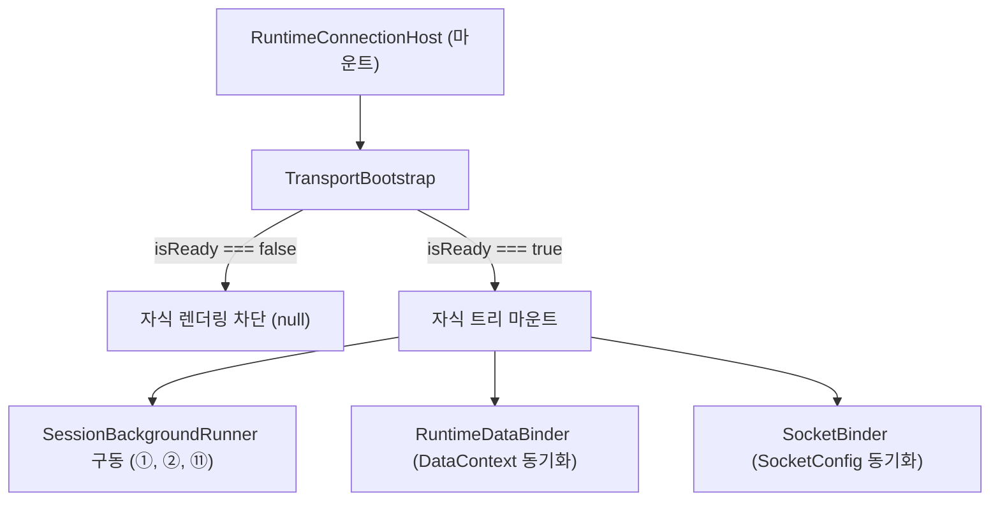

# Runtime Session 서브 (Runner & Bootstrap)

Date: 2026-06-19

## 1. 목적

`runtime`의 **session 서브**는 `@chatic/web-core`가 소유하고 있는 백그라운드 병렬 세션 시나리오(중계서버 유지, 토큰 리프레시, 디바이스 등록 등)의 마운트 생명주기를 통제하고, `webTransport` 통신 레이어의 초기화 선행 조건을 보장하는 역할을 한다.

---

## 2. 세션 백그라운드 러너 (SessionBackgroundRunner)

`SessionBackgroundRunner`는 백그라운드 상에서 병렬로 지속 구동되어야 하는 `web-core` 핵심 세션 제어 훅들을 한데 묶어 실행하는 render-null 컴포넌트다.

```tsx
export const SessionBackgroundRunner = () => {
    // ① 중계서버 게스트/인증 로그인 세션 항시 유지
    useRelaySessionKeepAlive();

    // ② 주기적 토큰 리프레시 루프 (relay + cloudToken)
    useTokenRefresh();

    // ⑪ 물리 디바이스 고유 식별자(deviceId) 등록/관리
    useDynamicDeviceId();

    return null;
};
```

- **역할 분리**: 세션의 상태 전이 로직 및 API 호출은 전적으로 `web-core` 훅이 소유한다. `SessionBackgroundRunner`는 해당 훅들이 적절한 순서와 환경에 마운트되어 라이프사이클을 구동할 수 있도록 제어하는 실행 단위이다.
- **마운트 선행 조건**: `TransportBootstrap`에 의해 `webTransport` 인스턴스 초기화 및 중계서버 초기화(`useInitWebCore` 완료)가 보장된 상태에서만 안전하게 실행되도록 게이팅한다.

---

## 3. 웹트랜스포트 부트스트랩 (TransportBootstrap)

`TransportBootstrap`은 런타임의 최상위 게이트 역할을 하는 컴포넌트다.
스토리지 어댑터, 환경 변수, 네트워크 자격 증명 등을 보유하는 `webTransport` 런타임(`libs/web-core/src/transport/webTransport.ts`)의 준비 여부를 관측한다.

- `web-core` 내부의 `useInitWebCore()` 훅의 `isReady` 상태를 가이드로 삼는다.
- **초기화 대기**: `isReady === false`인 초기 구동 시점에는 자식 트리를 렌더링하지 않고 `null`을 반환하여, 선행 의존성이 없는 상태에서 하위 바인더나 세션 러너가 일찍 마운트되어 에러를 발생시키는 것을 원천 차단한다.
- **초기화 완료**: `isReady === true`가 되는 순간 자식 트리를 마운트하여 정상적인 커넥션 및 데이터 동기화 루프를 가동한다.

---

## 4. 라이프사이클 흐름도



1. **로그인/갱신 흐름 생성**: `SessionBackgroundRunner`가 `web-core` 세션 데이터를 지속적으로 갱신하고 흐르게 한다.
2. **반영**: 세션 데이터가 갱신되어 활성 서버 정보가 변경되면, `useRuntimeBinding`을 거쳐 `RuntimeDataBinder`와 `SocketBinder`가 이를 감지하고 소켓 및 데이터 엔진에 주입한다.

---

## 관련 문서

- [../architecture.md](../architecture.md) — 전체 아키텍처 아웃라인 및 오케스트레이션 매핑
- [./runtime.md](./runtime.md) — Binder 컴포넌트 및 `useRuntimeBinding` 파생 규칙
- [../socket/socket.md](../socket/socket.md) — 소켓 401 재인증 복구 매커니즘
