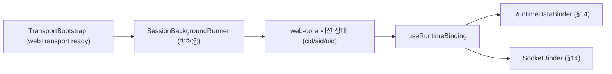

# Runtime Session 서브

Date: 2026-06-19

## 1. 목적

`runtime`의 **session 서브**는 web-core가 소유한 백그라운드 병렬 세션 시나리오를 "**언제·어디에 마운트하는가**"만 책임진다. 전이 로직 자체는 web-core가 소유하며(`hooks/app`, `session/services`), 여기서는 그 훅들을 묶어 background에서 병렬 구동할 마운트 단위를 정의한다.

이 서브는 [runtime.md](./runtime.md) §13 권장(컴포넌트)을 적용한다 — 백그라운드 시나리오는 "ready일 때만 켜고 조건 따라 끄는" 성격이라 render-null 컴포넌트가 자연스럽다.

## 2. 비책임

- 전이 자체(로그인·리프레시·디바이스 등록) — web-core `session/services` 소유
- cid/sid/uid 변경의 data/socket 반영 — [runtime.md](./runtime.md) §14 binder 소관
- 토큰/refresh 정책 — web-core hook 소관

## 3. 백그라운드 병렬 시나리오 러너

`@chatic/web-core` docs [orchestration.md](../../../web-core/docs/hooks/orchestration.md)에서 **백그라운드로 병렬 구동**되는 시나리오를 한 마운트 단위로 묶는다.

대상 (orchestration.md 번호):

- ① 중계서버 로그인 항시 유지 — `useRelaySessionKeepAlive`
- ② 병렬 리프레시 루프 (relay + cloudToken) — `useTokenRefresh`
- ⑪ 디바이스 등록 — `useDynamicDeviceId`

설계 아이디어:

```tsx
// render-null 헤드리스 컴포넌트. ForegroundTokenRefresh(app.tsx) 패턴 차용.
const SessionBackgroundRunner = () => {
    useRelaySessionKeepAlive(); // ①
    useTokenRefresh(); // ②
    useDynamicDeviceId(); // ⑪
    return null;
};
```

- 훅 자체는 web-core 소유. 컴포넌트는 마운트 시점/조건만 결정한다(orchestration.md 원칙: hook은 lifecycle 트리거 + service 호출 연결만 담당).
- 마운트 조건: webTransport ready + (필요 시) webCore init 완료 이후 (§4).
- 개별 시나리오를 더 잘게 쪼갠 컴포넌트로 분리해도 된다(예: `<KeepAliveRunner/>`, `<TokenRefreshRunner/>`). 단일 러너는 마운트 순서를 한곳에서 보장하는 장점, 분리는 독립 마운트/언마운트의 장점이 있다.

## 4. webTransport 초기화 선행 의존

백그라운드 세션 훅은 `@chatic/web-core`의 transport 런타임(`libs/web-core/src/transport/webTransport.ts`)을 전제로 한다. 이 런타임은 스토리지 어댑터·env·자격증명을 보유하는 세션 훅의 **선행 조건**이다.

- `<TransportBootstrap>`(또는 러너 마운트 가드)로 webTransport ready를 보장한 뒤 `SessionBackgroundRunner`를 마운트하는 순서 의존을 명시한다.
- 순서: `webTransport ready` → (relay init: `useInitWebCore`) → `SessionBackgroundRunner` 마운트.
- webTransport 자체는 web-core 소유다. app-runtime의 session 서브는 "ready 여부를 보고 러너 마운트를 게이팅"하는 역할만 한다.

## 5. 다른 서브와의 관계



- session 러너는 세션 상태를 **흐르게** 하고, binder(§14)는 그 결과를 data/socket에 **반영**하는 소비자다.

## 관련 문서

- [runtime.md](./runtime.md) §13 훅 vs 컴포넌트, §14 binding 반응 구성, §15 session 서브
- [../../../web-core/docs/hooks/orchestration.md](../../../web-core/docs/hooks/orchestration.md) — 백그라운드 시나리오 정책
- [../socket/socket.md](../socket/socket.md) — 소켓 도메인 5책임
