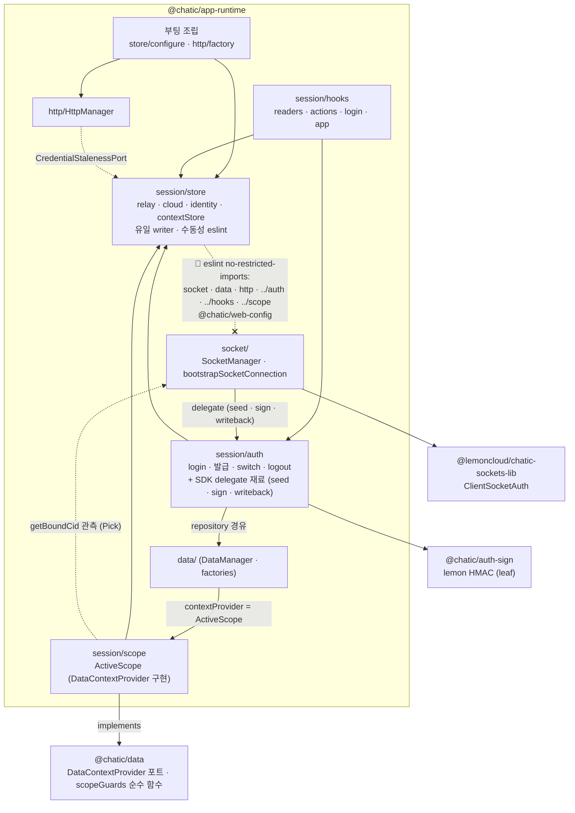
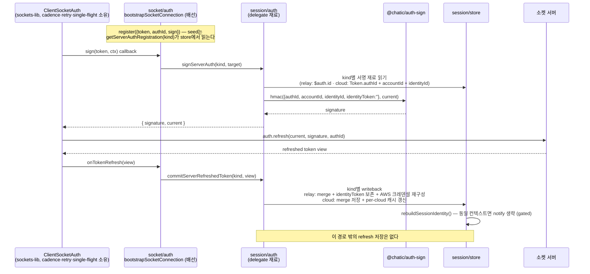

# app-runtime 세션 허브 — store · auth · scope · hooks

> 상태: Live · 최종 갱신: 2026-09-02 · 관련 ADR: [ADR-0070](../../../../docs/adr/0070-app-runtime-session-hub.md) (결정 1·2·7)

## 목적

세션(토큰·크레덴셜·선택 상태·identity·스코프)의 **단일 창구**다. 세션 상태의 유일한 보관처·writer는
`app-runtime/src/session/store`이고, refresh의 실행·cadence·retry·single-flight는 SDK
`ClientSocketAuth`만 소유하며, 스코프의 소유자는 `session/scope/ActiveScope` 하나다.

이 문서는 그 네 폴더가 지금 무엇을 소유하고 어떤 방향으로만 흐르는지를 정의한다. **왜 그렇게
됐는지**(대안·근거·이관 경위)는 [ADR-0070](../../../../docs/adr/0070-app-runtime-session-hub.md)이
소유한다.

## 설계 원칙

아래 네 원칙이 이 문서 전체의 판단 기준이다.

- **스토어의 수동성.** `session/store/**`는 저장과 통지만 한다 — 소켓·데이터·HTTP·유스케이스·훅을
  모른다. 규약이 아니라 **강제선**이다: [`eslint.config.mjs`](../../eslint.config.mjs)의
  `no-restricted-imports`가 형제 폴더와 env import를 막는다(§session/store).
- **env 주입.** `session/**`은 `@chatic/web-config`를 직접 import하지 않는다. 부팅 조립이 읽어 값(또는
  resolver 함수)으로 넘긴 것만 본다. `import.meta`가 ts-jest(`module: commonjs`)를 깨는 문제가
  구조적으로 사라진다.
- **refresh 단독 소유.** 만료 cadence·refresh 실행·백오프·in-flight 직렬화는 `ClientSocketAuth`만
  수행한다. app-runtime이 배선하는 것은 sign callback(`@chatic/auth-sign` 경유), 초기 seed,
  `onTokenRefresh` writeback 셋뿐이다. **refresh 엔드포인트를 치는 코드는 이 패키지에 없다**(§refresh).
- **세 뷰 불합침.** 스코프의 `intent`(선택) · `bound`(소켓 관측) · `committed`(커밋 토큰)는 이름 붙은
  별개 값이다. 통일하는 것은 **소유자**이지 값이 아니다 — 합치면 낙관적 전환이 깨지고 크로스 클라우드
  캐시 오염이 돌아온다.

## 폴더 구조

```
session/
├── store/      relay·cloud·identity 토큰 · 선택(cid/sid/uid) · 파생 컨텍스트 조립 · 통지
│   └── configure.ts   env 이음매 (유일한 lint 면제)
├── auth/       login · 발급 · switch · logout · cloud 토큰 재발급 + SDK delegate 재료
├── scope/      ActiveScope — intent·bound·committed 세 뷰 + DataContextProvider 구현
└── hooks/      readers 4 · session actions 5 · auth 8 · app 7
```

`store/index.ts`는 `stores.ts`(원시 스토어 3형제 + 저장 키)를 **재수출하지 않는다** — 소비자는
`contexts`/`contextStore`를 읽고, 원시 스토어는 허브 안의 유스케이스만 잡는다.

## 의존 방향 — ESLint 강제선 포함



방향 요약: `store`는 leaf(수동), `auth`는 store에 쓰고 HTTP는 **repository를 지나며**, `scope`는 store
구독 + 소켓 관측만, `hooks`는 auth·store 소비만 한다.

## session/store — 수동성의 강제선

[`eslint.config.mjs`](../../eslint.config.mjs)가 `src/session/store/**`에 두 그룹을 금지한다:

| 금지                                         | 이유                                                         |
| -------------------------------------------- | ------------------------------------------------------------ |
| `**/socket/**` · `**/data/**` · `**/http/**` | 스토어는 자기가 기록하는 흐름의 참여자가 되면 안 된다        |
| `../auth` · `../hooks` · `../scope` (+ `/*`) | 방향이 반대다. 열어두면 폴더 순환                            |
| `@chatic/web-config` · `@chatic/web-core`    | env·레거시 표면 직접 import 금지 — 부팅이 주입한 값을 받는다 |

`../scope`가 금지 목록에 있는 것은 ADR 본문이 다섯 폴더만 명시한 것의 확장이다 — scope가 store를
구독하는 방향이므로 역방향을 열면 순환이 된다.

**면제는 하나뿐이다.** [`store/configure.ts`](../../src/session/store/configure.ts)가 relay
endpoint resolver(`getDynamicRelayBackend`/`getDynamicRelayWss`)를 `relayStore`에 꽂는 이음매다.
값이 아니라 **함수**로 넘긴다 — 딥링크 오버라이드(`?_backend=`)가 모듈 로드 이후에 잡혀도 반영되도록
매 접근마다 지연 해석한다. `storage`(`@chatic/shared`)와 `logger`(`@chatic/bridges`)는 금지 대상이
아니다 — 플랫폼 유틸이지 세션 형제 폴더가 아니다.

## session/auth — HTTP는 data 레이어를 지난다

`session/auth`의 유스케이스(login·발급·전환·로그아웃·OAuth 교환)는 HTTP를 쳐야 하는 코드다.
**게이트웨이를 직접 잡지 않는다** — [`services.ts`](../../src/session/auth/services.ts)는
`AuthRepositoryV2`를 부르고, 게이트웨이 인스턴스를 아는 코드는 전부 `data/` 안에 있다.

```
session/auth/services.ts ──> data(AuthRepositoryV2) ──> http/gateways ──> HttpManager
```

비-React 코드라 `getRepositories()`로 잡는다 — `socket/sync/plans.ts`와 같은 접근자이고,
`useRuntimeRepositories` 훅은 React 표면 전용이다.

[`authActions.ts`](../../src/session/auth/authActions.ts)는 이름층이 아니라 **어댑터**다:
`registerUserWithInviteCode`·`fetchInviteInfoWithCode`는 배럴로 나가서 앱 3개가 positional 인자로
부르는데 repository는 객체를 받는다. 그 번역을 한 곳에 두는 것이 존재 이유 전부다.

**세션 재료의 주인은 `session/auth`다.** repository는 호출을 수행할 뿐 토큰을 해석하거나 설치하지
않는다. 그래서 `AuthHttpDomainGateway`의 `Pick`은 토큰 생성 액션(`login` · `registerDevice` ·
`verifyNativeToken` · `exchangeCode` · `delegateCloud` · `exchangeToken`)을 **포함한다**. 유지되는
불변식은 부재가 아니라 규칙이다: `data/` 아래 어디도 `Token`을 읽거나 스토어를 쓰거나 인증 상태를
뒤집지 않는다.

매핑 그룹은 응답의 성격을 따른다 — 사용자 생성(`registerUser` · `registerUserV2`)은 `DomainUser`로
매핑되고, **로그인·발급 계열은 raw 뷰로 통과한다**(매핑이 `Token`과 `cloudId`를 떨어뜨린다).

`webTransport.buildCredentialsByToken`(AWS 크레덴셜 캐시 재구성)은 lemon adapter의 표면이라
`session/auth`가 직접 잡는다. HTTP 요청이 아니라 로컬 자격증명 재구성이다.

## refresh — `ClientSocketAuth` 단독 소유 (HTTP 경로 0)



배선 지점은 셋뿐이다 — seed · sign · writeback. `commitServerRefreshedToken`이 새 토큰 뷰의 **유일한**
저장 경로이고, `signServerAuth`는 `session/store`의 재료만 읽고 서명한다(네트워크 호출도, 토큰 저장도
하지 않는다). lemon-hmac이 토큰 문자열에 의존하지 않는 성질(`identityToken: ''`로 서명)은 그대로
유지된다 — 계약은 [socket/auth/signing.md](../socket/auth/signing.md).

`sign(token, ctx)` 배선의 실제 위치 셋: [`bootstrapSocketConnection.ts`](../../src/socket/auth/bootstrapSocketConnection.ts) ·
[`reauthenticateActiveSocket.ts`](../../src/socket/auth/reauthenticateActiveSocket.ts) ·
[`recoverUnverifiedSockets.ts`](../../src/socket/auth/recoverUnverifiedSockets.ts). delegate 구현은
[`sessionDelegate.ts`](../../src/socket/auth/sessionDelegate.ts)다.

### 유일한 트리거 API

[`requestRelaySessionRefresh()`](../../src/socket/auth/requestRelaySessionRefresh.ts)만이 "relay 세션의
자격증명을 신선하게" 진입점이다. **HTTP fallback은 없다** — 소켓이 없으면 `false`를 돌려주고 호출부가
소켓을 되찾는다(`useSocketWakeRecovery`).

### 가드는 부재 검사다

예전 가드는 `no-restricted-imports`로 정당 호출부 밖의 deep-import를 막았다. 그 규칙은 경로
문자열(`**/session/auth/api`)에 묶여 있어서 심볼이 옮겨가자 아무것도 매치하지 않은 채 **조용히
죽었고**, 위반 파일이 lint를 통과했다.

지금은 [`src/http/refreshAbsence.test.ts`](../../src/http/refreshAbsence.test.ts)가 **app-runtime
어디에도 refresh 경로 문자열이 없음**을 검사한다(`libs/http/src/gateways/refreshAbsence.spec.ts`가
게이트웨이 디렉토리에 대해 하는 것과 같은 방식). 심볼이 어디로 옮겨가든, 누가 새 파일을 만들든 걸린다 —
경로 의존이라는 실패 양식 자체가 없다.

## staleness 감시 — relay와 cloud는 가드가 둘이다

`useSessionStalenessGuard`는 **relay 전용이다.** 이름이 "session"이라 cloud도 덮는 것처럼 읽히지만,
프로브(`hasStoredRelaySession` · `isStoredSessionExpired`)와 refresh 대상
(`requestRelaySessionRefresh()`)이 전부 relay다. 누락이 아니라 계약이다 — 이름이 그 계약을 말한다.
두 서버의 복구 수단이
다르기 때문이다.

|               | relay                                   | cloud                                                           |
| ------------- | --------------------------------------- | --------------------------------------------------------------- |
| 토큰의 부모   | 없음 (로그인이 유일한 발급)             | relay identity (`delegate-cloud`)                               |
| 갱신 수단     | **refresh** — `ClientSocketAuth` 단독   | **재발급** — `delegate-cloud` + `exchange-token`                |
| 소켓이 없으면 | 갱신 불가. 기다리는 것 외에 방법이 없다 | relay만 살아 있으면 언제든 가능                                 |
| 만료 시 정책  | 세션 자체가 위험 → teardown 후보        | 클라우드만 버리면 된다 (`onAuthExpired` → `logoutCloudSession`) |

### relay — [`useSessionStalenessGuard(policy)`](../../src/session/hooks/app/useSessionStalenessGuard.ts)

프로브는 read-only다(lemon 토큰 스토리지를 건드리지 않는다). refresh가 필요하면
`requestRelaySessionRefresh`를 부른다. 그 둘은 정책 파라미터가 아니다.

`forceRefresh` 정책은 만료 프로브(`isStoredSessionExpired`) **앞에서** 자격증명을 직접 재고 선제로
refresh를 요청한다. 부팅 핸드셰이크의 `auth.update`는 토큰을 emit하지 않으므로(SDK는 `refresh`/`switch`에서만
emit) 첫 writeback이 연결 후 한 refresh 주기(서버가 `expiresIn`을 안 주는 지금은
`AUTH_OPTIONS.refreshIntervalMs` = 5분) 뒤에나 도착하고, 그때까지 relay 서명 HTTP는 잠들기 전 자격증명으로
서명한다 — 만료 프로브는 lemon의 `expired_time`만 읽으므로 이 창을 볼 수 없다.

**재는 대상은 그 프로브가 아니라 실제 서명 재료다.** `credentialFreshness.timeToExpiry('relay')`가 relay
자격증명의 `Expiration`을 읽고, 한 refresh 주기보다 여유가 적을 때만 쏜다(2026-09-02). 예전에는 엣지마다
무조건 쏘았는데, 그건 못 믿을 시계를 우회하는 방법이었을 뿐이고 방금 민팅된 자격증명까지 갱신해 로그인
순간의 재인증과 겹쳤다. 측정 불가(토큰 뷰에 자격증명이 없음)는 예전처럼 무조건 쏜다.

- 에지 구동 호출자(relay verified 상승 에지 · 포그라운드 복귀)만 켠다. **인터벌과 함께 쓰면 쏘는 창에서
  매 틱 refresh가 되므로 금지.**
- 60초 쿨다운이 걸려 있다.
- **선제 refresh 실패는 teardown 스트릭에 넣지 않는다** — 아직 유효한 자격증명은 세션이 죽었다는
  근거가 아니다(대개 소켓이 아직 authenticated가 아닐 뿐).

### cloud — [`useCloudCredentialGuard`](../../src/session/hooks/app/useCloudCredentialGuard.ts)

트리거는 폴링이 아니라 **자격증명 자신의 `Expiration`에서 계산한 마감 시각**이다(만료 - 마진까지 잠들고,
상한 5분마다 스토어를 다시 읽는다). 마감이 오면
[`socket/auth/renewCloudSession`](../../src/socket/auth/renewCloudSession.ts)이 **재발급 → 소켓 재등록**
순으로 갱신한다.

마진이 5분(= `AUTH_OPTIONS.refreshIntervalMs`)인 이유는 튜닝이 아니라 진단이다: 건강한 cloud 소켓은 매
주기 자격증명을 다시 민팅하므로, **마진 아래로 내려온 것 자체가 소켓이 못 따라오고 있다는 증거다.**

이 틈은 실재했다. cloud 자격증명은 1시간 수명이고 세션 중간에 그것을 다시 민팅하는 것은 cloud 소켓의
refresh writeback 하나뿐이었다. 그 소켓이 죽은 동안(절전·연결 끊김·한 장소에 오래 머무름) 아무도
자격증명을 **측정조차 하지 않았고**, 만료된 뒤 cloud 서명 HTTP가 전부 403이 됐다. 클라우드 재입장이
이걸 가려왔다(`switchCloudSession`이 재발급하므로) — 즉 가만히 있는 세션에서만 드러났다.

**소켓 재등록이 선택 사항이 아닌 이유:** cloud 슬롯의 binding은 의도적으로 `identityToken`을 싣지 않아서
`SocketBinder`도 `SocketReauthBinder`도 same-wss 토큰 변경에 반응하지 않는다. 명시적으로
`reauthenticateActiveSocket({ kind: 'cloud' })`를 부르지 않으면 SDK가 **만료된 토큰을 계속 재전송**하다
`maxFailures`를 태우고 `onAuthExpired`가 클라우드에서 사용자를 내보낸다 — HTTP만 고치고 장소를 잃는다.

**재발급 경로([`session/auth/cloudTokens`](../../src/session/auth/cloudTokens.ts))는 배럴에 없다.**
`switchCloudSession`(진입: 캐시 허용, 선택 상태 소유)과 `reissueCommittedCloudTokens`(체류: 캐시 금지,
선택 상태 불변)이 같은 교환을 공유하고, **캐시 금지가 핵심이다** — per-cloud 캐시에 들어 있는 사본이
바로 지금 만료되는 그 사본이다. 같은 이유로 `commitServerRefreshedToken('cloud')`도 캐시를 함께 올린다.
캐시가 활성 토큰보다 뒤처지면 나중의 재입장이 **갱신 전 자격증명을 되살려** 방금 닫은 403 창을 다시 연다.

## session/scope — `ActiveScope`

받는 쪽 포트는 `@chatic/data`의 `DataContextProvider`(`getContext` / `setContext`) 하나이고,
[`ActiveScope`](../../src/session/scope/ActiveScope.ts)가 그 유일한 구현자다.

```ts
export class ActiveScope implements DataContextProvider {
    constructor(
        private readonly readIntent: () => DataContext, // scope/intent — store에서 매 read 파생
        private readonly socket: BoundCidSource, // Pick<ISocketManager, 'getBoundCid'>
        private readonly committedCloudId: () => string | null
    ) {}

    get intent(): DataContext; //  선택된 cloud/site/user — 전환 시작에 낙관적으로 뒤집힘
    get bound(): { cid: string | null }; //  소켓이 실제로 붙은 cloud — 관측값, 여기서 대입하지 않음
    get committed(): { cid: string | null }; //  스토어에 커밋된 토큰의 cloud — 낙관 창 동안 동결

    getContext(): DataContext; //  intent + socketCid(bound) 합성. 매 호출 조립(캐시 안 함)
    setContext(): void; //  no-op — push를 존중하면 stale holder 경로가 돌아온다
}
```

**읽기가 밀어넣기보다 낫다.** 예전에는 `useRuntimeBinding`이 세션 렌더마다 intent를 파생해
`DataManager.ensure`로 holder에 밀어 넣었다. 그 push가 React effect에서 도는 바람에 cloud 전환 시
provider는 아직 **이전** cid를 보고하는데 하위 훅이 구독을 시작했고, 관측자가 stale 스코프로 등록돼
커밋 후 쓰기를 영영 못 받았다(레일이 수동 새로고침 전까지 stale). 스토어를 직접 읽으면 그 lag가 없다.
apps/web의 `contextOverride` 우회(`useHomePlaces` · `useActiveCloudChannels`의 "SCOPE PINNING" 주석)는
자기 값을 넘기므로 그대로 동작한다.

`getContext()`가 `socketCid`를 **null로 세팅하지 않고 생략**하는 것도 계약이다 — `isForeignContext`는
`socketCid` 부재를 "이견을 낼 상대가 없음"으로 다룬다.

### 판정 함수의 소유자는 `@chatic/data`다

판정 호출부의 다수가 `data` 안에 있고 `data`는 leaf라 app-runtime을 import할 수 없다. 그래서 판정은
`DataContext` 값만 받는 **순수 함수**로 `@chatic/data`(`repositories-v2/scopeGuards.ts`)가 소유하고,
`session/scope`와 `socket/sync`는 그것을 호출하는 소비자다.

```ts
export const isForeignContext = (ctx: DataContext): boolean =>
    ctx.socketCid != null && (ctx.cid || 'default') !== ctx.socketCid;
export const isCidActive = (targetCid: string | null, boundCid: string | null): boolean =>
    targetCid == null || targetCid === boundCid;
```

소비 지점: `ChannelRepositoryV2`(3곳 — 그중 하나는 **부정 반전**으로 일치할 때만 캐시 쓰기) ·
`PlaceRepositoryV2` · `SyncManager.isCidActive` · `plans.dropForeignFrame`.

per-call `contextOverride`(로컬 data-source의 요청 단위 힌트)는 그대로 남는다 — 물리
파티션(`${type}:${cid}:${uid}:${id}`)을 바꾸는 수단이 아니고 read 경로는 override를 무시한다는 기존
한계도 그대로다.

`HttpManager`가 이 뷰에서 읽는 것은 이제 **신선도 하나**다(`CredentialStalenessPort`). 서명하는
자격증명은 relay 것 하나뿐이라 route별 크레덴셜 선택이 없어졌다 — cloud 자격증명으로 서명하던 유일한
요청(클라우드 HTTP refresh)이 사라지면서 그 선택도 함께 사라졌다(2026-09-02). 클라우드 backend로 가는
요청은 `baseURL`로 목적지만 클라우드일 뿐 relay 서명을 탄다.

cloud 자격증명의 만료시각은 여전히 읽힌다 — 서명용이 아니라 **cloud 소켓 토큰의 나이 대용 지표**로,
`useCloudCredentialGuard`가 재발급 시점을 정하는 데 쓴다(`credentialFreshness`의 `CredentialOwner`).

## env 주입

env 읽기(`import.meta.env`/`window.*`)의 실체는 leaf 패키지 `@chatic/web-config`에 있다. `session/**`은
그것을 직접 import하지 않고, [`store/configure.ts`](../../src/session/store/configure.ts) 하나가 relay
endpoint resolver를 주입한다. 세션 테스트가 ts-jest(`module: commonjs`)에서 도는 것 자체가 `import.meta`
격리의 증명이며, `public-surface.test.ts`는 `@chatic/web-config`만 목으로 잡고 세션 허브는 **아무것도
스텁하지 않는다** — 스텁하는 것이 바로 그 게이트가 잡으려는 실패다.

## 부팅

세션 부팅은 아직 **import 부수효과**다: `session/store` 배럴 로드가 `configureSessionStore()`를 돌리고,
lemon transport 초기화는 `http/transport`가 소유한다. 위치가 leaf로 옮겨졌을 뿐 성격은 남았다.

호출 위치를 앱 엔트리(`initAppRuntime(config)`)로 끌어올리는 것은 별개 작업이며, 그때 각 앱
`main.tsx`의 초기화 순서 계약 — **로깅·브릿지 초기화가 세션 부팅보다 먼저**여야 하는 순서 — 를 깨지
않는지 앱마다 확인해야 한다.

## 검증

- **타입체크는 `tsc -b tsconfig.lib.json`** — libs에서 `tsc --noEmit`은 0건 검사 no-op이다(리포 기존
  함정). 물리 이동 후 다운스트림 유령 에러는 `dist/`·`out-tsc/` 강제 삭제 후 재빌드로 진단한다.
- **표면 잠금** — [`src/public-surface.test.ts`](../../src/public-surface.test.ts)가 공개 값 심볼 집합을
  목록으로 고정한다. 심볼 추가/삭제는 그 목록을 고치는 의도적 행위여야 한다.
- **refresh 부재** — [`src/http/refreshAbsence.test.ts`](../../src/http/refreshAbsence.test.ts).
- **스코프** — [`intent.test.ts`](../../src/session/scope/intent.test.ts) + `data`의 scopeGuards 테이블
  테스트. 판정 6곳의 스킵/통과 케이스를 1:1 보존한다(특히 `ChannelRepositoryV2`의 부정 반전).

```bash
npx nx run-many -t test -p @chatic/app-runtime,@chatic/data,@chatic/http
```

## 남은 일

코드로 끝낼 수 없는 두 가지다.

### 교환 응답이 `$auth.id`를 싣는지 — 로그 한 줄이 답한다

`createCredentialsByProvider`가 응답에 `$auth.id`가 없으면 `AUTH` 경고를 남긴다. 실제 로그인 한 번이면
확인된다. 싣지 않는다면 릴레이 소켓 등록이 불가능하므로 서버 쪽 변경이 선행돼야 한다.

### desktop-web 실기기 확인 — QA 기준은 "이전과 동일"이 아니다

동명 훅 병합으로 desktop-web이 소켓 통지 판을 타게 됐다. **아래가 의도된 동작 변화이고, 이것이 QA
기준이다** — "이전과 동일" 회귀 기준을 쓰면 1·2를 버그로 오판한다.

1. **로그아웃(PlaceRail):** "스토어만 지움" → "relay·cloud 소켓에 `auth.logout` 통지 후 지움". 서버 쪽
   auth 세션이 종료되는 것이 새 기대 동작이다. 통지는 fire-and-forget이라 로컬 teardown·redirect
   타이밍은 불변이다.
2. **클라우드 이탈(`useCloudSwitchFlow`의 'default' 전환):** "cloud 스토어만 지움" → "cloud 소켓에
   `auth.logout` 통지 후 지움". 마찬가지로 서버 세션 종료가 추가 기대치다.
3. **사이트 전환:** 변화 없음 — desktop-web은 이미 승자 판을 쓰고 있었다.

그 통지가 로그아웃 후 재로그인 플로우와 어떻게 맞물리는지는 실기기로만 확인된다.

### 사라진 안전망 하나 — 기록으로 남긴다

cloud refresh 400 시 relay 재발급 → cloud 재교환 → 1회 재시도하던 체인이 클라우드 HTTP refresh 제거와
함께 사라졌다. 이미 닿지 않는 코드였다(진입점이 `requestSessionRefresh('cloud')`의 HTTP 폴백과 죽은
커맨드들뿐이었다). 긴 절전 복귀에서 같은 증상이 재발하면 **답은 소켓 쪽 복구**여야 한다 — cloud
`ClientSocketAuth` 실패 → `onAuthExpired` delegate → 재교환 유스케이스. HTTP refresh를 되살리는 것은
답이 아니다.

## 관련 문서

- [../architecture.md](../architecture.md) — 5축 소유 규칙·모듈 구조
- [../public-surface.md](../public-surface.md) — 세션 허브가 배럴로 내는 것
- [../socket/auth/README.md](../socket/auth/README.md) · [signing.md](../socket/auth/signing.md) — SDK 소유 경계·서명 계약
- [../runtime/README.md](../runtime/README.md) — `RuntimeBinding`의 소켓 슬롯 파생
- [`libs/http/docs/architecture.md`](../../../http/docs/architecture.md) — HTTP 실행기·정책
