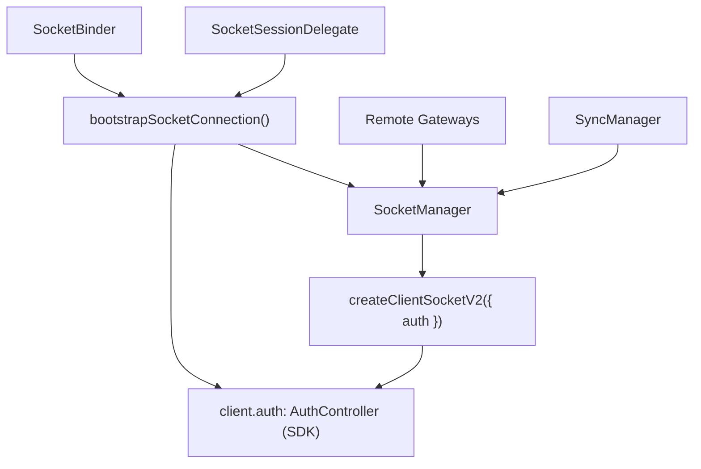

# Socket Domain Spec

Date: 2026-06-24
Status: Target Architecture

## 목적

`socket` 도메인은 `@lemoncloud/chatic-sockets-lib` v2 기반 transport를 앱이 안정적으로 사용하도록 감싸는 레이어다.

이 문서의 핵심은 두 가지다.

1. socket client 생성은 `SocketManager`가 소유한다.
2. 인증 수명주기는 SDK `AuthController`(`client.auth`)가 소유한다. 상태를 들고 있는 controller 클래스는 없고, bootstrap 시퀀싱과 SDK 구독 배선만 `SocketBinder`가 호출하는 순수 함수 `bootstrapSocketConnection(...)`가 담당한다.

> 인증 소유 경계·상태 머신·서명/writeback 계약은 [../auth/README.md](../auth/README.md) · [../auth/usage.md](../auth/usage.md) · [../auth/signing.md](../auth/signing.md)가 SSoT다. 이 문서는 socket 계층에서 그것을 어떻게 배선하는지만 다룬다.

## 핵심 구조



## 컴포넌트 책임

### `SocketManager`

책임:

- `ClientSocketV2` 생성, 교체, destroy
- 현재 client 상태 보관
- stable `request/send/onType/onMessage/onState`
- socket 교체 시 listener 재바인딩
- observable `SocketState` 제공

비책임:

- token refresh 정책
- bootstrap orchestration
- sync runtime 생성

핵심 판단:

- `ManagedSocketClientProxy`는 별도 레이어로 유지하지 않는다.
- 그 역할은 `SocketManager`에 흡수한다.

### `bootstrapSocketConnection(...)` (함수)

`SocketBinder`가 `binding.socket` 변경 시 호출하는 순수 async 함수. 상태를 들고 있는 클래스가 아니며, 반환한 cleanup으로 구독을 해제한다.

책임:

- bootstrap sequence — `manager.ensure(config)` → `manager.connect()` → `device.save` ack 관찰 → `client.auth.register({ token, authId, sign })` + `await client.auth.ready()`
- SDK 인증 구독 배선: `onAuthState` → `manager.setVerified` 매핑, `onTokenRefresh` → `delegate.commitRefreshedToken`, `expired` → `delegate.onAuthExpired`

비책임:

- 토큰 획득/갱신 타이밍, 만료 기반 refresh, 재연결 재인증, 401 백오프, site switch — 모두 SDK `AuthController`가 소유
- client 생성/교체
- sync target 관리

## 상태 모델

`SocketState`는 최소한 아래 정보를 가진다.

- `state`
- `isConnected`
- `isVerified`
- `connectionId`

주의:

- `device` 등록 여부는 runtime 내부 세부 구현으로 내려가므로 socket public state에 다시 드러내지 않는다.
- `isVerified`는 SDK `AuthController` 상태가 `authenticated`인지를 의미한다(`onAuthState` 매핑).

## 생성 규칙

### `createClientSocketV2`

- `SocketManager` 내부에서만 호출한다.
- config가 같으면 기존 client를 재사용할 수 있다.
- config가 바뀌면 기존 client를 파기하고 새 client를 생성한다.

## 인증 규칙

인증 수명주기는 SDK `AuthController`가 소유한다. socket 계층은 등록·구독만 배선한다.

### bootstrap

순서:

1. `SocketManager.ensure(config)` — `createClientSocketV2({ auth })`로 `AuthController` 부착
2. `SocketManager.connect()`
3. `device.save:*` 응답 관찰 (device 링크 전엔 서버가 `auth.update`를 거부하므로 ack 후 등록)
4. `client.auth.register({ token, authId, sign })` — `delegate.getAuthRegistration()`/`delegate.signAuth()`로 공급
5. `await client.auth.ready()` — `authenticated`까지 대기
6. `onAuthState` → `isVerified` 매핑

### 만료 기반 refresh · 재연결 재인증 · 401 백오프

- 모두 SDK `AuthController`가 자동 처리한다(만료 잔여 × `refreshRatio` 선제 refresh, `onState=connected` 자동 `auth.update`, `failed` → epoch 직렬화 백오프 → `maxFailures` 초과 시 `expired`).
- socket 계층은 별도 타이머(주기 refresh)나 single-flight 401 recovery를 두지 않는다.
- refresh/switch 성공분은 `onTokenRefresh` → `delegate.commitRefreshedToken(view)`로 web-core에 단방향 writeback한다.
- 상세 상태 머신·백오프 파라미터 → [../auth/README.md](../auth/README.md) §3.

## site 전환 규칙

- 같은 소켓 내 site 변경은 `client.auth.switch(`${uid}@${siteId}`)` 일회성 호출로 처리한다. 실패는 타입드 에러(`AuthSwitchError.phase`)로 받고 기존 sid는 보존된다([../auth/usage.md](../auth/usage.md) §1.4).
- active server 종류가 바뀌어(`relay`↔`cloud`) wss URL이 달라지면 switch가 아니라 **새 소켓 생성**이며, `SocketBinder`가 재부팅(register)으로 처리한다.
- 별도 `SocketAuthBinder`(identity token 변경 관측 → `updateAuth('session-switch')`)는 두지 않는다. token 변경 관측 재인증은 `onTokenRefresh` writeback과 피드백 루프를 만들어 제거한다.

## 외부 계약

### `SocketSessionDelegate`

app-runtime과 web-core 세션 레이어를 잇는 계약. SDK `AuthController`가 요구하는 register/sign/writeback을 active-server-aware 헬퍼로 공급한다([../auth/signing.md](../auth/signing.md) §2).

```ts
export interface SocketSessionDelegate {
    // register 초기값: active server 기준 { token, authId } (relay/cloud 분기)
    getAuthRegistration(): Promise<{ token: string; authId: string } | null>;
    // SDK sign 콜백 본문. token 인자는 무시(active server 기준 서명), target은 switch 식별용
    signAuth(token: string, target?: string): Promise<{ signature: string; current: string }>;
    // onTokenRefresh/switch 결과를 web-core 저장소로 단방향 writeback
    commitRefreshedToken(view: AuthTokenView): Promise<void> | void;
    // AuthController가 expired 터미널에 도달했을 때(백오프 소진) 로그아웃 트리거
    onAuthExpired?(): Promise<void> | void;
}
```

### gateway 사용 규칙

- gateway는 raw client를 직접 참조하지 않는다.
- gateway는 `SocketManager`의 stable API만 사용한다.
- request 재시도와 listener 유지 책임은 socket 계층이 가진다.

## 구현 메모

정렬 완료 (2026-06-24): `ManagedSocketClientProxy`는 제거되었고 request facade(request/send/onType rebind + 401 재시도)는 `SocketManager`에 흡수되었다. 자세한 정렬 상태는 [../architecture.md](../architecture.md#현재-코드와의-차이) 참조.

## 관련 문서

- [../architecture.md](../architecture.md) — 전체 아키텍처·소유 규칙
- [../public-surface.md](../public-surface.md) — 공개 API 표면
- [../runtime/README.md](../runtime/README.md) — composition root·binder 역할
