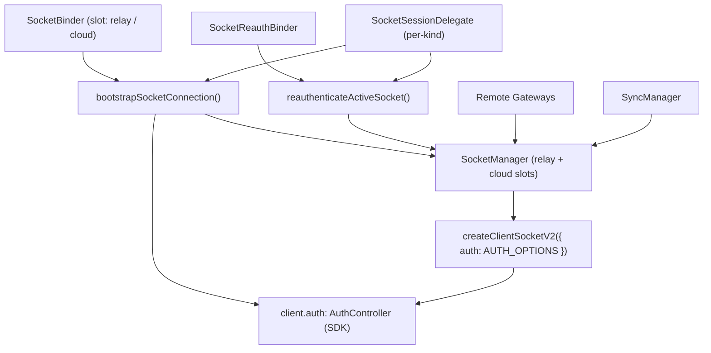

# Socket Domain Spec

## 목적

`socket` 도메인은 `@lemoncloud/chatic-sockets-lib` v2 기반 transport를 앱이 안정적으로 사용하도록 감싸는 레이어다.

핵심 두 가지:

1. socket client 생성·교체·상태는 `SocketManager`가 소유한다. relay·cloud **두 슬롯**을 독립 관리하며, gateway/sync에는 하나의 **active-facade**로 노출한다.
2. 인증 수명주기는 SDK `AuthController`(`client.auth`)가 소유한다. 상태를 들고 있는 controller 클래스는 없다. bootstrap 시퀀싱과 SDK 구독 배선은 `SocketBinder`가 호출하는 순수 함수 `bootstrapSocketConnection(...)`가, same-connection 재인증은 `SocketReauthBinder`가 담당한다.

> 인증 소유 경계·상태 머신·서명/writeback 계약은 [../auth/README.md](./auth/README.md) · [../auth/usage.md](./auth/usage.md) · [../auth/signing.md](./auth/signing.md)가 SSoT다. 이 문서는 socket 계층에서 그것을 어떻게 배선하는지만 다룬다.

## 핵심 구조



## 듀얼 슬롯 + active-facade

`SocketManager`는 `Map<SocketKind, ClientEntry>`로 `relay`·`cloud` 두 client를 **동시에** 들 수 있다. 각 슬롯은 자신의 `AuthController`·`boundCid`·인증 상태를 갖는다.

- **per-kind 접근**: `ensure(config, kind)`, `getClient(kind)`, `connect(kind)`, `setAuthenticated(kind, bool)`, `destroy(kind)`.
- **active-facade**: `request/send/onType/onMessage/onState/onError`는 kind를 받지 않고 **active slot**(cloud가 있으면 cloud, 없으면 relay — `getActiveKind`)으로 위임한다. gateway는 어느 슬롯이 active인지 몰라도 된다.
- `getBoundCid()` — active slot이 부팅 시 고정한 cid. sync/data가 cross-cloud frame을 걸러내는 데 쓴다.

## 컴포넌트 책임

### `SocketManager`

책임:

- kind별 `ClientSocketV2` 생성(`ensure`)·교체·`destroy`
- kind별 인증 상태 미러링(`setAuthenticated`) + transport 연결과 합성한 `SocketState` 방송(`subscribe`)
- active-facade `request/send/onType/onMessage/onState/onError`
- client 교체 시 listener 재바인딩(`subscribeClient`)
- 슬롯별 client 라이프사이클 방송(`subscribeSlotClients`) — 바인드/재빌드 시 `(kind, client)`, teardown 직전 `(kind, null)`. 같은 변경에서 active 알림(`subscribeClient`)보다 **먼저** 발화해, 슬롯별 부착물(SyncManager의 slot runtime)이 replay 전에 존재하도록 보장
- `waitUntilVerified(timeoutMs=10_000)` — verified까지 대기(성공/실패 bool, reject 안 함)

비책임:

- token 획득/갱신 정책, 만료 refresh, 재연결 재인증, `auth.update` orchestration — **SDK `AuthController`** 소유
- **401 감지/재시도** — `request`는 더 이상 401을 가로채거나 재연결·retry를 하지 않는다(제거됨)
- sync runtime 생성 — `SyncManager` 소유

### `bootstrapSocketConnection(...)` (함수)

`SocketBinder`의 각 슬롯이 config 변경 시 호출하는 순수 async 함수. 상태를 들고 있는 클래스가 아니며, 반환한 cleanup으로 구독을 해제한다.

책임 — 순서 **`ensure` → 구독 → `register`+게이트 닫기 → `device.save:ok`/disconnect 구독 → `connect`**:

1. `kind`는 SocketBinder가 슬롯별로 **명시 전달**(config에서 재유도하지 않음 — wssType 누락 시 relay 슬롯을 덮어쓰는 footgun 방지); `manager.ensure(config, kind)`
2. `onAuthState` → `manager.setAuthenticated(kind, state==='authenticated')`; `expired` → `delegate.onAuthExpired(kind)`
3. `onTokenRefresh` → `delegate.commitRefreshedToken(kind, view)`
4. `delegate.getAuthRegistration(kind)` → `client.auth.register({ token, authId, sign })`(토큰만 시드) → `auth.stop()`(게이트 닫기: SDK의 `onState('connected')` 자동 발사 억제) — **`connect` 전에**
5. `client.onMessage`에서 `device.save:ok` 필터 → `auth.start()`(게이트 열기: connected+토큰이면 `auth.update` 발사); `client.onState` closed/closing/idle → `auth.stop()`(재연결 대비 게이트 재폐쇄). `device.save:ok`는 `device.save` 요청의 응답이라 `onType`으로는 안 오고 `onMessage`로만 온다.
6. `manager.connect(kind)`

비책임:

- 토큰 갱신 타이밍·만료 refresh·재연결 재인증·백오프·site switch — SDK `AuthController` 소유
- **`auth.update`는 `device.save:ok` 이후에만 발사**(백엔드가 device 미등록 시 `auth.update`를 처리 못 함 — SDK의 connect-time 자동 발사를 stop/start 게이트로 억제·지연). **`client.auth.ready()` 호출 없음**(근거 → [../auth/README.md §3](./auth/README.md))

### `SocketReauthBinder` / `reauthenticateActiveSocket(...)`

같은 연결에서 신원(토큰)만 바뀌는 경우(게스트→소셜 승격, 같은 wss cloud site 전환)를 재인증한다. 각 슬롯의 `identityToken` 변화를 reboot가 아닐 때만 관측 → `reauthenticateActiveSocket({ manager, delegate, kind })` 호출. `token===auth.token` no-op 가드 + `logout→register` resume 경로(상세 → [../auth/README.md §3](./auth/README.md)).

## 상태 모델

`SocketState`:

- `state` — SDK 인증 상태 문자열
- `isConnected` — transport 연결 여부
- `isVerified` — `authenticated && connected` 파생
- `connectionId` — **현재 항상 `null`(미배선, 알려진 갭)**

주의:

- device 등록 여부는 runtime 내부 세부라 socket public state에 드러내지 않는다.
- `isVerified`는 kind별 SDK 상태(`setAuthenticated`)와 transport 연결을 합성한 active-facade 값이다. `useRuntimeSocketState()`가 UI에 노출한다.

## 생성 규칙 — `createClientSocketV2`

- `SocketManager` 내부에서만 호출하며 **`auth: AUTH_OPTIONS`를 넘긴다**(값·근거 → [../auth/README.md §2](./auth/README.md)).
- `ensure(config, kind)`: config가 같으면 재사용, 바뀌면 기존 client를 파기하고 새로 생성하며 `boundCid`를 고정한다.

## 인증 규칙 (요약)

인증 수명주기는 SDK `AuthController`가 소유하고 socket 계층은 등록·구독·재인증 트리거만 배선한다. 만료 refresh·재연결 재인증·백오프는 모두 SDK 자동이며, socket 계층은 주기 타이머나 401 recovery를 두지 않는다. refresh/switch 성공분은 `onTokenRefresh` → `delegate.commitRefreshedToken(kind, view)`로 web-core에 단방향 writeback한다. 상세 상태 머신·파라미터 → [../auth/README.md §5](./auth/README.md).

## site 전환 / 로그아웃 헬퍼

socket 계층은 `client.auth`를 직접 노출하지 않고 `socket/auth/` 안의 헬퍼로 감싼다. 이 원함수들은 루트에서 export하지 않으며(내부 전용), 앱은 `session/`의 react-query 훅(`useSiteSwitch` · `useSessionLogout` · `useLogoutCloudSession`)으로 소비한다:

- **`switchSite(siteId)`** ([switchSite.ts](../../src/socket/auth/switchSite.ts)) — 같은 소켓 내 site 변경. optimistic `applySelectedSite` → `waitUntilVerified()` → `client.auth.switch(`${uid}@${siteId}`)` → 실패 시 롤백·rethrow. 종류 변경(relay↔cloud, wss URL 변경)은 switch가 아니라 **새 소켓 생성**이며 `SocketBinder` 재부팅이 처리한다.
- **`logoutSession(options?)`** ([logoutSession.ts](../../src/socket/auth/logoutSession.ts)) — 두 슬롯 best-effort `auth.logout()` + `logoutRelaySession()`(전체 로컬 정리). relay 토큰 소멸 → 두 슬롯 tear down.
- **`logoutCloudSession()`** ([logoutCloudSession.ts](../../src/socket/auth/logoutCloudSession.ts)) — cloud 슬롯 best-effort `auth.logout()` + web-core cloud teardown. cloud 슬롯만 tear down, relay 유지.

## 외부 계약 — `SocketSessionDelegate`

app-runtime과 web-core 세션 레이어를 잇는 계약. 모든 메서드가 소켓 **`kind`** 를 받는다(전역 active 참조 금지 — [../auth/signing.md §0](./auth/signing.md)). 배선은 app-runtime의 [`useSocketSessionDelegate`](../../src/connection/useSocketSessionDelegate.ts)가 소유하며, 앱이 주입하지 않는다.

```ts
export interface SocketSessionDelegate {
    // register 초기값: kind 기준 { token, authId } (relay/cloud 분기)
    getAuthRegistration(kind: SocketKind): Promise<{ token: string; authId: string } | null>;
    // SDK sign 콜백 본문. token 인자는 무시(kind 기준 서명), target은 switch 식별용
    signAuth(kind: SocketKind, token: string, target?: string): Promise<{ signature: string; current: string }>;
    // onTokenRefresh/switch 결과를 kind 저장소로 단방향 writeback
    commitRefreshedToken(kind: SocketKind, view: AuthTokenView): Promise<void> | void;
    // AuthController가 expired에 도달했을 때: cloud→logoutCloudSession, relay→warn만(수동 로그아웃)
    onAuthExpired?(kind: SocketKind): Promise<void> | void;
}
```

### gateway 사용 규칙

- gateway는 raw client를 직접 참조하지 않고 `SocketManager`의 active-facade(`request/send/onType`)만 쓴다.
- socket 교체 시 listener 재바인딩은 `SocketManager`가 책임진다. (이 request facade가 과거 `ManagedSocketClientProxy` 역할을 흡수했다 — 별도 프록시 클래스는 없다.)

## 관련 문서

- [../architecture.md](../architecture.md) — 전체 아키텍처·소유 규칙
- [../public-surface.md](../public-surface.md) — 공개 API 표면
- [../runtime/README.md](../runtime/README.md) — composition root·binder 역할
