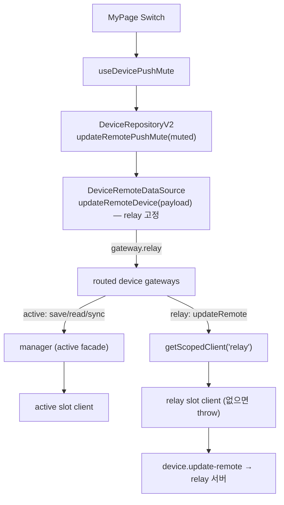
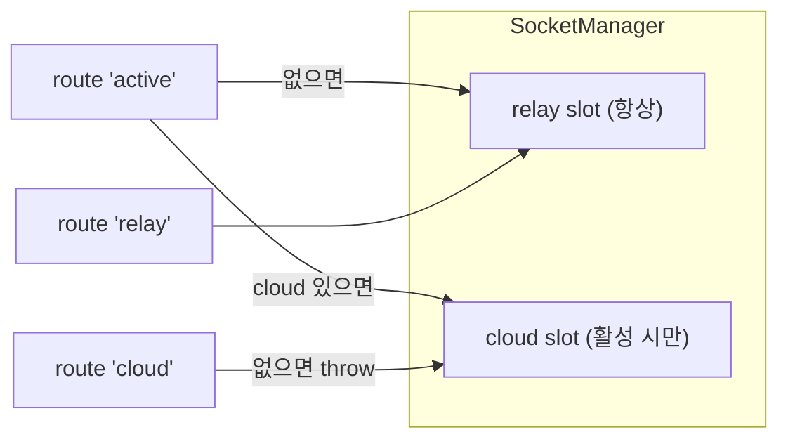

# Kind-scoped 소켓 라우팅 — 목적지 선택형 요청 (relay / cloud / active)

> 상태: Live · 최종 갱신: 2026-07-23 · 관련 ADR: [[ADR-0027]](../../../../docs/adr/0027-device-push-mute-setting.md)

## 목적

`SocketManager`는 `relay`(항상 켜짐)·`cloud`(활성 시만) 두 슬롯을 소유하고, 대부분의 요청은
**active 슬롯**(cloud 있으면 cloud, 없으면 relay)으로 나간다([SocketManager.ts:239](../SocketManager.ts),
[types.ts:59-65](../types.ts)). 하지만 어떤 요청은 클라우드 활성 여부와 무관하게 **특정 서버 슬롯**으로만 가야 한다.

첫 사례는 **디바이스 전역 푸시 음소거**(`device.update-remote`) — 설정 소유처가 relay 뒤의
`chatic-pushes-api`라서, 클라우드가 켜져 있어도 **relay 소켓으로만** 요청해야 한다.

이 기능은 그런 "슬롯을 지정해 요청" 능력을 **1급 재사용 프리미티브**로 제공한다. relay-while-cloud,
cloud-specific 같은 케이스가 반복될 것이므로, 도메인마다 배선을 새로 짜는 대신 코어 하나로 흡수한다.

## 설계 원칙

- **코어는 얇고 목적지-중립.** `SocketManager`는 "kind 고정 파사드"만 제공한다. "어떤 요청이 어디로
  가야 하는가"라는 정책은 코어가 모른다.
- **단일-목적지 도메인은 데이터 소스에 고정한다.** (2026-07-23 개정, ADR-0027 추록) update-remote처럼
  계약상 목적지가 하나뿐인 메서드는 데이터 소스가 relay 파사드를 직접 쓰고 `route` 인자를 노출하지
  않는다 — 호출부가 route를 빠뜨려 active(cloud)로 새는 사고 표면 자체를 없앤다. 호출 시점에 목적지가
  정말 달라지는 두 번째 소비자가 생기면 그때 그 메서드에 `route`를 노출한다.
- **지연 해석 필수.** 슬롯은 `ensure()`에서 teardown/rebuild되므로([SocketManager.ts:91-118](../SocketManager.ts)),
  파사드는 클라이언트를 캡처하지 않고 매 호출 `getClient(kind)`로 다시 얻는다. 이걸 어기면 재바인드 후 stale client를 잡는다.
- **조용한 폴백 금지.** relay 슬롯이 없으면 request 시점에 throw한다. "relay로 갔다"는
  계약을 지키기 위한 의도적 실패다 — active로 몰래 새지 않는다.

## 범위

**포함**

- 코어: `SocketManager.getScopedClient(kind)` — kind 고정 안정 파사드(`request`/`send`).
- 라우팅: `SocketRoute` 타입 + `routed()` 헬퍼(게이트웨이 묶음). data-source의 update-remote는 relay 고정
  (route 인자 미노출 — 위 설계 원칙 개정 참조).
- 첫 소비자: device `update-remote`(muted) 경로 + 마이페이지 푸시 음소거 토글.
- 라이브러리 업그레이드: `chatic-sockets-lib@0.4.8`, `chatic-sockets-api@0.26.704`.

**제외**

- 코어 파사드의 `onType`(kind 고정 push 구독) — 타입 표면에서 제외. 소비자가 생길 때 active 파사드의
  owned-subscription 재바인딩과 같은 방식으로 추가한다.
- 서버 `muted` 읽기 경로(read-remote). 초기 상태는 web에서 기본 ON 가정.
- device gateway의 `save`/`read`/`sync` 목적지 변경 — 뷰잉/프레즌스는 계속 active.
- per-channel 알림(notify, [[ADR-0025]](../../../../docs/adr/0025-channel-notification-mute-toggle.md)).
- muted가 push fanout에 반영되는 것은 `chatic-pushes-api` 책임(프론트 밖).

## 시나리오

### S1. 클라우드 활성 중 푸시 음소거 (핵심 요구)

1. 사용자가 클라우드 세션에 있다 → SocketManager active 슬롯 = `cloud`.
2. 마이페이지에서 "알림 받기" 토글을 끈다.
3. `useDevicePushMute`가 `updateRemotePushMute(true)` 호출 — 목적지는 호출부가 아니라 데이터 소스가 안다.
4. `DeviceRemoteDataSource.updateRemoteDevice`가 relay 파사드의 device gateway로 `device.update-remote { muted: true }`를 **relay 슬롯**으로 전송(고정).
5. 서버가 커넥션 연결 deviceId로 pushes-api에 PUT → device push view(`muted:true`) 응답.
6. 훅은 이미 낙관적으로 반영한 로컬 preference(`pushMuted`)를, 성공 시 **응답의 authoritative `muted`로 재조정**한다(write가 read를 겸함). 실패 시 롤백.

### S2. 요청 실패 → 롤백

1. relay 미verified/오프라인/서버 4xx·5xx.
2. `device.update-remote`가 소켓 `:error`로 reject.
3. 훅이 `pushMuted`를 이전 값으로 되돌리고 에러 토스트.

### S3. 게스트

- 로그인 없이도 relay 슬롯은 존재하므로 토글 노출·동작. device 스코프라 로그인 무관.

### S4. (미래) 상황별 relay/cloud 선택

- 호출 시점에 목적지가 정말 달라지는 메서드가 생기면, 코어/gateway 변경 없이 그 메서드에만 `route`
  인자를 노출한다(기본 `'active'`). 단일-목적지 메서드는 계속 데이터 소스에 고정.

## 다이어그램

### 계층 흐름

### 슬롯 vs 라우트

## 상세 구현

핵심 파일과 역할:

**코어 (libs/app-runtime)**

- [`SocketManager.ts`](../SocketManager.ts) `getScopedClient(kind): ScopedSocketClient` — 반환 객체의
  `request`/`send`는 매 호출 `this.entries.get(kind)?.client`를 조회(지연 해석)하고, 슬롯 미바인드면 throw한다.
  kind 고정 push 구독(onType)은 표면에 없다 — 소비자가 생길 때 active 파사드의 owned-subscription
  재바인딩([SocketManager.ts](../SocketManager.ts) `rebindTypeListeners`)과 동일한 방식으로 추가한다(**extension point**).
- [`types.ts`](../types.ts) — `ScopedSocketClient = Pick<ISocketManager, 'request'|'send'>` 정의 +
  `ISocketManager`에 `getScopedClient(kind): ScopedSocketClient` 시그니처.
- [`data/factories/remoteFactory.ts`](../../data/factories/remoteFactory.ts) — `SocketRoute` 타입 +
  `routed(create)` 헬퍼. `routed(createDeviceGateway)` → `{ active: create(manager),
relay: create(manager.getScopedClient('relay')), cloud: create(manager.getScopedClient('cloud')) }`.
  bundle의 device 항목을 이 routed 묶음으로 교체(기존 active 배선은 `.active`로 보존).

**라우팅/도메인 (libs/data)**

- [`gateways/index.ts`](../../../../libs/data/src/data/remote/gateways/index.ts) — `DeviceDomainGateway`에
  `updateRemote` 추가(`Pick<DeviceGateway, 'save'|'read'|'sync'|'updateRemote'>`). routed 묶음 타입 `RoutedGateway<G> = Record<SocketRoute, G>`.
- [`data-sources/DeviceRemoteDataSource.ts`](../../../../libs/data/src/data/remote/data-sources/DeviceRemoteDataSource.ts) —
  생성자가 routed device 묶음을 받고, `updateRemoteDevice(payload)`는 **relay 고정**으로
  `this.gateway.relay.updateRemote(payload)`를 호출한다(정책이 이 한 곳에 있음). 기존 save/read/sync는 `this.gateway.active`로.
- [`data-sources/index.ts`](../../../../libs/data/src/data/remote/data-sources/index.ts) — `new DeviceRemoteDataSource(gateways.device)`가
  routed 묶음을 그대로 받도록 조정.
- [`data-sources/DeviceRemoteDataSource.ts`](../../../../libs/data/src/data/remote/data-sources/DeviceRemoteDataSource.ts) —
  응답을 `unknown` 대신 client-safe 뷰 `DevicePushView { id?; muted? }`로 타입. 외부 SDK 뷰(endpoint/installId 등)를 앱에 노출하지 않으면서 `muted`만 읽는다.
- [`repositories-v2/DeviceRepositoryV2.ts`](../../../../libs/data/src/data/repositories-v2/DeviceRepositoryV2.ts) —
  `updateRemotePushMute(muted): Promise<boolean>` — id 미전송. 응답의 authoritative `muted`를 반환(없으면 요청값 폴백)하여 호출부가 서버 진실로 재조정하게 한다.
- [`gateways/__mocks__/MockRemoteGateways.ts`](../../../../libs/data/src/data/remote/gateways/__mocks__/MockRemoteGateways.ts) —
  device mock에 routed 형태(active/relay/cloud 각 `updateRemote: jest.fn()`) 반영.

**UI (apps/web)**

- [`stores/preferenceKeys.ts`](../../../../apps/web/src/app/stores/preferenceKeys.ts) — `pushMuted`(strategy `local`, default `'false'`) 추가.
- [`stores/usePreferenceStore.ts`](../../../../apps/web/src/app/stores/usePreferenceStore.ts) — `pushMuted`/`setPushMuted`
  (issueReportHidden 패턴 그대로).
- `features/mypage/hooks/useDevicePushMute.ts`(신규) — `useRuntimeRepositories().device` + preference store.
  낙관적 set → **성공 시 서버 echo(`muted`)로 재조정** → 실패 시 롤백 + 토스트([`useToast`](../../../../apps/web/src/app/features/mypage/pages/AccountManagePage.tsx) 패턴).
  `isSupported`(네이티브 셸 여부, `CHATIC_APP_PLATFORM`)를 노출 — 비셸(일반 브라우저)은 pushes-api에
  push 디바이스가 없어 write가 404이므로 토글을 disabled + "앱에서만 설정" 안내로 렌더한다.
- [`features/mypage/pages/MyPage.tsx`](../../../../apps/web/src/app/features/mypage/pages/MyPage.tsx) — Settings `MenuCard`에
  `Switch` 행 1개. `checked = pushEnabled(= !muted)`, `onCheckedChange`로 write. 게스트 포함 노출.
- [`public/locales/{ko,en}/translation.json`](../../../../apps/web/public/locales/ko/translation.json) — `mypage.pushNotifications` 등 키.

## 검증 방법

- **코어 단위 테스트** — [`SocketManager.test.ts`](../SocketManager.test.ts) "getScopedClient (kind-scoped routing)"
  (mocked `createClientSocketV2`, `makeClient()`):
    - `getScopedClient('relay').request(...)`가 **relay 슬롯** 클라이언트로 위임(cloud 슬롯이 active여도).
    - 슬롯 재바인드(`ensure` 재호출) 후에도 최신 relay 클라이언트로 위임(**지연 해석** 회귀 방지).
    - 슬롯 미바인드 시 request throw.
- **라우팅/도메인 테스트** — [`DeviceRemoteDataSource.test.ts`](../../../../libs/data/src/data/remote/data-sources/DeviceRemoteDataSource.test.ts)
    - [`DeviceRepositoryV2.test.ts`](../../../../libs/data/src/data/repositories-v2/DeviceRepositoryV2.test.ts):
    * `updateRemoteDevice(payload)` → 항상 routed `device.relay.updateRemote`, active/cloud 미호출(정책 고정 회귀).
    * `updateRemotePushMute(true)` → `{ muted: true }`만 전달(id 미포함), 서버 echo 반환/폴백.
- **훅 테스트** — [`useDevicePushMute.test.ts`](../../../../apps/web/src/app/features/mypage/hooks/useDevicePushMute.test.ts):
  성공 시 서버 echo 재조정, 실패 시 롤백 + 토스트, 비셸 `isSupported=false`.
- **타입** — `nx typecheck data app-runtime` green (gated lib check).
- **수동 확인** — 클라우드 세션 진입 후 토글 → 소켓 프레임이 **relay** wss로 나가는지(디버그 오버레이/네트워크).
  (실 확인은 인증된 relay 소켓 + `device.update-remote` 지원 서버가 필요해 로컬 프리뷰만으로는 재현 불가 — 단위 테스트로 대체 검증.)

## 전제: relay 슬롯의 device 링크 (버그 이력)

relay-핀 `device.update-remote`는 **relay 커넥션에 device가 링크되어 있음**(그 커넥션에서 `device.save`가
나갔음)을 전제한다. 초기 구현에서 이 전제가 깨졌다: connect-driven `device.save`를 보내는 device runtime을
`SyncManager`가 **active 슬롯에만** 붙여서, 클라우드 활성 중 relay가 재연결(또는 부팅 레이스로 늦게 연결)되면
링크 없는 relay 커넥션이 생겼고, 토글이 `400 BAD REQUEST - no device linked`로 실패했다. auth 게이트
([bootstrapSocketConnection](../src/socket/auth/bootstrapSocketConnection.ts))도 `device.save:ok`에 걸려 있어
relay 재인증까지 함께 멈추는 문제였다.

해결: `SyncManager`가 **슬롯별 runtime**을 슬롯 수명 동안 유지한다(`SocketManager.subscribeSlotClients`).
백그라운드 relay도 자기 `device.save`/keepAlive/reconnect/rotation을 계속 소유하므로, 어떤 재연결이든
device 링크와 인증이 복구된다. 상세는 [sync/README.md](sync/README.md).

## 라이브러리

`chatic-sockets-lib 0.4.6→0.4.8`(`DeviceGateway.updateRemote` 제공), `chatic-sockets-api 0.26.703→0.26.704`
(`device.update-remote`, 입력 `{ muted: boolean; id? }`, 응답 passthrough). 이 업그레이드가 별개로 `join.update`
입력 배럴(`JoinUpdateInput`)을 channel 변형으로 재해석해 [JoinRemoteDataSource.ts](../../../../libs/data/src/data/remote/data-sources/JoinRemoteDataSource.ts)가
깨졌고, 명시 alias `JoinDomainUpdateInput`로 교체해 수정했다.
